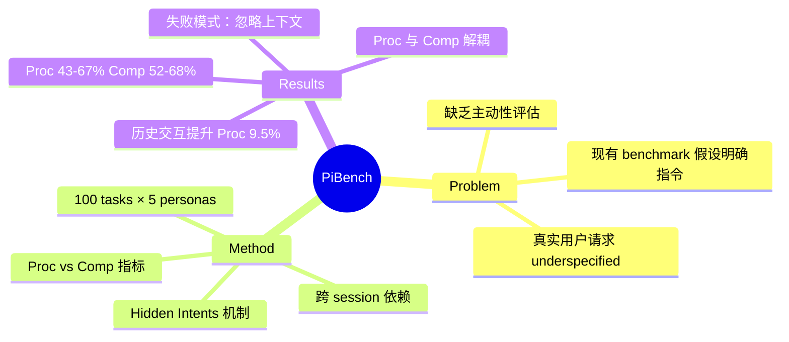

## Summary
提出 π-Bench，首个评估 personal assistant agent 在长时程工作流中**主动性**的 benchmark，包含 100 个跨 session 任务，核心创新是引入 hidden intents 和 Proactivity 指标，区分"完成任务"和"主动发现需求"两种能力。

## Problem & Motivation
现有 agent benchmark 假设用户请求是完整明确的，但真实场景中用户往往给出 underspecified 的指令，隐藏了约束、偏好和依赖关系。现有 benchmark（GAIA、WebArena、ClawBench）只评估 reactive 执行能力，memory benchmark（MemoryArena、PERMA）关注存储检索而非主动发现缺失需求，proactive benchmark（KnowU-bench、PIRA-bench）聚焦短时程移动任务。缺乏对专业工作流中跨 session、artifact-centered 的主动辅助能力的评估。

## Method
**Benchmark 设计**：100 个 multi-turn 任务，覆盖 5 个专业角色（researcher、marketer、pharmacist、law trainee、financier），每个角色 1 个 episode 包含 20 个 session，任务间存在跨 session 依赖关系。

**核心概念**：
- **Hidden Intents (I)**：用户未明说但应影响任务执行的隐含需求（约束、偏好、下游依赖），可以是 session-local 或跨 session 持久的
- **Checklist (C)**：可验证的完成标准，用于评估最终产出质量
- **User Agent Simulation**：模拟用户跟踪每个 hidden intent 的解决状态，分为三类：
  - **Completed**：agent 主动解决，无需用户明说
  - **Inferred**：agent 主动询问，用户回答后 agent 执行
  - **Provided**：agent 既未解决也未询问，用户被迫主动提供信息

**评估指标**：
- **Proactivity (Proc)**：`(|I_completed| + |I_inferred|) / |I|`，衡量 agent 主动解决或主动询问的 intent 比例
- **Completeness (Comp)**：`(1/|C|) Σ s(c, H)`，衡量最终产出是否满足 checklist 要求

两个指标**相关但独立**：reactive model 可以在用户干预后达到高 Comp 但 Proc 很低；proactive model 可能发现需求但执行不到位。

**依赖结构**：20 个任务中包含 6 组强依赖任务（2-3 个任务共享关键信息）和 5 个独立任务。

**工具与技能**：任务需要调用实际工具接口（购物工具、web search、数据处理 skill），要求协调多步工具调用。

## Key Results
**9 个 frontier LLM 评测结果**（GPT-5.4、Gemini 3.1 Pro、Claude Opus 4.6、DeepSeek V3.2、MiniMax M2.7、Kimi K2.5、Seed2.0 Pro、GLM-5.1、Qwen3.6 Plus）：

- **整体表现**：平均 Comp 52.1-67.6%，平均 Proc 43.1-67.0%，仍有大幅提升空间
- **最佳模型**：Claude Opus 4.6 达到 67.6% Comp（最高）和 65.5% Proc；GPT-5.4 达到 67.0% Proc（最高）和 65.6% Comp
- **Proc 与 Comp 解耦**：Kimi K2.5 达到 61.6% Comp 但仅 43.1% Proc（被动执行强但主动性差）；Seed2.0 Pro 相反（58.4% Proc 但 52.1% Comp，发现需求但执行不到位）
- **跨 session 依赖的价值**：ablation 实验移除前置 session 后，Proc 平均下降 9.5 个百分点，Comp 仅下降 2.5 个百分点，说明历史交互对主动解决 intent 更关键
- **领域差异**：Pharmacist 任务最简单（基于本地文件和领域技能），Researcher 任务 Proc 低但 Comp 高，Law Trainee 和 Financier 的 Comp 最低（需要风险导向判断）
- **Turn count 与 Proc 负相关**：更主动的 model 需要更少交互轮次，减轻用户负担

**失败模式**：忽略可恢复的历史上下文、完成显性请求但遗漏隐含需求、未主动澄清、使用工具前未验证必需 artifact。

## Strengths & Weaknesses
**Strengths**：
- **首次系统评估主动性**：Proc 指标明确区分"主动发现需求"和"被动执行"，填补了 agent benchmark 的关键空白
- **真实工作流设计**：跨 session 依赖、artifact-centered 任务、专业角色设定贴近实际 personal assistant 使用场景
- **指标设计合理**：Proc 和 Comp 解耦，揭示了模型在"发现需求"和"执行任务"两个维度的不同能力
- **Hidden intents 机制**：通过 user agent simulation 追踪 intent 解决状态，避免了简单的 binary success 评估

**Weaknesses**：
- **用户模拟而非真实用户**：出于成本和可复现性考虑使用模拟用户，可能无法完全捕捉真实用户的 underspecification 模式和交互行为
- **单一 agentic scaffold**：所有模型使用相同的 agent 框架（改编自 Nanobot），可能无法反映不同 scaffold 设计对主动性的影响
- **Hidden intents 定义的主观性**：什么算"应该主动发现的需求"vs"合理的用户输入"，边界可能存在争议
- **评估成本高**：100 个 multi-turn 任务 × 3 次运行 × 9 个模型，需要大量 API 调用和 GPT-5.4 作为 grader
- **领域覆盖有限**：5 个专业角色可能无法覆盖所有 personal assistant 使用场景（如创意工作、教育、医疗等）

**潜在影响**：为 personal assistant agent 的主动性能力建立了评估标准，推动社区关注"anticipate user needs"而非仅"follow instructions"，对 Claude Code、OpenClaw 等长时程 agent 系统的设计有直接指导意义。

## Mind Map

## Notes
- 这个 benchmark 直接对标 Claude Code 和 OpenClaw 的使用场景，Proc 指标的设计很有洞察力——区分"能干活"和"知道该干什么活"
- Hidden intents 的三分类（Completed / Inferred / Provided）清晰量化了主动性的层次，比简单的 success rate 信息量大得多
- Kimi K2.5 的 Proc/Comp 分离（43.1% / 61.6%）很有意思，说明"等用户说清楚再执行"和"主动发现需求"是两种能力
- 跨 session 依赖的 ablation（Proc -9.5% vs Comp -2.5%）说明 memory 对主动性的价值远大于对执行的价值，这对 long-context agent 设计有启发
- 用户模拟是合理的工程 tradeoff，但确实可能遗漏真实用户的 edge case（如故意模糊、情绪化表达、隐含文化背景等）
