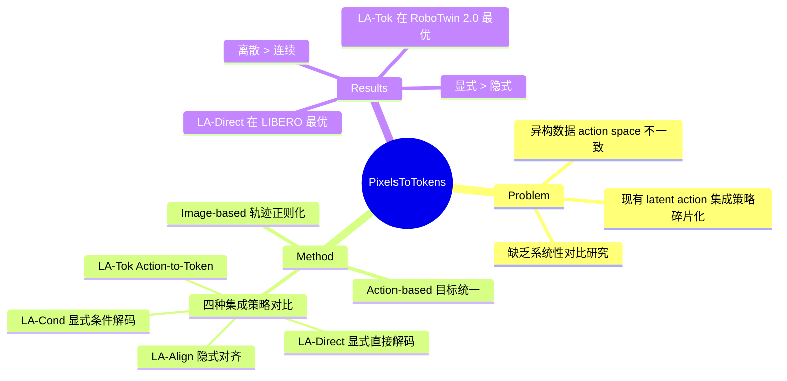

## Summary

系统性地研究 VLA 模型中 latent action supervision 的两种视角（image-based 用于轨迹正则化、action-based 用于目标空间统一）及四种集成策略，发现直接让 VLM 预测离散 latent action tokens 是最有效的方式，且两种视角各有优势：image-based 擅长长程推理，action-based 擅长复杂运动协调。

## Problem & Motivation

VLA 模型需要在异构数据上训练（不同机器人平台、人类视频），这些数据来自不一致的 action space，导致跨域 action 语义不匹配、性能下降。Latent action 作为中间表示可以抽象运动，提供统一的监督信号。

然而，现有方法对 latent action 的集成策略各不相同且与 VLA 架构设计纠缠在一起——有的用离散 token 监督，有的用辅助学习目标，但对 latent action 如何最优地融入 VLA 训练缺乏系统性研究。本文在统一基线下解耦这些因素，回答三个问题：latent action 的最佳形式是什么？最佳集成策略是什么？离散 vs 连续表示谁更优？

## Method

### 两种 Latent Action 视角

**视角 1：轨迹正则化（Image-based）**——用图像对（observation transition）编码的视觉变化作为 latent action，通过 VQ-VAE 离散化，作为高层视觉计划引导 VLM。核心假设：编码视觉状态转移可提供长程行为的连贯性监督。

**视角 2：目标统一（Action-based）**——将连续 action chunks 映射到共享的离散 token 空间。作者提出新型 action-based latent action model：FFT 提取低频趋势 + 1D 时序卷积捕获快速变化 + Transformer encoder 跨时间步整合。

### 统一 VLA 基线

基于 Qwen3-VL-2B，所有策略共享 backbone、placeholder 设计、聚合函数、action head。唯一的区别在于对 VLM 表示施加的监督方式。

### 四种集成策略

1. **LA-Align（隐式对齐）**：辅助目标，在中间层（第 17 层）用余弦相似度对齐 VLM hidden states 与 latent action embeddings
2. **LA-Direct（显式直接解码）**：直接让 VLM 预测 image-based latent action 作为离散 tokens，在 placeholder 位置加线性头预测 codebook 概率
3. **LA-Cond（显式条件解码）**：分割 placeholder 为 latent 段和 action 段，通过因果 attention 让 action 段条件依赖于 latent 段
4. **LA-Tok（Action-to-Token）**：用 action-based latent action model 将连续 action chunks 离散化，VLM 直接预测这些 action tokens

### 训练目标

总损失 = action reconstruction loss + λ × latent supervision loss。测试时所有策略都是单次 forward，无额外推理阶段。

## Key Results

### Image-based vs. Action-based（Q1）

- **长程任务**：Image-based 在 LIBERO-Long 上 +8.4%~+10.8%，action-based LA-Tok 仅 +6.8%。真实 Stack 4 Bowls 任务 LA-Direct 79 vs baseline 48
- **运动复杂任务**：Action-based 在 RoboTwin 2.0 上最优（LA-Tok +17.5%），因为离散化 action 提供更结构化的监督信号

### 最佳集成策略（Q2）

三个关键发现：
1. 显式直接解码 > 显式条件解码（LIBERO-Long：LA-Direct 96.6% vs LA-Cond 94.2%）
2. 显式监督 > 隐式对齐（LIBERO-Long：LA-Direct 96.6% vs LA-Align 94.8%）
3. **直接让 VLM 预测 latent actions 最有效**——LA-Direct 在 LIBERO 和真实实验领先，LA-Tok 在 RoboTwin 2.0 领先

### 离散 vs. 连续（Q3）

离散监督始终优于连续回归（LA-Direct +2.7%，LA-Tok +2.2%）。连续变体仍显著优于基线。

### 具体指标

- **LIBERO**：LA-Direct 97.1%（baseline 93.1%），与 OpenVLA-OFT 持平
- **RoboTwin 2.0**：LA-Tok 78.0%（+17.5%），超越 π₀（64.0%）和 DP3（71.0%）
- **真实机器人**：LA-Direct 在 manipulation 任务排第一（平均 87），pick-and-place 总平均 75。OOD 场景 LA-Cond 达 70 vs baseline 17

### 其他发现

- **减少负迁移**：10 个 RoboTwin 任务联合训练，LA-Cond 实现一致增益（平均 74.5%，+20.9%），无负迁移
- **数据效率**：LIBERO-Long 50% 数据下 LA-Tok 仍达 94.0%（+14.0%）
- **对 λ 不敏感**：latent supervision weight 在合理范围内表现稳定

## Strengths & Weaknesses

**亮点**：
- 问题定义清晰——将 latent action 监督从架构设计中解耦，系统性对比两种视角、四种策略
- 实验设计严谨——统一的基线、多个 benchmark、真实机器人验证、消融完整
- 结论有实用价值——"直接预测 latent tokens"这个简单策略效果最好，降低了方法复杂度
- 发现 image-based 和 action-based 各有适用场景，对实际应用有指导意义

**局限**：
- 未研究更强的 latent action model 是否会改变策略间的相对差距
- 真实机器人评估限于单臂平台，跨形态验证不足
- 四种策略可能未覆盖所有可能的集成方式

**与相关工作关系**：
- 与 LAPA（2404）相关但视角不同——LAPA 提出 latent action 用于 VLA 训练，本文系统对比集成方式
- 与 UniVLA 的 image-based latent action 架构有延续性，但本文提出 action-based 替代方案

## Mind Map

## Notes

- 核心洞察：**简单粗暴地让 VLM 直接预测 latent tokens 效果最好**，不需要复杂的条件解码或隐式对齐
- Image-based 擅长长程可能因为编码了视觉状态转移的语义信息，有助于高层规划
- Action-based 擅长复杂运动可能因为离散化提供了更结构化的 action space 监督
- 与 LAPA 的关系值得进一步探索——两者都用 latent action，但 LAPA 更侧重预训练视角
- 潜在研究方向：更强的 latent representation（如 VQ-VAE 换成 flow-based）、跨形态泛化验证