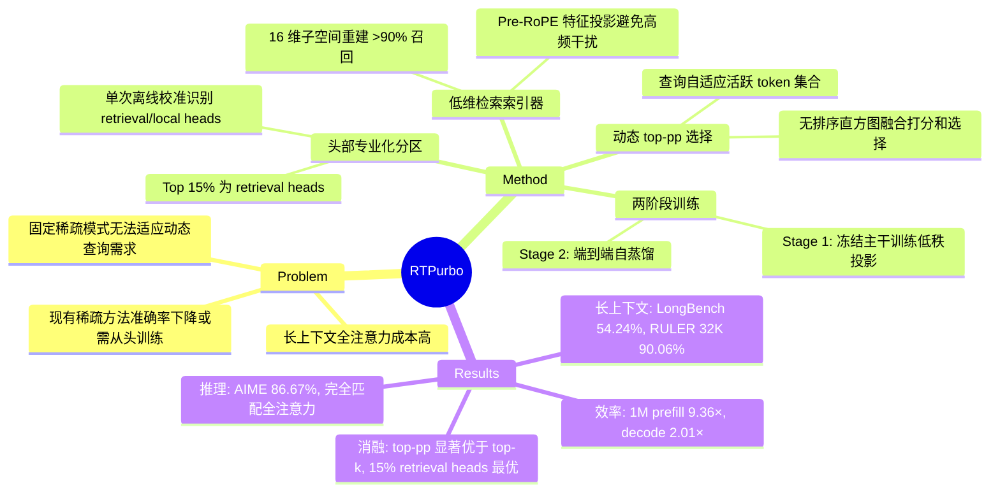

## Summary
RTPurbo 通过三个核心观察（头部专业化、低维检索几何、查询依赖稀疏性）将全注意力 LLM 在数百步内转换为稀疏推理模型,在 1M 上下文实现 9.36× prefill 加速和 2.01× decode 加速,同时保持与全注意力几乎一致的准确率。

## Problem & Motivation
长上下文 LLM 的全注意力机制计算成本随序列长度二次增长,限制了实际部署。现有稀疏注意力方法要么需要从头预训练（成本高昂）,要么使用固定稀疏模式（无法适应不同查询的动态需求）,要么在长上下文和推理任务上准确率显著下降。核心问题是:能否以极低成本将已有的全注意力模型转换为高效稀疏模型,同时保持原有能力？

## Method
RTPurbo 基于三个关键观察设计了轻量级稀疏化方案:

**1. 头部专业化分区**
通过单次离线校准识别 retrieval heads（需要全局长上下文）和 local heads（只需局部信息）。校准方法:在长文档首尾插入相同 needle span,计算每个头从后 needle 到前 needle 的注意力质量,取 top 15% 为 retrieval heads。

**2. 低维检索索引器**
Retrieval heads 的长距离检索主要由 RoPE 低频分量主导,可在 16 维子空间重建 >90% 召回率。为每个 retrieval head 训练轻量级低秩投影（16 维）,在 pre-RoPE 特征上估计 token 相关性,避免高频位置编码干扰。

**3. 动态 top-pp 选择**
不同查询需要的 token 数量差异巨大（实验显示 5× 变化）。使用 top-pp（p=0.9）而非固定 top-k,让每个查询自适应选择活跃 token 集合。

**训练流程**（两阶段,各约 600 步）:
- Stage 1: 冻结主干,仅训练 retrieval heads 的低秩投影（~840K 参数）,用 KL 散度对齐原始注意力分布
- Stage 2: 端到端自蒸馏,稀疏模型作为学生匹配稠密教师的输出 logits（仅对齐 top-10）,极小学习率（3e-6）防止能力漂移

**硬件优化内核**:
- 无排序 top-pp: 通过 256-bin 直方图（每头仅 1KB）融合打分和选择,避免全局排序
- 带宽优化稀疏解码: 单 warp CTA,无共享内存,寄存器状态,2-token 展开 + half2 向量化指令

## Key Results
**长上下文任务**:
- LongBench: 54.24% (RTPurbo top-pp) vs. 53.80% (全注意力) vs. 52.98% (RazorAttn,次优基线)
- RULER 32K: 90.06% vs. 89.65% (全注意力),显著优于 RTPurbo top-k 的 84.36%
- RULER 64K: 85.49% vs. 86.23% (全注意力),而 top-k 变体崩溃至 70.53%
- 超长上下文（128K-512K）: 基线灾难性退化,RTPurbo 保持高准确率,512K 时稀疏度 >97.1%

**推理任务**:
- AIME24/AIME25: 86.67%,完全匹配全注意力
- MMLU-PRO: 各子类别与全注意力一致,而 top-k 变体在 Chemistry（51.40%）和 CS（50.49%）等科目显著下降

**效率提升**:
- Prefill: 32K 时 2.83×,1M 时 9.36× (相比 FlashAttention-2)
- Decode: 32K 时 1.47×,1M 时 2.01×
- 64K 时动态稀疏度达 89.2%,保留 >0.93 注意力质量
- 活跃 token 预算跨任务变化 5×（niah-S: 468.8 vs. multi-K: 2462.1 @ 32K）

**消融实验**:
- Retrieval head 比例: 15% 最优（10% 准确率显著下降,30% 训练成本翻倍但收益微小）
- 低维尺寸: dim=16 在拟合质量和稀疏度间最佳平衡（dim=4 因拟合能力弱被迫保留更多 token,dim=32 无额外收益）
- Top-k vs. top-pp: top-pp 在所有任务上显著优于固定 top-k,尤其在推理任务和长上下文

## Strengths & Weaknesses
**亮点**:
1. **极低转换成本**: 仅需数百步训练（~1M tokens）即可将全注意力模型转为稀疏模型,相比从头预训练成本降低数个数量级
2. **动态稀疏性**: top-pp 机制首次在稀疏注意力中引入查询自适应预算,实验证明这对推理任务至关重要
3. **理论洞察**: 低维检索几何的发现（16 维即可重建 >90% 召回）为稀疏注意力提供了新的理论视角
4. **工程完整性**: 从算法到硬件内核的端到端优化,无排序 top-pp 和带宽优化解码展现了系统级思考
5. **实验全面**: 覆盖长上下文（32K-512K）和推理任务,消融实验细致,与多个 SOTA 基线对比

**局限**:
1. **头部专业化依赖**: 方法假设预训练模型已形成稳定的 retrieval/local 头部分区,对头部专业化较弱或领域偏移较大的模型可能失效
2. **Prefill 未完全稀疏化**: Retrieval heads 在 prefill 阶段仍使用全稠密注意力,未充分挖掘 prefill 加速潜力
3. **评估范围有限**: 仅在 Qwen3 系列上验证,缺乏对其他架构（Llama、Mistral 等）和更多领域（代码生成、多轮对话）的测试
4. **校准成本未量化**: 虽然声称"单次离线校准",但未报告校准的计算成本和对校准数据的敏感性
5. **与原生稀疏预训练的对比缺失**: 未与 Mamba、RWKV 等原生稀疏架构对比,无法判断 post-hoc 稀疏化的效率上限

**潜在影响**:
论文挑战了"稀疏 LLM 必须从头预训练"的主流观点,为已有全注意力模型的高效部署提供了新路径。如果方法能泛化到更多架构,可能显著降低长上下文 LLM 的部署门槛。动态 top-pp 机制对推理任务的提升尤其值得关注,暗示稀疏注意力设计需要更细粒度地考虑任务特性。

## Mind Map

## Notes
- 低维检索几何的发现很有意思,16 维就能重建 >90% 召回率,这暗示 attention 的本质维度可能远低于模型维度。是否可以进一步探索这个低维子空间的结构？
- Top-pp 在推理任务上的提升非常显著（top-k 在 RULER 64K 崩溃至 70.53%）,说明推理任务的注意力模式与检索任务有本质区别。这个观察能否指导推理专用模型的设计？
- 方法依赖头部专业化,但论文未讨论如何判断一个模型是否适合 RTPurbo。能否设计一个"稀疏化潜力"指标,在转换前预测效果？
- Prefill 阶段 retrieval heads 仍用全注意力,这是最大的效率瓶颈。能否用类似的低维索引在 prefill 时也做稀疏化？
- 仅在 Qwen3 上验证是最大的局限。Llama 3/4、Mistral 等模型的头部专业化程度如何？方法能否泛化？
