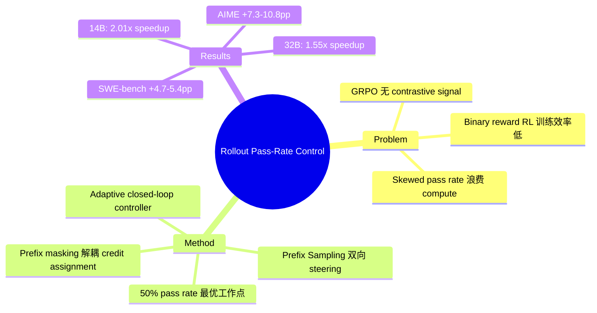

## Summary

论文针对 SWE-bench 风格的 agentic RL 中 binary rewards 训练效率低下的问题，提出 pass rate 50% 是最具信息量的训练区间。核心方法 Prefix Sampling (PS) 通过双向 prefix replay 将偏斜的 rollout groups 推向 50% 工作点，在 Qwen3-14B 上实现 2.01x 端到端加速，SWE-bench Verified 性能从 0.273 提升到 0.295。

## Problem & Motivation

在 SWE-bench 风格的 agentic RL 中，rollout trajectories 昂贵且耗时，但大量 compute 被浪费在 pass rate 极端偏斜的 rollout groups 上。当 group 的 binary rewards 全为 0 或全为 1 时，GRPO 风格的 group-relative normalization 无法产生任何 contrastive learning signal。

现有 group filtering 只是被动排除无信息 groups，但保留的 groups 中仍存在大量 1/8 或 7/8 等高度偏斜情况，contrastive signal 很弱。论文从四个视角证明 p=0.5 是最优工作点：reward entropy 最大、group filtering 存活率最高、RLOO advantage energy 最大、success-failure contrastive pairs 最多。

## Method

### 核心框架

Prefix Sampling 是双向 pass-rate steering framework，通过 trajectory prefix replay 将偏斜 groups 推向 50% 区间：

- **Hard groups（多为失败）**：replay 成功 prefix 作为 "head start"
- **Easy groups（多为成功）**：replay 失败 prefix 作为 "handicap"

### Bucket 划分（以 N=8 为例）

- Degenerate groups（k∈{0,8}）：直接丢弃
- Balanced groups（k∈{3,4,5}）：直接用于标准训练
- Hard buckets（k∈{1,2}）：保存成功 trajectory 作为 replay prefix
- Easy buckets（k∈{6,7}）：保存失败 trajectory 作为 replay prefix

### Adaptive Prefix Controller

每个 bucket 维护 EMA 追踪 rerollout pass rate，设定 target=0.5、deadzone δ=0.03，通过 closed-loop feedback 调整 prefix ratio。

### Prefix Masking

Loss 只应用于 continuation tokens，确保梯度只来自当前 policy 在 replay boundary 之后生成的 actions。这解耦了状态操纵与 credit assignment。

## Key Results

### Benchmark 性能

| 模型 | 基准 | Baseline Pass@1 | PS Pass@1 | 提升 |
|------|------|----------------|-----------|------|
| Qwen3-32B | SWE-bench Verified | 0.368 | 0.422 | +5.4pp |
| Qwen3-14B | SWE-bench Verified | 0.247 | 0.295 | +4.7pp |
| Qwen3-8B | AIME 2025 | 0.571 | 0.679 | +10.8pp |
| Qwen3-4B | AIME 2025 | 0.590 | 0.662 | +7.3pp |

### 训练效率

- **收敛加速**：4B 1.92x、8B 1.56x、14B 1.51x、32B 1.40x
- **Valid groups 提升**：14B +41.7%、32B +28.8%
- **End-to-end wall-clock speedup**：14B 2.01x、32B 1.55x

### Ablation（4B Math）

- PS-fix（固定 r=0.25）：1.61x speedup
- PS-ada hard-only：1.13x speedup
- PS-ada（完整四桶）：1.92x speedup

Replay 贡献最大，但 adaptive control 和双向覆盖必不可少。

## Strengths & Weaknesses

### Strengths

1. **问题定位精准**：直指 binary reward RL 中 pass rate 偏斜导致 signal 稀释的核心问题，理论分析完整（entropy、survival rate、advantage energy、contrastive pairs 四个视角）
2. **方法简洁有效**：Prefix Sampling 作为 drop-in controller，不改变 prompts、rewards、rollout budget，实现即插即用
3. **双向设计有洞察**：Easy-side handicap 的想法很聪明——不只是救 hard tasks，还主动增加 easy tasks 的难度
4. **Ablation 清晰**：将收益分解为 replay、adaptive control、bidirectional coverage 三个独立贡献

### Weaknesses

1. **适用范围有限**：仅适用于 binary-reward RLVR with grouped rollouts (N=8)，对 continuous reward 或其他 group size 未验证
2. **机构信息缺失**：作者列表 11 人，但论文和 arXiv 页面均未注明所属机构，影响可复现性评估
3. **超参数敏感性未充分探索**：50% target、deadzone δ=0.03、step size η=0.05 的选择缺乏 sensitivity analysis
4. **Agentic replay 假设**：依赖 replay-through-execution 重建状态，对 framework-specific 非确定性工具的鲁棒性依赖实现

## Mind Map

## Notes

- 与 SEELE 动机相近但方法不同：SEELE 用 hint calibration，PS 用 on-policy prefix replay
- 核心洞察是"训练时 50% pass rate 最优"而非"模型应只以 50% 概率求解任务"
- Prefix masking 的设计关键——确保梯度只来自当前 policy 的 actions
- Easy-side handicap 的 case study 很精彩：将 7/8 正确的任务变为 4/8，创造 contrastive learning 机会