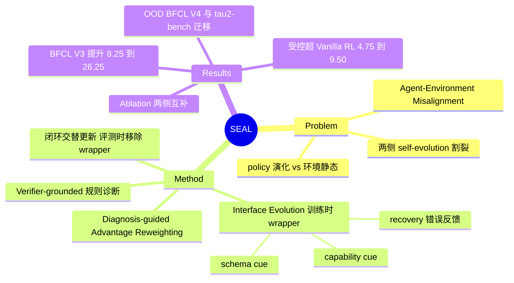

## Summary

SEAL 针对 "Agent-Environment Misalignment"（policy 在训练中演化而环境的监督信号保持静态）提出闭环框架：用确定性规则对失败 rollout 做 verifier-grounded 诊断，同一诊断信号既驱动环境侧演化训练时 observation interface（暴露 tool schema 提示、恢复导向的错误反馈、能力针对性 cue），又驱动 policy 侧的 diagnosis-guided advantage reweighting（接入 GRPO）。在 400 样本 low-resource 设定下，三个 backbone 在 BFCL V3 Multi-Turn 上相对基线提升 +8.25~+26.25 平均分（受控对照下超 Vanilla RL +4.75~+9.50），并在 BFCL V4 与 τ²-bench 上表现出 OOD 迁移优势。

## Problem & Motivation

LLM agent 的 self-evolution 方法目前两侧割裂：**model-centric**（recursive skill learning、self-consolidation、reflective prompt adaptation、memory-based improvement、RL）在基本固定的环境上优化 policy；**environment-centric**（curriculum learning、automatic curriculum design、synthetic instruction generation、task evolution、tool/skill construction）改造环境但通常不以当前 agent 的可执行失败为条件。论文把这种失配命名为 **Agent-Environment Misalignment**："as the agent's capability frontier shifts during training, the environment that provides supervision often remains static or only weakly coupled to the agent's revealed failures"。SEAL 的主张是：从失败 rollout 中提取的诊断信号应当**同时**驱动环境适应与 policy 优化，形成耦合闭环，而非各自为政。

## Method

四个组件构成闭环（round t 交替执行）：

### 1. Verifier-Grounded Failure Diagnosis（Ψ）
把失败轨迹转成 turn-level 诊断标签 Z(τ) = {z₁,...,z_T}。Ψ 是 "a deterministic rule-based classifier over executable traces"——基于 parser 检查、tool-schema 校验、执行错误、verifier 对比等**可执行证据**而非 free-form model critique，且优先判定可直接执行层面的失败（先于下游 verifier 层失败）。六类 priority-ordered 标签：`invalid_tool_call` > `argument_mismatch` > `state_mismatch` > `recovery_failure` > `missing_tool_call` > `response_mismatch`（Appendix C.2 Table 5）。

### 2. Learning-Interface Evolution（环境侧）
**只演化训练时的 observation function**，不动 benchmark verifier、不动 tool semantics（"不生成新任务"由 "evolves only the training-time learning interface" 蕴含）。增强后的 observation：

õᵢ = Ω_t(oᵢ, ℱ, H_t, C_t) = oᵢ ⊕ φ_schema(ℱ) ⊕ φ_err(oᵢ, H_t) ⊕ φ_cap(C_t)

- **φ_schema**：暴露 schema 隐含的 tool affordance（必填参数、enum 约束、参数类型、合法调用格式）
- **φ_err**：把执行错误转成 recovery-oriented 反馈，"without revealing the correct answer"
- **φ_cap**：按当前 failure profile 选择能力针对性 cue，让高频错误获得定向反馈

Cue 激活是 failure-type-specific 的：`argument_mismatch` 激活 schema/constraint cue，`missing_tool_call` 激活 tool-affordance cue，`recovery_failure` 激活结构化错误反馈。

### 3. Diagnosis-Guided Advantage Reweighting（policy 侧）
每条轨迹计算诊断 profile p_j(z)（各标签的 turn 占比），按诊断效用 ρ(z) 加权：

w_j = clip(Σ_z p_j(z)·ρ(z), 0.5, 2.0)，Ã_j = w_j·A_j

加权后的 advantage 接入 GRPO。Appendix C.2 Table 6 给出效用权重（如 spurious_tool_call 2.0、correct_abstention 1.8、empty_turn_model_response 1.5、pass 1.0、instance_mismatch 0.6）。**注意（verifier 实锤）**：Table 6 权重词表（7 条）与正文六类诊断标签仅 `state_mismatch`/`response_mismatch` 两条重合，ρ(z) 与 Ψ 输出的映射关系论文未给出——引用 Table 6 权重时须带此 caveat。

### 4. 闭环训练与评测协议
每轮：在 interface Ω_t 下采 N 条轨迹 → 原始 verifier 打分 r(τ) + 诊断 Z(τ) → 聚合成 failure profile C_t → Ω_{t+1} = Evolve(Ω_t, C_t) → diagnosis-weighted GRPO 更新 θ。**评测时 wrapper 全部移除**："the evolved interface is removed... identical test-time conditions"——SEAL 与 Vanilla RL 在完全相同的测试条件下比较。

训练配置：GRPO、8 rollouts/prompt、actor lr 1e-6、batch 32、4 GPUs + vLLM async rollout。

## Key Results

**In-distribution（BFCL V3 Multi-Turn，400 样本训练 / 400 held-in 评测）**，Table 1 平均分：

| Backbone | Base 模型 | + Vanilla RL | + SEAL | vs 基线 | vs Vanilla RL |
|:--|:--|:--|:--|:--|:--|
| Qwen2.5-3B-Instruct | 5.75 | 9.25 | **14.00** | +8.25 | +4.75 |
| Qwen2.5-7B-Instruct | 14.00 | 30.75 | **40.25** | +26.25 | +9.50 |
| ToolACE-2-Llama-3.1-8B | 32.00 | 38.50 | **46.75** | +14.75 | +8.25 |

四个子类（Base / Missing Functions / Missing Parameters / Long Context）全部提升；7B 上 Missing Functions +22、Missing Parameters +24（正是 φ_schema/φ_cap 针对的失败类型）。

**OOD 迁移（Table 2，训练分布外）**：BFCL V4（Web Search + Memory）与 τ²-bench（Retail/Airline/Telecom）上 SEAL 全分量 ≥ Vanilla RL——7B：BFCL V4 平均 10.26→12.71、τ²-bench 17.19→20.79（Retail 19.30→26.32）；3B：BFCL V4 5.98→8.63、τ²-bench 10.60→11.76。论文自认 "absolute OOD scores remain modest"。

**Ablation（Table 3，7B）**：w/o environment-side adaptation 35.75、w/o diagnosis-guided reweighting 32.75、w/o closed-loop update 33.00，均显著低于 full SEAL 40.25 且均高于 Vanilla RL 30.75——两侧各自有贡献且互补，去 reweighting 伤害最大。训练动态（Figure 3）显示 SEAL 收敛更快，Missing Functions/Parameters 子类差距随训练加宽。

**对照公平性**：Vanilla RL 与 SEAL 用 "same initial checkpoint, same 400 BFCL V3 samples, same rollouts per prompt, same optimizer, same decoding configuration"。与 reference systems（GPT-4o、Claude-Sonnet-4.5、GLM-4.6 等）的比较为非受控参考。

## Evidence Ledger

| Claim ID | Claim | Type | Source locator | Evidence excerpt | Status |
|:--|:--|:--|:--|:--|:--|
| C1 | BFCL V3 上相对三个 backbone 基线平均提升 +8.25 / +26.25 / +14.75 | number | Table 1 | "5.75→14.00 (+8.25); 14.00→40.25 (+26.25); 32.00→46.75 (+14.75)" | source-verified |
| C2 | 训练仅用 400 样本（四类各 100），400 条 held-in 评测 | benchmark-setting | Section 4.1 | "400 training examples, sampling 100 from each category" | source-verified |
| C3 | 三个 backbone：Qwen2.5-3B/7B-Instruct、ToolACE-2-Llama-3.1-8B | benchmark-setting | Section 4.1 | "Qwen2.5-3B-Instruct, Qwen2.5-7B-Instruct, ToolACE-2-Llama-3.1-8B" | source-verified |
| C4 | 受控对照下超 Vanilla RL +4.75 / +9.50 / +8.25 | comparison | Table 1 + Appendix C.3 | "same initial checkpoint, same 400 BFCL V3 samples, same rollouts per prompt, same optimizer" | source-verified |
| C5 | OOD：BFCL V4 与 τ²-bench 上全分量 ≥ Vanilla RL（7B 10.26→12.71、17.19→20.79） | number | Table 2 | "7B: BFCL V4 10.26→12.71; τ²-bench 17.19→20.79, Retail 19.30→26.32" | source-verified |
| C6 | 只演化训练时 observation wrapper，评测时移除、测试条件与 Vanilla RL 一致 | benchmark-setting | Section 3.3 | "evolves only the training-time learning interface... at evaluation time, the evolved interface is removed" | source-verified |
| C7 | 诊断为对 executable trace 的确定性规则分类器，六类 priority-ordered 标签 | causal-mechanism | Section 3.2 + Appendix C.2 Table 5 | "Ψ is a deterministic rule-based classifier over executable traces" | source-verified |
| C8 | w_j = clip(Σ p_j(z)ρ(z), 0.5, 2.0)，Ã_j = w_j·A_j 接入 GRPO | causal-mechanism | Section 3.4 + Appendix C.2 Table 6 | "w_j = clip(Σ_z p_j(z)ρ(z), w_min, w_max)", [0.5, 2.0] | source-verified |
| C9 | Ablation（7B）：35.75 / 32.75 / 33.00 vs full 40.25，均高于 Vanilla RL 30.75 | number | Table 3 | "w/o Env-Side 35.75; w/o Reweighting 32.75; w/o Closed-Loop 33.00; Full 40.25" | source-verified |
| C10 | 代码：github.com/yihaohu0118/SEAL | license-code | paper header | "GitHub: https://github.com/yihaohu0118/SEAL" | source-verified |
| C11 | 论文内部不一致：Table 6 效用权重词表（7 条）与正文六类诊断标签仅 2 条重合（state_mismatch/response_mismatch），ρ 与 Ψ 的映射未给出 | benchmark-setting | Appendix C.2 Table 5 vs Table 6 | Table 6: spurious_tool_call/correct_abstention/empty_turn_model_response/instance_mismatch/pass 不在六类分类学中 | source-verified |

## Strengths & Weaknesses

**亮点**

- **问题命名有价值**：Agent-Environment Misalignment 把"policy 在演化、监督环境静态"的失配显式化，为 agent-environment co-evolution 方向提供了干净的问题表述。
- **环境侧演化的保守设计反而干净**：只动训练时 observation wrapper，不生成新任务、不改 verifier、不改 tool semantics——**直接绕开了合成环境路线（AgentWorld、CUA-Gym）最大的"演化环境质量谁来验证"问题**：既然 reward 始终来自原 verifier、不产生新任务，就没有质量验证负担；评测时 wrapper 移除保证协议不被污染。
- **同一诊断信号驱动两侧**是机制上的真贡献：failure profile 既决定 cue 激活（环境侧）又决定 advantage 权重（policy 侧），比"环境课程 + policy RL 各自为政"耦合更紧。ablation 显示两侧互补（单侧变体均低于 full）。
- **对照相对认真**：同 checkpoint/训练集/rollout 预算/optimizer/decoding；三刀 ablation 齐全。
- **scaffold-then-remove 的正面证据**：评测时提示全部撤掉后 SEAL 仍胜 Vanilla RL，说明训练时 scaffold 教出的行为被 policy 内化，而非依赖提示。

**局限**

- **"co-evolution" 名号大于实质**：环境侧的演化空间只是三类文本提示的开关组合（observation augmentation），任务分布、转移动态、verifier 都不演化。更准确的定位是 **failure-conditioned scaffolding curriculum**，与 AgentWorld 那种环境池级别的演化不在一个量级。
- **对照存在算力小缺口**：同 rollout 数但 SEAL 的 observation 拼接了额外提示 → 每 rollout token 更多；诊断虽是规则的、便宜，论文没有 wall-clock / token 开销对账。
- **ρ(z) 权重手工设定**且跨任务/backbone 固定（作者自认）；且 Table 6 效用权重词表与正文六类诊断 taxonomy 对不上（independent verifier 实锤：仅 2/6 重合，映射缺失，推测为版本迭代残留）。
- **绝对分数低**：7B held-in 仅 40.25%，OOD 更低且作者自认 modest；400 样本 low-resource 设定下增益百分点大但 base 也弱。与 reference systems 的比较非受控。
- **适用边界**：依赖可执行环境（tool schema、execution trace、verifier feedback）；开放域没有 executable evidence 时诊断退化为 model critique（作者自认 "more open-ended domains may require richer diagnosis mechanisms"）。φ_err "不泄露答案"是设计声明，论文未做泄露审计。

## Mind Map

## Notes

- **在 co-evolution 谱系中的位置**：[[Topics/SelfEvolvingAgents-Survey]] 把 agent-environment co-evolution 列为 2026 四个活跃前沿之一，SEAL 是该方向的实证代表作——但其环境侧演化粒度最细（observation wrapper），与 [[Papers/2604-AgentWorld]]（环境池 + arena-based 诊断定向加训）、[[Papers/2606-CUAGym]]（任务/状态/reward 三元组合成）构成从 interface → 任务 → 环境的演化粒度光谱。SEAL 用"不生成新任务"换来了免于质量验证的负担，AgentWorld/CUA-Gym 则相反。
- **与失败驱动课程的关系**：[[Papers/2411-WebRL]] 从失败经历生成新任务（任务级课程），SEAL 是失败驱动的 **interface 级**课程；两者共享"用 agent 的失败条件化环境侧更新"的思想，但 SEAL 独有 policy 侧的同源 reweighting。
- **对 GUI 侧的迁移可能**（[[Topics/CUA-Survey]] 环境章相关）：GUI 训练环境同样有 schema（accessibility tree / action space 约束）与执行错误信号，failure-conditioned interface scaffolding 原则上可迁移；但 GUI 的 verifier-grounded 诊断比 tool-call parser 检查难得多，这正是该思路迁移的瓶颈。
- 疑问：closed-loop 的轮级 interface 更新只依赖聚合 failure profile C_t，粒度是 batch 级而非 per-instance；w/o closed-loop（固定 interface）只掉 7.25 分，说明大部分增益来自"有 scaffold + 有 reweighting"本身，而非"scaffold 随训练动态调整"——闭环的边际贡献其实是三个组件里最弱的叙事。
