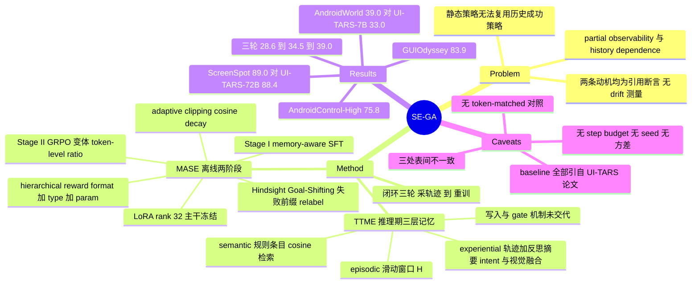

## Summary

SE-GA 把 GUI agent 的记忆检索与策略训练接成闭环：TTME 在推理时从 episodic / semantic / experiential 三层仓库取上下文，MASE 拿 TTME 采到的轨迹做 SFT 加 GRPO 变体训练，整套流程迭代三轮。以 Qwen2.5-VL-7B 为 backbone，报告 ScreenSpot 89.0、AndroidControl-High 75.8、GUIOdyssey 83.9、AndroidWorld 39.0。标题里的 self-evolution 落地形态是三轮离线重训，不是部署期的在线参数更新。

## Problem & Motivation

论文列了两条 challenge。第一条是 partial observability：GUI 任务 historically dependent，关键信息可能只出现在早期几步却影响后续很远的决策，而现有方法主要依赖当前 screenshot 加一个有限 context window，于是 error accumulation。第二条是 static policy：真实任务多是已完成任务的变体或组合，需要复用过去的成功策略，但现有 agent 要么用固定数据集训出的静态策略，要么只做临时检索而没有统一的 memory organization，因此缺少"把显式历史经验编码进隐式策略参数"的机制。

两条都是带引用的断言，论文没有提供任何测量。全文没有测过策略在环境变化下的 drift，没有测过适应速度，也没有构造"环境发生了变化"的对照条件；Sec 2.1 那句 "reliance on policies from static datasets limits their ability to adapt to dynamic layout changes" 后面挂的是一条引用，不是一张图。SE-GA 因此能作为 self-evolution 的方法样本，但不能作为"静态策略会在动态环境中失效"的动机证据。

AndroidWorld 上的归因尤其值得盯。论文把 39.0 解释为 self-evolution 让 agent"持续探索并适应动态环境变化"，但 AndroidWorld 的 dynamic 来自 116 个任务的参数随机实例化与 live emulator，不是随时间推移的界面漂移；而 Table 8 显示 AndroidWorld 从 28.6 涨到 39.0 是三轮离线重训的结果，每一轮都重新训练模型权重。这个结果与"用更多自采数据多训两轮"是观测等价的，无法区分。

## Method

### TTME：三层记忆的检索侧

三个仓库的定义都在检索侧，写入侧写得很薄。

Episodic memory 存 `<o_k, a_k, o_{k+1}>` 三元组，用固定 horizon H 的滑动窗口截断，只保留最近 H 步，目的是过滤 stale 信息。Semantic memory 存 `<k_sem, d_i>`，d_i 是交互规则的文本描述（论文举例 "Log in before accessing restricted pages"），按 instruction embedding 的 cosine similarity 取 Top-K。Experiential memory 存 `<τ_i, g(τ_i), k_intent, k_task>`，g(τ_i) 是 agent 自己生成的 reflective summary，检索用 λ 加权融合语义 intent 相似度与视觉相似度，取 Top-K 的 summary 注入 prompt。三者拼接后进入当前决策步的输入，Stage II 的 max prompt length 设到 6144 token 来容纳。

写入与 gate 是这套设计最空的地方。Semantic memory 只描述了表示形式与检索公式，全文没有说这些规则条目从哪里来、由谁写、何时更新——Sec 4.1.2 加 Appendix C.7 的例子都只演示"假设仓库里已有这条规则"。Experiential memory 写的是 successful trajectories，但成功判定的实现没有交代。唯一显式出现的 gate 是 Hindsight Goal-Shifting 里的谓词 `Verify(τ_0:k, g') = 1`：把失败轨迹的成功前缀 relabel 成另一个子目标 g' 的成功样本。这个 Verify 在全文只出现这一次，是规则匹配、模型判定还是人工标注，论文没说。对一个以"记忆写回质量"为核心的自进化框架，这是最需要说清而没说的部件。

### MASE：两阶段离线训练

Stage I 是 memory-aware behavior cloning，在 expert trajectory 上最小化负对数似然，prompt 里带记忆。Stage II 基于 GRPO 改三处：借 DAPO 的 token-level importance ratio 做细粒度 credit assignment；adaptive clipping 把上界 ε_cur 设成 cosine decay，训练早期允许更大更新、后期收紧；hierarchical reward 先判 format（R_format 为 1 才算 R_acc），R_acc 再拆成 action type 与 parameter 两项，click 用落点是否在 bbox 内的 0/1 奖励，scroll 用带阈值 τ_IoU 的 IoU 软奖励，其余任务用 exact match 或 math verify。

Stage II 用 LoRA（rank 32、alpha 64、all-linear、dropout 0.05）更新，主干冻结。所以"自进化"改动的是低秩 adapter，不是整个 policy。

### 闭环

一轮 = TTME 与环境交互采轨迹 → Hindsight Goal-Shifting 构 D_EVO → MASE 训练更新策略。论文跑了三轮。训练数据共 4,007 条轨迹，平均 11.89 步，2K 给 grounding、2K 给 self-evolution，来源是 AITW、AMEX、GUIOdyssey 三个公开集加 Android 模拟器新采的轨迹。硬件 4 张 A800，Stage I lr 2e-6 / batch 16，Stage II lr 2e-5 / batch 256 / group size 16。

## Key Results

先说可比性，因为它决定了下面所有数字怎么读。Sec 5 开头与 Appendix A.5 明确：baseline 数字引自 UI-TARS 论文而非自行复现，A.5 列出的外引名单是 UI-TARS、GPT-4o、Gemini、Claude3、InternVL、Aria-UI、Aguvis、UGround、SeeClick。这意味着整张对比表冻结在 UI-TARS 那一代，对一篇 2026 年 5 月的论文来说落后约一年。另外 Table 3 里的 Qwen2.5-VL-7B（25.5）、OS-Genesis（17.4）、GUI-Critic-R1（27.6）都不在 A.5 的外引名单里，论文也没有任何"我们重跑了这些"的说明，这三个 AndroidWorld 数字的来源在全文无法确定。

**ScreenSpot（Table 1）**：SE-GA-7B 平均 89.0，六个分项是 Mobile text 96.3 / icon 83.0、Desktop text 95.9 / icon 76.4、Web text 91.0 / icon 84.0；对比 UI-TARS-72B 88.4、Qwen2.5-VL-72B 85.0、Aguvis-7B 84.4，backbone Qwen2.5-VL-7B 76.1。需要注意六个分项的无权算术平均是 87.77，与报告的 89.0 差 1.2，论文没有交代 Avg 列的加权方式（UI-TARS 那一行的分项均值 88.23 对 88.4，偏差要小得多）。

**AndroidControl / GUIOdyssey（Table 2）**：AC-Low type 94.6 / grounding 92.5 / SR 88.6；AC-High type 84.4 / grounding 76.4 / SR 75.8；GUIOdyssey type 96.5 / grounding 87.4 / SR 83.9。AC-High 的 75.8 比 UI-TARS-72B 的 74.7 高 1.1，比 backbone 的 47.0 高 28.8。GUIOdyssey 83.9 仍低于 UI-TARS-72B 的 88.6。

**AndroidWorld（Table 3）**：SE-GA 39.0，对 UI-TARS-7B 33.0 是 +6.0，对 backbone Qwen2.5-VL-7B 25.5 是 +13.5，对 GUI-Critic-R1 27.6 是 +11.4，对 GPT-4o 23.7 是 +15.3，对 OS-Genesis 17.4 是 +21.6。这是唯一的在线结果，而论文没有给 AndroidWorld 的 step budget：Appendix A.4 只做定性描述，Table 6 的 6144 / 1024 是训练侧 token 上限而非 episode 步数上限。

**三轮演化（Table 8）**：ScreenSpot 79.3 → 86.0 → 89.0，AC-Low 68.3 → 75.5 → 88.6，AC-High 55.9 → 71.3 → 75.8，GUIOdyssey 52.3 → 75.1 → 83.9，AndroidWorld 28.6 → 34.5 → 39.0。论文自己观察到 Round 2 到 Round 3 的增速下降，归因于策略收敛与新轨迹边际效用递减。

**消融**：Table 4 报告去掉 TTME 后 AC-High SR 从 73.8 降到 61.4（−12.4）、GUIOdyssey 83.9 降到 74.9、AC-Low 88.6 降到 83.0；去掉 "MASE" 后 AC-High 降到 59.7、GUIOdyssey 降到 60.4。Table 9 比较检索策略，AC-High 上 Top-k 75.8 / Mixed 76.2 / Success-only 70.0，GUIOdyssey 上 83.9 / 82.1 / 72.5，论文据此说失败轨迹也提供有价值的监督信号。

三处内部不一致需要记下来，它们直接影响消融结论怎么引用。

其一，Table 2 里 SE-GA 的 AC-High SR 是 75.8，Table 4 同一模型同一列是 73.8，而两表的 type（84.4）与 grounding（76.4）完全相同。Sec 5.4 正文全部以 73.8 为基准算 delta。abstract、Table 8 Round 3、Table 9 Top-k 三处都是 75.8，所以 73.8 更像是 Table 4 的笔误，但所有消融 delta 都建在这个数上。

其二，Table 4 标为 "w/o MASE" 的那一行，六个数与 Table 7 标为 "w/o MASE-Stage II" 的行逐格相同。也就是说，正文"去掉 MASE 掉 14.1 点"这个结论实际只去掉了 Stage II 的 RL，Stage I 的 grounding SFT 仍在。真正两阶段都去掉的变体只出现在附录 Table 7，SR 是 55.7 与 49.3。主文用的是较弱版本的消融却打了较强的标签。

其三，Table 7 的两个列组表头写的是 AndroidControl-High 与 GUIOdyssey，但 SE-GA 行的六个值 94.6 / 92.5 / 88.6 与 84.4 / 76.4 / 73.8 恰好是 Table 2、Table 4 里 AndroidControl-**Low** 与 AndroidControl-**High** 两组的值（GUIOdyssey 组在那两表里是 96.5 / 87.4 / 83.9）。表头与数据对不上。

另有一处附录内的非单调：在 Table 7 的第二个列组里，`w/o MASE-Stage I`（只去 SFT、保留 RL）是 44.0，而 `w/o MASE`（两阶段全去）反而是 49.3——不做训练比只做 RL 不做 SFT 更好。这是个有信息量的结果（RL 缺 SFT warm-start 会退化），但论文没有讨论。该观察在表头标签存疑的情况下依然成立，因为比较发生在同一列内。

## Evidence Ledger

| Claim ID | Claim | Type | Source locator | Evidence excerpt | Status |
|:--|:--|:--|:--|:--|:--|
| C1 | ScreenSpot Avg：SE-GA-7B 89.0，UI-TARS-72B 88.4 | number/comparison | Table 1 | "SE-GA(Ours) \| 7B \| 96.3 \| 83.0 \| 95.9 \| 76.4 \| 91.0 \| 84.0 \| 89.0"；"UI-TARS \| 72B \| … \| 88.4" | source-verified |
| C2 | Table 2 报 AC-High SR 75.8，type 84.4，grounding 76.4 | number | Table 2, row SE-GA(Ours) | "84.4 \| 76.4 \| 75.8" | source-verified |
| C3 | Table 4 同一模型 AC-High SR 记为 73.8，而 type/grounding 与 Table 2 完全相同 | number/internal-consistency | Table 4 vs Table 2 | Table 4: "SE-GA \| 7B \| 94.6 \| 92.5 \| 88.6 \| 84.4 \| 76.4 \| 73.8 \| 96.5 \| 87.4 \| 83.9" | source-verified |
| C4 | AndroidWorld：SE-GA 39.0、UI-TARS-7B 33.0、GUI-Critic-R1 27.6、Qwen2.5-VL-7B 25.5、GPT-4o 23.7、OS-Genesis 17.4 | number | Table 3 | "UI-TARS \| 7B \| 33.0 ; SE-GA(Ours) \| 7B \| 39.0" | source-verified |
| C5 | baseline 数字引自 UI-TARS 论文而非自行复现 | benchmark-setting | Sec 5 intro / Sec 5.1 / Appendix A.5 | "we referred to the test data from the UI-TARS paper including UI-TARS, GPT-4o, Gemini, Claude3, InternVL, Aria-UI, Aguvis, UGround, and SeeClick" | source-verified |
| C6 | Qwen2.5-VL、OS-Genesis、GUI-Critic-R1 不在 A.5 外引名单，其 AndroidWorld 数字来源全文未交代 | benchmark-setting | Appendix A.5 vs Table 3 | A.5 名单止于 "…Aguvis, UGround, and SeeClick"；三者均不在列，全文无复现声明 | source-verified |
| C7 | backbone Qwen2.5-VL-7B；4×A800；Stage I lr 2e-6 / batch 16；Stage II lr 2e-5 / batch 256 / group 16 | number | Sec 5 intro / Sec 5.1 | "4 NVIDIA A800 GPUs. In the first training stage, the learning rate is set to 2e-6 with a global batch size of 16" | source-verified |
| C8 | Stage II 用 LoRA（rank 32 / alpha 64 / all-linear / dropout 0.05）且冻结主干 | number/mechanism | Appendix B.1 + Table 6 | "employs Low-Rank Adaptation (LoRA) to efficiently update the policy model while freezing the main backbone" | source-verified |
| C9 | 训练集 4,007 条轨迹、平均 11.89 步，2K grounding + 2K evolve，源自 AITW/AMEX/GUIOdyssey 与模拟器新采 | number | Sec 5.1 + Table 5 | "Total trajectories 4,007"；"Average steps per trajectory 11.89" | source-verified |
| C10 | GUIOdyssey 同时作训练数据源与评测集（随机取 500 episodes），论文未声明两者不相交 | benchmark-setting | Sec 5.1 + Appendix A.3 | "including AITW, AMEX, and GUIOdyssey"；"randomly samples 500 episodes to create a consistent evaluation subset" | source-verified |
| C11 | 去 TTME：AC-High 73.8→61.4，GUIOdyssey 83.9→74.9，AC-Low 88.6→83.0 | number | Table 4 + Sec 5.4 | "disabling TTME reduces the success rate from 73.8% to 61.4%" | source-verified |
| C12 | Table 4 的 "w/o MASE" 行与 Table 7 的 "w/o MASE-Stage II" 行逐格相同，即主文消融只去 Stage II | number/internal-consistency | Table 4 vs Table 7 | 两行均为 "88.6 \| 86.9 \| 74.3 \| 72.2 \| 60.1 \| 59.7" | source-verified |
| C13 | Table 7 表头写 AC-High / GUIOdyssey，但 SE-GA 行的值对应 Tables 2/4 的 AC-Low / AC-High | benchmark-setting/internal-consistency | Table 7 vs Tables 2, 4 | 表头 "Method \| AndroidControl-High \| GUIOdyssey"；行值 "94.6 \| 92.5 \| 88.6 \| 84.4 \| 76.4 \| 73.8" | source-verified |
| C14 | Table 7 另有完整 "w/o MASE" 行，值为 69.7 / 59.1 / 55.7 与 66.4 / 51.8 / 49.3 | number | Table 7 | "w/o MASE \| 69.7 \| 59.1 \| 55.7 \| 66.4 \| 51.8 \| 49.3" | source-verified |
| C15 | 三轮演化：ScreenSpot 79.3/86.0/89.0；AC-High 55.9/71.3/75.8；GUIOdyssey 52.3/75.1/83.9；AndroidWorld 28.6/34.5/39.0 | number | Table 8 (Appendix C.5) | "AndroidWorld 28.6 34.5 39.0" | source-verified |
| C16 | 全文未报 seed、方差、置信区间或重复运行次数 | benchmark-setting | 全文含附录 A/B/C | raw HTML 检索 "seed" 零命中；结果语境中无 variance / std / CI / error bar | source-verified |
| C17 | 未给出 AndroidWorld 在线评测的 step budget 或 episode 步数上限 | benchmark-setting | Sec 5.1/5.2 + A.4 + B.2/Table 6 | Table 6 仅有 "Max Prompt Length 6144 / Max Completion Length 1024"，为训练侧 token 上限 | source-verified |
| C18 | 无 context-length 或 token-budget matched 对照；最接近的是 Table 9 的检索策略比较 | causal-mechanism | Table 9 + 全文 | "Top-k \| 75.8 \| 83.9 ; Mixed \| 76.2 \| 82.1 ; Success-only \| 70.0 \| 72.5" | source-verified |
| C19 | Hindsight Goal-Shifting 的 gate 写成谓词 Verify(τ_0:k, g')=1，但未说明其实现 | causal-mechanism | Sec 5.1, Eq. (17) | "D_GS={(tau_{0:k},g') \| Verify(tau_{0:k},g')=1 …}"；"Verify" 全文仅此一处 | source-verified |
| C20 | 只描述 semantic memory 的表示与检索，未说明条目如何创建、写回或更新 | causal-mechanism | Sec 4.1.2 (+ Appendix C.7) | "d_i denotes the textual description of the interaction rule"，其后仅有 cosine similarity Top-K 检索 | source-verified |
| C21 | 论文声称 TTME 是推理期实时累积的 buffer 可"无需即时重训"地在线演化，但无实验将该部署期效应与 MASE 训练轮次分离 | causal-mechanism | Sec 1 + Sec 5.3/5.4 + Appendix C.5 | "TTME functions as a dynamic buffer that accumulates novel successful trajectories in real-time during inference … without immediate retraining" | source-verified |
| C22 | "静态策略无法适应动态环境"的动机仅有引用支撑，无 drift / 适应速度的任何测量 | causal-mechanism | Sec 1 + Sec 2.1 + Sec 5 | "reliance on policies from static datasets limits their ability to adapt to dynamic layout changes or learn from feedback in real-time" | source-verified |
| C24 | 代码开源于 github.com/jinshilong-dev/SE-GA，仓库公开且为 MIT license | license-code | Abstract 末句 + GitHub API | "Open source code: https://github.com/jinshilong-dev/SE-GA"；API 返回 visibility public、spdx_id "MIT" | source-verified |
| C25 | Table 5 同时写 "Maximum trajectory length 31" 与 "Long Task (16-47 steps) 11%" | number/internal-consistency | Table 5 (Appendix A.6) | "Maximum trajectory length \| 31"；"Long Task (16-47 steps) \| 11%" | source-verified |
| C26 | 2026-05-16 投稿；arXiv comments 标注 ICML 2026 接收；作者来自 TJU 与 SJTU | metadata | arXiv abs page + 论文首页 | "[Submitted on 16 May 2026]"；Comments: "Accepted by ICML 2026" | source-verified |
| C27 | ScreenSpot 六项无权均值 87.77 与报告的 89.0 不符，加权方式全文未说明 | number | Table 1 + Sec 5.3.1 | 行值 "96.3 \| 83.0 \| 95.9 \| 76.4 \| 91.0 \| 84.0 \| 89.0"，正文仅称 "an average score of 89.0" | source-verified |

> 说明：`source-verified` 由独立 verifier 对照 arXiv 原文逐条定位，仅表示原文确实包含该信息，不表示结果已被独立复现。

## Strengths & Weaknesses

**站得住的部分。** 把三类记忆的检索接口写清楚了，尤其 experiential memory 用 λ 融合 intent embedding 与视觉 embedding 这一点，比纯文本 RAG 更贴 GUI 的实际检索需求；Table 9 的 Success-only 对照（AC-High 70.0 对 Top-k 75.8）给出了一个具体结论：只存成功轨迹反而更差，失败轨迹带信息。Table 8 的三轮曲线也诚实地展示了边际收益递减。代码公开且带 MIT license，TTME 三个 memory 模块与 MASE 的 SFT/GRPO 训练脚本都在仓库里。

**证据层面的主要问题有四个。**

第一，比较基线冻结在 UI-TARS 那一代。A.5 给的理由是"prior work 缺少完整实现细节，引用官方数字更公平"，这在一致性上说得通，但代价是这张表无法支撑 abstract 里 state-of-the-art performance 的措辞。放进 vault 已记录的同期结果看，7B 级 AndroidWorld 有 44.0、51.7、55.7 这些数字，SE-GA 的 39.0 处于中游——不过这些数字来自不同 harness（是否用 a11y tree、step budget、截图管线都不同），本身也不构成严格排名，正因如此 SE-GA 缺 step budget（C17）让它连粗略对齐都做不到。

第二，TTME 的增益无法与"上下文变长"分离。Stage II 的 prompt 长度专门开到 6144 token 来容纳三层记忆，而 `w/o TTME` 同时拿掉了记忆内容和这部分 token 预算，没有任何 token-matched 或 length-matched 对照（C18）。更麻烦的是，Stage I 本身是 memory-aware behavior cloning，模型是带记忆训出来的，而论文从未说明 `w/o TTME` 是重训了一个无记忆版本还是只在推理时把记忆拿掉。如果是后者，那 12.4 点里有多少是 prompt 分布失配而非记忆价值，无从判断。

第三，消融标签与数字对不上（C3、C12、C13）。主文那句"去掉 MASE 掉 14.1 点"用的是只去 Stage II 的变体；所有 delta 的基准 73.8 与主表的 75.8 不一致；附录扩展表的列头与数据错位。单看每个数字都能在原文找到，但组合起来引用时很容易把结论说重。引用这篇的消融时应当写"去掉 Stage II 自进化训练"，不能写"去掉 MASE"。

第四，写回侧是黑箱。一个自进化框架的可信度基本取决于"什么样的经验被允许写进记忆、谁来把关"。这里 semantic memory 的写入机制完全缺失（C20），experiential memory 的成功判定未交代，Hindsight Goal-Shifting 的 `Verify` 只作为一个谓词符号出现（C19）。加上 GUIOdyssey 同时出现在训练源与评测集且未声明 split 不相交（C10），以及全文零 seed 零方差（C16），这套 pipeline 目前不具备被复核的条件。

**对 CUA self-evolution 这条线的定位。** 这篇的价值不在方法新颖（memory 检索 + GRPO 变体 + hindsight relabeling 都是已有组件的组装），而在它把"GUI agent 的 self-evolution"这个词的当前实际含义摊开了：迭代若干轮离线重训。论文自己在 Sec 1 提了 TTME 作为推理期 buffer 可以"无需即时重训"地在线演化，但没有任何实验把这个部署期效应单独量出来（C21）。也就是说，即使在一篇以 self-evolution 命名、被 ICML 接收的工作里，deploy-time adaptation 仍然只是一句设计意图。

## Mind Map

## Notes

- 引用纪律：消融结论必须写成"去掉 MASE Stage II"，主文的 "w/o MASE" 标签与附录 Table 7 冲突（C12）。delta 基准用 73.8 还是 75.8 也要交代，两者在原文并存（C3）。
- 与 vault 内相邻工作的关系：[[2600-UiMemSelfEvolving]] 同样是"分层经验记忆 + self-evolving update loop"，[[2600-UiVoyagerSelfEvolving]] 是 RFT + GRSD 的两阶段自进化，[[2605-MementoGUI]] 与 [[2605-MemW]] 分别从学习式记忆控制器和 latent memory token 两个方向做记忆表示，[[2603-AndroTMem]] 与 [[2602-MemGUIBench]] 提供 memory 能力的专门评测。SE-GA 在这组里属于"检索式记忆 + 离线 RL 重训"的常规组合，它的独立信息量主要在证据边界而非方法。
- 一个可做的最小检验：在同一 backbone 上跑 token-matched 对照——把 `w/o TTME` 的 prompt 用等长的无关或打乱记忆填到 6144 token，看 AC-High 还剩多少 delta。这能直接回答"记忆内容 vs 上下文长度"这个 SE-GA 没答的问题。
- 仓库层面的观察（来自公开文件树，非论文 claim）：`gui_sega/ttme/memory/` 下三个 memory 模块与 `gui_sega/mase/` 下 SFT/GRPO 训练脚本齐全，vendored 了一份 TRL；但 `dataset/` 目录只有 `.gitkeep` 与一份 1KB 的 `dataset.md`，4K 轨迹数据本身未随仓库发布。若要深挖 Verify 与 memory 写回的实际实现，值得另起一轮 `repo-digest`（repo_candidate: https://github.com/jinshilong-dev/SE-GA）。
