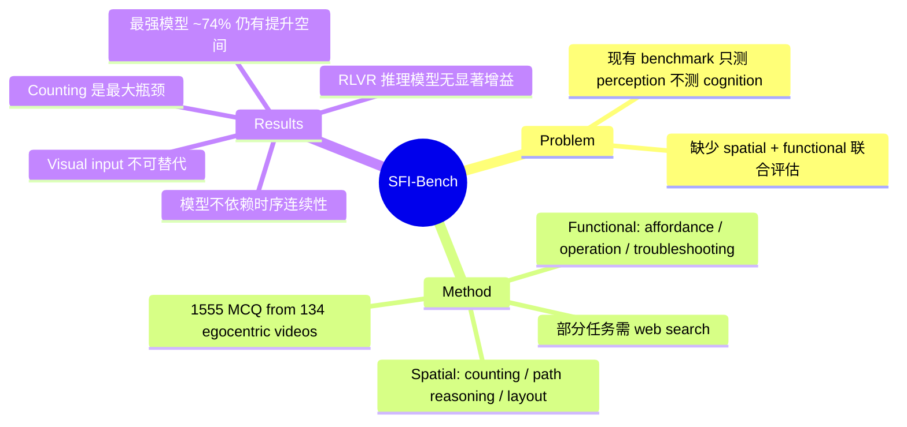

## Summary

提出 SFI-Bench，一个基于 egocentric indoor video 的 benchmark，从"空间在哪里"和"功能是什么"两个维度评估 MLLM 的高级认知推理能力。当前最强模型在 conditional counting 和 functional reasoning 任务上仍有明显短板，揭示了 perception-to-cognition 的瓶颈。

## Problem & Motivation

现有 spatial benchmark（如 VSI-Bench）主要评估几何感知和事实回忆，属于 perception 层面。但 agentic intelligence 需要更高阶的能力：构建结构化空间表示（cognitive map）和推断物体的功能 affordance。当前缺少系统评估这两个认知维度的 benchmark。

## Method

SFI-Bench 包含 1555 道人工标注的多选题，来自 134 个 egocentric indoor video（ARKitScenes + ScanNet++）。任务分两大类：

**Cognitive Spatial Reasoning（3 个任务）**：
- **Conditional Counting**：需要属性约束下的组合逻辑推理（如找柜子上同品牌瓶子的最大数量），不是简单计数
- **Cross-View Multi-hop Path Reasoning**：跨帧/视角整合空间线索，推断不在单帧中可见的关系
- **Layout Inference**：整合分布式线索推断全局场景布局和遮挡关系

**Functional Reasoning（3 个任务）**：
- **Functional Association**：推断物体间的 affordance 关系（如遥控器配对正确电视）
- **Operation Planning**：需要搜索设备手册，组装多步操作计划
- **Causal Hypothesis & Troubleshooting**：结合场景理解与外部知识诊断问题

构建流程：Gemini-2.5-Pro 提取 metadata → 模板生成候选问题 → 人工验证标注 → 后置质量过滤。

## Key Results

评测了 Gemini-3.1-Pro、GPT-5.4/5、o4-mini、Qwen3-VL、InternVL3.5、LLaVA-OneVision/Video 等模型：

- **Gemini-3.1-Pro 排名第一**，平均 73.8%；GPT-5.4-High 第二 72.1%
- **Conditional counting 是最大瓶颈**：所有模型得分最低（Gemini-3.1-Pro 也仅 59.1%）
- **Functional reasoning 任务（OP/TS）** 对无 web search 的模型接近 50%（4 选项随机猜概率）
- **GPT-5 配合 web search 在 OP/TS 上比无 search 高 ~8%**，但低推理预算下 web search 反而引入噪声降低性能
- **开源 reasoning 模型（RLVR 训练）相比 instruct 版本几乎没有提升**，甚至部分场景下降
- **帧序打乱实验**：GPT-5 在 0%-100% shuffle ratio 下性能基本不变，说明模型依赖静态视觉聚合而非时序连续性
- **visual vs. caption-only 输入**：caption-only 在 Layout 任务上从 83.0% 暴跌至 51.6%，证明直接视觉信号不可替代

## Strengths & Weaknesses

**Strengths**：
- 任务设计有想法：将 counting 重新定义为 compositional logical reasoning，将 functional reasoning 与 web search 工具结合，比单纯的 spatial QA benchmark 更接近 agentic 场景
- 分析维度丰富：reasoning trace 分析、failure mode 分类、帧序打乱实验、visual vs. caption 对比，都有信息量
- RLVR 在 spatial-functional 任务上无效这个发现值得关注

**Weaknesses**：
- 规模偏小：1555 题、134 个视频，作为 benchmark 的统计置信度存疑
- 仅 MCQ 格式，开放式回答/生成式评估完全缺失，容易受 option 设计影响
- "functional reasoning" 的定义偏窄：操作规划和 troubleshooting 本质上更接近 tool-use + retrieval 而非真正的 affordance understanding
- 数据构建高度依赖 Gemini-2.5-Pro 的 metadata 提取质量，存在系统性 bias
- 帧序打乱实验只用了 200 个样本，结论力度有限

## Mind Map

## Notes

- 评分 3：任务设计有一定新意（conditional counting 和 functional+tool-use 组合），但规模小、MCQ-only、"functional reasoning" 实质偏窄，限制了 benchmark 的长期影响力
- RLVR 在 spatial-functional 上无效这个发现值得深挖——可能暗示当前 RLVR 训练的目标函数和 spatial cognition 之间存在根本的 distribution mismatch
