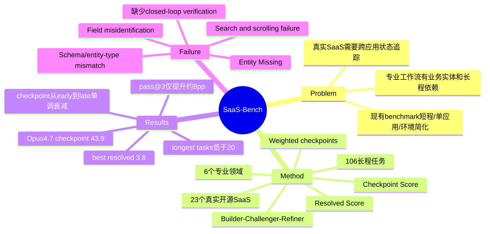

## Summary

SaaS-Bench 是一个面向 Computer-Use Agent 的真实 SaaS 工作流 benchmark：23 个可本地部署的开源 SaaS 系统、6 个专业领域、106 个长程跨应用任务。最强模型 Claude Opus 4.7 只有 43.9% checkpoint score 和 3.8% resolved score，说明当前 CUA 往往能推进中间步骤，但很少能稳定完成完整专业工作流。

## Problem & Motivation

现有 web/GUI agent benchmark 的主要问题是低估真实工作流难度：任务常常是单应用、短 horizon、环境逻辑简化，或者缺少真实后台状态约束。真实 SaaS 工作不同：需要跨系统协调、维护业务实体状态、处理领域术语和动态 UI，并把早期输出作为后续输入。

这篇论文的问题定义比较清楚：不是问 agent 能不能点击网页，而是问它能不能在真实业务软件中完成有经济意义的端到端流程。这个 formulation 比单纯提高 OSWorld/WebArena 分数更接近部署问题。

## Method

**SaaS environment**：作者选择 23 个真实开源 SaaS 系统，要求具备完整 frontend-backend、登录、持久化数据库、业务约束，并能通过 Docker 本地部署。系统被组织到 6 个专业领域：Software、Business、Healthcare、Teamwork、Agriculture、Media。为避免空环境过于 toy，作者根据 SQL schema、页面结构、字段语义和业务逻辑填充数据；没有公开数据源的系统使用 LLM 生成 realistic fake data，有公开数据源的场景则导入真实分布数据。

**Task design**：106 个任务中，74 个 text-only，32 个 multimodal；99/106 任务涉及至少两个应用，53 个任务涉及三个应用。按 Claude Opus 4.6 的轨迹估计，72/74 text-only 任务和 19/32 multimodal 任务超过 100 步。任务不是随机采样功能点，而是从职业角色和 workflow seed 出发，通过 Builder-Challenger-Refiner pipeline 生成：LLM Builder 负责模板和实例化，human Challenger/Refiner 检查 ambiguity、executability、verifiability、cross-app naturalness、dependency depth 等。

**Evaluation protocol**：统一使用 browser-use 执行，agent 只能通过 browser UI 操作，不允许直接访问数据库、backend API、文件系统或 verifier。每个任务被拆成 weighted verification checkpoints。验证方式包括 State-Check（数据库记录、API response、文件存在等客观状态）、Content-Check（结构/字符串规则）和 LLM-Judge（开放式输出质量）。指标分两类：

- **Resolved Score**：所有 checkpoints 都通过才算 1，否则 0，衡量严格端到端完成。
- **Checkpoint Score**：按权重计算 partial progress，衡量长程任务推进程度。

这个双指标设计很关键，因为它把“做对了很多中间步骤”和“最终业务闭环完成”区分开。

## Key Results

**主结果**：

| Model | Avg Steps | Resolved | Overall Checkpoint |
|---|---:|---:|---:|
| Claude Opus 4.7 | 175 | 3.8 | 43.9 |
| GPT-5.5 High | 200 | 1.9 | 43.8 |
| Claude Opus 4.6 | 257 | 1.9 | 43.2 |
| GPT-5.4 High | 252 | 3.8 | 37.0 |
| Kimi K2.6 | 269 | 0.9 | 34.1 |
| Qwen 3.6 Plus | 249 | 1.9 | 29.9 |
| Claude Sonnet 4.6 | 155 | 0.9 | 23.3 |

最强模型的 checkpoint score 只有 43.9%，top 3 都在 43-44% 区间；resolved score 最高只有 3.8%。这说明 CUA 不是“差一点就能部署”，而是在长程组合可靠性上有结构性缺口。

**Pass@k**：四个代表模型的 pass@3 相比 pass@1 约提升 8 个百分点，但仍无法填平差距。作者据此认为，失败不只是知识不足，也来自执行不稳定、过早终止和局部错误恢复失败。单次 pass@1 会掩盖模型的 run-level variance。

**复杂度趋势**：
- 最简单任务平均 score 约 53%，最长轨迹任务降到 20% 以下。
- checkpoint 数从 6 增到 18 时，score 从 65% 降到 27%。
- 早期、中期、后期 checkpoints 呈单调衰减，说明 agent 越往任务后段越难维持上下文和状态一致性。

**失败模式**：
- 失败 checkpoint 以 **Entity Missing** 为主，而不是 value mismatch。这表示 agent 经常根本没有创建目标记录/文件/工单，而不是仅把字段值填错。
- 不同领域的 failure mode 不同：Agriculture/Media 更偏 search/scrolling failure；Software 更容易在复杂控件上重复无效操作；Healthcare/Teamwork 更容易在 dense forms、document-like UI 和领域术语上 field misidentification。
- case study 中，一个日期错误让 Opus 4.6 得到 0.80 checkpoint score 但无法 resolved；另一个 customer entity-type 错误让下游财务记录全部挂到错误实体上，单个 schema 语义误读造成 30% 权重损失。

## Strengths & Weaknesses

**Strengths**：
- **问题 formulation 重要**：把 CUA 评测从“能不能操作 UI”推进到“能不能完成真实专业流程”。SaaS 的持久化状态、业务实体、跨应用依赖比普通网页任务更接近部署场景。
- **Resolved vs Checkpoint 双指标有信息量**：43.9% checkpoint vs 3.8% resolved 暴露了长程组合可靠性的脆弱性。这个 gap 比单个成功率更能说明问题。
- **环境可部署且有 verifier contract**：相比纯在线 in-the-wild 评测，Docker 化 SaaS + verify.py 保留了可复现性；相比 toy web，真实开源 SaaS 保留了业务复杂度。
- **失败分析扎实**：Entity Missing、checkpoint decay、entity-type mismatch、self-assessment mismatch 都指向同一个深层问题：当前 agent 缺少显式 task state / application schema / outcome verification loop。

**Weaknesses**：
- **成本高**：官方仓库建议 Linux、Docker、约 100GB 镜像空间；并行评测甚至建议 500GB+ RAM。作为训练或大规模回归 benchmark，成本不低。
- **browser-only action space 有边界**：禁止 backend/API/DB 访问让评测更公平，但也不完全符合未来 production agent 可能使用 UI+API hybrid 的现实形态。它测的是“纯浏览器操作 SaaS”的能力，而不是更广义的 enterprise automation。
- **任务构建依赖专家审核**：45% candidate task surviving full review 说明质量控制严格，但也意味着 benchmark 扩展需要大量人工 domain review。
- **LLM-Judge 仍在评估链中**：大部分状态可由 State-Check/Content-Check 覆盖，但开放式输出还依赖 LLM-Judge。对 report quality、image understanding 等结果，评分稳定性仍值得进一步验证。

**Impact**：
这篇最有价值的结论不是“某模型分数低”，而是指出 CUA 的可靠性瓶颈在组合层：单步 UI 能力、局部 planning、甚至中间 checkpoint 通过率都不足以推出端到端可用性。未来方法可能需要显式 schema grounding、checkpoint-based self-verification、persistent task memory、retry/recovery policy，而不是只扩大模型或提高 grounding accuracy。

## Mind Map

## Notes

- 与 [[Papers/2605-OpenComputer|OpenComputer]] 的关系：OpenComputer 更强调 app-specific hard-coded verifier 和桌面软件世界；SaaS-Bench 更强调真实 SaaS、跨应用业务流程和长程依赖。两者共同说明 verifier-grounded benchmark 正在成为 CUA 评测核心。
- 与 [[Papers/2606-WeaveBench|WeaveBench]] 的关系：WeaveBench 证明 GUI+CLI+Code hybrid 对真实桌面任务必要；SaaS-Bench 刻意限制为 browser UI，以隔离 browser-only CUA 能力。两者不是冲突，而是覆盖不同 deployment assumptions。
- 一个值得 follow-up 的研究问题：能否把 SaaS-Bench 的 checkpoints 变成 agent 内部可调用的 self-verification abstraction？如果 agent 能在执行中查询/重读/校验关键业务状态，resolved score 是否会超线性提升？
- 另一个方向：面向 SaaS schema 的显式 world model。失败案例中的 customer/company entity-type mismatch 不是视觉 grounding 错，而是 application data model grounding 错。
