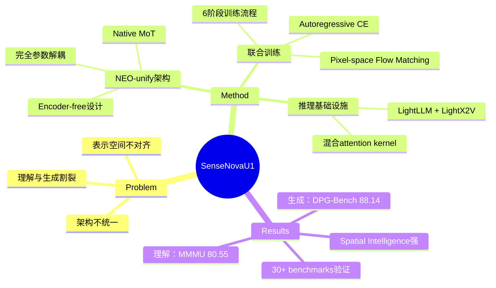

## Summary
提出 SenseNova-U1，一个原生统一的多模态理解与生成模型，通过 NEO-unify 架构在单一模型中同时实现视觉语言理解和图像生成，无需预训练 vision encoder 或 VAE，直接在像素和文本上操作。

## Problem & Motivation
当前 VLM 将理解和生成视为独立问题，导致架构割裂、级联流水线和表示空间不对齐。作者认为这是结构性限制而非工程问题。理解和生成应是"单一底层过程的协同视角"，统一建模能让两者互相增强。

## Method
### 核心架构：NEO-unify + Mixture-of-Transformers (MoT)

**视觉接口**：
- 轻量级双层卷积 patch encoding（stride 16 和 2）生成 32×32 patch tokens
- 线性投影头处理理解输出，MLP 头直接预测像素 patch 用于生成，绕过 VAE decoder
- Resolution-adaptive noise scale σ_R 确保跨分辨率的信噪比一致（平方根缩放）

**Native MoT 架构**：
- **完全参数解耦**：理解和生成流使用独立参数
- **Native RoPE**：统一 T、H、W 轴的时空编码
- 文本 token 使用 causal attention；图像 token 在 block 内双向 attend
- Noise token 双向 attend clean input；clean token 不能 attend noise
- 8B 变体：对称并行 dense streams + Pre-Buffer layers
- A3B 变体：MoE 架构，128 个理解 experts（30B 总参数）+ 32 个生成 experts（8B 总参数），每 token 激活 ~3B 参数

**联合训练目标**：
- 文本：autoregressive cross-entropy（λ₁）
- 生成：pixel-space flow matching（λ₂），rectified-flow interpolant + x-predict + v-loss
- Classifier-free guidance：独立调制文本（γ=4）和视觉条件（γ_img=1），训练时 10% 文本 dropout + 10% 全 dropout

**6 阶段训练流程**：
1. Understanding Warmup：attention fusion + 从 NEO 继续训练，0.75T tokens
2. Generation Pre-Training：冻结理解分支，3 个阶段（256²→2048²），~0.88T tokens
3. Unified Mid-Training：端到端联合训练，84K steps，λ₁=0.1, λ₂=1.0
4. Unified SFT：9K steps，高质量指令数据
5. Post Training (T2I)：RL via Flow-GRPO + dynamic resolution warmup + DMD2 distillation
6. CFG & Step Distillation：将 NFE 从 100 降至 8

**推理基础设施**：
- 解耦部署：LightLLM（理解）+ LightX2V（生成），通过 pinned shared memory 交换状态
- 混合 attention kernel 高效支持 causal/bidirectional 混合模式

## Key Results
### 理解能力（与专用 VLM 竞争）
- **MMMU**：8B-Think 74.78，A3B-Think 80.55
- **MathVista_mini**：8B-Think 84.20
- **Spatial Intelligence**：VSI-Bench 62.66，MindCube-Tiny 62.01（8B）/ 70.86（A3B）
- **IFEval**：8B 91.13，A3B 92.39
- **τ²-Bench**：A3B 75.39，**Claw-Eval** 58.50

### 生成能力（与专用生成模型竞争）
- **GenEval**：0.91 overall，Position accuracy 0.92（领先）
- **DPG-Bench**：A3B 88.14 overall，Global score 94.19（最高）
- **OneIG-Bench**：英文和中文 Text 分数均最佳
- **TIIF-Bench**：8B short 89.74 / long 89.17（最佳）
- **CVTG-2K**：8B 平均 word accuracy 0.940（开源最佳），NED 0.972
- **LongText-Bench**：8B EN 0.979 / ZH 0.962，接近 Seedream 4.5
- **Image Editing**：在 ImgEdit-Bench、GEdit-Bench、RISEBench 上表现强劲
- **Interleaved Generation**：在 OpenING、VBVR-Image、Uni-MMMU、RealUnify 上具竞争力

### Ablation
- Encoder-free 设计同时保留语义和像素表示
- 理解和生成通过 native MoT backbone 协同增强
- 高数据扩展效率

## Strengths & Weaknesses
**亮点**：
- **架构创新**：首个真正原生统一的多模态理解+生成模型，完全参数解耦 + native MoT 设计优雅
- **无需预训练组件**：绕过 vision encoder 和 VAE，直接在像素空间操作，减少信息瓶颈
- **全面的实验验证**：在 30+ benchmark 上验证理解和生成能力，覆盖文本渲染、infographic、编辑、interleaved 生成等多种场景
- **工程完整性**：6 阶段训练流程清晰，推理基础设施（LightLLM + LightX2V）实用
- **Spatial Intelligence 强**：VSI-Bench 和 MindCube 分数亮眼，符合研究兴趣

**局限**：
- **训练成本未披露**：6 阶段训练（~1.63T tokens + RL + distillation）的计算成本和数据规模细节不足
- **理解-生成协同的机制不清晰**：虽然声称"synergistic"，但 ablation 未充分展示两者如何互相增强（例如生成任务是否提升理解能力？）
- **与专用模型的差距**：理解侧未超越 GPT-4o/Claude 3.5 Sonnet，生成侧未超越 FLUX/Seedream 4.5，"统一"的代价是否值得？
- **VLA/World Model 结果缺失**：结论提到 VLA 和 world modeling 的潜力，但正文无实验支撑，过度 claim
- **MoE 效率分析不足**：A3B 变体激活 3B 参数但总参数 30B（理解）+ 8B（生成），实际推理效率和内存占用未详细讨论

**对领域的影响**：
- 为统一多模态模型提供了可行的架构范式，但"统一"是否优于"专用模型组合"仍需更多证据
- Encoder-free + pixel-space flow matching 的设计可能启发后续工作简化多模态架构

## Mind Map

## Notes
- **与研究兴趣的关联**：Spatial Intelligence 能力强（VSI-Bench 62.66），且声称支持 VLA，值得关注其在 GUI agent / embodied AI 场景的潜力
- **疑问**：MoE 的 expert routing 策略是什么？理解和生成 experts 是否共享部分参数？
- **后续探索**：如果开源模型权重，可尝试在 GUI grounding 或 computer-use 任务上 finetune
