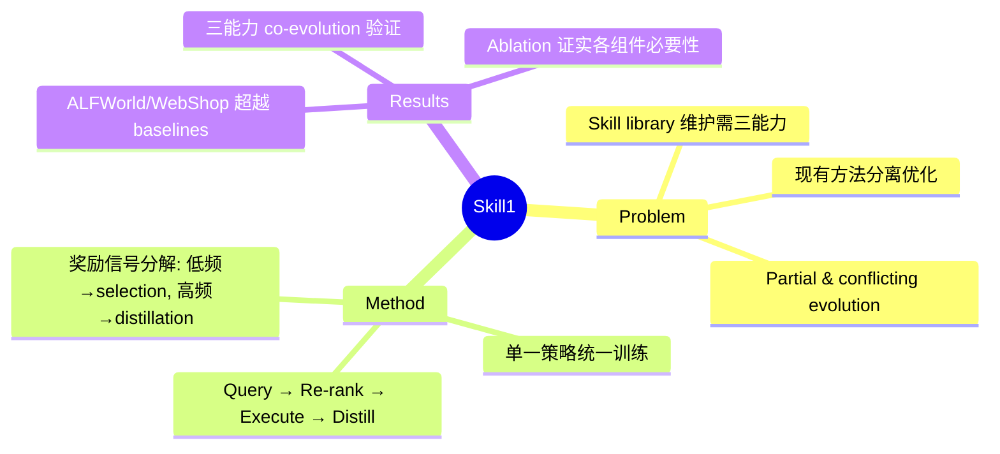

## Summary
Skill1 提出一个统一框架，让单一策略同时学习技能的选择、使用和提炼三种能力，通过共享的 task-outcome 信号实现协同进化，解决了现有方法分离优化导致的 partial and conflicting evolution 问题。

## Problem & Motivation
> [未获取全文，仅基于 abstract]

Language model agents 需要 skill library 来跨任务复用成功策略。维护这样一个 library 需要三个耦合能力：
1. **Skill Selection**：从 library 中选择相关技能
2. **Skill Utilization**：在执行中使用选中的技能
3. **Skill Distillation**：从经验中提炼新技能

现有方法的局限：将这些能力**分离优化**或使用**独立的奖励源**，导致 partial and conflicting evolution——各能力无法协同发展。

## Method
> [未获取全文，仅基于 abstract]

Skill1 框架的核心设计：

**统一训练目标**：单一策略（single policy）同时学习三个能力，共享一个 task-outcome objective。

**完整流程**：
1. 生成 query 搜索 skill library
2. 重排序候选技能并选择一个
3. 基于选中技能执行任务
4. 从 trajectory 中提炼新技能

**奖励信号分解**：
- **低频趋势**（low-frequency trend）：归功于 selection
- **高频变化**（high-frequency variation）：归功于 distillation

所有学习都源自单一的 task-outcome 信号，避免了多奖励源的冲突。

## Key Results
> [未获取全文，仅基于 abstract]

- **ALFWorld** 和 **WebShop** benchmark 上超越 prior skill-based 和 RL baselines
- 训练动态确认三种能力的 co-evolution
- Ablation 实验显示移除任何 credit signal 都会退化进化过程

## Strengths & Weaknesses
> [未获取全文，仅基于 abstract，评价可能不完整]

**Strengths**：
- 统一框架解决 skill library 维护的核心问题
- 单一奖励信号避免了多目标优化中的冲突
- 理论分析将奖励信号分解为 selection 和 distillation credit

**Weaknesses**：
- 需要验证在更复杂、更大规模环境中的泛化性
- skill library 的容量和检索效率可能成为瓶颈
- 依赖 task-outcome 信号，对于稀疏奖励环境可能需要额外设计

## Mind Map

## Notes
- 与 [[2500-TestTimeReinforcementLearning]] 的关系：都涉及 agent 的 RL 训练，但 Skill1 聚焦于 skill library 的维护
- 核心洞察：将 selection/utilization/distillation 统一到一个 policy 中，用频率分解来 credit assignment
- 待确认：skill representation 的具体形式、library 的存储和检索机制