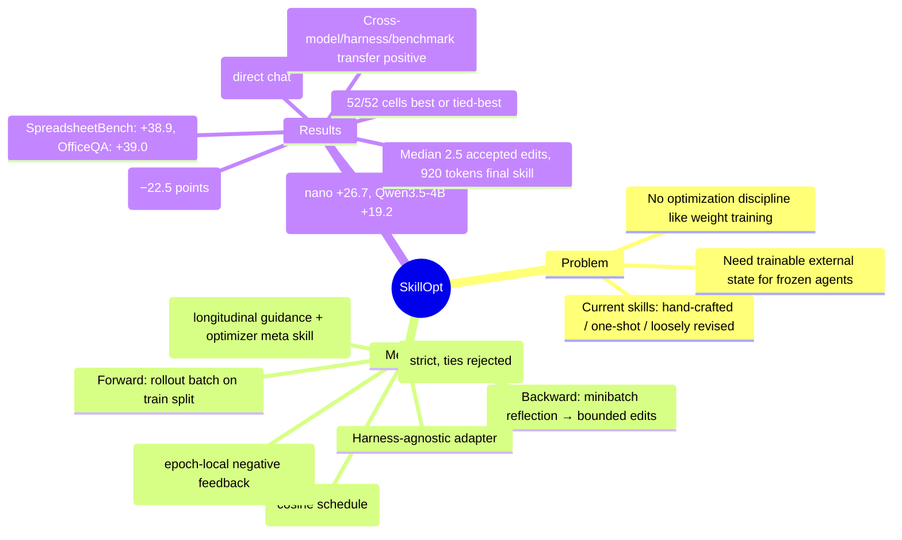

## Summary
将 agent skill 文档视为可训练对象，用独立的 optimizer 模型对其进行类似深度学习的优化（bounded edits + validation gate + learning rate schedule），在 6 个 benchmark 上平均提升 23.5 个点，且部署时零额外推理成本。

## Problem & Motivation
当前 agent skill 要么手写、要么一次性生成、要么通过松散的自我修订演化，都无法可靠地超越起点。作者认为 skill 应该像模型权重一样被"训练"，但作为冻结模型的外部状态，施加与权重空间优化同等的纪律（learning rate、validation split、rejected sample buffer 等）。核心洞察：用独立的 optimizer 模型将打分后的任务轨迹转化为有界的 add/delete/replace 编辑，仅在验证集性能严格提升时接受更新。

## Method

### 核心设计

**Forward Pass (Rollout Evidence)**：在训练集上用当前 skill 执行一批任务，记录轨迹（tool calls、observations、final answers、verifier feedback）。小 batch 更新快但噪声大，大 batch 暴露更多重复模式。

**Backward Pass (Minibatch Reflection)**：optimizer 模型将失败/成功样本分离，分成 reflection minibatch，为失败样本提议修正规则、为成功样本提议保留行为。提议分层合并，过滤重复和矛盾。

**Bounded Text Updates (Textual Learning Rate)**：关键创新——每步最多接受 *Lₜ* 个编辑（默认 cosine schedule，初始 4，floor 2）。Optimizer 按预期效用排序合并后的编辑，裁剪到 top *Lₜ*。这是与无界 prompt rewriting 的核心区别。

**Validation Gate**：每个候选 skill 在 selection split 上评估。若提升当前 selection score 则成为新 current skill；若超过历史最佳则成为导出 artifact；否则拒绝。被拒编辑进入 epoch-local buffer，作为负反馈提供给后续 reflection。

**Epoch-Wise Slow/Meta Update**：epoch 结束时，在前后 skill 下采样相同任务，分组为 improvements/regressions/persistent failures/stable successes，写入 protected longitudinal guidance block。Optimizer 侧维护 meta skill 总结编辑模式（accepted/rejected/persistent），用于未来 optimizer prompt——该 meta skill 不随部署 artifact 发布。

**Harness-Agnostic Deployment**：轻量 adapter 接口构造 batch、注入 skill 到 agent context、运行原生 harness、返回打分轨迹。同一 optimizer 适用于 direct QA、spreadsheet execution、embodied environments、Codex/Claude Code loops。

### 超参数（默认）
- 4 epochs，rollout batch size 40，reflection minibatch size 8
- 16 parallel analyst workers，merge batch size 8
- Textual learning rate *Lₜ* = 4 with cosine decay (floor = 2)
- Strict validation gating（ties rejected）
- Slow update 每 epoch 采样 20 个任务
- Patch edit mode（alternative: rewrite_from_suggestions）

## Key Results

### 主要数字
- **52/52 cells** 在所有（model, benchmark, harness）组合上最佳或并列最佳
- GPT-5.5 direct chat：平均 no-skill accuracy 从 58.8 提升到 82.3（**+23.5 points**）
- GPT-5.5 Codex harness：**+24.8 points** over no skill
- GPT-5.5 Claude Code：**+19.1 points** over no skill
- 平均比最佳 per-cell 竞争者（oracle 从 6 个 baseline 中选）高 **+5.4 points**

### 分 Benchmark 亮点（GPT-5.5, direct chat）
| Benchmark | No Skill | SkillOpt | Gain |
|-----------|----------|----------|------|
| SearchQA | 77.7 | 87.3 | +9.6 |
| SpreadsheetBench | 41.8 | 80.7 | +38.9 |
| OfficeQA | 33.1 | 72.1 | +39.0 |
| DocVQA | 78.8 | 91.2 | +12.4 |
| LiveMath | 37.6 | 66.9 | +29.3 |
| ALFWorld | 83.6 | 95.5 | +11.9 |

### Scaling 行为
更小/更弱的模型相对收益最大。GPT-5.4-nano 平均增益 +26.7 points；Qwen3.5-4B 增益 +19.2 points。方法提供了小模型权重中缺失的程序性知识。

### Ablation 关键发现
- **Slow/Meta Update**：移除两者导致最大性能下降（SpreadsheetBench 从 77.5 降至 55.0，−22.5 points）
- **Textual Learning Rate**：*Lₜ* ∈ {1,2,4,8,16} 都有竞争力；"without lr"（无界 rewriting）降至 84.6/75.7/57.3，远低于有界变体
- **Training Data**：SpreadsheetBench 从 1 example 到 100% 训练数据，性能从 47.5 爬升到 78.0；SearchQA 在 ~20% 训练数据后饱和
- **Batch Size**：Reflection minibatch size (1–32) 和 rollout batch size (8–full epoch) 性能相对平坦，说明增益不来自脆弱的 batch-size tuning

### Transfer 实验
- **Cross-Model**：GPT-5.4 优化的 SpreadsheetBench skill 迁移到 GPT-5.4-mini (+9.4) 和 GPT-5.4-nano (+3.0)。部分迁移 skill *超过* in-domain SkillOpt（如 LiveMath GPT-5.4: 47.2 transferred vs. 44.0 in-domain）
- **Cross-Harness**：Codex 训练的 SpreadsheetBench skill 迁移到 Claude Code 增益 +59.7 points（略超 in-domain 的 80.4）；对称的 Claude Code→Codex 迁移增益 +43.6
- **Cross-Benchmark**：OlympiadBench→Omni-MATH 迁移在三个模型规模上正向（+1.3 到 +3.7），但小于 within-domain 迁移
- **Optimizer Strength**：强 frontier optimizer (GPT-5.5) 产生更大增益，但 target-matched optimizer 恢复了 56–74% 的强 optimizer 增益——确认优化循环本身贡献了实质价值

### Learned Skill 特性
- **紧凑性**：最终 skill 范围 379–1,995 tokens（中位数 ~920），都能良好适配典型 system-prompt 预算
- **编辑经济性**：增益来自极少的 accepted edits：每 benchmark 1–4 个编辑（中位数 2.5）。大部分 optimizer 提议被 validation gate 拒绝
- **代表性学到的规则**（verbatim from deployed skills）：
  - **SearchQA**: "Infer the expected answer type from clue wording, then choose the shortest canonical entity"
  - **SpreadsheetBench**: "Inspect workbook structure and formulas, then write evaluated static values"
  - **OfficeQA**: "Treat oracle parsed pages as primary evidence, lock table/date/unit context"
  - **DocVQA**: "first bind the question to the exact visual row/header/field, then copy only the aligned answer span"
  - **LiveMath**: "rank choices by theorem strength and prefer a justified stronger-result option"
  - **ALFWorld**: "Keep a horizon-aware visited/frontier ledger, diversify search after repeated same-type failures"
  - 所有规则都是程序性的，而非 instance-specific

## Strengths & Weaknesses

### Strengths
1. **系统性优化纪律**：首次将深度学习的优化控制（learning rate schedule、validation gate、rejected sample buffer、meta update）系统性地引入 text-space skill optimization，而非松散的 self-revision
2. **零部署成本**：优化后的 skill 是紧凑文本文件（中位数 ~920 tokens），部署时零额外推理调用，与 weight adaptation 或 in-context learning 形成鲜明对比
3. **跨模型/跨 harness 泛化**：迁移实验显示 skill 可跨模型规模、跨执行环境、甚至跨 benchmark 正向迁移，部分迁移性能超过 in-domain 优化
4. **编辑经济性**：中位数仅 2.5 个 accepted edits 就带来显著增益，说明 validation gate 有效过滤了噪声提议，学到的是高质量程序性规则
5. **Ablation 充分**：slow/meta update、textual learning rate、batch size、training data、gate strictness 等关键设计都有对照实验，且 slow/meta update 的重要性（−22.5 points）清晰可见

### Weaknesses
1. **需要自动反馈**：方法最直接适用于有 verifier、exact-match metrics 或可执行检查的任务；主观/开放式领域需要替代评估方式（论文已承认）
2. **训练成本**：Rollout 计算和 optimizer 模型调用增加成本，虽然可通过复用摊销，但对资源受限场景可能是障碍
3. **单一 skill artifact**：对高度异构、需要多个不相交程序的领域可能不足（论文已承认）
4. **分布敏感性**：Skill 可能编码训练分布的 domain-specific heuristics，迁移到实质不同的设置前需仔细评估（论文已承认）
5. **Optimizer 模型依赖**：虽然 target-matched optimizer 能恢复 56–74% 的强 optimizer 增益，但仍需一个足够强的 optimizer 模型；对于非常弱的 target 模型，可能需要外部强 optimizer，增加部署复杂度
6. **Baseline 对比不完整**：缺少与 prompt optimization 方法（如 DSPy、OPRO）的直接对比，虽然论文 positioning 强调 "persistent, reusable skill artifact" 与 prompt optimization 的区别，但实证对比会更有说服力

### 潜在影响
- **Agent skill 工程范式转变**：从手写/一次性生成转向"训练" skill 文档，可能成为 agent 系统的标准流程
- **Text-space optimization 理论**：为 text-space 优化建立了类似 weight-space 的优化控制框架，可能启发更多 text-space learning 研究
- **小模型增强路径**：为资源受限场景提供了通过外部 skill 增强小模型的可行路径（Qwen3.5-4B +19.2 points）

## Mind Map

## Notes
- **与 EvoSkill 的区别**：EvoSkill 是 harness-side 的 skill evolution，SkillOpt 是独立 optimizer + validation gate + bounded edits + meta update 的系统性优化框架。实验显示 SkillOpt 在 Codex 上比 EvoSkill 高 +14.0 points，在 Claude Code 上高 +3.2 points
- **Textual learning rate 的类比**：*Lₜ* 限制每步最多接受的编辑数，类似 weight-space 的 learning rate 限制参数更新幅度。Ablation 显示无界 rewriting 性能显著下降，证明 bounded update 是关键
- **Validation gate 的严格性**：Ties rejected 确保被拒编辑成为有信息量的负反馈，而非隐藏状态。这与深度学习中 validation loss 不降则拒绝更新的纪律一致
- **Slow/meta update 的双重作用**：Slow update 写入 longitudinal guidance（跨 epoch 的改进/退化模式），meta update 维护 optimizer 侧的编辑模式总结。两者共同稳定优化过程，ablation 显示移除两者导致最大性能下降（−22.5 points）
- **迁移实验的意外发现**：部分迁移 skill 超过 in-domain 优化（如 LiveMath GPT-5.4: 47.2 transferred vs. 44.0 in-domain），可能因为源模型的优化过程发现了更通用的规则，或目标模型的 in-domain 优化陷入局部最优
- **与 GEPA/TextGrad 的区别**：GEPA/TextGrad 优化 prompts 或 configurations，SkillOpt 优化 persistent, reusable skill artifact。与 Trace2Skill 的区别：SkillOpt 增加了 held-out validation gating 和 iterative refinement
- **潜在研究方向**：
  1. 多 skill artifact 系统（针对高度异构领域）
  2. 主观/开放式任务的评估方式（如 LLM-as-judge + validation gate）
  3. Optimizer 模型的 meta-learning（学习如何更好地提议编辑）
  4. Text-space optimization 的理论分析（收敛性、泛化界等）
