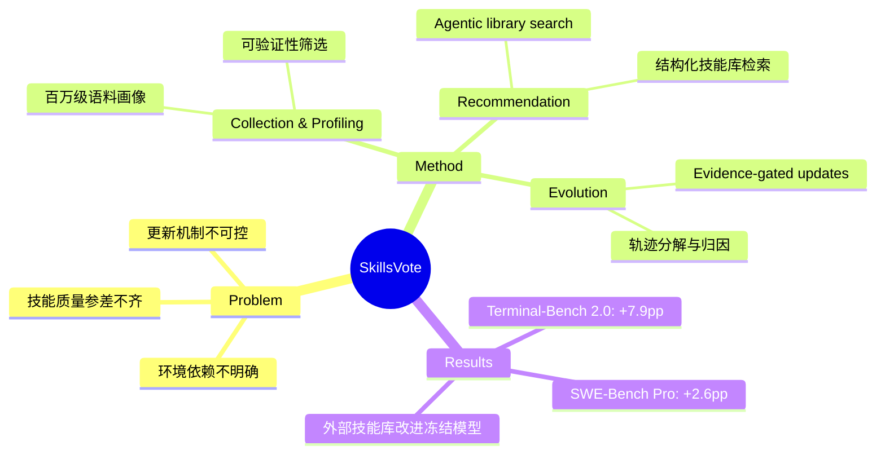

## Summary
> [未获取全文，仅基于 abstract]

SkillsVote 是一个 Agent Skills 的全生命周期治理框架，从百万级开源语料中筛选、验证、推荐和演化可复用技能，通过 evidence-gated updates 机制在 Terminal-Bench 2.0 上提升 GPT-5.2 达 7.9pp，在 SWE-Bench Pro 上提升 2.6pp，证明外部技能库可在不更新模型的情况下改进冻结 agent。

## Problem & Motivation
> [未获取全文，仅基于 abstract]

现有 agent 系统缺乏对外部技能库的系统化治理：技能质量参差不齐（研究显示 26.1% 的社区贡献技能含漏洞）、环境依赖不明确、更新机制不可控。如何从海量开源语料中筛选高质量、可验证的技能，并在执行后安全地演化技能库，是提升 agent 能力的关键瓶颈。

## Method
> [未获取全文，仅基于 abstract]

SkillsVote 将 Agent Skills 定义为"耦合可执行脚本与非可执行过程指导的经验模式"，包含三个核心阶段：

1. **Collection & Profiling**：对百万级开源语料进行环境需求、质量和可验证性画像，筛选出可验证技能并为其合成测试任务
2. **Recommendation**：执行前通过 agentic library search 在结构化技能库中检索，暴露相关技能的指导性上下文
3. **Evolution**：执行后分解轨迹，将结果归因到多个信号，仅通过 evidence-gated updates 准入成功发现的技能更新

框架支持离线演化（在 benchmark 上预训练技能库）和在线演化（在实际任务中持续学习）。

## Key Results
> [未获取全文，仅基于 abstract]

- **Terminal-Bench 2.0**：离线演化使 GPT-5.2 提升最高 7.9pp
- **SWE-Bench Pro**：在线演化提升最高 2.6pp
- **核心发现**：governed external skill libraries 可在不更新模型参数的情况下改进冻结 agent

## Strengths & Weaknesses
> [未获取全文，仅基于 abstract]

**Strengths**：
- 系统化解决技能库治理的完整生命周期（采集→推荐→演化），而非单点优化
- Evidence-gated updates 机制提供了可控的技能演化路径，避免盲目累积低质量技能
- 在两个主流 benchmark 上验证了外部技能库对冻结模型的提升效果，为 agent 能力扩展提供了模型更新之外的新路径

**Weaknesses**（基于 abstract 的推测）：
- 未获取全文，无法评估 evidence-gated updates 的具体实现细节和失败案例
- 百万级语料的 profiling 成本和可扩展性未知
- 技能库的长期维护和版本管理策略不明确

## Mind Map

## Notes
- 技能定义强调"可执行脚本 + 过程指导"的耦合，区别于纯指令或纯代码的技能表示
- Evidence-gated updates 的具体门控机制是关键，需要全文确认是基于成功率、覆盖率还是其他信号
- 与 NVIDIA Verified Agent Skills、Self-Evolving Agent Skills (arXiv 2604.01687) 等工作的对比需要进一步调研
