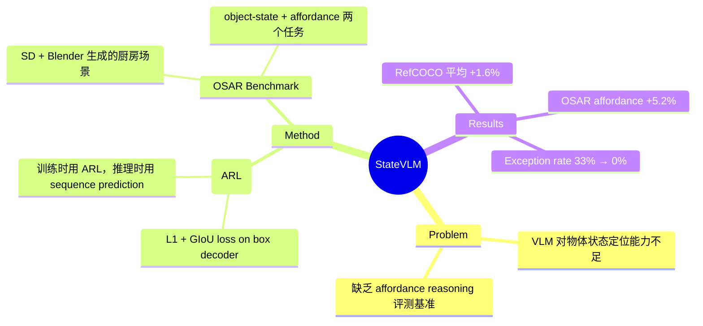

## Summary

提出 Auxiliary Regression Loss (ARL) 训练策略，通过在 VLM fine-tuning 时引入 box decoder 的回归损失（L1 + GIoU），提升模型在物体检测和 affordance reasoning 上的定位精度，同时推理阶段保持标准 sequence prediction 不变。配套贡献了 OSAR benchmark（1,172 scenes, 7,746 objects）用于评估 object-state affordance reasoning。

## Problem & Motivation

现有 VLM 在机器人场景中对物体状态感知和 affordance reasoning 能力不足，尤其在数值推理（bounding box 坐标输出）方面表现较差。当前缺乏专门评估 object-state affordance reasoning 的 benchmark，RefCOCO 等 REC 数据集只关注引用表达式理解，不涉及物体状态（如脏/空/满）和可抓取区域的推理。因此需要：(1) 一种能让 VLM 更准确定位物体及状态的方法；(2) 一个面向 affordance reasoning 的评测基准。

## Method

### Auxiliary Regression Loss (ARL)

- 基于 MiniCPM-V 2.6（SigLip-400M 视觉编码 + Perceiver-resampler 压缩 + Qwen2-7B LLM）
- 新增一个轻量 box decoder：对 LLM sequence output 做 global average pooling，再过两层 MLP（ReLU）输出 4D 坐标
- 训练目标：$\mathcal{L}_{CLM+ARL} = \alpha \mathcal{L}_{CLM} + \beta \mathcal{L}_{ARL}$，其中 $\alpha=0.2, \beta=0.8$
- ARL 本身由 L1 loss（权重 0.2）和 GIoU loss（权重 0.8）组成，模仿 DETR 的 loss 设计
- **关键设计**：训练时用 box decoder 的输出计算 ARL，推理时回归标准 Pix2Seq sequence prediction，不需要额外推理开销
- 训练硬件：4x A100 80GB，DeepSpeed 分布式训练，lr=1e-6

### OSAR Benchmark

- 基于 Stable Diffusion + Blender 生成的厨房场景数据集
- 1,172 scenes，7,746 objects，25,401 referring expressions，76,203 dialog instances
- 两个任务：object-state localization（定位物体位置）和 affordance reasoning（定位可抓取区域）
- 物体状态覆盖容器内容（空/半固体/固体/液体）和餐具卫生（干净/脏）

## Key Results

### RefCOCO/RefCOCO+/RefCOCOg（full fine-tuning）

| Model | RefCOCO val | RefCOCO+ val | RefCOCOg val |
|:------|:------------|:-------------|:-------------|
| Shikra (Pix2Seq-7B) | 87.0 | 81.6 | 82.3 |
| NExT-Chat (Pix2Emb-7B) | 85.5 | 77.2 | 80.1 |
| StateVLM (CLM only) | 85.1 | 80.2 | 78.9 |
| StateVLM (CLM+ARL) | 86.6 | 81.7 | 80.7 |

- ARL 平均提升 1.6%，与 Shikra 持平，优于 NExT-Chat
- CLM-only 在 ~5k steps 后过拟合，CLM+ARL 持续改进至 25k steps

### OSAR Benchmark（LoRA fine-tuning）

- CLM-only LoRA: object detection 77.9%，affordance reasoning 32.2%，exception rate 33.36%
- CLM+ARL LoRA: affordance reasoning **60.2%**，exception rate **0.00%**
- ARL 平均提升 5.2%，且将 exception rate 从 33.36% 降至 0%

### Ablation

- Box decoder 设计：两层 MLP + ReLU 最优，GELU/Sigmoid 效果差
- Prompt 设计：简单 prompt 优于包含坐标系统说明的 concrete prompt

## Strengths & Weaknesses

**Strengths:**
- ARL 设计思路简洁：训练时加回归 loss，推理时无额外开销，是一种低侵入性的增强策略
- OSAR benchmark 填补了 object-state affordance reasoning 评测空白，开源且有自动标注
- Exception rate 从 33.36% 降至 0% 是一个实际有意义的改进，说明 ARL 显著提升了输出格式稳定性

**Weaknesses:**
- **增量有限**：RefCOCO 上 1.6% 的提升在 REC 领域不算显著，且未超越 Shikra（2023 年的工作）
- **OSAR benchmark 可信度存疑**：由 Stable Diffusion + Blender 自动生成，非真实机器人采集数据，"human verification is still necessary" 且数据集规模小（仅 1,172 scenes），难以支撑 full fine-tuning
- **ARL+LoRA 在 OSAR object detection 上反而低于 CLM-only LoRA**，与 REC 上的结论矛盾，未充分解释
- **Baseline 选择偏弱**：Baseline MiniCPM-V 未经任何 REC 微调（Acc@0.5 仅 6-16%），对比不公平；与 Shikra/NExT-Chat 的对比受限于不同训练配置
- **Affordance 定义窄**：仅覆盖厨房场景的抓取区域，未涉及更广泛的操作 affordance
- 作者自己承认 "significant gap remains between current performance and practical deployment"

## Mind Map

## Notes

- ARL 的核心思想（在 sequence prediction 模型上加辅助回归 loss）并不新颖，DETR/NExT-Chat 等已有类似设计，本文的贡献更多是将此策略适配到 MiniCPM-V 上并验证于 affordance 场景
- OSAR 的自动生成流程（SD + Blender）虽然降低了标注成本，但生成数据与真实机器人场景之间的 domain gap 是一个未被充分讨论的问题
- 与 RT-2、OpenVLA 等 VLA 工作相比，本文未涉及 action generation，仅聚焦于 perception 层面的 affordance reasoning
