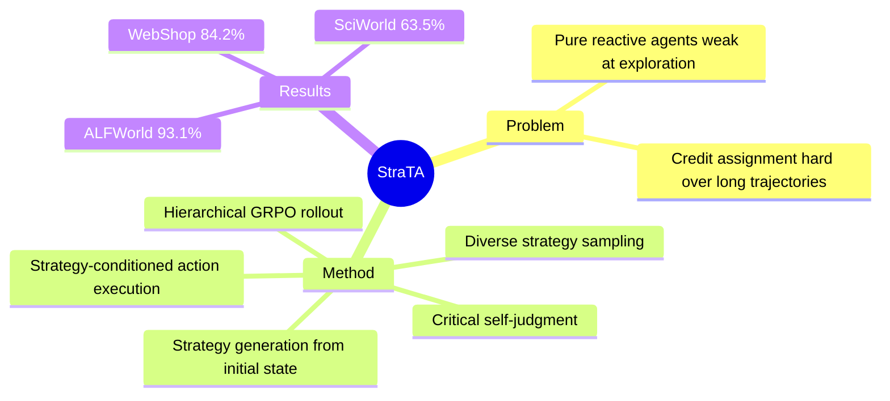

## Summary

StraTA 在 agentic RL 中引入显式的 trajectory-level strategy：从初始状态采样一个 compact strategy，conditioning 后续 action，并通过 hierarchical GRPO-style rollout 联合训练 strategy generation 和 action execution。

## Problem & Motivation

当前 LLM agent 的 RL 优化面临一个核心困境：existing methods are largely purely reactive，即 agent 只根据当前 observation 做决策，缺乏对整个 trajectory 的全局规划。这同时削弱了 exploration（难以发现稀疏 reward 的长序列）和 credit assignment（难以将最终 reward 归因到早期决策）。对于 long-horizon decision making 场景，纯 reactive 策略是根本性的瓶颈。

## Method

核心设计：

1. **Strategy Generation**：从 initial task state 采样一个 compact strategy（trajectory-level 的高层规划），作为后续 action 的 conditioning signal
2. **Strategy-conditioned Execution**：agent 的 action 不再仅依赖当前 observation，而是同时以 strategy 为上下文，实现 trajectory-level 的 coherence
3. **Hierarchical GRPO-style Rollout**：联合训练 strategy generation 和 action execution，采用层次化的 rollout 设计
4. **Diverse Strategy Rollout**：采样多种 strategy 增强 exploration 多样性
5. **Critical Self-Judgment**：引入自我评估机制（具体实现未知，需全文确认）

本质上是在 GRPO 基础上加了一层 trajectory-level abstraction，把 "先想清楚再做" 的结构注入 RL 训练。

## Key Results

| Benchmark | StraTA | 备注 |
|:----------|:-------|:-----|
| ALFWorld | 93.1% success rate | 文本家庭环境 |
| WebShop | 84.2% success rate | Web 购物任务 |
| SciWorld | 63.5% overall score | 科学实验环境，超过 frontier closed-source models |

声称在 sample efficiency 和 final performance 上均优于 strong baselines。

## Strengths & Weaknesses

**Strengths**：
- 问题定位精准：纯 reactive 策略在 long-horizon task 上的局限是真实痛点，引入 trajectory-level strategy 是自然且合理的方向
- 设计相对简洁：在 GRPO 框架上加一层 strategy abstraction，不需要全新的 RL 算法
- 三个不同类型的 benchmark（textworld、web、science）上都有提升，说明方法有一定 generalizability

**Weaknesses**：
- Strategy 质量如何保证？如果 strategy 本身是 bad plan，conditioning on it 反而会 harm performance。训练中 strategy 的 failure mode 未在 abstract 中提及
- "Outperforming frontier closed-source models" 的 claim 需要谨慎看待——SciWorld 上的 closed-source baseline 通常没有经过 RL fine-tuning，对比不公平
- 缺乏对 strategy 的可解释性分析：生成的 strategy 是什么形式？自然语言？latent code？可读性如何？
- Sample efficiency 的提升幅度未在 abstract 中给出具体数字，只说了 "consistently improves"
- Simulation-only：ALFWorld/WebShop/SciWorld 都是模拟环境，real-world agent 场景的可行性存疑

## Mind Map

## Notes

- 论文标题中 "Abstraction" 和用户给的 "Augmentation" 不同，以论文原文 "Abstraction" 为准
- 与 GRPO 系列（如 RAGEN、AgentRL 等）的关系值得深入对比——是否只是在 GRPO 上加了一层 planning？ablation 是否能证明 strategy component 的独立贡献？
- hierarchical rollout 的具体设计是关键细节，需要全文确认
- 对 "critical self-judgment" 机制比较好奇——是 reward model？还是 self-critique prompt？
