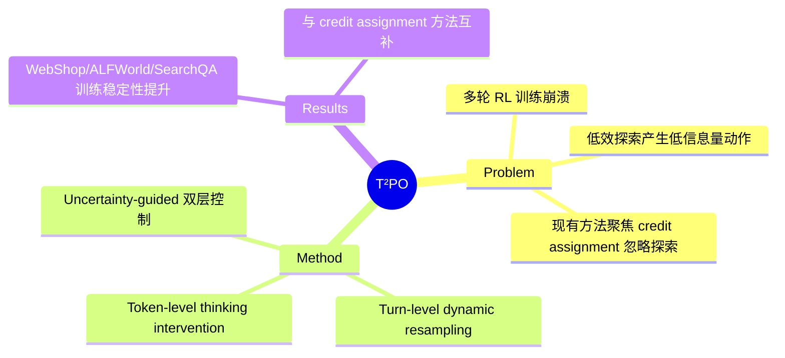

## Summary

T²PO 提出 uncertainty-guided 的 token-level 和 turn-level 双层探索控制机制，解决多轮 agent RL 训练中的不稳定性问题——通过监控 uncertainty 动态触发 thinking intervention 和动态重采样低信息量 turn，在 WebShop/ALFWorld/SearchQA 上实现更好的训练稳定性和性能。

## Problem & Motivation

多轮 RL 训练中，尽管已有 credit assignment 和 trajectory filtering 等稳定化技术，训练崩溃仍然普遍。作者认为根源在于低效探索：policy 持续产生低信息量动作，既不减少 uncertainty 也不推进任务进度。现有方法（ProxMO、SOLAR-RL、GiGPO）聚焦 credit assignment，未从探索效率角度切入。

## Method

**Token-Level: Thinking Intervention**
- 监控 token 级别的 uncertainty 动态（entropy 变化）
- 当边际 uncertainty 变化低于阈值时，触发 thinking intervention——强制模型重新推理
- 避免模型在低 uncertainty 区域"自动驾驶"产生无信息量 token

**Turn-Level: Dynamic Resampling**
- 识别探索进度可忽略的 interaction turn
- 动态重采样这些 turn，避免浪费 rollout
- 避免在"死胡同"turn 上浪费计算

**核心差异**: 现有方法（ProxMO、SOLAR-RL）在 credit assignment 层面工作（如何分配奖励），T²PO 在 exploration 层面工作（如何避免无效探索）。两条路线互补。

## Key Results

- WebShop、ALFWorld、SearchQA 三个环境上验证
- 训练稳定性和性能均优于 baseline
- 代码开源 (github.com/WillDreamer/T2PO)

## Strengths & Weaknesses

**亮点**：
- 从探索效率角度切入多轮 RL 不稳定性，与 credit assignment 方法（ProxMO、SOLAR-RL）正交
- Token-level + turn-level 双层控制提供了细粒度的探索管理
- 代码开源

**局限**：
- 与 ProxMO 的 PSA、SOLAR-RL 的 first failure point detection 相比，T²PO 的 uncertainty 监控需要额外的 entropy 计算开销
- 仅在 WebShop/ALFWorld/SearchQA 上验证，未在 GUI grounding 或真实 web agent 场景测试
- Uncertainty threshold 的选择可能需要 per-task 调优

## Mind Map

## Notes

- 与 [[Papers/2602-ProxMO]] 的关系：ProxMO 解决"如何分配 credit"，T²PO 解决"如何避免无效探索"。两者可组合使用。
- 与 [[Papers/2604-SOLAR-RL]] 的关系：SOLAR-RL 从离线数据重建 rollout，T²PO 在在线训练中控制探索。互补。
- 对 GUI Agent 方向的启示：GUI agent 的长程任务中，"死胡同"turn 尤其常见（如反复点击无效元素），T²PO 的 turn-level resampling 可能有直接应用价值。
