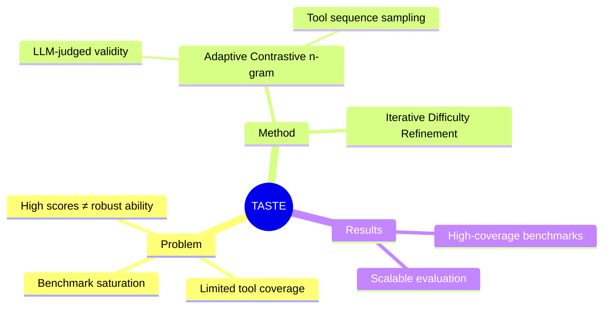

## Summary
> [未获取全文，仅基于 abstract 和检索信息]

提出 TASTE 方法，通过自适应对比 n-gram 建模和迭代难度提升，自动生成高覆盖度、高难度的 agent benchmark 任务，解决现有基准饱和问题。

## Problem & Motivation
> [未获取全文，仅基于 abstract 和检索信息]

现有 agent benchmark（如 WebArena、SWE-bench）存在两大问题：1）覆盖度有限，工具组合空间未充分探索；2）难度饱和，模型快速达到高分但不代表真实能力。高分往往反映 benchmark saturation 而非 robust task-solving ability。已有研究（Berkeley RDI）发现这些 benchmark 可被利用达到近乎完美分数而实际未解决任务，亟需可持续、可扩展的 benchmark 生成方法。

## Method
> [未获取全文，仅基于 abstract 和检索信息]

TASTE（Task Synthesis from Tool Sequence Evolution）包含两大核心机制：

1. **Adaptive Contrastive n-gram Modeling**：在 LLM-judged validity signals 上训练对比 n-gram 模型，能够采样出覆盖广泛工具组合的有效工具序列。通过对比学习区分有效/无效的工具调用模式。

2. **Iterative Difficulty Refinement**：迭代地提升任务难度，确保生成的任务对当前 SOTA agent 仍具挑战性。

该方法目标是实现 benchmark 的**自动化生成**和**持续扩展**，避免人工构造 benchmark 的成本和饱和风险。

## Key Results
> [未获取全文，仅基于 abstract 和检索信息]

具体实验数字未获取。方法声称能够生成 difficult, high-coverage benchmarks 用于持续、可扩展的未来 agent 评估。

## Strengths & Weaknesses
> [未获取全文，仅基于 abstract 和检索信息]

**Strengths:**
- 直击痛点：现有 benchmark 饱和是 agent 评估的真实瓶颈，WebArena/SWE-bench 已被证明可被 game
- 方法可扩展：自动生成 + 迭代难度提升，理论上可持续产生新任务
- 覆盖度优先：n-gram 建模工具序列组合，系统化探索工具使用空间

**Weaknesses:**
- 信息不足以评估：validity signal 的 ground truth 来源？LLM-judged 是否引入偏差？
- 难度提升的上界：iterative refinement 会否陷入 adversarial examples 而非真实任务？
- 与真实任务分布的 gap：自动生成的任务是否保持生态有效性（ecological validity）？

## Mind Map

## Notes
- 与 Berkeley RDI 的 benchmark gaming 研究形成呼应，validation 很重要
- n-gram 建模工具序列是个巧妙角度，但需要看具体实现（context window、如何处理长依赖）
- 关键问题：生成的任务是否 reflect real-world agent capabilities？还是只是 harder puzzles？
