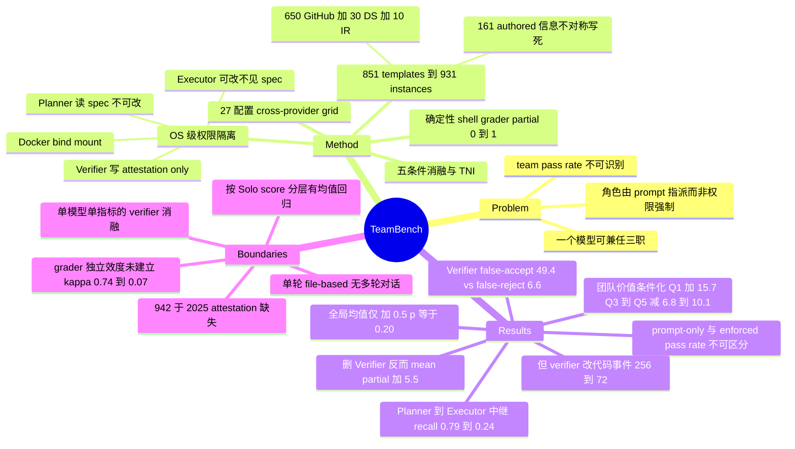

## Summary

TeamBench 用 Docker bind mount 把 Planner / Executor / Verifier 的「读完整 spec / 改 workspace / 签最终认证」三项权限物理隔离，在 851 templates（931 seeded instances）上把 **enforcement 本身当作实验变量**，问「角色分离到底买到了什么」。三条主结果都是负面的：Verifier 放行 49.4% 被确定性 grader 判失败的提交（false-reject 仅 6.6%），155 任务参照消融里删掉 Verifier 反而让 mean partial score 涨 5.5 分，prompt-only 与 sandbox-enforced 的 pass rate 统计上不可区分（42.7% vs 40.5%）。团队价值高度条件化：Solo 最低五分位上 Full Team 领先 15.7 分，最高三个五分位上落后 6.8–10.1 分，全局均值只有 +0.5 分（p=0.20）。

## Problem & Motivation

论文的 problem formulation 比它的 benchmark 更值得注意：**在几乎所有 multi-agent 工作里，"角色"是 prompt 里的一句话，而不是 harness 里的一条约束**。MetaGPT / AutoGen / ChatDev / CAMEL 都把 Planner、Executor、Critic 指派给同一个 backbone，harness 并不阻止这个模型同时规划、编辑、认证同一份解。于是 team pass rate 变成一个不可识别的量——它既可能来自真正的跨角色协作，也可能来自一个模型悄悄兼任三职，两者在指标上无法区分。

作者的做法是把 enforcement 从"实现细节"提升为"实验变量"：固定 Planner-Executor-Verifier 这一个 topology，只变 enforcement（prompt-only vs OS 权限），看指标和行为分别怎么动。这与 MultiAgentBench 那类"变 topology、不变 prompt-assigned"的设计正交，也正是后者无法隔离的那个轴。

第二个前提是任务构造：如果 workspace 本身就包含解题所需的全部信息，Executor 单干即可，Planner 天然冗余。因此作者手写了 161 个模板，把 critical constraint **只**放进 `spec.md`，brief 和 workspace 里都没有——协作被结构性地设为必要条件。

## Method

**权限矩阵（Table 2，Docker bind mount 强制）。** 每个角色一个容器，只挂载自己需要的文件与工具。Planner 读完整 spec 但不能改 workspace、不能执行命令；Executor 能改能跑，但只拿到摘要版 brief，看不到完整 spec；Verifier 读完整 spec 与 Executor 的只读证据，出最终 pass/fail 判决并写 `attestation.json`。**没有任何角色同时拥有三项权限**。Table 23 列出四个统一接口的 tool（`read` / `write` / `run` 等），每个都按角色做程序化鉴权，越权调用直接返回 permission denied——Verifier 的写权限被收窄为 attestation only。

**任务池。** 851 个模板 → 931 个 seeded instance，覆盖 19 个 base category（leaderboard 用 21 个 refined category）。构成为 161 个原创模板（信息不对称在撰写阶段就写死）+ 650 个 GitHub bug report（11 个手工精选自 Flask/Click/httpx/Requests/Pydantic/Django/pytest/FastAPI/SQLAlchemy/Celery/Werkzeug，639 个来自更广的抓取）+ 30 个 data science + 10 个 incident response。每个模板配一个 generator，按 seed 产出确定性但各不相同的 workspace（变配置值、API 字段名、bug 位置，保持结构复杂度），seed 0–2 公开、seed ≥5 留给隐藏 leaderboard。

**五条件消融（Table 1）。** Solo（单 agent，全 spec + workspace + 四个 tool）/ Restricted（同一 agent，去掉 spec 访问）/ Full Team / Team-No-Plan / Team-No-Evaluate。由此定义 Teamwork Necessity Index：TNI = 团队从 Solo−Restricted 缺口中挽回的比例（ε=0.05 防止分母近零），并另报 Planning Value = S_full − S_no_plan、Verification Value = S_full − S_no_verify。

**Cross-provider role mixing。** 把「哪个 provider 坐哪个角色」当实验变量，三家（Anthropic / Google / OpenAI）各出一个紧凑前沿模型，穷举 3³ = 27 种配置 × 25 任务 × 3 seed = 2,025 run，实测花费 $326.04。

**评分。** 每个任务一个确定性 shell 脚本 grader（`grade.sh`），产出 [0,1] 的 partial score；binary pass 要求所有 check 通过（对齐 SWE-Bench / Terminal-Bench）。有一条 promotion rule：如果一次 run 的全部失败都来自 attestation check（即只是忘了写 attestation.json），则计为 pass，原始判定同时保留。所有 API call 用 temperature 0。

## Key Results

### 1. Verifier 是坏 gate，不是没 gate

在 155 任务参照消融（Gemini-3 Flash 固定在全部五个条件上）里，**从 Full Team 里删掉 Verifier，mean partial score 反而涨 5.5 分**，per-task verification value 平均 −5.8 分。作者随即做了一件对的事：这个下降既可能是 Verifier 错，也可能是 grader 错，于是转到 role-mixing pool 上把每个 Verifier 判决与确定性 grader 配对：

| 指标 | Pooled | GPT-5.4 Mini（最好） | Gemini-3 Flash（最差） |
|:--|:--|:--|:--|
| False-accept rate | 49.4% | 36.3% | 77.0% |
| False-reject rate | 6.6% | 3.3% | 18.6% |
| Accuracy | 62.7% | 70.9% | 48.2% |

误差是**不对称**的：Verifier 远比"错判失败"更容易"错判通过"。Table 18 的 pooled 混淆矩阵为 TP=285 / FP=384 / FN=20 / TN=394。作者自己给了口径边界——2,025 个 role-mixing cell 中有 942 个没产出有效 attestation（harness 错误、超时、verifier 轮次未完成），把这 942 个当作 fail verdict 处理后有效 false-accept 率从 49.4% 降到 22.3%；在经过审计的 TeamBench-Verified 子集上是 38.7%。结论方向不变：**当前 LLM Verifier 在这个单轮 file-based 协议里是 pass-by-default，不是质量闸门。**

### 2. 团队价值是条件性的，不是普遍的

155 任务按 per-task Solo score 分成五等分（每格 31 任务）：

| Solo 分位 | Full Team − Solo |
|:--|:--|
| Q1（Solo 0.00–0.22） | **+15.7**（95% CI [5.8, 25.7]） |
| Q2 | +8.8 |
| Q3–Q5 | **−6.8 到 −10.1** |

全局均值只有 **+0.5 分（p=0.20，paired bootstrap n=10,000）**，team 只在 155 个任务里的 68 个上赢。TNI 把任务分为 15 个 HIGH-TNI、39 个 TEAM-HELPS、62 个 NEUTRAL、39 个 TEAM-HURTS。leaderboard（13 模型 / 90 任务分层子集）上同一模式按模型复现：Sonnet 4.6 +20.0、Haiku 4.5 +16.7、GPT-5.4 +15.6、Gemini-3 Flash +12.2（Solo 弱者受益），而 Opus 4.7 只有 +2.2、GPT-5.4 Mini −4.4、Gemma 4 31B −5.6（Solo 强者受损）。最强模型是 Claude Opus 4.7：Full Team 37.8% / Solo 35.6%。

作者在 E.6 里主动尝试证伪三个解释：H1 spec relay（**反向成立**：necessity gap 与 team uplift 负相关 r=−0.446, p<10⁻²⁴, n=472）、H2 step-budget 耗尽（Solo 耗时与 Solo 得分零相关 r=0.00）、H3 Planner 充当隐式 CoT（No-Plan 与 Restricted 在难任务上无差别，p=0.66）。三个都不成立。

### 3. Prompt-only vs enforced：pass rate 看不出差别，行为看得出

预注册 450 run（25 任务 × 3 模型家族 × 2 seed），排除后 400 个有效：

| Condition | Pass rate % [95% CI] | Per-run violation rate % [95% CI] | n |
|:--|:--|:--|:--|
| prompt_only | 42.7 [34.7, 50.0] | 6.4 [5.3, 7.6] | 150 |
| enforced | 40.5 [32.4, 48.6] | 6.2 [5.3, 7.3] | 148 |
| enforced_shared_history | 48.0 [38.2, 57.8] | 8.9 [7.6, 10.3] | 102 |

三个预注册 McNemar 检验（按 (model, task, seed) 配对 + Holm-Bonferroni）：T1 compliance p_adj = 0.113、T2 outcome p_adj = 0.907、T3 p_adj = 0.907，最强的原始检验是 p = 0.038。**没有一个 planned comparison 在校正后显著。**

而 trace label 讲了另一个故事：**enforcement 把 Verifier 改代码的尝试从 256 降到 72（3.6×），同时把 executor-plans 事件从 261 升到 416**。论文明确说明这个 3.6× 是**按 per-turn event 计数**而非 per-run outcome。作者由此提出两条 benchmark 报告建议：报 per-turn trace 的 role-violation rate；按 Solo score 分层报 team value。

### 4. Cross-provider mixing 改变成本-性能前沿

25 任务网格、三 seed 汇总：PGEAVA（Google Planner + Anthropic Executor + Anthropic Verifier）26.7% @ $20.52，超过全 Anthropic 队（22.7% @ $39.58）4 个点且只花一半钱；POEOVA 以 $10.98 打平全 Anthropic；全 OpenAI 队 18.7% @ $2.09。成本跨度从 $0.65 到 $39.58（60.9×），而 pass rate 跨度只有 4 个点。Per-role marginal 显示 Executor 与 Verifier 的选择比 Planner 更重要（Planner 三家 CI 完全重叠）。作者诚实提示：细粒度配置排名跨 seed 不稳（Spearman 0.09–0.28，28.9% 的配置-任务对翻转），所以只该看 pooled role marginal。

### 5. 信息中继确实很差

Planner→Executor 传递分析（792 run / 15 任务）：spec-critical token 在 Planner 通道的 mean recall 是 0.79，到 Executor 的 tool 输入输出只剩 **0.24**；Executor 平均保留 Planner spec-critical token 的 0.21，中位数 0.13。作者标注这是下界（只数出现在 Executor 通道里的 token）。

### 6. Grader 效度没有被独立建立（作者承认）

三个 LLM judge 对 285 个分层 run 打 PASS/FAIL：**给它们看确定性判定时 Fleiss κ = 0.74，把判定藏起来重跑同样 285 个 tuple 时 κ = 0.07**。作者据此宣布两个版本都不作为独立 grader validation。泄漏-free 版还暴露一个系统性分歧：Gemini-3 Flash 在 53% 的 case 上返回 PASS，而 grader 的 PASS 率是 14%——与它作为 Verifier 的 77% false-accept 同源。TeamBench-Verified（canonical solution + cross-model discrimination + 适用时的 mutation testing）只有 90 个 leaderboard 任务中的 57 个（63.3%）通过，且 58 个 canonical solution 走的是 "LLM-run evidence path" 而非人工解。

### 7. 人类研究（pilot）

40 个完成且带问卷的 session、21 个任务、18 个真人（Solo n=12 / Hybrid n=17 / Team n=11）。三种模式的行为分布截然不同：Solo 中位 11 分钟 / 6 个显式动作；**Hybrid 塌缩为「秒批」——中位 3 分钟 / 2 个动作，17 个 Hybrid Verifier 里 16 个自签 pass，而 grader 重跑的 structural mean partial 只有 0.79**；Team 中位 26 分钟 / 39 个动作，自签 11/11 pass 而 grader 的 structural mean partial 是 0.60。人类 Team 问卷里 Verifier 感知价值最高（3.75/5）却聊天轮次最低（中位 5），且"漏验证"只被 4/32 选为主要失败因素——与 agent 侧 49% false-accept 形成对照。失败因素排名：时间压力 17/32、跨角色信息缺失 14/32。

## Evidence Ledger

| Claim ID | Claim | Type | Source locator | Evidence excerpt | Status |
|:--|:--|:--|:--|:--|:--|
| C1 | 851 templates → 931 seeded instances；161 authored + 650 GitHub + 30 DS + 10 IR | benchmark-setting | §2.2；Table 8 | "We curate 161 tasks with critical constraints available only in the full requirements. We adapt 650 GitHub bug reports" | source-verified |
| C2 | 155 任务参照消融（Gemini-3 Flash）删 Verifier 使 mean partial score +5.5，per-task verification value 平均 −5.8 | number | §3.3 ¶1 | "removing the Verifier from the Full Team raises mean partial score by 5.5 points" | source-verified |
| C3 | 该 verifier-removal 消融只报 mean partial score，无 pass rate、无 CI、无显著性检验（全文无对应 per-condition 表） | benchmark-setting | §3.3；Tables 1–23 全扫 | 全段仅有 "5.5 points" 与 "−5.8 points" 两个点估计 | source-verified |
| C4 | Table 12 上 No-Eval 减 Full 的符号按模型翻转：GPT-5.4 34.4 vs 27.8、Gemini-3 Flash 27.8 vs 25.6，但 Haiku 4.5 1.1 vs 28.9、Sonnet 4.6 6.7 vs 27.8 | number | Table 12（App C.2） | Table 12 行值 | source-verified |
| C5 | Table 6 pass rate：prompt_only 42.7 [34.7,50.0] n=150；enforced 40.5 [32.4,48.6] n=148；shared-history 48.0 [38.2,57.8] n=102 | number | Table 6 | Table 6 行值 | source-verified |
| C6 | 统计口径为按 (model, task, seed) 配对的 McNemar + Holm-Bonferroni；T1 p_adj=0.113、T2 p_adj=0.907、T3 p_adj=0.907；最强原始检验 p=0.038 | benchmark-setting | §3.6；Table 6 caption | "McNemar tests are paired at the (model, task, seed) level with Holm-Bonferroni correction" | source-verified |
| C7 | "statistically indistinguishable" 无 TOST/等价界支撑，仅为未拒绝零假设（全文检索无 equivalence test） | benchmark-setting | §3.6；App E.7 | "No planned comparison remains significant after correction" | source-verified |
| C8 | 3.6× = Verifier code-edit attempts 从 256 降到 72，论文明说按 per-turn event 而非 per-run outcome 计算 | number | §3.6；App E.7 末句 | "computed on per-turn events rather than per-run outcomes and is unchanged" | source-verified |
| C9 | 预注册 450 run（25 任务 × 3 家族 × 2 seed），排除后 400 有效 | benchmark-setting | §3.6 | "pre-specified a 450-run study on a 25-task subset ... 400 valid runs remain" | source-verified |
| C10 | 两条件 per-run role-violation rate 几乎相同：6.4% vs 6.2% | number | Table 6 violation 列 | "prompt_only ... 6.4 [5.3, 7.6]"；"enforced ... 6.2 [5.3, 7.3]" | source-verified |
| C11 | Pooled false-accept 49.4%（Wilson CI [45.9,52.9]）；Table 18 pooled TP=285/FP=384/FN=20/TN=394 → 真实分母为 FP+TN=778，而非 §3.3 并列引用的 n=1,083 | number | §3.3；Table 18（App E.2） | §3.3 "(Wilson 95% CI [45.9,52.9], n=1,083)"；Table 18 pooled "285 384 20 394" | source-verified |
| C12 | Per-provider false-accept 36.3%（GPT-5.4 Mini）–77.0%（Gemini-3 Flash）；pooled false-reject 6.6%，per-provider 0%–18.6% | number | Table 18 metrics block；App E.2 | "pooled false-reject rate at 6.6% and the per-provider rates between 0% and 19%" | source-verified |
| C13 | 2,025 个 role-mixing run 中 942 个无有效 attestation；把它们记为 fail verdict 后 false-accept 降至 22.3%；Verified 子集上为 38.7% | number | App E.2；Table 19；App D | "2,025 unique role-mixing runs minus 942 that lacked an attestation"；Table 19 "Treat as fail verdict 22.3%" | source-verified |
| C14 | 155 任务按 Solo score 五等分（每格 31）：Q1 +15.7（CI [5.8,25.7]）、Q2 +8.8、Q3–Q5 −6.8 至 −10.1 | number | §3.4 ¶1；Fig. 5(b) | "outperforms Solo by 15.7 points in the lowest quintile (Solo 0.00 to 0.22; 95% CI [5.8,25.7])" | source-verified |
| C15 | 全局 team-vs-Solo 均值 +0.5 分（p=0.20，paired bootstrap n=10,000）；team 赢 68/155 | number | §3.3 ¶2 | "Mean team-vs-Solo uplift is +0.5 points (p=0.20, paired bootstrap, n=10,000)" | source-verified |
| C16 | 团队价值峰值位置论文内部不一致：472-pair panel 上二次拟合顶点在 Solo 0.54（峰值 7.6 分，R²=0.60，p=0.002），五分位分析峰值在 Q1（最难）；作者并列报告不做调和 | number | App E.6 "Capability-conditional uplift" | "vertex sits at Solo 0.54 ... places the peak at Q1 (hardest). The two statistics answer different questions" | source-verified |
| C17 | E.6 H1：necessity gap（Solo−Restricted）与 team uplift 负相关 r=−0.446, p<10⁻²⁴, n=472；作者结论"spec relay 不足以解释" | causal-mechanism | App E.6 H1 | "necessity gap is negatively correlated with team uplift (r=−0.446 ...). Spec relay alone is not sufficient" | source-verified |
| C18 | 每任务一个确定性 shell grader（grade.sh），partial score ∈ [0,1]；binary pass 需全 check 通过；仅 attestation 类失败被 promote 为 pass；API 全用 temperature 0 | benchmark-setting | App A.2；§3.1；Table 12 脚注；App D.2 | "counts a run as a pass if all failures are attestation-related"；"All API calls use temperature 0" | source-verified |
| C19 | Grader 效度审计：三 LLM judge 在 285 tuple 上看得到判定时 Fleiss κ=0.74，藏起判定后 κ=0.07；作者宣布两者都不作 grader validation | benchmark-setting | App D；App D.1；Table 14 | "we report neither variant as independent grader validation" | source-verified |
| C20 | 90 个 leaderboard 任务中 57 个（63.3%）过 TeamBench-Verified 门槛；"Verified" 指按适用支柱审计而非逐任务专家核定 | benchmark-setting | App D；Table 13 | "'Verified' means audited on the pillars that apply rather than expert-verified per task" | source-verified |
| C21 | 13 模型 / 4 家族 / 90 任务分层 leaderboard；role-mixing 27×25×3 = 2,025 run @ $326.04；参照消融 1,165 run（gemini-3-flash-preview） | benchmark-setting | §3.1；Table 7（App C.1）；App D.2 | "reference ablation requires 1,165 task runs under gemini-3-flash-preview" | source-verified |
| C22 | 每轮输出预算 8,192 token，正文称 harness "uses capped turns"，但全文未给出具体 per-role turn cap / step limit / wall-clock timeout | benchmark-setting | App E.4；§4 | "exhaust the harness's per-turn output budget (8,192 tokens)"；"The current harness uses capped turns" | source-verified |
| C23 | 角色权限由 Docker bind mount 强制；共四个 tool；Planner/Verifier 不能执行任意命令或改 workspace，Verifier 写权限仅限 attestation | causal-mechanism | Table 2（App A.1）；Table 23（App F.1） | "Role permissions enforced by Docker bind mounts"；write 行 Verifier "Attest. only" | source-verified |
| C24 | Table 12 上 13 个模型里 6 个 Restricted（无 spec）pass rate 高于 Solo（有 spec），如 GPT-5.4 35.6 vs 12.2、Sonnet 4.6 27.8 vs 7.8、Haiku 4.5 31.1 vs 12.2 | number | Table 12 Solo/Restricted 列 | "GPT-5.4 12.2 35.6"；"Claude Sonnet 4.6 7.8 27.8"；"Claude Haiku 4.5 12.2 31.1" | source-verified |
| C25 | Opus 4.7 最强（Full 37.8% / Solo 35.6%）；team−solo 差按 Solo 强弱翻转：Sonnet +20.0、Haiku +16.7、GPT-5.4 +15.6、Gemini-3 Flash +12.2 vs Opus +2.2、GPT-5.4 Mini −4.4、Gemma 4 31B −5.6 | number | §3.2；Fig. 3；Table 12 | "Claude Opus 4.7 is the strongest model in both settings, with 37.8% on Full Team and 35.6% on Solo" | source-verified |
| C26 | Planner→Executor 中继（792 run / 15 任务）：spec-critical token recall 0.79（Planner 通道）vs 0.24（Executor 通道）；Executor 保留均值 0.21、中位 0.13；作者称其为下界 | number | §3.4 末段 | "mean recall of spec-critical tokens is 0.79 in the Planner channel but only 0.24 in the Executor tool inputs and outputs" | source-verified |
| C27 | 人类研究 40 session / 21 任务 / 18 人（Solo 12、Hybrid 17、Team 11）；Hybrid 中位 3 分钟 2 动作、16/17 自签 pass 而 grader structural mean partial 0.79；Team 11/11 自签 pass 而 structural mean partial 0.60 | number | §3.8；App B.3；Table 5 | "40 completed survey-confirmed sessions across 21 tasks from 18 distinct humans (Solo n=12, Hybrid n=17, Team n=11)" | source-verified |
| C28 | 发布于 teambench.github.io，数据集在 HuggingFace ybkim95/teambench，代码与数据均为 MIT license | license-code | App D.2 | "Both the dataset content and the code release are distributed under the MIT license" | source-verified |
| C29 | 作者单位为 MIT / Google Research / Google DeepMind / Independent Researcher；2026-05-08 提交 cs.AI | metadata | 首页 affiliation；arXiv abs 页 | "1MIT 2Google Research 3Google DeepMind 4Independent Researcher" | source-verified |
| C30 | 161 个原创模板的 critical constraint 只出现在完整 spec 中，brief 与 workspace 均无，因此 Executor 必须依赖 Planner | causal-mechanism | §2.2；App A.2 | "critical constraints appear only in the full specification. They are absent from the brief and workspace" | source-verified |

## Strengths & Weaknesses

**Strengths**

- **把 enforcement 变成实验变量，这是全文最重要的贡献。** 论文问的不是"多 agent 好不好"，而是"我们报告的 team 指标到底在测什么"。固定 topology、只变 enforcement，这个设计直接把"协作收益"与"prompt 服从"分开——而这恰是 MetaGPT / AutoGen / MultiAgentBench 一系无法隔离的轴。这个 formulation 可以直接搬到任何 harness component attribution 研究上。
- **False-accept 与 false-reject 的不对称是可复用的定量事实。** Pooled 49.4% vs 6.6%，跨三家 provider 方向一致。它给出的不是"LLM judge 不准"这种模糊结论，而是"**LLM verifier 是 pass-by-default，误差单向**"。这对所有用 LLM judge 标 milestone 的 multi-agent benchmark（含 MultiAgentBench 的 Coordination Score）都是可操作的校准警告：judge 的错误不会互相抵消，会系统性地把团队分数往上推。
- **诚实标准显著高于同类 benchmark 论文。** 四个例子：(a) grader plausibility audit 的 Fleiss κ 从 0.74（看得到判定）掉到 0.07（藏起判定）后，作者主动宣布两个版本都不算 grader validation，而不是留着 0.74 当卖点；(b) shared-history 条件的方向在敏感性分析下翻转后被降格为 inconclusive；(c) 49.4% 与 22.3% 两个 false-accept 口径同时给出并各自说明含义；(d) 配置排名跨 seed 不稳（Spearman 0.09–0.28）被写出来，并据此只报 pooled marginal 而不报排名。
- **E.6 是在认真尝试证伪自己的解释。** H1（spec relay）、H2（step budget）、H3（隐式 CoT）三个候选机制被逐个检验，H1 还得到了**反向**结果（necessity gap 与 team uplift 负相关）并照实写出。这种"给自己的机制假设找反例"的做法在 benchmark 论文里罕见。
- **权限隔离是真隔离。** Docker bind mount + 程序化 tool 鉴权，越权返回 permission denied，而不是在 system prompt 里写 "You CANNOT modify the workspace"。这使得 trace 里的"Verifier 尝试改代码"成为可测量的事件而非可协商的行为。

**Weaknesses**

- **两个 headline 用了同一个不显著的检验，读法却相反。** "statistically indistinguishable pass rates" 与 "3.6× more verifier code-edit attempts" 出自同一个 450-run 预注册研究。前者把"未拒绝零假设"当作等价性证据——没有 TOST、没有预设等价界，而 CI 宽度是 ±8pp，根本排除不了有实践意义的差异；后者对应的 compliance 检验（T1）raw p=0.038 / p_adj=0.113 同样不显著，却以确定性口吻写进 abstract。更值得注意的是 Table 6 里两条件的 per-run violation rate 几乎相同（6.4% vs 6.2%），与 3.6× 的叙事张力明显：3.6× 是**单一 label 的 per-turn 事件计数**（256 vs 72，未按 150/148 的 run 数归一），不是 per-run 违规率。作者在 E.7 里如实标注了计数单位，但 abstract 没有。
- **Verifier-removal 这个核心消融只有一个模型、一个指标、零不确定度。** +5.5 mean partial score 来自 155 任务 × Gemini-3 Flash 单模型，无 CI 无 p 值；而同一操作在 leaderboard pass rate 上（Table 12 "No Eval" vs "Full"）符号按模型翻转：GPT-5.4 删 Verifier 后从 27.8 升到 34.4，Gemini-3 Flash 从 25.6 升到 27.8，但 Haiku 4.5 从 28.9 塌到 **1.1**、Sonnet 4.6 从 27.8 塌到 6.7。abstract 的 "removing the verifier improves mean partial score" 字面上成立，但把它读作"verifier 有害"会与作者自己的表直接冲突。而且 Haiku/Sonnet 那两个极低值很可能是 attestation 相关的实现产物（No-Evaluate 条件下无人写 attestation，promotion rule 是否覆盖该条件论文没说），作者完全没有解释这一列为何塌陷——一个没被解释的 27.8 点塌陷本身就是问题。
- **按 Solo score 分层再报告 Full Team − Solo，存在均值回归。** 分层变量与被比较量共用同一次 Solo 观测。在 per-task 单次运行、partial score 噪声不小的情况下，落进最低五分位的任务本身就富集了"Solo 这次运气差"的样本，任何其他条件都会向上回归。论文没有做 split-half（用一半 seed 分层、另一半算差值）或任何去偏。这不否定条件性的存在——leaderboard 上跨 13 个模型的同向模式是独立证据——但 +15.7 这个幅度不可信。作者自己的二次拟合把峰值放在 Solo=0.54（中等难度）而非 Q1（最难），两个结论并列且未调和，而这**正是均值回归会产生的分歧模式**。
- **benchmark 的核心设计前提被自己的数据削弱。** 设计假设是"critical constraint 只在 spec 里，所以必须靠 Planner 中继"。但 (a) Table 12 上 13 个模型里 6 个在 Restricted（无 spec）下 pass rate **高于** Solo（GPT-5.4 35.6 vs 12.2，Sonnet 4.6 27.8 vs 7.8，Haiku 4.5 31.1 vs 12.2）；(b) E.6 H1 发现 necessity gap 与 team uplift 负相关 r=−0.446。两条都指向：在这个 harness 下，把完整 spec 给 agent 常常是净负债而非资产（大概率是 context 负担与注意力分散）。作者报告了 (b) 并承认"spec relay 不足以解释"，却没有回头质疑这对 **TNI 这个指标本身**意味着什么——TNI 的分母 S_solo − S_restricted 在近半数模型上是负的，一个建立在"完整信息应该更好"之上的必要性指数就失去了基准。
- **49.4% 的分母在正文里标错了。** §3.3 写 "(Wilson 95% CI [45.9,52.9], n=1,083)"，但 Table 18 给出 FP=384、TN=394，false-accept 的真实分母是 **778 个 grader-failing run**；1,083 是 attestation-bearing 池的大小。CI 宽度与 n=778 吻合而与 n=1,083 不吻合，所以数字本身没算错，是标注错了 n。这个错误正好落在最容易被二手引用的位置。
- **942/2,025（46.5%）的 attestation 缺失率，敏感性分析方向反了。** 22.3% 那一档把全部 942 个缺失 run 都算进"grader-failing 且被正确拒绝"，等于假设它们**全部失败且 Verifier 全部判对**——这是对 Verifier 最有利的假设，却被标为"保守端"。真正的下界应该把缺失当作对 Verifier 最不利的情形，或者给区间界。46.5% 的缺失本身也说明 harness 在 role-mixing 网格上稳定性不足。
- **grader 的独立效度没有建立，因此"是 Verifier 错还是 grader 错"这个问题并没有被真正回答。** κ 从 0.74 掉到 0.07 意味着 LLM judge 在看不到答案时几乎毫无一致性，所以那 778 个 grader-failing run 里有多少属于 grader 过严，本文排除不了。§3.3 用 role-mixing pool"分离 Verifier 错误与 grader 错误"的论证因此不完整：它证明的是"Verifier 与 grader 系统性不一致且方向单一"，不是"Verifier 错了"。TeamBench-Verified 子集上 38.7% 的复现降低了这个担忧但没有消除——该子集 90 个任务里 58 个的 canonical solution 走的是 "LLM-run evidence path"（某次历史 agent run 通过了 grader）而非人工解，这条证据链与 grader 本身并不独立。
- **外部效度受限于单轮 file-based 协议。** 无多轮对话、无动态角色分配、无同 provider 内的模型规模缩放；而真实 multi-agent 系统（Claude Code subagent、AutoGen、OpenHands）恰恰是多轮的，Verifier 的反馈本该触发 Executor 重做。在单轮协议里 Verifier 只能"签或不签"，它的 false-accept 代价被最大化了。作者明确承认这个边界。
- **人类研究是 pilot，且未达到自己的停止条件。** 40 session / 18 人，预注册停止条件是"每个模式在 20 个分层目标任务上各 ≥10 session"，实际每个模式只有 5 个目标任务有数据；Solo 的 verdict 甚至不由平台写入。"Hybrid 3 分钟就批准"这个观察很有说服力（16/17 自签 pass vs grader structural partial 0.79），但只能当方向性信号，不能作为 human-vs-LLM 对照。

**潜在影响。** 这是目前"harness component attribution"这条线上对照设计最完整的一篇，它的价值不在 leaderboard 数字（37.8% 的天花板一年内会过时），而在两个可迁移的方法论产物：(1) **enforcement 作为实验变量**——把角色边界从 prompt 挪进 harness，使 role violation 成为可测量事件；(2) **按 Solo score 分层报告 team value**——把"平均 +0.5 分"这种无信息的汇总拆成有方向的条件效应。这两条应该成为 multi-agent benchmark 的报告标准。

## Mind Map

## Notes

### 与 [[2608-LongHorizonHarness]] 的关系：不是简单矛盾，但确实补上了它缺的那个对照

LongHorizon-Harness 的核心机制主张是「read-only auditor 从 fresh context 独立取证，executor 的完成声明不进 state」，并把 WeaveBench 51.8→80.7 PassRate 归因于此——但**全文没有任何 role-level ablation**，auditor 的净贡献从未被隔离（见该笔记 C13）。TeamBench 恰好做了这个对照，并在自己的池子上得到相反符号（删 Verifier 使 mean partial score +5.5）。三点必须分清：

1. **两个 verifier 不是同一种东西。** TeamBench 的 Verifier 是**终局闸门**——单轮 file-based 协议里签或不签，签完就结束；LH-Harness 的 auditor 是**状态更新过滤器**——它的判定喂给 manager，manager 决定是否再派一轮，最多 25 轮。前者的 false-accept 代价被结构性放大（没有第二次机会），后者的 false-accept 只是让一条记录提前标为 completed，还可能被后续轮次的证据推翻。
2. **两者要修的失败模式不同。** LH-Harness 的 auditor 存在的理由是"防止未核实的完成声明写进跨轮持久状态"；TeamBench 的单轮协议根本没有跨轮状态可保护。所以 TeamBench 的负结果**不能**外推为"LH-Harness 的 auditor 无效"。
3. **但 TeamBench 确实削弱了一个更强的一般命题**，即「独立 read-only auditor 提升任务完成率」作为 harness 层设计规则。它给出的反证有三层：(a) 在自己的池上删掉 verifier 分数反而上升；(b) 49.4% 的 false-accept 说明同等能力档的 LLM auditor 会橡皮图章；(c) 关键的是——**LH-Harness 的 auditor 与 executor 是同一个 backbone（Qwen 3.7-Plus），只是 context 不同**，这正是 TeamBench 测出 pass-by-default 的那种配置。LH-Harness 从未验证过它的 auditor 判定与真实完成率的一致性。

有意思的是两篇在一个点上是**收敛**的：LH-Harness 自己的附录 Table 6 显示 Desktop domain 的 pass rate 升了但 mean score 反降（额外的核验与修复步骤会轻微伤害本来就很强的轨迹），而 TeamBench 把这个现象在 155 任务上量化成了 Q3–Q5 的 −6.8 到 −10.1。两篇独立观察到"验证在已经做得好的轨迹上是净损失"。**这应该成为 survey 里的一条 consensus 论断，而不是两个孤立的脚注。**

可提取的实验：把 LH-Harness 的 auditor 换成确定性 grader（或人工），跑同样的 WeaveBench，看 80.7 里有多少来自"独立核验"、多少来自"外置 state + fresh-context executor"。TeamBench 提供了做这个实验所需的全部方法论（配对检验 + per-turn role-violation label + Solo-score 分层）。

### 其他 vault 连接

- [[2606-CodeSelfReviewCollapse]] 的 rubber-stamp regime（AI self-gate 使通过率上升而正确率下降，Theorem 2.3 等价于完全不过滤）与本文 49.4% false-accept / 6.6% false-reject 的不对称是同一个现象在两个层面的显现：前者在训练数据过滤层，后者在 agent 执行层。两篇合起来支持一条相当强的论断——**用与被评者同能力档的模型做 gate，误差是单向的，且方向总是"放行"**。这比任何一篇单独的结论都稳。
- [[2605-MetaTeam]] 的消融（collaborative 53.9 > centralized 49.8 > partitioned 44.5 > no-evolution 40.8）显示团队式演化有净增益，与本文"团队在 Solo 强时反而有害"不直接冲突（演化的对象是 scaffold 而非单次执行），但两篇对 MAS 净价值的估计差距很大，值得在 survey 里并置追问：MetaTeam 的收益里有多少来自"多 agent"，有多少来自"多轮反思"？MetaTeam 没有 enforcement 对照，按 TeamBench 的标准它无法排除单模型兼任。
- [[2607-HarnessHandbook]] 与 [[2605-CodeAgentHarness]] 把 harness 当作一等研究对象；本文提供的是这条线上缺的**测量方法**（per-turn role-violation rubric + enforcement 对照），而不是又一个 harness 设计。
- [[2606-RiseAndCollapse]] 与本文共享一个方法论姿态：把负结果和边界条件当作主结论来写，而不是藏进附录。

### 待办 / 疑问

- **repo_candidate**: https://teambench.github.io/（代码与数据 MIT license，HuggingFace `ybkim95/teambench`）——系统/基建类工作，贡献主要在实现（Docker 权限边界、per-turn role-violation rubric、attestation 协议），值得另起一轮 repo-digest 核查两件事：(a) role-violation label 到底怎么从 trace 里判出来的（3.6× 完全依赖这套 rubric 的精度）；(b) No-Evaluate 条件下 attestation 是怎么处理的，用以解释 Table 12 里 Haiku/Sonnet 那两个塌陷值。
- 一个本文没问但很关键的问题：**Verifier 的 false-accept 到底是能力问题还是激励问题？** 论文的 system prompt 写着 "Only set verdict='pass' when ALL requirements are satisfied"，但没有任何机制惩罚错误的 pass。在没有代价的情况下 pass-by-default 是理性的。一个便宜的对照是给 Verifier 一个"错误放行比错误拒绝代价更高"的显式 scoring rule，看 49.4% 掉到多少——如果掉很多，那这就不是模型能力的上限，而是 harness 的激励设计问题。
