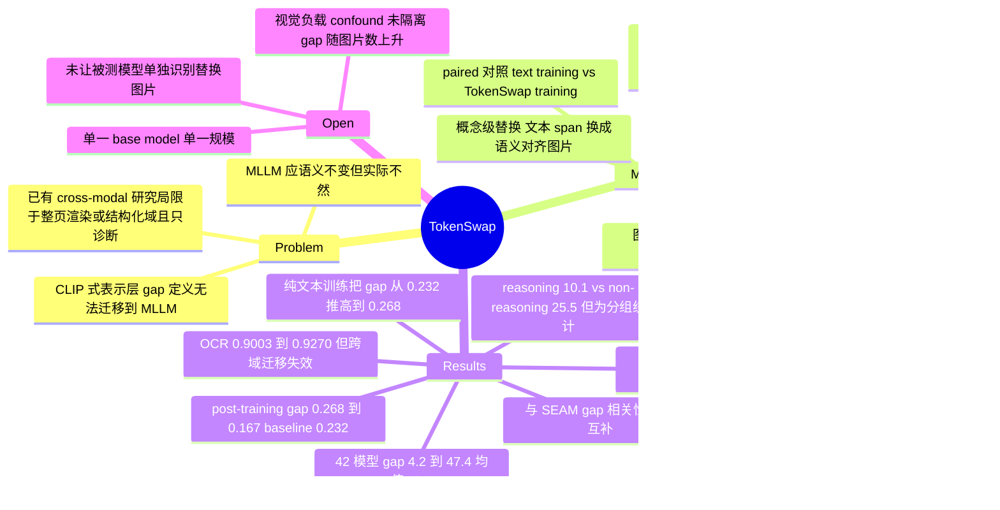

## Summary

提出 TokenSwap：在概念层面把文本里可视化的概念替换成语义对齐的图片，从而把任意纯文本 benchmark 机械转成 image-interleaved 版本，并据此从 MMLU 构造 TokenSwap-Bench（1,516 样本 / 6,946 处图片替换）来量化 modality gap。在 42 个 MLLM 上，text-only 到 image-interleaved 的准确率下降 4.2%–47.4%（均值 19.6% ± 3.3%），reasoning 模型分组均值 10.1% 明显小于 non-reasoning 的 25.5%，而 prompting 与 scaling training compute 都不能可靠缩小该 gap。作者进一步把 TokenSwap 当训练数据增强（base model 为 Qwen2-VL-7B），把 post-training 的 gap 从配对 text-only 训练的 0.268 降到 0.167（未增强 baseline 为 0.232），同时不损失 text-only 与常规 vision-language 性能。

## Problem & Motivation

MLLM 被默认应当具备语义不变性：同一内容不管以纯文本还是图文交错形式出现，预测都应一致。作者观察到这一性质在实践中系统性地不成立，并把它定义为 modality gap——同一语义内容在文本形式与多模态形式下的性能差 $\Delta_{\text{Gap}}=\text{Eval}(X_{\text{text}})-\text{Eval}(X_{\text{interleaved}})$。

已有工作有两个局限。其一，contrastive VLM（CLIP 一系）里的 modality gap 是表示层概念——图文 embedding 在共享空间里仍然分离——这个定义无法自然迁移到用 next-token prediction 训练、没有显式跨模态对齐目标的 MLLM。其二，MLLM 侧的 cross-modal consistency 研究要么把整个输入渲染成图片（rendered text），要么局限在有标准符号记法的结构化领域（棋谱、化学式、乐谱、图论），且基本停留在诊断，缺少缓解手段。本文要的是一个开放域、概念粒度、能把任意已有文本 benchmark 转换过去的测量协议，外加一个训练侧的干预。

## Method

**TokenSwap 操作**。把文本 token 序列中某个语义完整的概念 span $c=\{t_i,\dots,t_j\}$ 替换成一张表达同等语义的图片 $I_c$，图片进入模型后展开成视觉 token $\{v_1,\dots,v_m\}$，得到 $X_{\text{interleaved}}=\{t_1,\dots,t_{i-1},v_1,\dots,v_m,t_{j+1},\dots,t_n\}$。与整页渲染文本的做法不同，周围上下文与结构完全保留，一条样本可以替换多个概念。

**Benchmark 构造（三阶段 + 三重过滤）**。以 MMLU 为源：(1) 用 Gemini-2.0-Flash 从题干与选项里抽取可视化概念；(2) 用 Gemini 文生图，prompt 为 "generate an image of a {c}"；(3) 过滤：

- **Validity filtering**：LLM 判断生成图在上下文中是否忠实表达目标概念，采用 one-at-a-time restoration（其余概念还原成文字，只高亮目标概念）。
- **Importance filtering**：把所有有效概念从原文删掉得 $X^{-\mathcal{C}}_{\text{text}}$，只保留满足 $\text{Eval}(X_{\text{text}})=1$ 且 $\text{Eval}(X^{-\mathcal{C}}_{\text{text}})=0$ 的样本，确保被替换的概念是解题必需的。
- **Caption-guided validation**：round-trip 控制——给每张替换图生成 caption，把 caption 填回原位得到重建文本 $\tilde{X}_{\text{text}}$，只保留 $\text{Eval}(X_{\text{text}})=1$ 且 $\text{Eval}(\tilde{X}_{\text{text}})=1$ 的样本，以降低"gap 是由不可辨识或语义错位的图片造成"的可能。

三个过滤全程用 Gemini-2.0-Flash 作 filtering LLM 与 proxy model。最终 1,516 样本、6,946 处替换、平均 4.58 处/样本。作者另外做了人工核验：从 57 个 subject 各抽一题、共 213 个替换概念，让标注者做四选一"这张图代表哪个概念"。

**图源消融**。另建一个 retrieval 版本：用 CLIP ViT-L/14 以 "An image describing {c}" 从 DataComp-Small 检索 top-5、保留 cosine similarity > 0.3 者；与 generation 版本在 376 条 matched 样本上只变图源、其余全同。

**TokenSwap 训练**。把纯文本指令数据 Magpie-Pro 的 user query 里的可视化概念替换成图片、assistant response 不动，得 116,722 样本（平均 1.75 图/样本；为可扩展性去掉了 importance filtering 与 caption 验证）。base model 为 Qwen2-VL-7B，baseline 是只用 LLaVA post-training 数据训练；对比设置是 **paired** 的——text training 与 TokenSwap training 用完全相同的样本，只差是否把概念换成图片。continuous pre-training 与 post-training 两个阶段、generated 与 retrieved 两种图源各跑一遍。全部实验 8×A100。

## Key Results

**gap 的普遍性**。42 个模型（0.5B 到 78B 开源模型 + GPT-4o/4.1/5/5.1/5.2、Gemini 2.5/3/3.1、Claude 4.5/4.6 等专有模型）全部落在 $y=x$ 之下。最好的 Gemini-3-Flash gap 4.2%，最差的 InternVL2-8B 47.4%，均值 19.6% ± 3.3%。家族层面：Claude 平均 8.3% 最小，InternVL2 与 LLaVA-OV 常超 35.0%，Qwen3-VL 约 17.6%。

**reasoning 分组更小**。reasoning 模型 10.1% ± 2.2% vs non-reasoning 25.5% ± 3.7%，Welch's t-test $t=-7.48$。用 relative gap（除以 text-only 性能）归一化后趋势保持，作者据此认为优势不能仅归于更强的文本能力。**注意这是跨模型分组统计**：两组在模型家族、参数规模与训练数据上并不匹配，论文报告的唯一同族同规模对照是 Qwen3-VL-4B/8B 的 Instruct 与 Thinking 变体；作者自己的措辞也只到 "may be partly associated with reasoning-oriented training"。此外 §4.4 正文给 Qwen3-VL-8B-Thinking 的 gap 是 12.4%，而 Table 2 该模型是 0.928/0.808 → +0.120，正文与表格不一致（详见 Evidence Ledger C16）。

**便宜的解法都不奏效**。CoT / few-shot / 两者组合都会同时抬高 text 与 interleaved 准确率，但对 gap 的作用不一致：CoT 让 Qwen3-VL-4B-Instruct 的 gap 扩大约 3.2%，对 8B 变体则缩小相近幅度。scaling 侧，absolute gap 对 training FLOPs 的回归 $R^2=0.253$，10× FLOPs 只换来约 2.8% 的 gap 缩减（relative gap 拟合更好，$R^2=0.811$，10× FLOPs 减少 7.9%）。

**benchmark 侧的可比性**。generated 图比 retrieved 图平均高 4.6% 的 interleaved 准确率（gap 更小），作者归因于生成图更聚焦、检索图常带无关细节；但两种设置下模型排名基本不变。与 SEAM 对比（8 个重叠模型）：text 准确率 $r=0.811$、image 准确率 $r=0.914$ 高度相关，但 modality gap 本身 $r=-0.028$ 近乎无关——两个 benchmark 测的是 gap 的不同侧面。附录还显示 gap 随替换图片数单调上升：1 处替换 14.0% → 7 处替换约 24.9%。

**训练侧干预（对应标题里的 "Reducing"）**。post-training + generated 图：gap 从配对 text training 的 0.268 降到 0.167；未增强 baseline 为 0.232，即相对 baseline 也降了约 6.5 个点。反向结果同样清楚：纯文本训练把 gap 从 baseline 的 0.232 推高到 0.268。标准 VL benchmark 无明显退化（baseline GQA 63.8 / TextVQA 62.5 / MME 1542.4，post-train+Generate 为 63.9 / 62.3 / 1560.0）。迁移到 OCR：IIIT 5K-Word 从 baseline 0.9003（text training 0.8947）提到 0.9270。但跨域迁移基本失效——用 OCR 图训练后，natural image-interleaved 准确率 0.4393 反而低于不训练的 0.4466。

**人工核验**。两名标注者（一名作者 + 一名独立标注者）在 213 个概念上分别达到 92.0% 与 89.2% 的识别准确率（随机基线 25%），标注者间一致率 93.4%。作者承认干扰项通常不高度混淆，认为该数字应视为语义对齐度的保守估计。

## Evidence Ledger

| Claim ID | Claim | Type | Source locator | Evidence excerpt | Status |
|:--|:--|:--|:--|:--|:--|
| C1 | 42 个 MLLM 上 text→interleaved 掉点 4.2%–47.4%，均值 19.6% ± 3.3%（95% CI） | number | Abstract / §1 | "performance drops … range from 4.2% to 47.4%, with an average decrease of 19.6% ± 3.3% (95% confidence interval)" | source-verified |
| C2 | reasoning 10.1% ± 2.2% vs non-reasoning 25.5% ± 3.7%，Welch's t-test $t=-7.48$ 显著 | number/comparison | §4.3 | "10.1% ± 2.2% vs. 25.5% ± 3.7%), a difference that is statistically significant (Welch's t-test: t=-7.48" | source-verified（分组统计，未匹配规模/训练数据；见 Strengths & Weaknesses） |
| C3 | TokenSwap-Bench 由 MMLU 转换而来，1,516 样本 / 6,946 处替换 / 平均 4.58 处，概念抽取与过滤用 Gemini-2.0-Flash，图片用 Gemini 生成 | benchmark-setting | §3.2 / §3.2.1–3.2.3 | "The final benchmark contains 1,516 samples with 6,946 image replacements, averaging 4.58 replacements per sample" | source-verified |
| C4 | 存在 caption round-trip 控制：图→caption→填回文本，只保留原文与重建文本都答对的样本 | benchmark-setting | §3.2.3 / Appendix A.2 | "We retain only samples for which Eval(X_text)=1 and Eval(tilde{X}_text)=1" | source-verified |
| C5 | 人工核验 213 概念 / 57 subject，两名标注者 92.0% 与 89.2%（随机 25%），一致率 93.4% | benchmark-setting | §3.3 / Appendix A.4 | "achieve 92.0% (196/213) and 89.2% (190/213) accuracy … 93.4% (199/213)" | source-verified（核验者是人；**全文未让被评测的 42 个模型单独识别替换图片**） |
| C6 | 论文承认序列变长、多图输入、生成图 artifact 三类 confound，且其"gap 仍有意义"的论证依据是跨模型/设置/图源的一致性，而非隔离实验 | causal-mechanism | §4.2 | "While these factors may partly contribute to the observed performance drop, the gap is consistently observed across all models, settings, and image sources" | source-verified |
| C7 | prompting 不可靠：CoT 使 Qwen3-VL-4B-Instruct gap 扩大约 3.2%，8B 变体缩小相近幅度 | number | §4.4 | "under CoT prompting, the gap widens by approximately 3.2% for Qwen3-VL-4B-Instruct, but shrinks by a similar margin for the 8B variant" | source-verified |
| C8 | absolute gap vs FLOPs 回归 $R^2=0.253$，10× FLOPs 仅减 2.8%；relative gap $R^2=0.811$，10× 减 7.9% | number | §4.5 / Appendix B.2 | "a 10 × increase in training FLOPs reduces the absolute modality gap by only 2.8%" | source-verified |
| C9 | 376 条 matched 样本上只变图源，generated 比 retrieved 平均高 4.6% interleaved 准确率；检索用 CLIP ViT-L/14 从 DataComp-Small top-5、cos > 0.3 | number/benchmark-setting | §4.6 | "Generation-based benchmarks consistently achieve 4.6% higher image-interleaved accuracy on average" | source-verified |
| C10 | 与 SEAM（8 个重叠模型）：text $r=0.811$、image $r=0.914$、modality gap $r=-0.028$ | number | §4.7 / Figure 5 / Appendix B.5 | "text accuracy ( r=0.811 ) and image-interleaved accuracy ( r=0.914 ), but near-zero correlation in modality gap ( r=-0.028 )" | source-verified |
| C11 | 训练数据 116,722 样本（Magpie-Pro，平均 1.75 图/样本），base model Qwen2-VL-7B；post-training + generated 图 gap 由 0.268 降至 0.167 | number | §5.1 / §5.2 / Appendix C.1 | "in post-training with generated images, the gap decreases from 0.268 to 0.167" | source-verified（0.268 是配对 **text-only 训练** 后的 gap，非未增强 baseline；baseline 为 0.232） |
| C12 | 纯文本训练加剧 gap：post-training 下由 baseline 0.232 升到 0.268 | number | §5.2 | "in post-training, the gap increases from 0.232 for the baseline to 0.268 after text-only training" | source-verified |
| C13 | 标准 VL benchmark 无退化：baseline GQA 63.8 / TextVQA 62.5 / MME 1542.4；post-train+Generate 63.9 / 62.3 / 1560.0 | number | Appendix C.4 / Table 4 | "Baseline 63.8 62.5 1542.4 … post-train + Generate 63.9 62.3 1560.0" | source-verified |
| C14 | IIIT 5K-Word：Baseline 0.9003、Text Training 0.8947、TokenSwap Training 0.9270 | number | §5.3 / Table 1 | "Baseline 0.9003 Text Training 0.8947 TokenSwap Training 0.9270" | source-verified |
| C15 | 自称是首个针对 MLLM modality gap 的训练侧缓解方法，并把已有工作定性为主要是诊断性的 | sota-novelty | §1 / §2 | "To our knowledge, this is the first training-based approach to mitigate the modality gap for multimodal LLMs" | source-verified（仅为作者自述的相对定位） |
| C16 | §4.4 正文给出的 Qwen3-VL-8B-Thinking gap 12.4% 与详细结果表一致 | number | §4.4 / Appendix B.5 Table 2 | "Qwen3-VL-8B-Thinking 0.928 0.808 +0.120" | **contradicted**：Table 2 为 +0.120（0.928−0.808=12.0%），正文写 12.4%；4B-Thinking 的 10.9% 与表格 +0.109 一致，8B 不一致 |
| C17 | Gemini-3-Flash gap 最小 4.2%、InternVL2-8B 最大 47.4%；Claude 家族均值 8.3%，InternVL2/LLaVA-OV 常超 35.0%，Qwen3-VL 约 17.6% | number | §4.2 / Table 2 | "Proprietary models, such as Claude, exhibit the smallest gaps (mean gaps 8.3%), while open-source models generally show larger gaps" | source-verified |
| C18 | 域失配（Table 5）：natural 训练 0.5132 / 0.9196，OCR 训练 0.4393 / 0.9270，不训练 0.4466 / 0.9003；作者结论为跨域迁移有限 | number | Appendix C.5 / Table 5 | "these gains are reduced or disappear, indicating limited cross-domain transferability" | source-verified |
| C19 | gap 随替换图片数上升：1 处 14.0% → 7 处约 24.9%（跨模型平均） | number | Appendix B.4 | "the gap rises from 14.0% with one replacement to around 24.9% with seven replacements" | source-verified |
| C20 | importance filtering 只保留 proxy model 在原文答对、在删掉概念后答错的样本，即 benchmark 成员资格条件在 Gemini-2.0-Flash 的行为上 | benchmark-setting | §3.2.3 / Appendix A.2 | "we consistently use Gemini-2.0-Flash as the underlying LLM for filtering and as a proxy model" | source-verified |
| C21 | 作者与机构为 UCSB + Google DeepMind，arXiv:2607.28640v1 [cs.CL]，提交日期 20 May 2026；正文未给出 benchmark/训练数据的公开发布链接 | license-code | 标题块 / abs 页 | "Andong Hua, Colton Bishop, Igor Mordatch, Arian Hosseini, Jindong Gu, Aleksandra Faust, Rebecca Roelofs, Yao Qin" | source-verified（code/data 发布链接：无） |

## Strengths & Weaknesses

**亮点**

1. **测量协议本身是可扩展的**。概念级替换而非整页渲染，保留上下文与题目结构，原则上能把任意纯文本 benchmark 机械转成 interleaved 版本。这比"再造一个多模态数据集"更省，也更容易在新 benchmark 上复用。
2. **effect validity 做得比同类测量论文认真**。三重过滤 + caption round-trip + 人工核验，不是"换图掉点然后宣布发现 gap"。caption round-trip 尤其关键：它要求图片承载的信息可被文字恢复且不改变答案，直接对着"图片本身不可辨识"这个最大 confound 去。
3. **不止诊断，还给干预，且对照设计干净**。text training 与 TokenSwap training 共享完全相同的样本、只差是否替换成图片，这个 paired 设计让"是图文交错结构本身而非额外数据量带来收益"这一点站得住。反向结果（纯文本训练把 gap 从 0.232 推到 0.268）比正向结果更有信息量——它说明当前主流的"多加文本数据"路线会主动恶化跨模态一致性。
4. **两个便宜解法被系统性否掉**。CoT/few-shot 不可靠、10× FLOPs 只买到 2.8%，这两条结论对下游是 actionable 的：想收敛 gap 只能改训练数据构成，不能指望 prompt 或等下一代更大模型。

**局限（按严重度排）**

1. **最关键的 sanity control 缺位：从未让被评测的模型单独识别替换图片**。caption round-trip 与 importance filtering 全程只用 Gemini-2.0-Flash 作 proxy，人工核验验证的是"人能否认出这张图"。这两者都不能保证 InternVL2-8B 或 LLaVA-OV-7B 能认出同一张图。因此对弱模型报出的 35%–47% "modality gap"，无法区分其中有多少是语义不变性失败、有多少只是视觉识别能力不足——而后者是一个平凡得多的结论。一个便宜的补丁是给每个被测模型跑一遍"这张图是什么概念"的四选一（人工核验用的正是这个格式），把它当 per-model 的 gap 上界对照；论文没有做。
2. **论文自陈的 confound 未被隔离，且有反向证据未被处理**。作者列出视觉 token 变长、多图处理、生成图 artifact 三类混淆，但论证只停在"所有模型/设置/图源下 gap 都存在"——一致性不能排除一个同样普遍存在的 confound。更值得注意的是 Appendix B.4：gap 随替换图片数从 14.0% 单调升到 24.9%，这恰恰是"视觉负载/多图处理"confound 会预测的形状，论文把它当作 gap 稳健性的补充证据，而没有当作对自身解释的挑战。
3. **reasoning 更小的 gap 是分组统计，不是受控比较**。两组在家族、规模、训练数据上都不匹配；relative gap 归一化只控制了文本能力这一个维度。唯一的同族同规模对照是 Qwen3-VL-4B/8B 的 Instruct vs Thinking，只有两对（其中 8B 的数字正文与 Table 2 还对不上，12.4% vs +0.120）。因此"reasoning 训练缩小 modality gap"目前只能算相关性观察，作者自己也只写到 "may be partly associated"，笔记不应写强于此的表述。
4. **benchmark 对 Gemini 家族存在结构性选择偏差（我的推测，论文未讨论）**。importance filtering 与 caption validation 都要求 Gemini-2.0-Flash 在文本版上答对，保留下来的题因此是 Gemini 家族擅长的子集。这对跨家族比较（例如 "Gemini-3-Flash gap 最小 4.2%"）是潜在的利好偏差。作者可以用另一个 proxy model 重跑过滤管线来检查排名稳定性，论文没有做。
5. **训练侧证据面窄**。只在 Qwen2-VL-7B 一个 base model、一个规模上验证；干预后仍剩 0.167 的 gap，是缓解不是消除；Table 5 显示跨域迁移基本失效（OCR 数据训练后 natural interleaved 反而从 0.4466 掉到 0.4393）。作为 data-centric 方案，这意味着要覆盖多少个视觉域才够是个未回答的开放问题，"seamlessly integrated into existing training pipelines" 的乐观说法尚无大规模证据。
6. **正文未给出 benchmark 与训练数据的公开发布链接**，对一篇以 benchmark 为主要交付物的论文来说是明显的复现门槛（仅为原文缺失，不排除后续另行发布）。

**潜在影响**。对任何以图文交错为常态输入的系统（GUI agent 的 screenshot + 指令、文档 agent、检索到图片的 RAG），这篇给出了一个直接的坏消息：即使图片与被替换文本语义等价，性能也会系统性下降，且 prompt 与 scaling 都救不回来。如果这个结论稳健，"把信息尽量以文本形式喂给模型" 会是当前部署阶段一条有实际价值的工程默认，而 TokenSwap 式的数据增强是训练侧最直接的对策。

## Mind Map

## Notes

- 与 [[Papers/2604-DoVLMsTrulyReason]] 高度互补，值得对读。CrossMath 在结构化的 math crossword 上做信息等价的 text / image / image+text 三态对照，发现 image+text 甚至低于 text-only；本文在开放域 MMLU 上做概念级替换，发现 interleaved 一致低于 text-only。两篇独立地在完全不同的域上给出同向证据，且都发现针对性 post-training 能缩小但关不上 gap（CrossMath 训练后仍差约 26 pt，本文残余 0.167）。两篇的共同短板也同构：都没有做 causal probe 去区分"模型确实被视觉 token 拖累"与"视觉输入引入了别的 confound"。这是一个可以立刻做的跨论文 pattern：**跨模态一致性的失败是稳定复现的现象，但机制归因至今没有一篇给出隔离实验**。
- 直接可做的补强实验（针对本文局限 1）：在 TokenSwap-Bench 上对每个被测模型加跑一遍 per-image concept identification（沿用人工核验的四选一格式），得到该模型的"图片可辨识率"，再把 modality gap 对该率做偏相关。如果控制识别率后 gap 仍显著，本文的核心 claim 才真正立住；如果 gap 大部分被识别率解释掉，那弱模型那一段的数字要重新解读。这个实验成本极低，是本方向一个明显的空位。
- §4.5 正文写 "as shown in Figure 2 (a)"，但描述的是 Figure 4(a) 的 FLOPs–gap 散点；同段落 §4.6 的 "Figure 2 (b)" 同理应为 Figure 4(b)。属排版笔误，不影响结论，但引用该图时需注意。
- 元数据异常，需 coordinator 注意：abs 页与全文首行均写 "[Submitted on 20 May 2026]" / "arXiv:2607.28640v1 [cs.CL] 20 May 2026"，而 2607 号段对应 2026 年 7 月（同批其他候选均为 7 月 30–31 日提交）。本笔记的 `date_publish` 与文件名 YYMM 按 skill 规定取自 `date_publish`（2605）；若 vault 约定以 arXiv 号段为准，应改名为 `2607-TokenSwap.md`。
- 若后续做 GUI agent 相关的 interleaved 输入实验，本文的 relative modality gap 定义（gap 除以 text-only 性能）比 absolute gap 更适合跨规模比较——absolute gap 会被弱模型的低天花板压缩，本文 §4.5 里 relative 版本的 scaling 拟合 $R^2$ 从 0.253 升到 0.811 就是这个效应的直接证据。
