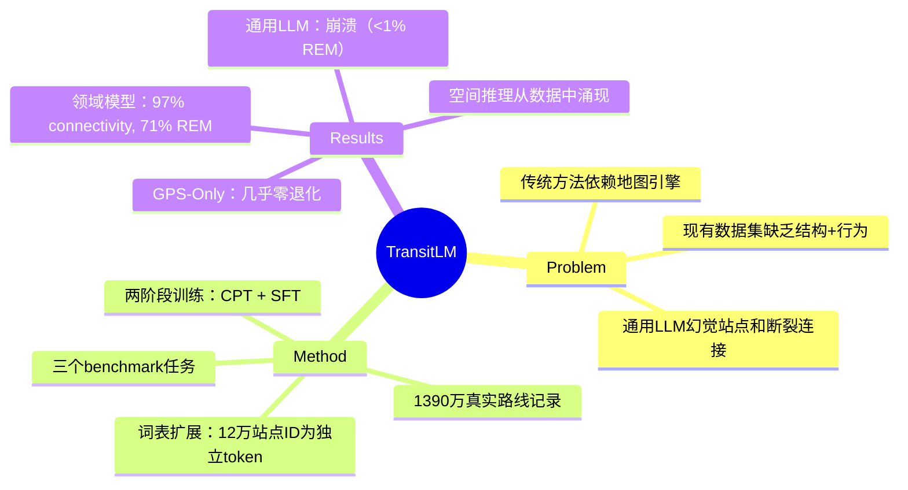

## Summary
用 1300 万条真实公交路线规划记录训练 LLM，让模型学会从 GPS 坐标直接生成完整公交路线，无需地图引擎，证明空间推理能力可以从数据中涌现。

## Problem & Motivation
传统公交路线规划依赖结构化地图和复杂路由引擎。现有数据集要么只有轨迹无站点结构（T-Drive），要么只有静态网络无用户行为（GTFS）。通用 LLM 在公交规划任务上会幻觉出不存在的站点或断裂的换乘连接，尤其对冷门 OD 对。能否让 LLM 从数据中学会端到端的路线生成？

## Method
**数据集 TransitLM**：1390 万条路线规划记录，来自高德地图四个城市（北京、上海、深圳、成都）的真实用户查询日志，覆盖 120,845 个站点、13,666 条线路，总计超 200 亿 token。包含两部分：
- **CPT Corpus**（1290 万 session + 100 万静态线路/站点描述）：每条 session 平均 2377 个中文字符，包含 6.32 条候选路线，33% 纯公交、19% 纯地铁、16.8% 公交+地铁、30.5% 混合（含出租车/骑行接驳）
- **Benchmark SFT Data**：每个任务 3 万训练 + 1 万测试样本，标准化 prompt-label 格式

**核心设计——词表扩展**：将全部 120,845 个站点 ID 注册为独立 token，每个站点用单个 token 表示。这防止模型通过字符级组合幻觉出不存在的站点，并使模型能直接学习站点级空间关系。

**两阶段训练**：
1. **Stage 1 (CPT)**：在文本语料上持续预训练，序列打包至 4096 长度，cosine LR，AdamW，LR=2e-5，15,000 步（约 3 epoch），64 PPU，DeepSpeed ZeRO-3，bf16。4B 模型训练约 6 天
2. **Stage 2 (SFT)**：每个任务单独微调 1 epoch，时间段与 CPT 无重叠，loss 仅计算 response token，8 PPU，有效 batch 256

**Backbone**：Qwen3-0.6B/1.7B/4B-Base。另训练 Qwen3-4B-Joint 在三个任务的联合 SFT 数据上微调，测试跨任务知识迁移。

**推理**：贪心解码，最大生成 4096 token，输入截断 2048，固定随机种子。

**三个 benchmark 任务**：
1. **Optimal Route Generation**：生成单条最优路线（JSON 格式，含线路序列、站点 ID、换乘标记、距离/时间/票价、接驳细节）
2. **Preference-Aware Planning**：根据显式偏好生成路线（地铁优先/公交优先/少换乘/最短时间）
3. **Multi-Route Generation**：生成三条多样化路线并标注 route_tag

## Key Results
**通用 LLM 对比**（1K 样本，简化输出格式）：最佳 Gemini-3.1-Pro 仅 75.5% connectivity、40.2% REM；GPT-5.4 为 60.5% connectivity、18.4% REM；Claude-Opus-4.6 为 48.1% connectivity、15.4% REM。评估已放宽——LLM 只需预测上下车站，而领域模型生成完整序列。

**领域模型**（1 万测试样本，Qwen3-4B）：
- **Optimal Route Generation**：Connectivity **97.0%**，Station Grounding **98.5%**，Distance Plausibility **91.0%**，Line Overlap **0.828**，Station Sequence Overlap **0.838**，Route Exact Match **71.0%**，Estimation Accuracy **98.5%**，MAPE **1.33%**
- **Preference-Aware Planning**：Connectivity 93.2%，REM 50.4%，Preference Compliance **89.8%**
- **Multi-Route Generation**：Connectivity 96.3%，REM 64.5%，Route Diversity **0.545**

**Joint 模型**（4B-Joint）在所有任务上匹配或超越单任务模型，无负迁移。

**最小模型**（0.6B）在更宽松评估下仍超越所有六个通用 LLM。

**数据规模**：从 6.25% CPT 数据（94.0% connectivity，49.9% REM）到 100%（97.0% connectivity，71.0% REM）单调提升。学习层次清晰——"基础网络拓扑先习得，精确路线匹配和数值校准需要更多数据"。

**GPS-Only Ablation**（移除所有文本线索，仅保留 GPS 坐标）：
- **领域模型**：几乎零退化（4B-Joint：72.9% REM vs. 73.7% 带文本）
- **通用 LLM**：崩溃（GPT-5.4：0.6% REM；Gemini-3.1：17.7% REM；多数降至 <1%）

证明隐式空间 grounding 从训练数据中涌现，而非依赖文本线索。

**单城市 vs. 多城市 CPT**：四城市模型（120,845 站点 token）在北京测试集上仅落后北京单城模型（38,792 token）3.5pp REM，尽管词表扩大 3.1 倍。部分指标（SG、EA）在多城市下略有提升，显示正向跨城市知识迁移。

**CPT vs. SFT-Only**：纯 SFT baseline（相同数据量重格式化为 SFT）在标准输入下达 74.9% REM，但 GPS-Only 下降至 66.1%。CPT-100% 为 71.0% 标准 / 70.4% GPS-Only——退化小得多。CPT 产生鲁棒空间表示，SFT-Only 更依赖文本线索。

## Strengths & Weaknesses
**Strengths**：
- **数据规模与质量**：1300 万真实用户查询，覆盖 12 万站点，是首个结合完整路线结构与行为标注的公交数据集
- **词表扩展设计**：将站点 ID 注册为独立 token 是关键创新，从根本上杜绝幻觉站点，使模型能学习站点级空间关系
- **GPS-Only 实验**：证明空间推理能力从数据中涌现，而非依赖文本线索，这是最有说服力的结果
- **评估体系完整**：9 个指标覆盖连通性、grounding、精确匹配、数值估计、偏好遵从、多样性，远超简单准确率
- **跨任务迁移**：Joint 模型无负迁移，显示任务间知识共享

**Weaknesses**：
- **地理局限**：仅四个中国城市，单一平台数据，泛化性未知。跨国家、跨语言、跨平台的迁移能力存疑
- **静态假设**：数据仅包含静态路线结构，无实时动态（拥堵、延误、临时停运）。真实应用需要动态信息
- **模型规模上限**：未探索 >4B 模型，4B 已达强性能但可能未触及能力天花板
- **Baseline 不足**：未与传统路由引擎（Dijkstra、A*）或专用图神经网络方法对比，无法判断 LLM 方法的效率与准确性优势
- **词表扩展代价**：12 万站点 token 使词表膨胀 3 倍，推理效率与内存开销未量化。多城市扩展时词表线性增长，scalability 存疑
- **Claim 过强**："map-free" 有误导性——模型仍需训练数据中的隐式地图知识，只是不需要显式地图引擎。对未见过的新站点/新线路无法泛化

**潜在影响**：证明 LLM 可从数据中学习复杂空间推理，为 navigation、logistics、urban planning 等领域提供新范式。但实用化需解决动态信息融合、跨地域泛化、推理效率等问题。

## Mind Map

## Notes
- GPS-Only 实验是全文最亮眼结果，直接证明空间 grounding 的涌现性。但"map-free"这个 claim 有过度营销嫌疑——模型本质上是把地图知识内化到参数里，而非真正摆脱地图
- 词表扩展是双刃剑：杜绝幻觉的同时牺牲了泛化性（新站点无法处理）和效率（词表膨胀）。对比实验缺失：如果用 character-level 表示 + constrained decoding 能否达到类似效果？
- 未与传统路由算法对比是重大缺陷。LLM 方法的计算成本（推理 4096 token）vs. Dijkstra 的毫秒级响应，哪个更实用？
- 数据集的价值 > 方法的创新。1300 万真实查询日志是稀缺资源，但论文未讨论数据采集的伦理问题（用户隐私、数据使用授权）
- 跨城市迁移实验（仅 3.5pp 退化）暗示存在可迁移的抽象空间知识，但论文未深挖。不同城市的公交网络拓扑有何共性？模型学到了什么 invariant？
- 对 Embodied AI 的启示：如果公交网络的空间推理可以从数据中涌现，室内导航、机器人路径规划是否也可以？但公交网络是离散图结构，连续空间的泛化难度更高
