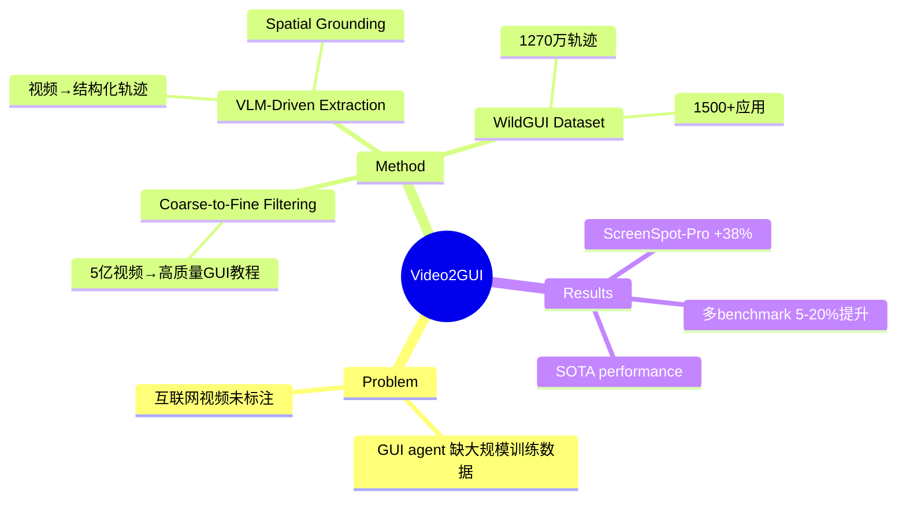

## Summary
从 5 亿 YouTube 视频中自动挖掘 GUI 交互轨迹，构建 1270 万条轨迹的 WildGUI 数据集，用于 GUI agent 预训练，在多个 benchmark 上提升 5-20%。

## Problem & Motivation
GUI agent 训练需要大规模高质量的交互轨迹数据，但现有数据集规模小、覆盖场景有限。互联网上存在海量 GUI 教程视频（YouTube、B站等），但这些视频是非结构化的，缺乏 grounded action annotation。如何从这些未标注视频中自动提取结构化的 agent 轨迹，是扩展 GUI agent 训练数据的关键瓶颈。

## Method
**Video2GUI Pipeline** 是一个全自动框架，从原始视频到结构化轨迹无需人工标注：

1. **Coarse-to-Fine Filtering**：从 5 亿 YouTube 视频元数据中筛选高质量 GUI 教程视频
   - Coarse filtering：基于元数据（标题、描述、分类）初步筛选候选视频
   - Fine filtering：进一步过滤，保留高质量 GUI 教程内容

2. **VLM-Driven Trajectory Extraction**：使用 vision-language model 将视频转换为结构化轨迹
   - 从视频帧中提取 GUI 截图序列
   - 识别用户交互动作（点击、输入、滚动等）
   - 进行 spatial grounding，定位交互元素在屏幕上的位置

3. **输出格式**：每条轨迹包含 `(screenshot, action, grounded_element)` 三元组序列

**WildGUI Dataset**：
- 1270 万条交互轨迹
- 1.245 亿张截图
- 覆盖 1500+ 应用和网站（web、mobile、desktop 三大平台）
- 号称目前最大的开源 GUI 预训练数据集

## Key Results
在 Qwen2.5-VL 和 Mimo-VL 上预训练后，在多个 GUI benchmark 上取得一致提升：

| Benchmark | 提升 |
|-----------|------|
| **ScreenSpot-Pro** | 41.2 → 56.9（+38% 相对提升） |
| **OSWorld-G** | 有提升（具体数字未公开） |
| **AndroidControl** | 有提升 |
| **CAGUI** | 有提升 |
| **OSWorld** | 有提升 |
| **AndroidWorld** | 有提升 |

整体在 GUI grounding 和 action 任务上实现 **5-20% 的一致性提升**，达到或超越 SOTA。

## Strengths & Weaknesses
**Strengths**：
- **规模优势**：1270 万轨迹是现有数据集的数量级突破，且覆盖场景极广（1500+ 应用）
- **全自动化**：无需人工标注，可持续扩展，降低数据获取成本
- **实用性强**：在多个主流 benchmark 上验证有效，ScreenSpot-Pro 的 +38% 提升显著

**Weaknesses**：
- **Grounding 鲁棒性存疑**：HuggingFace 评论指出，UI 元素在应用版本更新或动态布局变化时可能漂移，单次 misgrounding 会在长期任务中级联失败。论文未提供针对版本/布局变化的 ablation study，无法量化 grounding 脆弱性
- **数据质量未知**：从 5 亿视频中自动筛选，false positive rate、噪声比例、轨迹完整性等指标未披露。Coarse-to-fine filtering 的具体标准和效果缺乏细节
- **方法细节不足**：VLM-driven extraction 的具体实现（用了哪个 VLM、prompt 设计、如何处理视频中的非 GUI 帧、如何识别动作边界）未公开，可复现性存疑
- **Benchmark 覆盖不全**：除 ScreenSpot-Pro 外，其他 benchmark 的具体数字未给出，无法判断提升的稳定性和泛化性
- **与 VideoAgentTrek 的区别不清晰**：VideoAgentTrek 也是从 YouTube 视频提取轨迹，Video2GUI 的核心创新点（除了规模更大）在哪里？

**潜在影响**：
- 如果数据和 pipeline 真正开源，将显著降低 GUI agent 研究的数据门槛
- 但 grounding 鲁棒性问题若未解决，可能导致模型在真实动态环境中表现不佳

## Mind Map

## Notes
- **与 VideoAgentTrek 对比**：VideoAgentTrek 从 3.9 万视频生成 152 万步，OSWorld-Verified 从 9.3% → 15.8%（+70% 相对提升）。Video2GUI 规模更大（1270 万轨迹 vs 152 万步），但 OSWorld 上的具体数字未给出，无法直接比较效果
- **开源承诺**：论文称将开源数据集和 pipeline，但截至 2026-05-22，GitHub repo 仅 20 stars，可能尚未完全发布
- **Grounding 问题**：这是 GUI agent 的核心挑战。如果 Video2GUI 的 grounding 依赖静态视觉特征而非语义理解，在 UI 改版时会失效。需要看 ablation study 中是否测试了跨版本泛化
- **数据多样性 vs 质量**：1500+ 应用覆盖广，但每个应用的轨迹数量、任务复杂度分布如何？是否存在长尾问题（少数热门应用占据大部分轨迹）？
