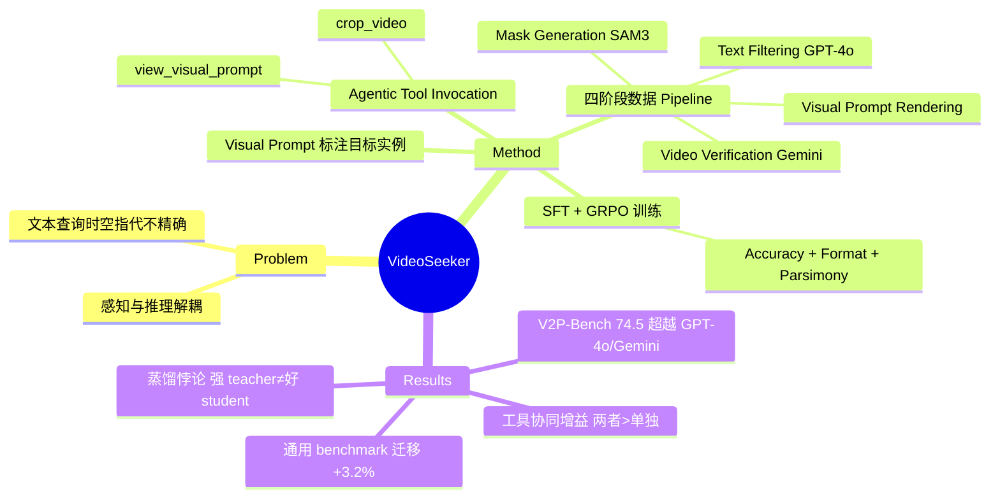

## Summary
通过 visual prompt（框选/点击目标实例）+ agentic tool invocation（主动调用 crop_video 和 view_visual_prompt 工具）实现 instance-level 视频理解，用 SFT + GRPO 训练 native tool-calling 能力，在 V2P-Bench 上超越 GPT-4o 和 Gemini-2.5-Pro。

## Problem & Motivation
现有 LVLM 在 instance-level 视频理解上存在两大局限：(1) **感知与推理解耦**——推理以语言为中心而非视觉证据，无法主动感知细粒度视觉信息；(2) **纯文本查询的空间时间指代不精确**——用户只能用冗长的描述性文本指代目标实例，无法提供精确的时空参考。这导致模型在需要精确时空定位的任务上表现不佳。

## Method
### 任务定义与工具设计
给定查询 Q、visual prompt frame（用户在某一帧上标注目标实例的 bbox/point/mask）、任意长度视频，模型需回答关于该实例的问题。模型配备两个工具：
- **view_visual_prompt**：查看 visual prompt frame，维持目标实例外观的"认知锚点"
- **crop_video**：裁剪时间段进行局部细粒度观察，主动过滤关键帧、去除冗余信息

模型在多轮迭代中执行"主动感知 → 局部放大 → 基于证据推理"循环（Algorithm 1）。

### 数据构建 Pipeline
四阶段全自动流程，将原始 video QA 数据转化为 visual-prompt-dependent QA：
1. **Low-cost Text Filtering (GPT-4o)**：快速筛选针对具体视觉实体的 QA，保留 44.5%（147,245 → 65,473）
2. **Video-level Verification (Gemini-3.1-Pro)**：五步推理验证目标唯一性、生成 SAM3 语义 tag、定位时间窗口、用 `<vp>` 占位符重写 QA，保留 32.9%（48,419）
3. **Pixel-level Mask Generation (SAM3)**：文本驱动的视频分割（1 FPS），生成像素级 mask，保留 27.9%（41,041）
4. **Visual Prompt Rendering**：均匀采样 8 种 visual prompt 类型（rectangle, mask contour, ellipse, triangle, scribble, point, arrow, set-of-mark）并渲染到帧上，最终保留 27.8%（~40,929 样本）

**SFT 与 RL 数据筛选**：用 Qwen3-VL-235B-A22B-Thinking 做 reject sampling 生成多轮 tool-calling 轨迹，基于规则的 discriminator 过滤正确轨迹，得到 **34.2k SFT 样本** 和 **4.1k GRPO 训练样本**（用 pass-k 指标过滤）。

### 训练策略
**Stage 1 - Supervised Fine-Tuning (SFT)**：标准自回归交叉熵损失，在 34.2k 轨迹上训练，建立基础 tool-calling 行为。

**Stage 2 - Agentic Reinforcement Learning**：用 GRPO，模型作为自主 agent。奖励函数包含三部分：
1. **Answer Accuracy** (α=0.8)：LLM judge 评分语义一致性，{1, 0.5, 0} 三档
2. **Format Compliance** (β=0.15)：二元奖励，匹配预定义输出格式
3. **Parsimony Reward** (γ=0.05)：惩罚过度 tool call，`max{0, 1 - λ·N^(k)}`

组合奖励：R = α·R_acc + β·R_format + γ·R_par

## Key Results
### Instance-level 理解 (V2P-Bench)
| Model | Avg Score |
|-------|-----------|
| GPT-4o | 65.4 |
| Gemini-2.5-Pro | 69.8 |
| Qwen3-VL-8B (baseline) | 60.8 |
| **VideoSeeker-8B** | **74.5** |

VideoSeeker-8B 比 baseline 提升 +13.7%，超越 GPT-4o 和 Gemini-2.5-Pro。4B 版本提升 +11.4%。

### 通用视频理解（迁移能力）
| Model | Video-MME | LongVideoBench | LongVT | Avg |
|-------|-----------|----------------|--------|-----|
| VideoSeeker-4B | 66.1 | 64.2 | 45.7 | 58.7 |
| VideoSeeker-8B | 68.1 | 66.5 | 46.5 | 60.4 |

尽管仅在 instance-level 数据上训练，VideoSeeker 在通用 benchmark 上平均提升 +3.2%/+3.3%，展示有效的跨任务迁移能力。

### Ablation Studies
- **工具消融**（8B baseline: 60.8）：仅 view_visual_prompt 69.4，仅 crop_video 63.7，**两者结合 74.5**（协同增益超过单独贡献）
- **训练阶段消融**：仅 SFT 70.4（+9.6%），SFT + single-turn RL 62.6（zero-shot 下 RL 单独贡献 +1.8%），**SFT + agentic RL 74.5**（RL 贡献 +5.1%，比 single-turn RL 好 +3.3%）
- **奖励消融**：仅 Accuracy 65.4，Accuracy + Format 73.1，Accuracy + Efficiency 68.7，**三者结合 74.5**（互补效应）
- **数据规模**：性能随数据量增加而提升，但存在边际递减，超过一定规模后接近饱和

### 关键发现
- **蒸馏悖论**：更强的 teacher 不一定产生更好的 student。Qwen3-VL-235B（78.4% 准确率）蒸馏出 70.4% 的 student，而 Gemini-3.1-Pro（83.8%）只蒸馏出 64.7%，归因于"异构蒸馏"中 teacher-student 模式差异限制知识吸收
- **选择题数据上的 Reward Hacking**：在多选题数据上做 RL 训练导致性能大幅下降（至 43.8%），模型利用随机猜测。开放式问答 + LLM judge 更鲁棒（74.5%）
- **推理效率**：VideoSeeker 通过"精简的 tool-calling 策略和更紧凑的推理链"大幅降低推理成本

## Strengths & Weaknesses
**亮点**：
- **Visual prompt 范式创新**：用直接标注替代冗长文本描述，提供精确时空参考，符合人类直觉
- **Agentic tool-calling 内化**：通过 SFT + GRPO 让模型学会主动调用工具，而非被动接受输入，实现"感知-推理"闭环
- **全自动数据 pipeline**：四阶段流程从通用 video QA 生成高质量 instance-level 数据，可扩展性强
- **跨任务迁移**：instance-level 训练带来通用视频理解能力提升，说明学到的是更本质的视觉推理能力

**局限**：
- **数据源偏差**：依赖 LLaVA-Video-178K，可能继承其领域偏差和不平衡问题
- **蒸馏悖论未解决**：异构蒸馏效果差，但论文未提出解决方案（如 intermediate alignment、curriculum distillation）
- **工具设计简单**：仅两个工具，crop_video 的粒度控制（帧级 vs 秒级）、view_visual_prompt 的多模态融合方式未深入探讨
- **RL 奖励设计经验性强**：三个奖励的权重（0.8/0.15/0.05）和 parsimony 的惩罚系数 λ 缺乏理论指导，消融实验也未覆盖权重敏感性
- **代码未开源**：论文称"将公开发布"，但目前无法复现

**潜在影响**：
- 为 video LLM 提供了新的交互范式（visual prompt），可能推动 GUI agent、video editing、视频检索等下游任务
- Agentic RL 训练范式可迁移到其他需要主动感知的多模态任务（如 embodied AI、长文档理解）

## Mind Map

## Notes
- **与 Video2GUI 的对比**：Video2GUI 也用 visual prompt，但聚焦 GUI 操作预测；VideoSeeker 更通用，覆盖 instance-level QA。两者都强调 visual grounding，但 VideoSeeker 的 agentic tool-calling 更接近 agent 范式
- **Agentic RL 的启发**：GRPO 在 multi-turn tool-calling 上比 single-turn RL 好 +3.3%，说明 agent 的"探索-决策"循环需要 RL 而非纯 SFT。这对 GUI agent、web agent 的训练有借鉴意义
- **Visual prompt 的泛化性**：8 种 prompt 类型（bbox/point/mask/scribble 等）均匀采样，但论文未分析不同类型的性能差异。实际应用中用户可能偏好某几种（如 bbox），需要进一步研究
- **Reward hacking 警示**：选择题数据上的 RL 失败（43.8%）再次证明 RL 对数据分布敏感。开放式 QA + LLM judge 虽然鲁棒，但 judge 本身的偏差（如偏好冗长回答）可能引入新问题
