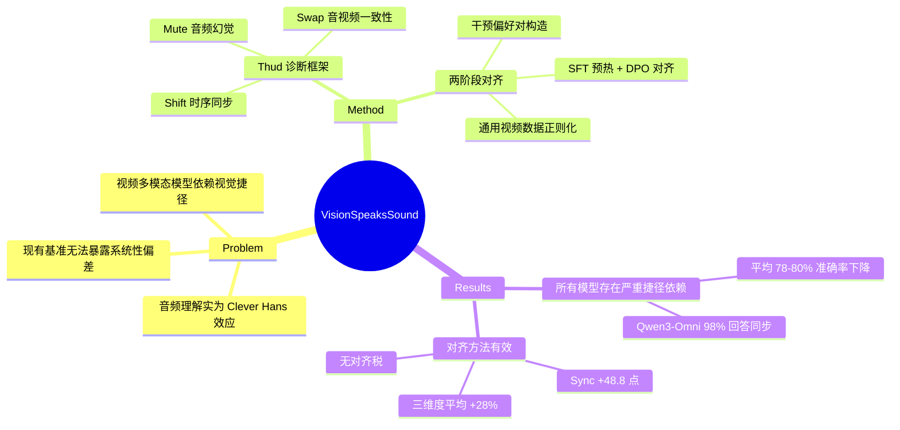

## Summary
揭示视频多模态大模型的"音频理解"实为视觉驱动的 Clever Hans 效应，提出 Thud 反事实诊断框架（Shift/Mute/Swap）和基于干预偏好对的两阶段对齐方法，在三个干预维度上平均提升 28 个百分点。

## Problem & Motivation
视频多模态大模型（video-capable MLLMs）看似能理解音频，实则依赖视觉-语义捷径（visual-semantic shortcuts）而非真正验证音视频对齐。作者将此现象命名为"音视频 Clever Hans 效应"——模型利用自然视频中的视觉-声学相关性，但不验证真实对齐关系。这导致模型在音频被篡改（时移、静音、替换）时仍给出视觉上合理但音频上错误的答案。现有评估基准均使用自然相关的音视频对，无法暴露这一系统性偏差。

## Method

### Thud 诊断框架
三种反事实音频干预（counterfactual audio edits）：
1. **Shift**：将音频轨道时移 Δ 秒，测试时序同步感知
2. **Mute**：用静音替换音频，测试模型是否幻觉出声音
3. **Swap**：用另一视频的音频替换，测试音视频一致性验证

每个干预 I_k 将原始视频 v = (x_{1:T}, a_{1:T}) 转换为破坏自然相关性的反事实样本。

### 两阶段对齐方法

**数据构建**：
- 基于 Oops 数据集（包含显著声学事件的意外动作视频）
- Gemini 生成初始事件-时间标注，GPT 和 Claude 通过逐帧分解验证视觉时间戳，人工审核员验证音频时间戳
- 跨模型验证（cross-model verification）+ 严格容差阈值确保标注可靠性

**偏好对构造**：
每个干预视频生成 (chosen, rejected) 对：
- **Chosen**：验证真实音视频关系的回答
- **Rejected**：反映"视觉上合理的捷径"——即需要抑制的失败模式

**训练流程**：
- **Stage 1 — SFT 预热**：在干预衍生数据上建立音频感知的响应模式
- **Stage 2 — DPO**：在干预偏好对 + FineVideo/LLaVA-Video 通用视频数据上训练，防止过度专门化

七种偏好数据源：
- **OP**：标注事件的原始同步偏好
- **SP**：SFT 模型自身错误采样的负样本
- **CTP**：原始/时移视频配对的反事实时序偏好
- **FV-D, FV-AVQA, FV-AVQA-L**：FineVideo 衍生的描述性和 QA 偏好
- **LV-MCQA**：LLaVA-Video 多选 QA 用于正则化

## Key Results

### 捷径依赖普遍存在（Table 1）
所有模型在原始 vs 干预条件下准确率剧烈下降：
- MiniCPM-o-4.5：**平均 80.7% 差距**（最大）
- MiMo-V2.5：**平均 78.4% 差距**
- Qwen3-Omni：原始时序同步 100% → Shift 干预下 **1.4%**

### 失败模式分析
- **音频幻觉占主导**：模型"发明符合视觉的音频，但很少否认真实存在的音频"
- 所有模型在幻觉指标上饱和（Mute Hallucination 和 Swap False-Match 超过 0.63）
- Qwen3-Omni 对 **98% 输入**回答"同步"，无论实际偏移量
- 错误"系统性偏向同步先验，而非随机分布"

### 对齐效果（Table 2）
最佳 10K 样本 DPO 配方（CTP + FV-D + FV-AVQA-L）：
- **Sync 准确率**：34.3% → 83.1%（+48.8 点）
- **VGGSoundSync（OOD）**：36.8% → 56.4%（+19.6 点）
- **六基准平均**：51.3% → 63.3%
- 保持或提升通用基准（无对齐税）

### 消融洞察
- 仅 SFT 干预数据提升同步但**"急剧损害通用基准"**
- DPO 配方恢复通用能力同时保留时序增益
- 反事实时序监督提供 grounding 信号，通用视频偏好防止过度专门化

### 超越时序同步（Section 3.4）
在最佳配方中加入 Mute/Swap SFT：
- **三个干预维度平均提升 28%**
- 模型在 Swap 上排名第一，Mute 上排名第二

### 补充分析
- 训练模型展现**难度敏感验证**：准确率随时移量减小而适当下降，不像基线一致崩溃
- 细粒度偏移定位改善，不仅是粗粒度同步/不同步检测

## Strengths & Weaknesses

**Strengths**：
- **问题识别精准**：通过控制实验量化了视频多模态模型的系统性偏差，命名"Clever Hans 效应"切中要害
- **诊断方法严谨**：Thud 框架的三种干预（Shift/Mute/Swap）覆盖存在性、时序性、一致性三个维度，设计简洁但有效
- **数据构建可靠**：跨模型验证 + 人工审核的标注流程保证质量，偏好对直接针对失败模式
- **对齐方法实用**：两阶段训练（SFT + DPO）在大幅提升音视频对齐的同时保持通用能力，无对齐税
- **泛化性验证**：OOD 测试（VGGSoundSync）和细粒度偏移分析证明模型学到的是真实 grounding 而非记忆

**Weaknesses**：
- **数据集依赖**：干预构建依赖 Oops 数据集（意外动作视频），可能不覆盖所有音视频场景类型（如音乐、对话、环境音）
- **训练成本**：需要 Gemini/GPT/Claude 跨模型标注 + 人工审核，数据构建成本较高，难以大规模扩展
- **方法局限性未充分讨论**：论文提到 Appendix I 有局限性说明但内容被截断，正文未详细讨论方法适用边界
- **模型覆盖不全**：GPT-5.5 因接口问题未能评估，缺少对最新闭源模型的完整对比
- **长期影响未知**：对齐后的模型在更复杂的多模态推理任务（如需要音视频联合推理的长视频理解）中表现如何尚未验证

## Mind Map

## Notes
- **与 GUI Agent 的关联**：音视频对齐问题类似 GUI grounding 中的视觉-动作对齐——模型可能依赖视觉先验而非验证真实状态变化。Thud 的反事实干预思路可迁移到 GUI agent 评估（如 action 后 screenshot 不变、UI 元素被替换等场景）
- **对 Agentic RL 的启示**：偏好对直接针对失败模式构造，DPO 在保持通用能力的同时修正特定偏差，这种"targeted preference learning"策略值得在 agent RL 中借鉴
- **评估范式转变**：论文强调"未来视频模型应在反事实音视频条件下评估和训练，而非仅自然相关视频"——这一原则同样适用于 embodied AI 和 GUI agent 的评估设计
