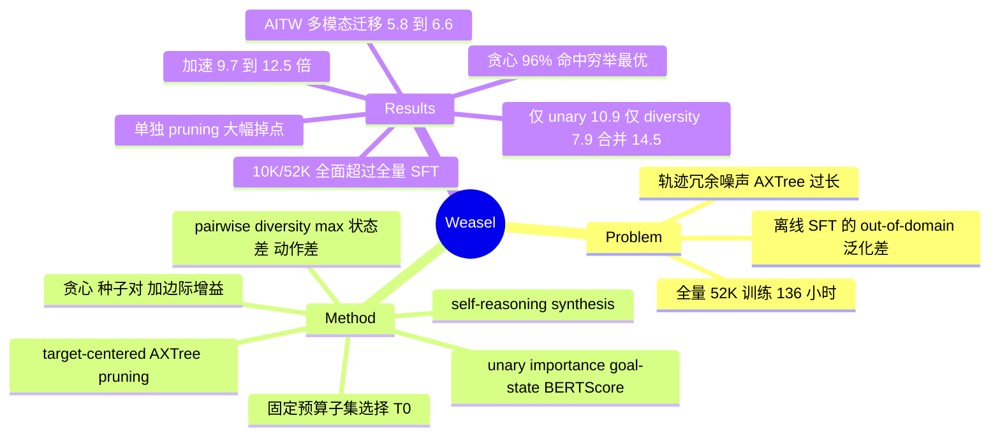

## Summary

把 web agent 的离线 SFT 数据构造写成一个固定预算的子集选择问题——目标 = 每步与 goal 的语义相关度（unary importance）+ 步骤之间的两两差异度（pairwise diversity）——用贪心求解，在 AgentTrek 上只留 10K/52K 的步骤就能在 WebArena / MiniWob / WorkArena 上全面超过全量 SFT，并带来约 9.7–12.5× 的训练加速。

## Problem & Motivation

作者同时盯着两个问题：

- **离线训练的 out-of-domain 泛化差**。在 AgentTrek / NNetNav 这类大规模轨迹上做 SFT 的 agent，换到训练时没见过的网站与交互模式上会明显掉分。
- **训练成本高**。轨迹本身冗余且噪声大，AXTree 状态又极长，全量训练 52K 步在 Qwen2.5-7B 上要 136 小时。

值得注意的是作者的问题设定：他们**不**去判断某一步是否"正确"，而是假设专家轨迹整体可用，问题出在冗余与覆盖不足。这和"trajectory reward=1 但中间步骤可能是错的"是两个不同的前提——Weasel 处理的是前者。

## Method

**选择目标（§2.2）。** 对长度 $T$ 的轨迹选出 $|J|=T_0 \ll T$ 个索引，最大化

$$\max_{J} \sum_{j\in J}\Phi(j) + \lambda\sum_{i<j,\,i,j\in J} D(i,j),\quad |J| = T_0$$

- **unary importance** $\Phi(t) = \mathrm{BERTScore}(g, s_t)$，即该步的状态与任务 goal 的语义相关度。
- **pairwise diversity** $D(i,j) = \max\big(\delta(s_i,s_j),\ \delta(y_i,y_j)\big)$，其中 $\delta(x,y) = 1 - \mathrm{BERTScore}(x,y)$，$y_i = [r_i; a_i]$ 是 reasoning 与 action 的拼接。取 max 的用意是：状态空间或动作/意图空间任一维度上有差异就保留。
- 除特别说明外 $\lambda = 1$；附录 C 另做了 $\lambda \in \{0.5, 2.0, 4.0\}$ 的敏感性分析。

**贪心求解（§2.3）。** 该问题一般是 NP-hard。算法先选出使目标最大的种子对，再逐个加入边际增益最大的索引直到预算用满。复杂度：unary $O(T)$、pairwise 预计算 $O(T^2)$、选择阶段 $O(T_0 T)$。

作者明确写出了一个通常会被藏起来的事实：**max-sum diversification 的 2-approximation 保证并不适用于这个目标**，因为 $D$ 基于语义伪距离且做了 max-composition，不满足度量性质。他们改用穷举做经验验证（见 Key Results）。

**Target-centered AXTree pruning（§2.4）。** 一个与选择正交的预处理：定位 ground-truth action 的目标节点索引 $k_t^*$，只保留以它为中心、长度 $2w+1$ 的连续窗口；非节点动作（`goto`、`noop`）改用等长前缀。

**Self-reasoning synthesis（§2.5）。** 针对 reasoning-native 模型（Qwen3-8B），用模型自己生成的 rationale 替换专家 trace，消除推理风格错配。

## Key Results

**主结果（AgentTrek 训练 → 零样本迁移，Table 1）。** 三个 backbone 上 Weasel 都拿到最好的精度-成本折衷。

| Qwen2.5-7B-Instruct | WebArena-Lite | WebArena | MiniWob | WorkArena L1 | L2 | 数据 | 时间 | 加速 |
|:--|:--|:--|:--|:--|:--|:--|:--|:--|
| base（未训练） | 5.5 | 5.2 | 41.8 | 4.8 | 0.0 | – | – | – |
| + Full | 10.9 | 8.7 | 44.6 | 12.1 | 0.4 | 52K | 136.0 hr | 1.0× |
| + Pruning | 9.7 | 8.6 | 47.7 | 12.4 | 0.4 | 52K | 62.0 hr | 2.2× |
| + Pruning + Sampling | 9.1 | 8.1 | 46.7 | 9.8 | 3.0 | 10K | 12.0 hr | 11.3× |
| + Pruning + LLM-Judge | 8.5 | 7.8 | 45.4 | 8.5 | 3.0 | 10K | 12.0 hr | 11.3× |
| **+ Weasel** | **14.5** | **9.5** | **48.0** | **12.4** | **4.7** | 10K | 12.0 hr | 11.3× |

Qwen3-8B 上 Weasel 达到 WebArena-Lite 21.2 / WebArena 19.2 / WorkArena L2 4.3（全量 SFT 为 17.7 / 18.2 / 2.1），加速 10.7×；Gemma3-4B 上 11.5 / 5.5 / 3.0（全量 9.1 / 4.3 / 0.0），加速 12.5×。换成 NNetNav-Live 训练集（Table 2，Qwen2.5-7B，4 epochs）结论一致：Weasel 12.1 / 8.3 / 41.8 / 7.6 / 6.8，全量 SFT 为 10.9 / 6.9 / 38.9 / 5.2 / 6.4。

**pruning 单独用是危险的。** 这是全文最值得记的负面证据：在 Qwen3-8B 上，只做 pruning 不做 selection，WebArena 从 18.2 掉到 12.7、MiniWob 从 59.4 掉到 40.3、WorkArena L1 从 33.3 掉到 15.5；在 NNetNav 上，Qwen2.5-7B 的 WebArena-Lite 从 10.9 掉到 5.5（回到未训练水平）。作者在正文里没有正面讨论这几行。

**目标函数消融（Qwen2.5-7B，WebArena-Lite）。** 两项互补，且 unary 项贡献更大：

| 配置 | SR |
|:--|:--|
| base | 5.5 |
| 仅 unary $\Phi$ | 10.9 |
| 仅 pairwise $D$ | 7.9 |
| **Weasel（两者）** | **14.5** |

importance 的配对方式（Table 5）：Goal-State 14.5 > Goal-State summary 12.7 > Goal-Reasoning 9.1。diversity 的构成（Table 6）：max-composition 14.5 > reasoning-only 13.9 > state-only 9.7——也就是说 diversity 项的价值主要来自动作/意图侧而非状态侧。

**贪心的近似质量（§3.3）。** 在 NNetNav 上对长度 10–37 的 1,877 条轨迹、$T_0=3$ 穷举全部子集（最多 $\binom{37}{3}=7{,}770$ 个）：贪心解在 >96% 的轨迹上等于精确最优，99.7% 落在候选前 1%，greedy/optimal 目标值比 $0.9999\pm0.0005$。这是把"缺形式保证"补成经验证据的规范做法。

**pruning 策略对比（Table 3，固定 token 预算约为原始的 32%）。** Target-centered 10.9 > Original Data 10.3 > Semantic 9.1 > Prune-by-Bid 8.5 > Target-centered+Semantic 7.3。所有 pruning 变体的加速都是 2×。Figure 5 进一步显示：把保留窗口从目标节点向外偏移、token 预算不变，成功率近似线性下降，随机 pruning 最差。

**reasoning synthesis 消融（Table 4，Qwen3-8B）。** base 16.4 / SFT(Random) 16.5 / SFT(Random+RS) 18.2 / Weasel w/o RS 17.0 / Weasel 21.2。两个组件都不足以单独解释最终结果。

**迁移到多模态 GUI（Table 8）。** 保持贪心选择算法不变，只把打分模块换成 SigLIP2-Large-384 截图 embedding（diversity）与 CLIP ViT-L/14-336 图文对齐（importance），在 AITW 上从 10K 池选 3.1K：Qwen2.5-VL-3B-Instruct base 4.4%、随机选 5.8%、Weasel 6.6%（500 条 held-out 测试子集）。作者自己标为 preliminary。

## Evidence Ledger

| Claim ID | Claim | Type | Source locator | Evidence excerpt | Status |
|:--|:--|:--|:--|:--|:--|
| C1 | 目标 = unary $\Phi$(goal-state BERTScore) + $\lambda\cdot$ pairwise $D=\max(\delta(s_i,s_j),\delta(y_i,y_j))$，$\delta=1-$BERTScore，默认 $\lambda=1$ | causal-mechanism | §2.2, Eq. (1)–(4) | "Unless otherwise stated, we set \lambda=1 in all experiments" | source-verified |
| C2 | 作者承认 2-approximation 保证不适用于其非度量伪距离目标 | causal-mechanism | §2.3, §3.3 | "the 2-approximation guarantee … does not directly apply to our objective … does not satisfy metric properties" | source-verified |
| C3 | 1,877 条轨迹穷举：贪心 >96% 命中最优、99.7% 落在前 1%、比值 0.9999±0.0005 | number | §3.3 Greedy Approximation Quality | "matches the exact optimum in more than 96% of trajectories … 0.9999\pm 0.0005" | source-verified |
| C4 | 约 19% 数据达到或优于全量 SFT，加速 9.7–12.5× | number | Abstract, §5 | "training with only 19% of the original training data achieves comparable or better performance … 9.7-12.5\times speed-ups" | source-verified |
| C5 | 目标函数消融：base 5.5 / 仅 unary 10.9 / 仅 diversity 7.9 / 两者 14.5 | number | Table 7 | "SFT (+ Unary) 10.9 … SFT (+ Diversity) 7.9 … Weasel (Ours) 14.5" | source-verified |
| C6 | importance 配对消融：Goal-State 14.5 / Goal-State summary 12.7 / Goal-Reasoning 9.1 | number | Table 5 | "Goal-State summary 12.7 / Goal-Reasoning 9.1 / Goal-State (Ours) 14.5" | source-verified |
| C7 | diversity 消融：state-only 9.7 / reasoning-only 13.9 / max-composition 14.5 | number | Table 6 | "State-only 9.7 … Reasoning-only 13.9 … Weasel (Ours) 14.5" | source-verified |
| C8 | 单独 pruning 掉点：Qwen3-8B WebArena 18.2→12.7、MiniWob 59.4→40.3；NNetNav 上 Qwen2.5-7B WebArena-Lite 10.9→5.5 | number | Table 1, Table 2 | "+ Pruning (52K steps) 17.6 12.7 40.3 15.5" ; "+ Pruning (52K steps) 5.5 3.2 38.4" | source-verified |
| C9 | AITW 迁移：base 4.4% / random 5.8% / Weasel 6.6%（3.1K 子集，500 条 held-out） | number | Table 8, §3.3 | "improves accuracy … from 5.8% with random selection to 6.6%, compared to 4.4% for the base model" | source-verified |
| C10 | pruning 策略对比：Original 10.3 / Prune-by-Bid 8.5 / Semantic 9.1 / Target+Semantic 7.3 / Target-centered 10.9 | number | Table 3 | "Original Data 10.3 … Prune-by-Bid 8.5 … Semantic 9.1 … Target-centered (Ours) 10.9" | source-verified |
| C11 | RS 消融：base 16.4 / Random 16.5 / Random+RS 18.2 / Weasel w/o RS 17.0 / Weasel 21.2 | number | Table 4 | "SFT (Random) 16.5 … SFT (Random + RS) 18.2 … Weasel (w/o RS) 17.0 … Weasel (Ours) 21.2" | source-verified |
| C12 | 代码开源于 github.com/fatemehpesaran310/weasel；单位含 SNU / McGill / Mila | license-code | Abstract, 作者栏 | "We make the code available at https://github.com/fatemehpesaran310/weasel" | source-verified |

## Strengths & Weaknesses

**亮点。**

- **把 step 选择写成一个可解的优化问题**，而不是又一个 LLM-as-judge 打分流水线。这直接带来两个好处：目标函数可以逐项消融（Table 5/6/7 就是这么做的），以及选择结果在给定分数和 tie-breaking 时是确定性的、可复现的。相比 [[Papers/2503-ATLaS]] 那种"GPT-4o 说哪步关键就是哪步"的黑箱，这是更好的科学形态。
- **承认没有形式保证，然后去做穷举验证**。$T_0=3$、$T\le37$ 的穷举当然只覆盖了很小的参数区间，但作者选择先说清楚保证不成立、再补经验证据，而不是含糊地援引 max-sum diversification 的经典结论。
- **diversity 消融给出了一个有信息量的结论**：state-only 只有 9.7，reasoning/action-only 有 13.9。这说明在 web 轨迹里，"看起来不同的页面"远不如"做了不同的事"更能刻画有效的覆盖度。这个发现对任何做轨迹去重的工作都直接可用。
- **成本账是完整的**：每个配置都报了数据量、epoch、墙钟时间和加速比，preprocessing 的一次性成本单列在附录 E。

**局限。**

- **Weasel 不解决"哪一步是对的"。** $\Phi$ 衡量的是"这一步的状态和 goal 语义上有多相关"，$D$ 衡量的是"这一步和其他被选步骤有多不同"。一个错误但语义上贴近 goal、且与其他步骤不重复的步骤，会被优先选中而不是排除。论文的前提是专家轨迹本身可信（AgentTrek 由教程合成、NNetNav 有回溯标注），在这个前提外它不提供 credit assignment。
- **在最强的 backbone 上，离线 SFT 本身几乎无效。** Qwen3-8B 未训练时 WebArena 18.0 / MiniWob 61.1 / WorkArena L1 35.2，全量 SFT 后是 18.2 / 59.4 / 33.3——训练把两项拉低了。Weasel 的 19.2 / 61.9 / 38.8 相对未训练 base 的净增益是 +1.2 / +0.8 / +3.6。也就是说在 Qwen3-8B 这一列，Weasel 的主要成就是"让 SFT 不再有害"，而非"让 SFT 带来大幅提升"；把它读成"选出更好的数据带来大幅增益"会 overclaim。
- **同预算下的最强 baseline 差距不大。** Qwen3-8B 上 Pruning+LLM-Judge 拿到 WebArena-Lite 19.4，Weasel 21.2，差 1.8；而 Weasel 这一列还额外享有 reasoning synthesis 的加成（w/o RS 只有 17.0，低于 LLM-Judge 的 19.4）。严格说，在 Qwen3-8B 上"选择算法本身优于 LLM-judge 选择"这个结论不成立。
- **pruning 与 selection 的交互没有被解释。** 单独 pruning 在 Qwen3-8B 上把 MiniWob 打到 40.3、把 WorkArena L1 打到 15.5，是全表最差的行；但加上 selection 之后又恢复到 61.9 / 38.8。为什么一个"破坏性"的预处理在与选择组合后不再破坏，论文没有给出机制解释，正文对这几行也没有正面讨论。这里可能藏着比选择目标本身更重要的东西。
- **$T_0$ 是固定预算而非自适应。** 长短轨迹一律选同样多的步骤，意味着长轨迹被压缩得更狠。附录 C 做了 $T_0$ 的敏感性分析，但没有做"按轨迹长度自适应"的对照。
- **AITW 迁移实验很弱**：绝对数只有 4.4 → 5.8 → 6.6，测试集 500 条，作者自己标 preliminary。它能说明打分模块可以换成多模态的，不能说明方法在真实 GUI agent 训练上有效。

## Mind Map

## Notes

- Weasel 和 [[Papers/2503-ATLaS]] 是"不做价值估计的直接子集选择"这一族里两条相反的路：ATLaS 用强 LLM 的语义判断挑"关键"步骤（选择器是黑箱、目标不可分解），Weasel 用可写出来的目标函数挑"相关且互不冗余"的步骤（可分解、可消融、确定性）。ATLaS 的 non-critical 对照证明了"选错步骤会有害"，Weasel 的消融证明了"覆盖度本身就值钱"——两者在解释增益来源上并不一致，值得在 survey 里并列。
- Weasel 的 unary 项是 goal-state 相关度，本质上是 [[Papers/2602-ADMIRE]] 的 milestone 命中判定的连续化版本（ADMIRE 用 SBERT 余弦 ≥ δ=0.75 做硬判定）。但 ADMIRE 是拿 agent 自述的动作描述去匹配，Weasel 是拿环境状态去匹配——后者不可被 agent 自报 hack，这是一个实打实的设计优势。
- diversity 项里 reasoning-only(13.9) 远好于 state-only(9.7) 的结论，与 [[Papers/2601-EvoCUA]] 的 step-level 去噪思路可以对上：EvoCUA 删的是"重复且无进展"的步骤，判据同样偏动作侧而非状态侧。
- 待查：$T_0$ 在主实验里的具体取值正文没写（只说 10K/52K 的总量），需要看附录 A/C 才能确定每条轨迹留几步。
- repo_candidate: https://github.com/fatemehpesaran310/weasel
