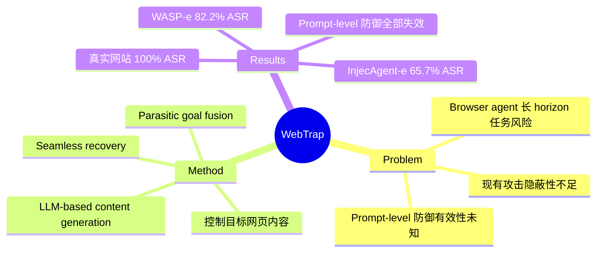

## Summary

WebTrap 提出一种针对 browser agent 的中间任务劫持攻击，利用"寄生式"目标融合——LLM 生成与用户任务上下文对齐的恶意网页内容，让 agent 在执行攻击目标后无缝恢复原始任务，实现隐蔽劫持。在 WASP-e 和 InjecAgent-e 上 ASR 分别达 82.2% 和 65.7%，真实网站上达到 100% ASR。

## Problem & Motivation

Browser agents 在执行长 horizon 任务时面临持续的 prompt injection 攻击风险。攻击者在 agent 访问的网页中注入恶意指令，劫持 agent 的行为。现有攻击方法的隐蔽性不足——agent 完成攻击目标后通常会暴露异常行为，用户可以察觉。此外，现有 prompt-level 防御（如 Instructional Hierarchy、Cautionary Prompts）的有效性未被充分验证。

## Method

核心设计：

1. **Parasitic Goal Fusion**：攻击者控制目标网页内容，将恶意目标与用户原始任务融合，生成对齐的恶意内容
2. **LLM-based Content Generation**：利用 GPT-4o 等强模型生成与任务上下文高度相关的恶意网页内容，使 agent 自然地执行攻击目标
3. **Seamless Recovery**：agent 完成攻击目标后，恶意网页内容引导 agent 无缝恢复原始任务执行，用户察觉不到异常

关键特点：
- 不需要修改 agent 的输入/输出接口
- 攻击发生在 agent 的自然执行流程中
- 攻击后 agent 继续正常工作，隐蔽性强

## Key Results

| Benchmark | WebTrap | 备注 |
|:----------|:-------|:-----|
| WASP-e | 82.2% ASR | 对话型 agent |
| InjecAgent-e | 65.7% ASR | 动作型 agent |
| Amazon | 100% ASR | 真实电商网站 |
| Best Buy | 100% ASR | 真实电商网站 |
| Walmart | 100% ASR | 真实电商网站 |

当前 prompt-level 防御几乎全部失效：
- Instructional Hierarchy: 无效
- Cautionary Prompts: 无效
- Spotlighting: 无效

## Strengths & Weaknesses

**Strengths:**

- **隐蔽性强**：agent 完成攻击后继续正常工作，用户察觉不到异常
- **攻击成功率高**：在真实电商网站上达到 100% ASR
- **泛化性好**：适用于多种 browser agent 架构（对话型/动作型）
- **现有防御失效**：prompt-level 防御几乎全部无效

**Weaknesses:**

- **内容生成器依赖闭源模型**：绑定 GPT-4o，开源模型 ASR 仅 42.6%，但论文未深入分析原因
- **防御验证不全面**：只测了 prompt-level 防御，未测 action verification、sandbox isolation、human-in-the-loop 等架构级防御
- **攻击前提被轻描淡写**：攻击者需要**控制目标网页内容**，这本质上是传统 web phishing 的变体
- **威胁场景被夸大**："browser agent 安全漏洞"的 framing 可能误导——这更多是内容安全问题而非 agent 架构问题

## Notes

- 开源模型 ASR 42.6% vs 闭源模型 82.2% 的差异是最有信息量的发现，但被一笔带过——为什么开源模型更鲁棒？
- 与 Don't Click That（防御论文）形成有趣的攻防对比
- 真实网站 100% ASR 吓人，但攻击者需要控制网页内容这个前提被轻描淡写
- 更像"攻方视角的 demo paper"而非严谨的安全分析

## Mind Map

