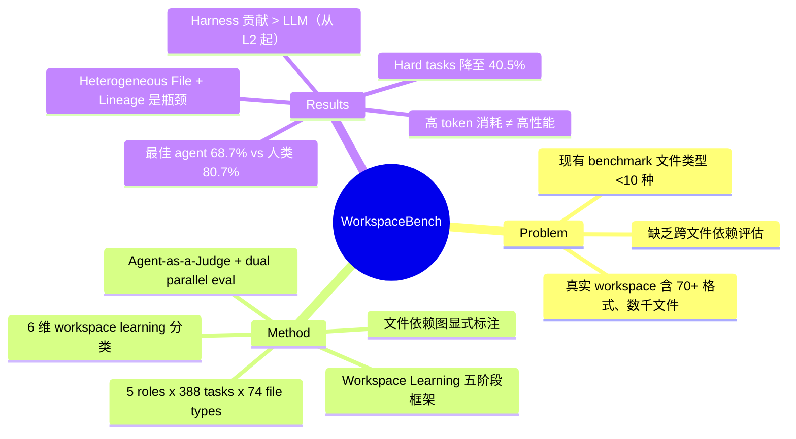

## Summary

提出 Workspace-Bench，一个面向大规模文件依赖的 workspace 级 agent benchmark，包含 5 个角色、388 个任务、20,476 个文件（74 种格式），评估 28 种 agent 配置后发现最佳 agent 仅 68.7% rubrics pass rate，远低于人类 80.7%，且在 Heterogeneous File Understanding 和 Lineage Tracing 上存在系统性瓶颈。

## Problem & Motivation

现有 agent benchmark 存在四类范式局限：prompt-driven（信息直接嵌入指令）、environment-driven（绕过本地文件生态）、task-file-driven（预打包文件，类似孤立 QA）、workspace-relevant（文件类型 <10 种，结构单一）。真实办公场景中，用户 workspace 包含数千个相互依赖的异构文件（70+ 格式），agent 需要跨文件检索、理解语义关系和版本谱系。论文从字节跳动 Lark 平台的 154 个真实任务场景出发，指出当前 agent 在 "massive, fragmented document workspaces" 上严重不足。

## Method

### Workspace 构建

- **五个角色**：Operations Manager、Logistics Manager、AI Product Manager、Backend Developer、Researcher
- **两阶段 pipeline**：(1) Structure Generation — agent 生成角色特异的目录层级，注入可控结构性噪声（冗余目录、模糊命名）；(2) Content Population — 混合策略：语义驱动爬虫获取公开资源（arXiv、GitHub、技术文档）+ LLM 合成关联 artifacts（邮件、会议记录、报告），领域专家审核一致性
- **规模**：20,476 files，3,299 directories，74 file types，max directory depth 8，最大 workspace 含 11,020 files

### Task 设计

- 388 tasks 来自 154 个真实任务场景，25 名人类标注者按角色对齐
- 每个 task 含：自然语言指令、所需输入、参考输出、评估 rubrics、文件依赖图
- **三个难度**：Easy（14%）— workspace 探索 + 结果文件利用；Medium（53%）— 语义内容关系；Hard（33%）— 异构文件理解 + 谱系追踪
- 7,399 total rubrics，avg 19.1 rubrics/task，标注时间 >3h/task

### 六个 Workspace Learning 维度

1. Workspace Exploration（67.5% tasks）
2. Task-Supporting Files Utilization（61.3%）
3. Result-Providing Files Utilization（54.4%）
4. Content Relations Understanding（43.8%）
5. Semantic Heterogeneous File Understanding（36.1%）
6. Lineage Tracing（35.1%）

### 评估框架

- Dual parallel acceleration：workspace-level 并行 + task-level sandbox 预克隆
- Multi-strategy file extraction：三种并行机制（指令约束路径、统一副本检索、元数据模糊匹配）
- Agent-as-a-Judge：judge agent 接收输出文件 + rubrics + 执行轨迹，输出二值评分 + 置信度 + 归因

### Workspace Learning 五阶段框架

- L0: Data Insensitive Execution（被动顾问）
- L1: User-Specified File Execution（处理指定路径文件）
- L2: File-to-File Dependency Reasoning（识别文件间依赖）— orchestration singularity
- L3: Task-to-File Dependency Discovery（主动探索 workspace）— Capability Singularity
- L4: Workspace-Native Self-Evolution（与 workspace 共同进化）

## Key Results

- **28 种配置**（4 harnesses x 7 models）在 Workspace-Bench-Lite（100 tasks）上评估
- **平均 pass rate**：47.4%；**最佳**：OpenClaw + Opus-4.7 ≈ 68.7%；**人类基线**：80.7%
- **难度分层**：Easy 57.6% → Medium 49.2% → Hard 40.5%，Opus-4.7 + OpenClaw/ClaudeCode 在 Hard 上维持 ~60%
- **三大瓶颈维度**：Heterogeneous File Understanding 和 Lineage Tracing 最差（OpenClaw + Opus-4.7 在 Heterogeneous File Understanding 上仅 ~20%）
- **角色差异**：Backend Developer / Researcher 表现最好（ClaudeCode + Opus-4.7 在 Researcher 上接近 80%），业务角色（AI PM、Operations Manager）较低
- **效率问题**：DeepAgent + MiniMax-M2.7 平均 58.1 turns、0.61M tokens/task，仅 ~45% pass rate；ClaudeCode + Opus-4.7 <20 turns 即达 >65%
- **Harness vs. Model**：从 L2 起，harness 贡献超过 LLM；强模型间差异小，弱模型受 harness 影响大
- **人类协作**：人类 + agent 辅助 > 所有自主 agent，且人类 pass rate 不随任务复杂度显著下降
- **Error 分布**：Missing Content 和 Reasoning Error 占绝大多数，Format/Process Error 边际

## Strengths & Weaknesses

**Strengths**:
- 规模和真实度突出：74 file types、20K+ files、avg >3h/task 的标注投入，远超 TheAgentCompany（<20 file types）和 OfficeBench
- 文件依赖图显式标注 + 6 维 workspace learning 分类，提供了比 "task completion rate" 更细粒度的诊断能力
- 五阶段 Workspace Learning 框架为领域提供了清晰的 roadmap，L2/L3 singularity 的概念有启发性
- Dual parallel evaluation 降低了大规模评估的工程成本
- 28 种配置的系统评估揭示了 harness vs. model 的交互效应，对实际部署选型有参考价值

**Weaknesses**:
- 数据来源高度依赖字节跳动内部 Lark 平台的 154 个场景，外部效度存疑——其他企业/行业的 workspace 结构可能差异很大
- Agent-as-a-Judge 的可靠性未充分讨论：judge model（Seed-2.0-Lite）本身的偏差如何影响评分？7,399 rubrics 的标注一致性如何保证？
- 五个角色中 Backend Developer 和 Researcher 的任务偏向代码/结构化数据，而业务角色任务评估标准可能更主观，rubrics 的客观性需验证
- Workspace-Bench-Lite（100 tasks）是否能忠实反映 full benchmark 的结论？分布保持 ≠ 误差保持
- 未评估多 agent 协作场景，所有任务是单 agent 执行，但现实中 workspace 常被多人共享
- 缺乏对 agent 失败模式的深入 error taxonomy——5 类 error 偏粗，难以指导具体改进
- Open-source harness（OpenClaw、Hermes）的细节不足，难以复现

## Mind Map

## Notes

- Workspace Learning 五阶段框架值得关注——L2 "orchestration singularity" 意味着 harness 设计比换模型更重要，这对 agent 系统架构选择有直接指导意义
- DeepAgent + GLM-5.1 在所有 persona 上的稳定性是一个有趣的反常现象，值得深挖原因
- 这篇论文本质上是一个 engineering-heavy 的 benchmark paper，核心贡献在于数据和评估框架而非方法创新
