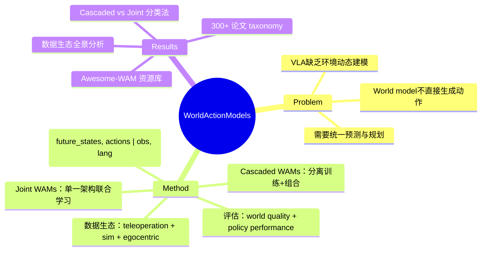

## Summary

> [未获取全文，仅基于 abstract 和结构化元数据]

首个系统性 World Action Models (WAMs) 综述，定义 WAMs 为"统一预测状态建模与动作生成的具身基础模型"，提出 Cascaded WAMs 和 Joint WAMs 的分类法，分析机器人遥操作、仿真、第一人称视频三大数据生态，并综合评估协议。配套 Awesome-WAM 资源库涵盖 300+ 相关工作。

## Problem & Motivation

> [未获取全文，仅基于 abstract]

Vision-Language-Action (VLA) 模型直接将观察映射到动作，但缺乏对环境动态的显式建模。World models 能预测未来状态但不直接生成动作。WAMs 试图统一两者：联合建模"世界如何演变"和"应该采取什么动作"，目标是让具身智能体既能预测行为后果，又能据此规划动作。本综述首次系统化这一新兴范式。

## Method

> [未获取全文，仅基于 abstract 和 PDF 结构元数据]

**核心贡献：**

1. **WAMs 定义与形式化**（Section 2）：
   - 明确 WAMs 的数学定义：联合分布 p(future_states, actions | observations, language)
   - 与 VLA、world model、JEPA 等相关概念的区分

2. **分类法：Cascaded vs Joint WAMs**（Section 3-4）：
   - **Cascaded WAMs**：world model 和 action policy 分离训练/组合，如先用 world model 生成想象轨迹，再训练 policy
   - **Joint WAMs**：单一架构同时学习状态预测和动作生成，如 WorldVLA、CosmosPolicy、InternVLA-M1
   - 涵盖 JEPA-based 方法（V-JEPA、VLA-JEPA）、Diffusion-based 方法、Dreamer 系列等

3. **数据生态分析**（Section 5）：
   - **Robot teleoperation data**：DROID、Bridge、OXE、RH20T 等
   - **Simulation data**：LIBERO、RLBench、ManiSkill、RoboCasa 等
   - **Egocentric video**：Ego4D、Ego-Exo4D、EPIC-KITCHENS、EgoVerse 等
   - 分析各数据源对 WAMs 训练的适用性和局限

4. **评估协议综合**（Section 6）：
   - World model 质量指标：video prediction fidelity、physics plausibility（VideoPhy、WorldScore）
   - Downstream policy 性能：task success rate（WorldEval、WorldModelBench、DaxBench）
   - 标准化评估的挑战

5. **开放挑战**（Section 7）：
   - 数据规模与质量、sim-to-real gap、评估标准化、架构设计权衡等

**关键引用工作：** RT-1/RT-2、OpenVLA、RDT-1B、Diffusion Policy、DreamerV3/V4、Genie、Sora、V-JEPA、CosmosPolicy、WorldVLA、FastWAM 等 300+ 篇论文

## Key Results

> [未获取全文，仅基于 abstract]

本文为 survey，不包含新实验结果。主要贡献是：
- 首次系统化 WAMs 定义和分类法
- 整理 300+ 相关工作的 taxonomy
- 分析三大数据生态的覆盖范围和局限
- 综合现有评估协议，指出标准化缺口
- 维护 Awesome-WAM 开源资源库（https://openmoss.github.io/Awesome-WAM）

## Strengths & Weaknesses

**Strengths:**

- **填补空白**：首个系统性 WAMs 综述，及时捕捉这一快速演进的新兴方向（2025-2026 年爆发期）
- **分类法清晰**：Cascaded vs Joint 的二分法抓住了核心架构差异，比简单按模型名罗列更有洞察
- **数据生态全景**：robot teleoperation、simulation、egocentric video 三大数据源的分析对研究者选择数据策略有实用价值
- **资源库维护**：Awesome-WAM GitHub repo 提供持续更新的论文列表、代码、数据集链接
- **作者阵容强**：Fudan NLP（Xipeng Qiu、Xuanjing Huang）+ NUS（Mike Zheng Shou）+ OpenMOSS 团队，跨 NLP/CV/Robotics

**Weaknesses:**

- **未获取全文限制**：无法评估具体分析深度、是否有 critical insights 还是仅文献罗列
- **时效性挑战**：survey 在快速演进领域容易过时，2026-05 提交时已有 Sora 2、Cosmos、Dreamer4 等新工作，覆盖完整性存疑
- **Cascaded vs Joint 边界模糊**：部分方法（如 latent action world models）可能难以严格归类
- **缺乏定量对比**：survey 若仅定性描述而无跨方法的性能对比表，对实践者指导有限
- **评估协议未统一**：Section 6 指出评估标准化缺口，但 survey 本身能否推动社区共识尚不明确

**对领域影响：**
- 若执行良好，可成为 WAMs 方向的 canonical reference，加速社区对术语和分类的共识
- Awesome-WAM 资源库若持续维护，价值可能超过论文本身
- 但 survey 质量高度依赖全文的分析深度和 critical perspective，需阅读全文验证

## Mind Map

## Notes

- **与 VLA survey 的关系**：2405.14093 "A Survey on Vision-Language-Action Models for Embodied AI" 已覆盖 VLA，本文聚焦 WAMs 子集，两者互补
- **Cascaded vs Joint 的实践权衡**：Cascaded 灵活（可复用预训练 world model）但 pipeline 复杂；Joint 端到端但数据需求大。哪种范式更优可能取决于数据规模和任务复杂度
- **Egocentric video 的潜力**：Ego4D 等数据集规模远超 robot teleoperation，若能有效迁移到机器人（如通过 cross-embodiment learning），可能是 scaling WAMs 的关键
- **需全文确认**：
  - Section 4 的 taxonomy 是否包含 flow-matching、diffusion-based action generation 的细分？
  - Section 7 的 open challenges 是否提出具体研究方向（如 sim-to-real、long-horizon planning）？
  - 是否有跨方法的定量对比表（benchmark 性能、数据效率、计算成本）？
- **后续行动**：若本综述质量高，可作为 WAMs 方向的入门材料；若仅文献罗列，Awesome-WAM repo 可能更有价值
