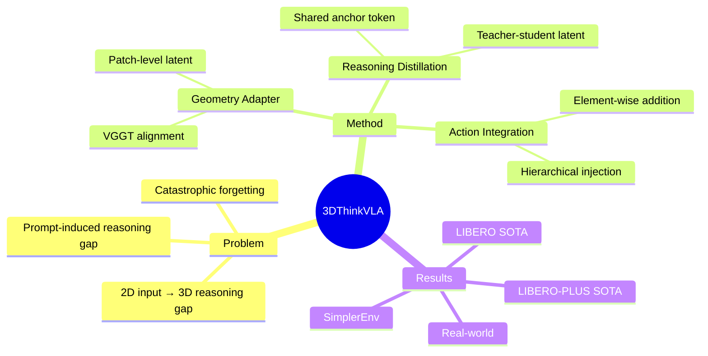

## Summary
提出 3D-thinking-guided co-training 框架，通过分离 3D geometry perception 和 3D spatial reasoning 两种能力，在不同特征层级注入 VLA 模型，实现纯 2D 输入的隐式 3D 推理，在 LIBERO、LIBERO-PLUS、SimplerEnv 和真实机器人任务上达到 SOTA。

## Problem & Motivation
现有 VLA 模型主要依赖 2D 图像输入，存在 2D 语义与 3D 空间推理之间的关键 gap。已有方法要么需要显式 3D 输入（point cloud、depth），要么依赖外部 3D foundation model，且都聚焦于 low-level geometry 注入，缺乏 high-level spatial reasoning。

更关键的是，作者发现了 **prompt-induced reasoning gap**：在 co-training 时，标准的 3D VQA prompts 能激活模型的 spatial reasoning，但简单的 action-prediction prompts 会导致模型 bypass 这些 spatial priors，退化为 action shortcut（注意力散乱或聚焦于 task-irrelevant 区域如机械臂）。

核心 insight：**3D geometry perception 和 3D spatial reasoning 是两种 distinct capabilities，可以 disentangle 并在不同 feature hierarchy 注入**。

## Method
三个紧密耦合的组件，训练时协同工作：

### 1. Latent 3D Geometry Perception Module
- 从 vision encoder 的第 18 层提取 intermediate visual features
- 通过 lightweight **Geometry Adapter**（MLP + LayerNorm）与 3D foundation model (VGGT) 的特征对齐
- 在 latent space 做 patch-level alignment，获取 low-level geometric cues
- 不修改 VLM backbone architecture

### 2. Online 3D Reasoning Distillation Module
- **Shared Reasoning Anchor Token** τ_R：插入在 task instruction 之后，作为 teacher 和 student branch 的统一 bottleneck
- Teacher branch：用 3D reasoning prompts 激活 VLM 的 spatial reasoning，获取 reasoning anchor hidden state
- Student branch：用 standard action prompts，通过 **Reasoning Adapter**（MLP + LayerNorm）将 reasoning anchor 映射到 latent reasoning space
- Token-level distillation：student 的 reasoning latent space 要 match teacher 的 representation
- 关键设计：teacher 和 student 共享参数，stop gradient through teacher branch

### 3. Spatially Augmented Action Integration
- Geometry features 和 reasoning features 分别通过 MLP 投影到 action latent space
- Element-wise addition 注入到 action-query tokens：H_A + H_geo^A + H_reasoning^A
- Random dropout 防止 overfitting

### Co-training Strategy
- VLA data + 3D VLM reasoning data (real-world images + 3D QA/dialogue)
- VLM stream：要求 reasoning anchor token 作为 first output token emitted，强化其 3D reasoning representation
- 两个 forward pass，accumulate gradients 后 single backward

### Inference
- 只保留 lightweight adapters，discard 3D foundation model 和 teacher branch
- 纯 2D 输入，无 3D sensor、无 external model、无 explicit CoT generation

## Key Results
- **LIBERO**：在 4 个 evaluation suites 上达到 SOTA success rate
- **LIBERO-PLUS**：同样 SOTA
- **SimplerEnv**：验证泛化能力
- **Real-world manipulation**：真实机器人任务验证

核心 claim：
1. 解决了 prompt-induced reasoning gap（attention visualization 证明 focus on task-relevant objects）
2. 防止 catastrophic forgetting of pretrained VLM
3. 3D-input-free inference，效率等同 standard VLA

## Strengths & Weaknesses
### Strengths
- **Insight 深刻**：disentangle geometry perception vs spatial reasoning 的设计思路 elegant，不是简单堆叠 3D feature
- **Prompt-induced reasoning gap** 发现有价值——揭示了 action prompts 会 deactivate spatial priors 的现象
- **Latent distillation** 设计巧妙：完全在 latent space 做 teacher-student transfer，无需 explicit CoT generation
- **部署友好**：推理时只需 lightweight adapters，无额外开销

### Weaknesses
- 需要额外的 3D reasoning co-training data（标注成本）
- 对 VGGT 3D foundation model 的依赖——虽然推理时 discard，但训练时需要
- Ablation 中未详细对比其他 3D foundation model（如 Depth Anything、DUSt3R）
- Real-world 实验规模未详述，缺少更多真实场景验证
- Reasoning anchor token 的设计是否 optimal？是否有其他 token position/design 的探索

## Mind Map

## Notes
- 与 Spatial Forcing、PointVLA 等 explicit 3D 方法对比，思路不同——implicit latent transfer
- Reasoning anchor token 的位置设计（after task instruction）是否有其他选择？
- 是否可以扩展到 video-based VLA？
- Co-training 的 gradient 分析见 Appendix F