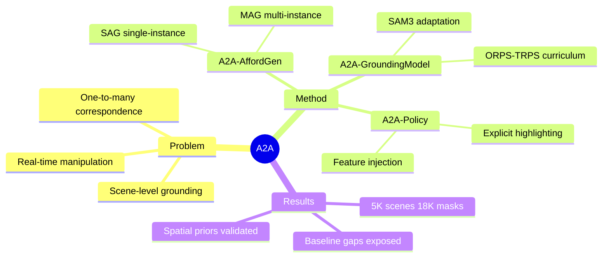

## Summary

A benchmark-centered learning framework that addresses the one-to-many correspondence problem in task-conditioned affordance grounding for manipulation: single instructions can map to multiple valid functional regions in cluttered scenes. Constructs A2A-Bench with agent-assisted annotation pipeline and adapts SAM3 for real-time grounding.

## Problem & Motivation

现有 affordance 数据集和基准与真实 manipulation 场景存在根本性错配：
1. **单一对应假设**：现有方法假设 instruction 与 region 一一对应，但真实场景中"打开微波炉"可能对应多个微波炉的把手
2. **物体级别局限**：RAGNet 等基准聚焦 grasping，InstructPart 缺乏场景复杂度和规模
3. **合成场景依赖**：UAD 等蒸馏方法依赖简化合成物体，在真实 cluttered scenes 表现差
4. **VLA 不可解释性**：Vision-Language-Action policy 隐式学习 task-relevant regions，难以解释和迁移

核心 insight：affordance 应作为 structured intermediate representation，而非隐式的 policy 内部状态。

## Method

### A2A-AffordGen 标注管线
双 regime pipeline 构建场景级标注：
- **SAG (Single-Instance Affordance Generation)**：对 isolated objects 通过 iterative point prompting 精炼 part masks
- **MAG (Multi-Instance Affordance Generation)**：扩展至多物体场景，使用 SAM3 instance mask + morphological dilation + mask-out 抑制邻域 clutter
- **Instruction Generation**：Qwen3-VL-32B-Instruct 生成多样化 TRPS (task-reasoning) 指令

数据规模：~40K 单物体 part masks（来自 RAGNet/HANDAL/InstructPart 等 7 个源）+ ~5K 人工验证场景 + ~18K single-part masks → ~150K click-trajectory samples

### A2A-GroundingModel
基于 SAM3 的轻量适配：
- **Staged Instruction Adaptation**：ORPS（显式 part 描述）→ TRPS（隐式 task intent）训练 curriculum
- **Text-Conditioned Visual Prompt Injection**：将 task intent 注入 visual encoder，而非仅靠 language side conditioning
- Frozen SAM3 backbone + lightweight adapters，无需 inference-time spatial prompts

### A2A-Policy
两种 affordance 使用方式：
- **Explicit Highlighting**：将 affordance mask 作为 spatial prior overlay 到原始 RGB
- **Implicit Feature Injection**：将 affordance features 融入 policy representation

## Key Results

### A2A-Bench 构建
- 5,000 human-verified multi-object multi-part scenes
- ~18K single-part masks
- ~150K click-trajectory samples 用于 fine-tune A2A-AffordGen

### Grounding Model 评估
- 暴露 generic segmentation、VLM-based grounding、affordance distillation baselines 的 substantial gaps
- 改善 task-level localization
- Zero-shot transfer capability to referring segmentation tasks

### Policy 评估
- Affordance grounding 提供有用的 spatial priors
- 支持 downstream manipulation policy learning
- Real-time grounding 实现（无需 inference-time spatial prompts）

## Strengths & Weaknesses

### Strengths
1. **问题定位精准**：首次系统性地解决 one-to-many affordance correspondence 问题，而非沿用 single-region assumption
2. **标注管线创新**：MAG 的 mask-out + crop 策略有效处理多物体场景 clutter suppression
3. **方法简洁有效**：基于 SAM3 的轻量适配而非从头设计复杂架构，ORPS→TRPS curriculum 设计合理
4. **下游验证充分**：不仅有 grounding 评估，还验证了 policy learning 的实际效用
5. **规模可扩展**：agent-assisted pipeline 显著降低场景级标注成本

### Weaknesses
1. **定量数据缺失**：论文 HTML 中未提取到具体 mIoU/cIoU 等数值，无法量化"substantial gaps"程度
2. **Backbone 依赖**：依赖 SAM3，其能力上限决定了 A2A 的性能 ceiling
3. **Human verification 仍需成本**：虽然 agent-assisted 降低标注负担，但 5K 场景仍需人工验证
4. **One-to-many 处理方式**：A2A-Bench 标注 one-to-many，但 Policy 只用 top-ranked region，benchmark 的 full potential 未充分利用
5. **Real-world demo 信息不足**：具体 real-world manipulation 成功率未明确

## Mind Map

## Notes

- 关键 insight：task-conditioned affordance grounding 需要推理 implicit functional regions，而非显式描述的 visual concepts
- Open question：one-to-many 标注如何更充分地被 downstream policy 利用？当前只用 top-ranked region
- Connection：与 CoA-VLA 的 chain-of-affordance 思路互补，A2A 提供更结构化的 intermediate representation
- 潜在延伸：MAG pipeline 可否用于 GUI agent 的 interactive element grounding？