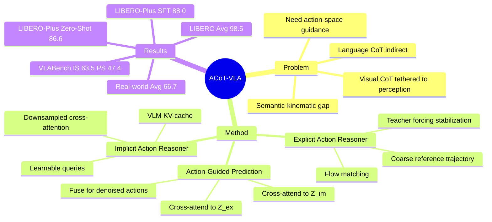

## Summary
ACoT-VLA 提出把 Chain-of-Thought 从 language / vision 中间表示转移到 action space：先生成粗粒度 reference actions，再从 VLM KV-cache 中抽取 implicit action priors，用两类 action guidance 条件化最终 action head。论文在 LIBERO、LIBERO-Plus、VLABench 和真实机器人任务上报告了相对 π0.5 等 VLA baseline 的稳定提升，但其核心假设仍依赖 action chunk 作为 action-space reasoning 表示。

## Problem & Motivation
现有 VLA 通常用预训练 VLM 表示将 observation + instruction 映射到动作；近期方法加入 language CoT（如 sub-task prediction）或 visual CoT / world model（如 goal image / future observation）作为中间推理。作者指出这些中间变量仍在 input space 中，和低层连续控制之间存在 semantic-kinematic gap：语言或视觉目标只能间接约束可执行 action sequence，难以传递精细运动信息。

ACoT 的问题设定是：如果机器人最终要输出动作，那么最直接的“推理”是否应发生在 action space 本身。论文把 thought 定义为结构化的 coarse action intents，并用显式轨迹与隐式行为先验共同指导最终策略；这个 framing 对 VLA / embodied reasoning 有直接相关性。

## Method
ACoT-VLA 建在 π0.5 之上，使用 SigLIP visual encoder 和 Gemma 2B LLM backbone（18 layers, hidden size 2048），输入帧 resize 到 224 × 224。整体训练使用 flow-matching MSE，同时优化 reference-action reasoner 和最终 action head，默认 reference horizon 为 15、policy action horizon 为 10，loss 权重 λ1 = λ2 = 0.5。

### Explicit Action Reasoner (EAR)

EAR 是一个 lightweight Transformer，用 noisy action sequence 和 VLM 的逐层 KV-cache 交互，生成 denoised coarse reference trajectory。这个 reference action sequence 再经 MLP projector 得到显式 action embedding `Z_ex`，作为直接的 action-space guidance。训练时使用 teacher forcing stabilization：`Z_ex` 从 ground-truth reference trajectories 计算，以避免 EAR 早期不稳定输出干扰 action head；推理时改为 EAR 自主生成 reference actions。

### Implicit Action Reasoner (IAR)

IAR 假设 VLM latent space / KV-cache 中包含 action-related semantics，例如 affordance、动作倾向和语言中的“reach out”“grasp”等隐式运动线索。每个 VLM layer 初始化 learnable query matrix，先把 KV-cache 下采样到较低维度（论文默认 `d' = 128`，query row `M = 1`），再用 cross-attention 抽取每层的 implicit action feature，最后跨层聚合得到 `Z_im`。

### Action-Guided Prediction (AGP)

最终 action head 不直接处理 noisy action embedding，而是把它作为 `Q_action`，分别对 `Z_ex` 和 `Z_im` 做 cross-attention，得到 explicit-guided 与 implicit-guided 表示，再通过 self-attention fusion block 融合并预测 denoised action sequence。方法的关键设计不是增加一个更大的 action decoder，而是把 action-level intermediate reasoning 显式暴露给 policy。

## Key Results
### Simulation Benchmarks

| Benchmark | Setting / Metric | Main Baseline | ACoT-VLA Result | 论文报告的关键差异 |
|:--|:--|:--|:--|:--|
| LIBERO | Avg. success rate | π0.5: 96.9%, VLA-Adapter: 97.3% | 98.5% | 全四个 suite 平均第一；LIBERO-Long 达 97.0%，高于 π0.5 的 92.4% |
| LIBERO-Plus | Zero-Shot Avg. success rate | π0.5*: 85.7% | 86.6% | Robot perturbation 82.6% vs 79.4%，Language variation 87.5% vs 83.3% |
| LIBERO-Plus | Supervised Fine-Tuning Avg. success rate | π0.5⋄: 75.7%, π0⋄: 67.4% | 88.0% | Camera 96.6%、Noise 95.9%、Background 97.1%，整体显著高于 frozen π0.5 baseline |
| VLABench | Avg. IS / PS | π0.5⋄: 60.2 / 43.1 | 63.5 / 47.4 | Unseen-texture track 为 74.6 IS / 54.6 PS，相比 π0.5⋄ 的 62.0 / 47.4 提升 12.6 / 7.2 |
| Genie-Sim 3.0 sim2real | Simulation / Real-world Avg. | π0.5: 75.7% / 77.5% | 84.2% / 82.9% | 论文把较小 sim-to-real drop 归因于 action guidance 比视觉表示更接近底层运动 |

### Real-World Deployment

真实机器人实验覆盖 AgiBot G1 上的 Wipe Stain、Pour Water、Open-set Pick，以及 AgileX 平台上的 Open-set Pick。论文报告 ACoT-VLA 平均成功率 66.7%，高于 π0.5 的 61.0% 和 π0 的 33.8%；但正文没有给出每个真实任务的完整数值表，只在图和文字中汇总平均结果。

### Ablations

| Ablation | Benchmark | Result | Takeaway |
|:--|:--|:--|:--|
| Baseline π0.5 | LIBERO Avg. | 96.9% | 无 EAR / IAR |
| + EAR | LIBERO Avg. | 98.3% | explicit reference action trajectory 单独有效 |
| + IAR | LIBERO Avg. | 98.1% | KV-cache 中的 implicit action cues 单独有效 |
| + EAR + IAR | LIBERO Avg. | 98.5% | 两者互补 |
| Baseline π0.5⋄ | LIBERO-Plus SFT Avg. | 75.7% | frozen LLM baseline |
| + EAR + IAR | LIBERO-Plus SFT Avg. | 84.1% | 在扰动 benchmark 上提升更明显 |
| IAR KV strategy | LIBERO Avg. | Query 97.0%, Attention Pooling 97.3%, Downsample 98.1% | 下采样 KV-cache 后再 cross-attention 最好，说明原始 VLM features 可能含有 action-irrelevant noise |
| Latency | LIBERO / LIBERO-Plus | 91ms baseline → 112ms EAR+IAR | 性能提升伴随推理延迟与参数量增加：3.35B → 3.81B |

## Strengths & Weaknesses
### 已知

- **核心 insight 简洁**：把中间推理从 language / vision space 移到 action space，直接面向 VLA 的 semantic-kinematic gap。这个问题 formulation 比“再加一个语言解释”更贴近机器人控制。
- **实验覆盖较完整**：包含 LIBERO、LIBERO-Plus、VLABench、真实机器人、Genie-Sim 3.0 sim2real；baseline 覆盖 visual guidance（CoT-VLA、WorldVLA、DreamVLA、GE-Act 等）和 linguistic guidance（OpenVLA、π0、π0.5、VLA-Adapter 等）。
- **消融能支撑模块贡献**：EAR、IAR 单独都提升，组合最好；参数/denoise budget 对比显示收益不只是来自更大的 action head 或更多 denoising steps。
- **论文明确给出成本**：EAR+IAR 把端到端 latency 从 91ms 提到 112ms，参数从 3.35B 到 3.81B；这对真实部署不是零成本。

### 推测

- ACoT 的主要价值可能不在“CoT”这个类比本身，而在给 action decoder 提供一个同质的 intermediate action prior；这解释了为什么在 LIBERO-Long、LIBERO-Plus perturbation 和 sim2real 中收益更明显。
- EAR 的 teacher forcing 说明 action-space reasoning 训练存在稳定性问题；如果 reference action generation 在更开放任务中偏移，最终 action head 可能被错误 reference trajectory 误导。

### 不知道 / 局限

- 论文没有给出细粒度 failure case taxonomy，也没有报告真实机器人各任务的完整表格数值，因此无法判断提升主要来自哪类失败恢复。
- 限制部分指出当前 action representation 仍是 action chunks（joint angles 或 end-effector poses 等低层控制序列），缺少显式几何结构；这可能限制 ACoT 在 object-centric coordination、contact geometry 和 3D spatial reasoning 上的潜力。
- EAR scale 的趋势非单调：300M 最好，500M 反而下降。作者解释为 over-parameterized EAR 可能 overfit spurious correlations 并生成 biased reference actions；这个结论重要，但仍需要更多任务验证。
- 资源受限机器人平台可能受额外计算开销影响；论文没有系统分析低算力边缘部署。

## Mind Map

## Notes
- 与 CoT-VLA 的差异：CoT-VLA 预测 visual sub-goal image，ACoT-VLA 预测 action-space reference trajectory；两者都叫 CoT，但中间变量的物理同质性不同。
- 与 π0.5 的关系：ACoT-VLA 不是从零提出新的 VLA foundation model，而是在 π0.5 上加入 action-space reasoning modules，因此更像是一个可插拔的 policy-conditioning 改造。
- 对 GUI-agent 的间接启发：GUI action 也存在“语言目标 → 可执行动作序列”的表示落差；但本文的证据只在机器人 manipulation / VLA 上，不能直接外推到 GUI grounding 或 computer-use。
