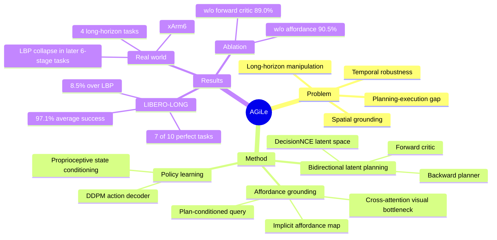

## Summary
AGiLe 针对 language-guided long-horizon manipulation 中的 temporal robustness 与 planning-execution gap，提出 backward planner + forward critic 的 bidirectional latent planning，并用 plan-conditioned cross-attention 做 affordance grounding。它在 LIBERO-LONG 上达到 97.1% average success，比 LBP 高 8.5%，并在 4 个真实 xArm6 长时程任务上相对 LBP 更稳。局限是 planner 两阶段训练后被冻结，论文明确把 end-to-end / online refinement、larger domain shifts 和 unseen objects 留作 future work。

## Problem & Motivation
长时程机器人操作需要同时解决两个不同问题：高层 subgoal plan 要在多个阶段中保持 temporal coherence，低层执行又要把抽象 subgoal 精确 grounded 到当前视觉场景中的可操作区域。已有方法通常只覆盖其中一侧：fine-grained forward planning 细但计算成本高，coarse-grained forward planning 容易 error accumulation；LBP 这类 latent backward planning 能改善 goal consistency，但仍可能生成与当前状态不可达的 subgoal，并且没有显式处理 planning-execution gap。

作者把核心问题定义为 temporal robustness + spatial robustness 的联合建模：不仅要知道“下一步应该做什么”，还要知道“当前图像里应该看哪里、怎么执行”。这个 formulation 对 embodied manipulation 很重要，因为长时程任务的失败常不是单步 policy 不会抓，而是高层计划、视觉 grounding 和动作生成之间的误差逐步放大。

## Method
AGiLe 是一个两阶段框架。第一阶段训练 Bidirectional Latent Planner；第二阶段冻结 planner，训练 affordance grounding module 与 diffusion policy decoder。

**Bidirectional Latent Planning**：AGiLe 使用 frozen DecisionNCE RN50-CLIP encoder，把初始观测编码为 `z0`，语言目标编码为 `zg`，专家 subgoal 编码为 `Zgt`。Backward Planner `Pback` 由 initial predictor 和 recursive Transformer 组成，从 `z0, zg` 反向生成 latent subgoal sequence；训练目标包含 backward imitation loss。Forward Critic `Vfwd` 是 latent forward model，从候选 subgoal 和初始状态预测 final goal embedding，用 ground-truth subgoals 和 planner-generated subgoals 两类 forward consistency loss 约束计划的 goal reachability。推理时只保留优化后的 backward planner，forward critic 不参与 deployment。

**Affordance Grounding for Subgoals**：planner 产生的 `Zplan` 仍是抽象 latent plan。AGiLe 先用 `z0` attend 到 `Zplan` 得到 state-aware fused plan，再投影为 task query；当前观测经 Swin Transformer visual backbone 得到 spatial feature map。一个 Multi-Head Cross-Attention 以 task query 为 Query、visual features 为 Key/Value，输出 attention weights 作为隐式 affordance map，并得到 purified task-relevant visual feature。这个设计不使用显式 affordance label，而是让 action loss 的梯度驱动 cross-attention 学到对执行有用的视觉 grounding。

**Policy Learning**：policy decoder 是 DDPM-style conditional denoising model，条件输入是 affordance-grounded visual feature 与 robot proprioceptive state 的拼接。训练目标是标准 diffusion noise prediction MSE；affordance module 与 policy decoder 在第二阶段端到端联合优化。

## Key Results
**LIBERO-LONG simulation benchmark**：在 10 个 long-horizon manipulation tasks 上，AGiLe 平均成功率为 97.1%，高于 LBP 的 88.6%、Seer 的 87.7%、MPI 的 77.3%、SuSIE 的 76.3%、MVP 的 68.2%、OpenVLA 的 54.0% 和 MTACT 的 41.0%。论文报告该结果对应相对 LBP 的 8.5% improvement。AGiLe 在 10 个任务中有 7 个达到 100% success；LBP 为 3 / 10，Seer 为 1 / 10。

**Hard LIBERO-LONG tasks**：在 “Put both pots on stove” 上，AGiLe 为 78.6%，LBP 为 60.0%，Seer 为 61.7%；在 “Put soup and sauce in basket” 上，AGiLe 为 92.3%，LBP 为 86.6%，Seer 为 88.3%。这些任务被作者用来说明 spatial coordination、long-term dependency 和 visual ambiguity 下的鲁棒性。

**Ablation on LIBERO-LONG**：去掉 Affordance Grounding 后，average success 从 97.1% 降到 90.5%，perfect tasks 从 7 / 10 降到 2 / 10。去掉 Forward Critic 后，average success 降到 89.0%，perfect tasks 降到 3 / 10；论文认为这是最大的单组件性能下降，说明 forward validation 对 temporal consistency 很关键。

**Real-world validation**：真实实验使用 xArm6、wrist/top-down 两个 Intel RealSense D435 cameras，包含 4 个长时程任务：两个 4-stage task 每个收集 100 条 expert demonstrations，两个 6-stage task 每个收集 150 条 demonstrations。评估采用每阶段 10 rollouts 的 stage-wise average score，并规定只有当前 stage 达到 100 分才能进入下一 stage。论文报告 AGiLe 在 4 个任务所有阶段上 consistently outperforms LBP；在 6-stage tasks 的后期，LBP performance collapse 到 Task 3 的 5% 和 Task 4 的 2%，而 AGiLe 仍保持显著成功。

## Strengths & Weaknesses
**已知**：AGiLe 的核心贡献是把 temporal robustness 和 spatial robustness 拆成两个互补模块：bidirectional latent planning 约束 subgoal sequence 的 goal consistency / reachability，affordance grounding 把 latent plan 变成当前图像中的 task-relevant visual evidence。这比单纯 backward planning 更完整，因为 LBP 只处理从目标反推 subgoal 的一侧，没有显式 forward feasibility validation，也没有显式视觉 grounding bottleneck。

**已知**：实验设计覆盖 simulation 与 real-world，baseline 包括 MTACT、MVP、MPI、OpenVLA、Seer、SuSIE 和 LBP。需要注意的是，Table 1 中 AGiLe 与 LBP 使用 top-3 saved checkpoints 的平均结果，其它 baseline 结果来自各自原论文；因此跨方法比较是有信息量的，但不是所有 baseline 都在同一代码路径下重跑。

**已知**：Ablation 比 main result 更有解释力。w/o Forward Critic 掉到 89.0%，说明单向 backward imitation 不足以保证从当前状态可达；w/o Affordance Grounding 掉到 90.5%，说明把 plan vector、global visual feature 和 state 简单 concat 不能替代 spatial attention bottleneck。

**已知的局限**：论文自己指出当前是 two-stage framework，planner independent training 后固定，限制 execution-time adaptivity；未来需要 end-to-end 或 online optimization，让 planner 能从 execution feedback 中实时修正。论文也把 larger domain shifts 和 unseen objects 的 open-world 扩展列为 future work，而不是已解决结果。

**不知道**：论文正文没有给出本论文自己的 arXiv id、DOI 或 code repository；只给出 project website。真实机器人实验的 Fig. 4 展示了 AGiLe 的 stage-wise 曲线，但正文没有逐项列出 AGiLe 每个 stage 的精确分数，因此这里不补写未给出的数字。Appendix C 被引用为 hyperparameter 详情来源，但正文没有展开具体超参表。

**推测**：这个方法对 GUI-agent / web-agent 的启发不在机器人动作空间本身，而在“latent plan 先约束 temporal consistency，再用 plan-conditioned attention grounding 到当前 observation”的结构。若迁移到 GUI，需要重新定义 affordance map（例如 UI element / clickable region / text field）和 action decoder，不能直接把机器人成功率外推到 GUI benchmark。

## Mind Map

## Notes
这篇的判断是“long-horizon robustness 不是单一 planning 问题”，而是 plan consistency 与 perceptual grounding 的耦合问题。值得后续对比 [[2603-SeedPolicy- Horizon Scaling via Self-Evolving Diffusion Policy for Robot Manipulation|SeedPolicy]]、[[2406-RoboMamba|RoboMamba]]、[[2508-EmbodiedR1|Embodied-R1]] 这类从 horizon scaling、state-space modeling、pointing / affordance intermediate representation 切入的工作。

后续阅读时可以追问两个问题：第一，forward critic 在 inference 被丢弃后，planner 遇到 execution drift 是否只能依赖 policy 自身吸收误差；第二，implicit affordance attention 是否真的学到可解释 affordance，还是只是在 LIBERO-LONG 与四个真实任务上作为有用的 feature selection bottleneck。
