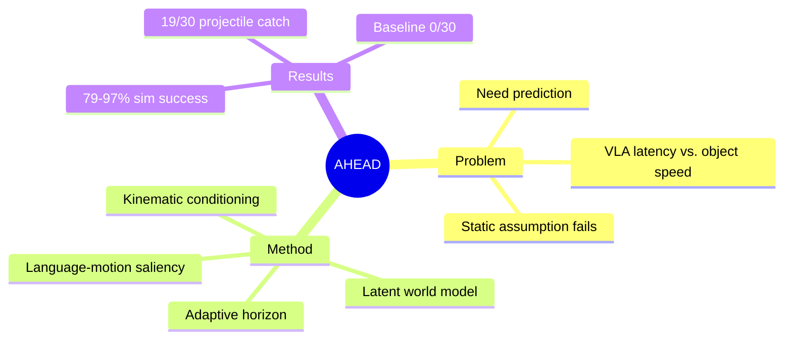

## Summary

AHEAD 通过在 frozen VLA 上添加轻量级 latent world model，实现动态场景下的预测式操作，在 20 个仿真场景达到 79-97% 成功率，物理机器人上完成 baseline 全失败的 projectile catching 任务。

## Problem & Motivation

现有 VLA 模型在静态操作任务上表现优秀，但面对移动物体时失效。VLA 假设场景在 observation 和 execution 之间静止，导致任何非零物体速度下，latency 都超过可用 grasping 时间窗口。人类通过 anticipatory internal models 处理动态场景，但 VLA 缺乏这种预测能力。

Prior work 有两个方向：
1. Reactive policies 缩短 perception-to-action loop，但物体速度增加时 residual latency 占用更大比例 reaction window
2. World models 学习 forward dynamics 并通过 imagined rollouts 规划，但现有方法要么在 expensive pixel space 操作，要么需要 joint retraining，且使用 fixed horizon

核心问题：现有方法没有解决"哪些场景部分需要预测"、"预测多远"、"以什么 latency"三个问题。

## Method

AHEAD (Anticipatory Horizon Extrapolation with Adaptive Dynamics) 是一个 predict-then-act wrapper，核心设计：

**1. Latent-Space World Model**
- 在 VLA 的 feature space 预测未来 patch tokens
- 仅 4.9M 参数，添加到 frozen 7B OpenVLA
- 基于 flow-matching，conditioned on per-token velocity 和 acceleration from optical flow

**2. Language-and-Motion Saliency**
- 通过 language conditioning 识别 task-relevant patches
- 通过 optical flow 识别 independently moving patches
- 只预测需要的 patches，节省 compute

**3. Adaptive Horizon Halting**
- 不使用 fixed horizon，而是根据 prediction uncertainty 动态停止
- 当 uncertainty 超过 threshold 时停止 rollout
- Linear motion 允许长 horizon，chaotic motion 只能短 horizon

**4. Explicit Kinematic Conditioning**
- 将 velocity 和 acceleration 在 rollout steps 中 analytically 传播
- 从 constant-velocity regime 扩展到 acceleration regime
- 不需要从数据学习二阶物理

**5. Predict-Then-Act Loop**
- World model rollout once → predicted future state → frozen action decoder
- 5 samples 用于 uncertainty estimation，而非 action selection
- 保持 frozen VLA 的 pretrained capabilities 不变

## Key Results

**Simulation (20 scenarios)**:
- AHEAD: 79-97% success rate
- Strongest baseline: 31-58% success rate
- 包括 constant-velocity、acceleration/deceleration、complex dynamic scenarios

**Physical Robot (UFactory xArm 7)**:
- Conveyor + rolling-ball tasks: 29/30 to 30/30 success
- Paddle interception: 23/30 success
- **Projectile catching**: 19/30 success (baseline: **0/30**)

**Ablations**:
- Motion estimator (velocity + acceleration) vs. velocity-only: 显著提升
- Spatial masking vs. full state: 降低 compute，提升 focus
- Adaptive horizon vs. fixed horizon: 更好的 predictability 适配
- Flow-matching world model architecture 的有效性

## Strengths & Weaknesses

**Strengths**:
1. **Minimal overhead**: 仅 4.9M 参数添加到 7B frozen VLA，保持原模型能力
2. **Adaptive compute**: spatial (只预测相关 patches) + temporal (uncertainty-driven halting) 双轴自适应
3. **Explicit kinematic conditioning**: 不学习二阶物理，analytically 传播 velocity/acceleration，简洁高效
4. **Strong empirical results**: 在 projectile catching 任务上 baseline 全失败 (0/30) 而 AHEAD 达 19/30，这说明真正解决了现有方法无法处理的 regime
5. **Frozen VLA preservation**: 不需要 retrain underlying VLA，可直接应用到不同 frozen VLAs

**Weaknesses**:
1. **Optical flow dependency**: 需要 accurate optical flow estimation，在极端 lighting/occlusion 下可能失效
2. **Single-object assumption**: 方法假设主要是单个 moving object，multi-object dynamic interaction 可能更复杂
3. **Training data requirement**: 需要 manipulation video pretraining，phase 1-3 curriculum，虽然比 joint training 简单但仍需数据
4. **Limited physics coverage**: explicit kinematic conditioning 覆盖 velocity/acceleration，但更复杂的物理（collision dynamics、elastic deformation）未涉及
5. **Real-time constraint**: 实验在特定 latency budget 下验证，更 tight real-time requirements 可能需要进一步优化

**Open Questions**:
- 如何处理 multi-object dynamic interaction？
- 是否可以 extend 到更高阶 physics（collision response、friction）？
- Adaptive halting threshold 如何自动设定，而非 hand-picked？

## Mind Map

## Notes

这篇论文的核心 insight 是将 world model prediction 与 VLA action decoding 解耦，通过 frozen wrapper 而非 joint training 实现。Adaptive compute（spatial + temporal）的设计很 clever——不是 brute-force predict everything，而是专注 task-relevant + motion-relevant patches，并根据 uncertainty 动态调整 horizon。

Projectile catching 的 19/30 vs. baseline 0/30 是最有说服力的 evidence——这不是 incremental improvement，而是打开了之前 VLA completely incapable 的 regime。

Explicit kinematic conditioning 的设计 choice 也值得注意——作者选择 analytically 传播 velocity/acceleration 而不学习，这避免了 learning high-order physics 的 complexity，但也限制了 applicability 到更 complex dynamics。

与 concurrent work (DynamicVLA、VLASH、Ctrl-World、VLAW) 的对比中，AHEAD 的 unique contribution 是 explicit prediction + adaptive compute，而非仅 accelerate the loop。