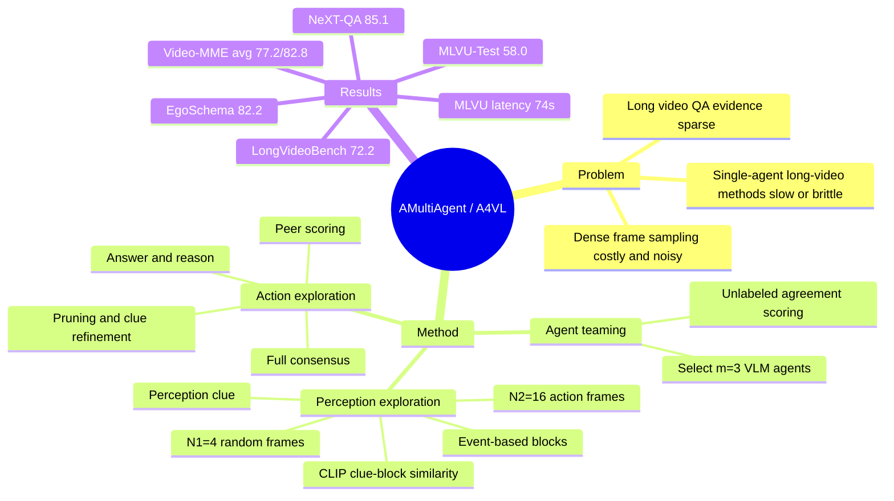

## Summary
A4VL 是一个 training-free multi-agent perception-action alliance，用多个 VLM agent 在长视频 QA 中先生成 query-specific perception clue，再用 event-based block selection 找关键帧，最后通过多轮答案、理由、互评、pruning 达成 consensus。论文的主要证据是：在 NeXT-QA、EgoSchema、LongVideoBench、MLVU-Test、Video-MME 上，A4VL 在较低推理延迟下超过一组 closed-source / open-source MLLM 与 long-video agent baselines。需要谨慎的是，论文没有系统报告 failure cases，且部分结果文字与表格存在小的算术或 caption 顺序不一致。

## Problem & Motivation
长视频 VideoQA 的核心困难不是单纯“看更多帧”，而是问题相关事件通常只出现在少量片段中；增加 sampling density 会带来 memory/time cost，并可能因为冗余帧引入噪声。已有 long-video 优化路线包括 token merging、sparsification、efficient architecture、memory retrieval 和 agent-based 方法，但论文指出 agent-based 方法常见问题是推理慢、依赖单个 MLLM 决策、对长而复杂问题的 key frame localization 仍不稳。A4VL 试图把问题拆成两个动作：先用 perception clue 定位候选视频块，再用多个 agent 对答案和证据做多轮 deliberation。这个方向与 GUI-agent / embodied agent 的关联在于：长时序观察中的 sparse evidence localization 与 action-reasoning loop 是共同瓶颈。

## Method
A4VL 的流程由可选的 agent teaming、perception exploration、action exploration 三部分组成。

**Agent teaming.** 给定一个包含 8 个模型的 agent library，论文用一小组未标注 video-question pairs 做 task-specific selection。每个 agent 独立跑部分 A4VL workflow 并输出选项；系统统计每个选项被选择的频率，把 agent 自己选择选项的频率作为该题得分，再对 K 个样本求平均，选择得分最高的 m=3 个 agent。论文实验中的候选模型包括 LLaVA-Video-7B-Qwen2、QwenVL-2.5-7B/32B/72B、InternVL3.5-8B/38B、InternVL3-78B、LLaVA-Video-72B-Qwen2。

**Perception exploration.** 每个 agent 第一轮先随机采样 N1=4 帧预览全视频，并基于问题和选项生成 perception clue。随后系统把视频切成最多 B 个 blocks；最终采用 event-based partitioning，使用 DINOv2 embeddings 和 HSV / motion / sharpness 等 pixel cues，结合 KTS、PELT、SSM-based novelty 生成边界候选，再合并和 NMS。每个 block 与每个 agent 的 clue 用 CLIP 计算 similarity；若所有 block 分数低于 ρ=0.8，则从最相关 block 采样 N2=16 帧，否则按 softmax 后的 block 分数分配 N2 帧。论文把 random sampling for clue + event-based sampling for action 记作 RESampling，并作为默认配置。

**Action exploration.** 每个 agent 基于自己的 N2 帧输出 answer 和 reason。如果所有 agent 达成 full consensus，summarizer 汇总 perception clues、answers、reasons 并返回最终答案；如果没有达成 consensus，每个 agent 对所有答案和理由打 1-10 分，系统 pruning 总分最低的 agent。剩余 agent 使用当前 clue、答案集合、理由集合、被淘汰 agent、问题和选项生成 refined perception clue，并回到 perception exploration 的 block selection 阶段。默认最多三轮，因为默认 team size 是 3。

## Key Results
- **总体准确率。** Table 1 中 A4VL 在五个 benchmark 上的结果为：NeXT-QA 85.1、EgoSchema 82.2、LongVideoBench 72.2、MLVU-Test 58.0、Video-MME average 77.2/82.8。论文正文把 Video-MME average 的 77.2 解释为 without subtitle、82.8 为 with subtitle；这与 table caption 的顺序表述需要交叉核对。
- **对比强 baseline。** NeXT-QA 上 A4VL 85.1，高于 InternVL3-78B 的 84.0；EgoSchema 上 A4VL 82.2，是表中唯一超过 80 的方法，高于 LVAgent 78.4 和 InternVL3-78B 76.8；LongVideoBench 上 A4VL 72.2，高于 GPT-4o 66.7、LVAgent 66.9、VideoRAG-72B 65.4；MLVU-Test 上 A4VL 58.0，高于 InternVL3.5-38B 56.1、InternVL3-78B 55.3、GPT-4o 54.9。
- **Video-MME。** A4VL 在 Short 86.6/87.3、Medium 76.8/83.2、Long 68.3/77.9、Average 77.2/82.8；论文正文强调 without subtitle average 77.2 比 Gemini 1.5 Pro 的 75.0 高 2.2。
- **Latency。** Table 3 中 A4VL 在 NeXT-QA / EgoSchema / MLVU 的平均推理时间为 18s / 37s / 74s；对比 GPT-4o 为 23s / 54s / 127s，InternVL3-78B 为 15s / 50s / 204s，VideoAgent 为 20s / 83s / 175s，TraveLER 为 101s / 94s / 450s。A4VL 并非每个短视频场景都最快，但在 EgoSchema 和 MLVU 上延迟明显更低。
- **Ablations.** EgoSchema 上 RESampling 达到 82.2、37s，优于 RRSampling 80.2、35s 和 ERSampling 79.6、37s；FConsens 为 82.2、37s，优于 MConsens 81.4、26s；默认 pruning 的 A4VL 为 82.2、37s，优于 NoPruneSum 80.8、60s 和 NoPruneMaj 79.4、60s。Figure 5 显示允许更多 rounds 时所有 benchmark 的 accuracy 都上升，Table 4 显示更难数据集更常进入第 2/3 轮。

## Strengths & Weaknesses
**已知 Strengths.** A4VL 的 formulation 比“把更多帧塞进一个 VLM”更清楚：query-specific clue 负责压缩检索目标，event-based blocks 负责把长视频变成可评分候选，multi-agent deliberation 负责在答案冲突时重新采样证据。实验覆盖短、中、长视频 QA，并包含 closed-source MLLM、open-source MLLM、agent-based 和 long-video-oriented 方法，说明比较面较宽。Ablation 对几个关键设计给了直接证据：RESampling、full consensus、pruning、多轮 collaboration 都带来可测收益。效率结果也有意义，尤其 MLVU 上 74s 明显低于 GPT-4o 127s、InternVL3-78B 204s、VideoAgent 175s、TraveLER 450s。

**已知 Weaknesses / Limits.** 论文没有系统 failure-case section；Figure 4 是成功案例，不能说明 A4VL 在什么类型的问题上会稳定失败。Agent teaming 的“未标注样本上按选择频率打分”隐含假设是 agreement 与 correctness 正相关，但论文没有看到针对 teaming 策略、K 值、m 值的独立 ablation。CLIP similarity 被作者选择为最快方案，caption-based 或 task-conditioned similarity 被留作 future work，因此当前 perception alignment 可能受 CLIP text-video alignment 上限约束。实验默认使用六张 H200 GPU；虽然 per-sample latency 降低，但三 agent 多轮推理的硬件成本不等于轻量部署。结果报告还有小瑕疵：EgoSchema 段落中 “InternVL3-78B 76.8, A4VL 82.2 (+3.2)” 的 +3.2 与表格算术不一致，Video-MME 的 subtitle 顺序也需要按正文解释读取。

**推测 / 对本 vault 的启发.** 对 GUI-agent 来说，A4VL 值得借鉴的不是视频 QA 数字本身，而是 perception clue -> evidence localization -> action/reasoning -> disagreement-triggered re-perception 这个 loop。它可以启发长 GUI trajectory / screen recording 理解：先用任务目标生成 clue，再从长轨迹中找关键 screen states，最后让多个 agent 对 action hypothesis 做互评和重采样。

**不知道.** 不知道 A4VL 在开放式生成式 VideoQA、非多选题、需要 audio-text-video 三模态融合、或强 temporal ordering 的细粒度事件问题上表现如何；论文只在当前五个 benchmark 和给定模型池下报告结果。也不知道 code release 是否包含完整复现实验配置、agent prompts、teaming samples 与所有 baseline 设置。

## Mind Map

## Notes
这篇的 rating 给 4：它与 VLM / video-LLM / agentic reasoning 高度相关，方法也足够简单可复用；但不是 GUI-agent 或 embodied action 的直接论文，且 failure analysis 与 agent teaming ablation 不够充分。后续若要把它接到 GUI trajectory reasoning，可以优先验证两个问题：第一，perception clue 是否能稳定定位关键 UI state；第二，disagreement-triggered re-perception 是否比单次 retrieval + answer 更稳。
