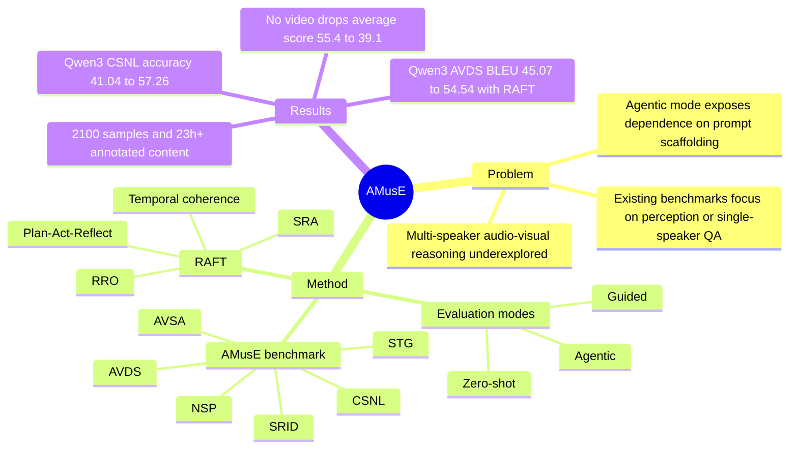

## Summary

AMusE 提出一个面向多说话人 audio-visual 理解的 benchmark，并用 zero-shot / guided / agentic 三种模式测试 MLLM 是否能在对话中做 speaker grounding、turn tracking、summary 和跨场景叙事链接。论文同时提出 RAFT，通过 Plan-Act-Reflect 格式、Reflective Reward Optimization、Selective Reasoning Adaptation 和 temporal coherence regularization 来提升 open-source MLLM 在 AMusE 上的 agentic 表现。

## Problem & Motivation

已知：现有 MLLM benchmark 多集中在图像/视频感知、单轮 QA 或单说话人叙事，较少评估真实多人对话里的 speaker identity、overlapping speech、turn-taking、跨片段因果链接。作者认为 meeting assistants、conversational video assistants 等场景需要模型同时理解音频、视觉、转写文本和时间结构，而不是只给出文本化回答。AMusE 的核心问题不是“模型会不会看视频”，而是“当提示不再显式告诉它用哪些线索时，它能否自主规划、调用感知工具并保持 speaker-consistent reasoning”。推测：这对 GUI / web agent 的评估有启发，因为 guided 与 agentic 的性能差距可以暴露模型是否真的学会任务分解，而不是只是在跟随 prompt scaffold。

## Method

**AMusE benchmark**：包含 2,100 个样本，覆盖 6 个任务：Speaker Temporal Grounding (STG)、Audio-Visual Dialogue Summarization (AVDS)、Audio-Visual Speaker Association (AVSA)、Next Speaker Prediction (NSP)、Speaker Re-identification (SRID)、Cross-Scene Narrative Linking (CSNL)。其中前五个任务各 400 个样本，CSNL 为 100 个人工收集的跨场景样本；平均 clip 长度 38.7s，总计超过 23 小时、350+ unique identities，平均每 clip 3.1 个说话人，overlap >= 2 的比例为 0.28。

**三种评测模式**：
- **Zero-shot**：只输入 raw video 和 question，作为模型 intrinsic multimodal understanding 的下界。
- **Guided**：提供 face crops、voice segments、transcripts、lip sync 等预计算线索，并用 step-by-step instruction 显式指导模型使用这些线索。
- **Agentic**：工具仍可用，但不显式提示工具可用性或中间步骤；模型需要自主决定是否调用 Whisper、Pyannote、InsightFace、SyncNet 等感知工具，并整合结果。

**RAFT (Reasoning-Acting-Feedback Training)**：训练时把输出组织为 Plan / Act / Reflect，并联合三个核心信号：
- **Structured Reasoning Alignment**：用 `Lalign = -log pi_theta(y | x)` 约束每个 reasoning phase 与上下文依赖一致。
- **Reflective Reward Optimization (RRO)**：对同一 multimodal sample 采样多个候选，基于 grounding accuracy、speaker consistency、textual coherence 与 perceptual agents 的反馈构造 reward，并用 softmax reward weighting 更新；作者声称 softmax weighting 比 GRPO 的线性 weighting 更稳定。
- **Temporal Coherence Constraint**：约束 audio / visual / text / reflective embeddings 在时间上同步，减少 speaker drift 和 modality mismatch。
- **Selective Reasoning Adaptation (SRA)**：只更新 cross-modal reasoning layers / adapters，而不是全模型或通用 LoRA 路径，以提高参数效率和可解释性。

## Key Results

- **Benchmark 难度**：在 AMusE 的 AVDS 上，Human 的 BLEU / METEOR / CIDEr / GPT score 为 86.04 / 8.36 / 92.03 / 9.52，Random 为 21.88 / 2.14 / 30.74 / 2.23；Qwen3-Omni-7B zero-shot 只有 45.08 / 5.26 / 42.03 / 5.24，说明与 human ceiling 差距很大。
- **自主性带来性能下降**：Qwen3-Omni-7B 在 AMusE AVDS 上 guided BLEU 48.08、agentic BLEU 45.07；在 STG 上 guided tIoU 51.02、agentic tIoU 45.59；在 CSNL 上 guided accuracy 49.76、agentic accuracy 41.04。论文据此认为许多 MLLM 依赖 explicit cue / prompt scaffold，而非稳定的内部多模态时序建模。
- **RAFT 提升 agentic 表现**：Qwen3-Omni-7B 在 AMusE AVDS agentic w/o RAFT 到 w/ RAFT 从 BLEU 45.07 提升到 54.54，METEOR 4.72 到 6.81，CIDEr 48.53 到 58.51，GPT score 5.10 到 6.62。AVSA accuracy 从 46.98 到 54.22，NSP 从 45.02 到 56.73，SRID 从 54.51 到 62.53。
- **最大相对增益来自 CSNL**：Qwen3-Omni-7B 在 AMusE CSNL agentic accuracy 从 41.04 到 57.26，约为 +39.52% relative improvement；human-judged coherence 从 5.02 到 7.11。STG tIoU 也从 45.59 到 54.04，Off-by-One Accuracy 从 43.29 到 56.33。
- **Ablation**：去掉 temporal regularizer 后，STG tIoU 下降明显：Qwen3-Omni 从 56.3 到 51.5，Qwen2.5-Omni 从 54.6 到 48.2，CREMA 从 41.0 到 37.5。SRA 参数效率实验中，SRA-0.5% 的 Avg. Score 为 54.1，高于 LoRA-5% 的 53.5；cue ablation 中 Full (A+V+T+F) 平均 55.4，No Audio 42.7，No Video 39.1，No Transcript 48.5，No Face Crops 50.2。

## Strengths & Weaknesses

**Strengths / 已知**：
- Benchmark 设计抓住了多人 audio-visual agent 的真实痛点：speaker attribution、temporal grounding、overlap、longer clip、跨场景 narrative linking，而不是只评估单轮 video QA。
- 三种 evaluation modes 很有价值：zero-shot、guided、agentic 的分离能直接测出模型是在“使用给定 metadata”还是“自主规划并调用工具”。
- RAFT 的方法没有引入复杂新 backbone，而是围绕 reasoning trace、reward weighting、temporal consistency 和 selective adaptation 做 post-training，设计相对简洁。
- 论文包含 human / random baselines、open-source / closed-source MLLM 对比、tool cue ablation、temporal regularizer ablation、parameter-efficiency 对比和 qualitative cases，证据面较宽。

**Weaknesses / 已知**：
- Agentic setting 把 Whisper、Pyannote、InsightFace、SyncNet 的输出当作可用工具证据，最终结果混合了 MLLM reasoning 能力与外部工具质量；论文虽报告了 tool-level 指标和 tool-selection correctness，但没有完全隔离每个工具误差对最终任务的贡献。
- 论文声称 RAFT 相比 PPO / DPO / GRPO 在所有任务上最高，但 Table 19 中 AVSA 一列显示 RAFT 为 54.22，低于 PPO 61.13、DPO 60.73、GRPO 62.23；这与文字结论不一致，需要核对表格或评价设置。
- 高 overlap、更多 visible speakers、更长 clip 仍明显困难：clip duration 从 0-20s 到 >40s 时平均分从 56.8 降到 49.7；speaker overlap 和 visible speaker 数增加时 AVSA / STG / NSP 均下降。
- GPT-as-a-Judge 与 Human-Judged Coherence 能覆盖开放生成质量，但仍可能带来 evaluator bias；论文没有充分展开 judge calibration 或 inter-annotator agreement。

**推测 / 不知道**：
- 推测 RAFT 对 GUI-agent 的直接价值不在 audio-visual speaker tracking，而在“agentic 评测应删除显式工具提示、要求模型自己发现工具需求”这一 protocol 设计。
- 不知道 AMusE 数据和 RAFT 训练代码是否公开；论文正文未给出 code URL。
- 不知道 RAFT 在非多人对话任务、非音视频工具链、以及真实在线 agent 环境中是否保持同等收益。

## Mind Map

## Notes

- 论文首页日期为 2025-12-19，arXiv header 为 `2512.16250v1 [cs.AI] 18 Dec 2025`，venue 标为 CVPR 2026。
- AMusE 对当前研究方向的主要价值：把 multimodal understanding 与 agentic evaluation 结合起来，特别是用 guided vs agentic 差距衡量“提示脚手架依赖”。
- 值得后续比较：GUI / web agent benchmark 是否也应设置同一任务的 guided mode 和 agentic mode，并报告 autonomy gap，而不是只报告最终成功率。
