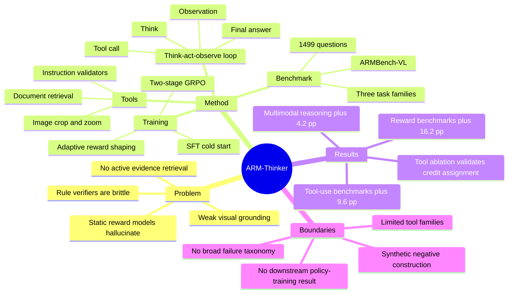

## Summary

ARM-Thinker 把 multimodal generative reward model 从一次性打分器改成带工具调用的 agentic judge：先 think，再调用 image crop / document retrieval / instruction checking tools 获取证据，最后给出可解释 judgment。论文同时提出 ARMBench-VL，用 Fine-grained Perception、Multimodal Long Document QA、Multimodal Instruction Following 三类任务评估 reward model 是否真的会用工具做 evidence-grounded verification。

## Problem & Motivation

作者要解决的问题是：现有 multimodal reward models 在复杂视觉/文档/指令任务上常常只能静态评分，缺乏主动检索、局部放大和约束验证能力，因此容易给 fluent but unsupported responses 高分。规则 verifier 又依赖字符串匹配或固定答案，难处理 paraphrase、partial credit 和主观判断。论文的核心动机是让 reward model 的 judgment 条件化在可访问证据上，而不是只依赖表面 fluency 或模型内隐记忆。这个问题对 VLM alignment 和 agentic evaluation 都重要，因为未来的 multimodal task 往往需要跨页检索、细粒度视觉 grounding 和多步验证。

## Method

**Agent loop.** ARM-Thinker 基于 Qwen2.5-VL-7B，采用 ReAct-style think-act-observe loop。每条 trajectory 包含 `<think>` reasoning、`<tool_call>` action、`<tool_response>` observation，直到模型输出 `<answer>`；每次 observation 会进入下一步上下文，使 reward judgment 变成可迭代的证据收集过程。

**Tool families.** 论文集成三类工具：1) 19 个 Instruction-Following Check Tools，用于检查 word count、sentence range、keyword usage 等文本约束；2) Image Crop and Zoom-in Tools，用于高分辨率图像的局部细节检查；3) Document Retrieval Tools，包括 `doc_page_retrieval_by_query` 和 `doc_page_retrieval_by_index`，用于长文档页面检索。模型还维护 indexed memory map，把候选 responses 和工具生成的图像 crop 映射成可引用对象。

**Data construction.** 训练先从 preference pairs 开始：LLaVA-Critic 提供 general multimodal QA reward supervision，DeepEyes、MM-IFEngine、MP-DocVQA 分别补充 image zoom-in、instruction checking、document retrieval 的 agentic task data。对于只有 `(question, image, ground-truth response)` 的数据，作者用 GPT-4o-mini 生成语义相关但错误的 negative responses，再过滤过于相似的 response pairs。

**Training pipeline.** SFT / cold start 阶段先用 difficulty filtration 去掉 base model 五次采样都能 100% 正确的 trivial samples，再用更强 LVLM 生成带 CoT 和 tool invocation 的 trajectories，并按 format、accuracy、behavior 过滤。SFT 数据规模约为 LLaVA-Critic 40k、DeepEyes 4k、MM-IFEngine 1k、MP-DocVQA 1k。随后做 two-stage GRPO：Stage 1 用 `Rtool = Rf + Rtry Itool_calls>0` 鼓励有效格式和工具探索；Stage 2 用分层 `Racc` 同时奖励最终答案正确性、成功工具调用和格式一致性，目标是避免 tool under-use 和 over-use。

**ARMBench-VL.** benchmark 共 1,499 questions，来自 V*Bench/VisualProbe、MMlongbench-doc、MM-IFEval 的筛选和重构，覆盖 550 个 Fine-grained Perception、460 个 Multimodal Long Document QA、489 个 Multimodal Instruction Following samples。它区别于 RewardBench-2、VL-RewardBench 等静态 reward benchmark 的关键点是给模型提供 toolkit，并检查模型是否能通过工具形成 verifiable chain of evidence。

## Key Results

| Benchmark / Setting | ARM-Thinker-7B 结果 | 关键对比 |
|---|---:|---|
| VL-RewardBench | 67.8% | 相比 Qwen2.5-VL-7B 的 50.1%，+17.7 pp |
| RewardBench-2 | 59.6% | 相比 Qwen2.5-VL-7B 的 47.1%，+12.5 pp |
| ARMBench-VL Avg. | 64.6% | 相比 Qwen2.5-VL-7B 的 46.1%，+18.5 pp；FG 67.6 / IF 73.8 / Doc 52.4 |
| Reward benchmark Avg. | 64.0% | 相比 Qwen2.5-VL-7B 的 47.8%，+16.2 pp；略低于 GPT-4o 的 64.9% overall，但 ARMBench-VL 高于 GPT-4o 的 63.3% |
| V* Bench | 86.4% | 相比 Qwen2.5-VL-7B 的 75.4%，+11.0 pp |
| HRBench-4K / HRBench-8K | 80.1% / 73.7% | 相比 Qwen2.5-VL-7B 的 69.1% / 64.6%，+11.0 / +9.1 pp |
| MME-RealWorld | 65.8% | 相比 Qwen2.5-VL-7B 的 58.5%，+7.3 pp |
| Tool-use Avg. | 76.5% | 相比 Qwen2.5-VL-7B 的 66.9%，+9.6 pp；高于 Qwen3-VL-8B 的 73.1% 和 Mini-o3 的 76.1% |
| Multimodal reasoning Avg. | 49.0% | MMMU / MathVista / MathVision / MathVerse / WeMath / LogicVista 平均比 Qwen2.5-VL-7B 高 +4.2 pp |

**Ablation.** 直接给 Qwen2.5-VL-7B 开工具会退化：ARMBench-VL 从 46.1 降到 44.3，V* 从 75.4 降到 50.3，HRBench-4K/8K 从 69.1/64.6 降到 60.1/51.8。ARM-Thinker 不开工具时已有 59.2 ARMBench-VL、82.2 V*、76.6 HRBench-4K、70.5 HRBench-8K；开工具后分别提升到 64.6、86.4、80.1、73.7，说明提升不是“工具存在”本身，而是模型学会了何时和如何使用工具。Reward design ablation 显示 Only Acc & Fmt Reward 会 tool under-use（tool-call rate 约 0.7，最终 77.5%），Fixed Tool Reward 会 over-use（约 1.15，最终 78.5%）；ARM-Thinker Reward 的 tool-call curve 稳定在约 1.12，并取得最高 accuracy。

## Strengths & Weaknesses

**已知 Strengths.** 论文的 formulation 有价值：它不是再做一个静态 reward model，而是把 reward judgment 明确建模成 active verification。ARMBench-VL 也补上了 reward benchmark 的一个缺口，即测试 judge 能否检索页面、放大图像局部、调用 instruction validators，而不只是看最终 preference choice。实验覆盖 reward modeling、tool-use visual reasoning、general multimodal reasoning 三类 benchmark，且 ablation 清楚显示 naive tool access 会伤害 baseline，必须通过训练把 tool-use policy 学出来。

**已知 Weaknesses / limitations.** 当前工具集仍是有限 API family：image crop/zoom、document page retrieval、instruction checking，作者在 conclusion 和 appendix 中也把 broader tools、video/spatio-temporal domains、full-scale computer interfaces 作为未来方向。ARMBench-VL 的构造依赖已有数据集重构和大模型生成 hard negatives，例如 Qwen3-VL-235B-A22B-Thinking 扩写/生成候选回答、GPT-4o-mini 生成 flawed responses；论文有过滤步骤，但 benchmark 的分布仍可能带有 synthetic construction bias。论文没有给出系统性的 ARM-Thinker failure taxonomy，也没有报告工具调用带来的 latency/cost 或真实 human preference alignment study。

**已知 failure modes from ablation.** Qwen2.5-VL-7B 在没有训练信号时不能自然从工具受益，甚至工具开启后明显退化；reward function 如果只看 accuracy 会 under-use tools，如果给固定工具 bonus 会 over-use tools。这些 failure modes 支持作者的核心论点：agentic reward model 需要对工具调用本身做 credit assignment。

**推测.** 这条路线可能对 GUI-agent / computer-use evaluation 有启发：一个 judge 如果能主动检索 screen state、检查操作约束、验证候选 action 的证据，比静态 preference model 更适合评估多步 agent trajectory。但这只是从工具化 reward modeling 到 GUI evaluation 的类比，论文当前并没有在真实 GUI control benchmark 上验证。

**不知道.** 不知道 ARM-Thinker 在更开放的工具池中是否仍能稳定选择工具，也不知道它对 adversarial tool outputs、retrieval noise、工具失败或长 horizon tool-chain 的鲁棒性。也不知道 ARMBench-VL 上的 gains 是否能直接转化为下游 RLHF/RLAIF 训练效果，因为论文主要报告 judge accuracy，而不是用该 reward model 训练另一个 policy 后的最终任务收益。

## Mind Map

## Notes

- 这篇的关键不是“VLM 会用 crop 工具”，而是把 reward model 的 score 变成可审计的 evidence-gathering process；对 agent benchmark 的意义在于 judge 本身也需要 agentic capability。
- 和 GUI-agent 的连接要谨慎：appendix 提到 future direction 可以从 zoom/crop 等 specific API tasks 走向 full-scale computer interfaces，但当前实验没有覆盖 OS/browser GUI control。
- 后续值得追的问题：ARMBench-VL 的 tool-use traces 能否作为 judge-side process supervision？如果 reward model 评价 agent trajectory，应该奖励最终答案、证据链完整性，还是工具调用的 causal usefulness？
