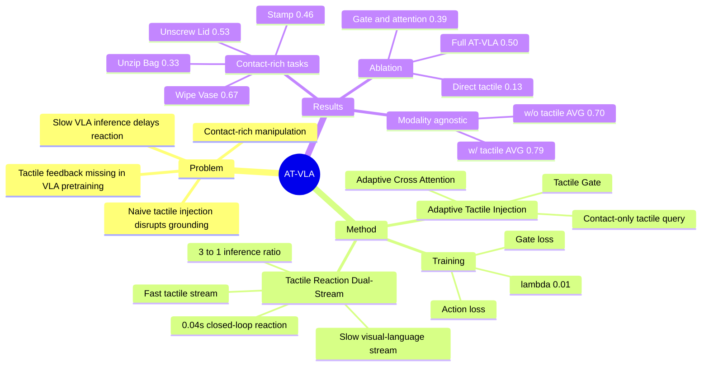

## Summary
AT-VLA 针对 contact-rich manipulation 中 pretrained VLA 难以及时利用 tactile feedback 的问题，提出 Adaptive Tactile Injection 与 Tactile Reaction Dual-Stream，在保持 GO-1 视觉语言能力的同时只在接触阶段引入触觉条件。真实机器人实验中，AT-VLA 在 Unzip Bag、Stamp、Wipe Vase、Unscrew Lid 等任务上相对 GO-1 / π0.5 提升整体成功率，并报告触觉闭环反应时间为 0.04s。主要 caveat 是实验集中在单一机器人平台和少量接触任务，且 VTLA/RDP baseline 的接触阶段评估与完整任务评估并不完全等价。

## Problem & Motivation
VLA models 已经能把语言、视觉感知和动作生成统一到机器人策略中，但在需要精确物理交互的 contact-rich manipulation 上仍然薄弱：视觉能定位物体，但看不到接触力、滑动、卡住等交互状态。已有方法通常在 downstream finetuning 阶段直接加入 tactile signals，但这些模态在 pretraining 中很少出现，可能破坏 pretrained VLA 的视觉 grounding / object localization；同时 VLA 推理较慢，难以对高频 tactile feedback 做实时闭环调整。

作者的 problem formulation 是：如何在不显著破坏 pretrained VLA 能力的前提下，让模型在接触阶段快速、准确地响应 tactile feedback。这个问题对 embodied manipulation 重要，因为很多失败不是“看不见目标”，而是进入接触后无法根据物理反馈调整轨迹，例如 zipper 卡住、stamp 继续向下压到桌面、gripper 在拧盖时打滑。

## Method
AT-VLA 基于 pretrained GO-1 构建。GO-1 使用 Intern-VL-2B 作为 vision-language model，DiT 作为 action expert；AT-VLA 继承其 action generation pipeline，输入包括 head camera、左右 wrist camera、language instruction、robot proprioceptive state 和 tactile feedback，输出双臂 14-DoF end-effector pose 的 action chunk。触觉输入使用 Xense Robotics tactile sensors 的 resultant force，包含 3D normal force 和 3D tangential force。

**Adaptive Tactile Injection** 的核心是只在接触阶段注入 tactile token。模型先用轻量 MLP tactile encoder 得到 tactile token，再用 Tactile Gating Network 判断当前 tactile signal 是否表示 contact；训练时手工标注 non-contact/contact frame，分别为 0/1，用 binary cross-entropy gate loss 监督，score 超过 0.5 时 gate 激活。

**Adaptive Cross Attention** 处理 gate 开关下的 action expert 条件输入。gate inactive 时保持 vanilla VLA 的 cross-attention 形式：image/text tokens 作为 key/value，state token 作为 query；gate active 时把 query 切换为 tactile token，使动作生成条件化于接触反馈。这个设计的动机来自作者的 intuition experiment：直接把 tactile tokens 加入 action expert 会让 attention 从目标物体偏移到周围区域，导致 grasp localization 变差。

**Tactile Reaction Dual-Stream** 把感知和控制频率解耦。slow stream 用 VLM 低频处理视觉和语言，负责 task understanding / visual perception；fast stream 高频处理 tactile feedback，负责接触阶段的快速动作修正。训练时 fast:slow 频率比随机设为 `h:1`，其中 `1 < h < H`；推理时 gate inactive 则与 vanilla VLA 同频，gate active 后使用 3:1 fast:slow ratio，并在同一个 action chunk horizon 内用最新 tactile feedback 结合最近一次 slow stream 输出生成动作。总损失为 `L = La + 0.01 * Lg`。

## Key Results
**Real-world contact-rich task evaluation（Table 1，30-50 demonstrations/task，15 trials/task）**：AT-VLA 在完整任务 overall success 上优于 GO-1 和 π0.5。

| Task | GO-1 Overall | π0.5 Overall | AT-VLA Overall |
|:-----|:-------------|:-------------|:---------------|
| Unzip Bag | 0.20 | 0.00 | 0.33 |
| Stamp | 0.13 | 0.20 | 0.46 |
| Wipe Vase | 0.07 | 0.33 | 0.67 |
| Unscrew Lid | 0.27 | 0.46 | 0.53 |

与 tactile-based policies 的比较需要按论文设定谨慎解读：VTLA 和 RDP 不在完整序列上训练/测试，而是在测试时由人工把机器人放到理想接触初始位姿，以隔离其 tactile reaction 能力。论文报告 Unscrew Lid 的 rotate subtask 上 VTLA/RDP 分别为 0.80/0.87，高于 AT-VLA 的 0.53；作者解释是 baseline 被手动设到稳定抓握位姿，而 AT-VLA 需要自己抓 lid，偶尔会因 grasp 不够牢导致 gripper slip。

**Modality-agnostic evaluation（Table 2）**：在 Pick Place / Open Drawer / Stamp 三个任务上，AT-VLA w/o tactile input 的 AVG 为 0.70，与 π0.5 的 0.70 相同，高于 GO-1 的 0.68；AT-VLA w/ tactile input 的 AVG 为 0.79。非接触任务上 AT-VLA w/o tactile 保持 Pick Place 1.0、Open Drawer 0.93，说明训练时加入 tactile 并没有明显损伤这些任务的执行。

**Ablation study（Table 3，Unzip Bag / Stamp / Wipe Vase / Unscrew Lid）**：vanilla VLA Ex0 的 AVG 为 0.22；direct tactile incorporation Ex1 降到 0.13；加入 Tactile Gate + Adaptive Cross Attention 的 Ex2 升到 0.39；完整 AT-VLA Ex3 达到 0.50。不同 tactile format 下，直接注入 marker 2D / visual-tactile image 的 Ex4/Ex6 AVG 仅为 0.05/0.02，而使用作者框架后 Ex5/Ex7 提升到 0.32/0.40；force 6D 的完整模型最好，为 0.50。

## Strengths & Weaknesses
**已知**：论文抓住了 tactile-VLA integration 的关键矛盾：触觉对 contact-rich control 有用，但 naive modality injection 会干扰 pretrained token sequence / attention behavior。Adaptive Tactile Injection 的设计相对简洁，gate inactive 时尽量保持 vanilla VLA 的输入与结构，gate active 时才让 tactile token 进入 action expert 的 query。

**已知**：ablation 支持了两个主要 claim。Ex1 比 Ex0 低 0.09 AVG，说明 direct tactile incorporation 可能损伤原有能力；Ex2 到 Ex3 从 0.39 到 0.50，说明异步 dual-stream 对快速触觉反应有额外贡献。作者还报告 closed-loop reaction within 0.04s，这是论文强调 tactile fast stream 的核心数字。

**已知的局限**：真实实验规模较小，每个任务只有 30-50 demonstrations 和 15 trials；评估平台是 AgiBot Genie1，正文没有证明方法跨机器人硬件或跨 VLA backbone 的泛化。Tactile gate 需要人工 contact/non-contact frame 标注；论文称框架 modular，但实际实例主要基于 GO-1。VTLA/RDP 的比较不是完整端到端任务对齐，因为它们在测试时由人工放置到理想接触初始位姿。

**已知的 failure case**：论文明确提到 baseline VLA 容易在 zipper、stamp、vase contact-rich stage 卡住；AT-VLA 在 Unscrew Lid 中也会因为自己抓 lid 不够稳定而发生 gripper slip。这个失败说明 tactile reaction 不能完全替代稳定的 pre-contact grasping / force closure。

**推测**：对 GUI-agent 的直接启发不在 tactile modality 本身，而在“慢速语义推理 + 快速反馈反应”的系统结构：GUI/web agent 也可能需要把低频 screen understanding / task planning 与高频 UI feedback / error recovery 分离。但论文没有在 GUI 或 software environment 上验证，不能把机器人结果外推为 GUI-agent 结论。

**不知道**：正文没有给出 DOI、GitHub/code repository，也没有报告跨物体类别、跨 sensor failure 模式、长时程连续运行或 open-world language instruction 下的结果。project page 被提到，但正文结果仍以论文内四个 contact-rich task 和两个 non-contact task 为主。

## Mind Map

## Notes
- 这篇论文最有价值的不是“加 tactile”本身，而是指出 direct incorporation 会破坏 pretrained VLA 的视觉 grounding，并用 attention map + ablation 给出证据。
- 触觉输入选择 force 6D，而不是 visual-tactile image 或 marker 2D，在作者实验中效果最好；作者推测高维 tactile token 可能更强地扰动 pretrained representation space。
- 和 [[2410-Pi0|π0]] / GO-1 类 VLA 的关系：AT-VLA 更像是给 pretrained VLA 增加 contact-stage feedback pathway，而不是重新训练一个从零开始依赖触觉的 policy。
