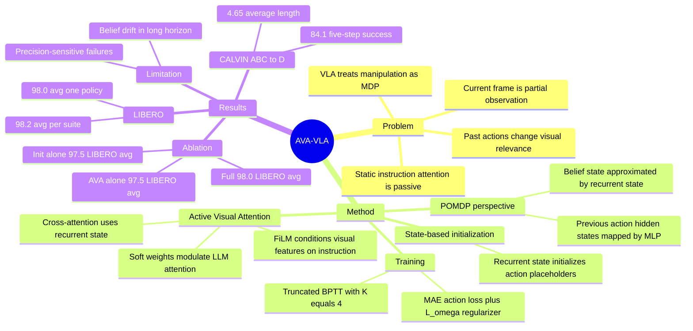

## Summary

AVA-VLA 将 VLA 的逐帧 Markov policy 重新表述为 POMDP 下的历史条件策略，用上一时刻 action hidden state 形成 recurrent state，并用 Active Visual Attention 动态调制当前 visual tokens。它在 LIBERO 达到 98.0% one-policy average / 98.2% one-policy-per-suite average，在 CALVIN ABC→D 达到 4.65 average length，并在 Mobile ALOHA 真机任务上报告高于 UniVLA 和 OpenVLA-OFT 的平均表现。

## Problem & Motivation

现有 VLA 模型通常只根据当前 observation 预测 action，把机器人操作隐式当作 Markov Decision Process。论文指出真实机器人控制更接近 Partially Observable Markov Decision Process：当前视觉帧只是环境状态的部分观测，过去动作会改变当前视觉输入，遮挡、内部状态和接触关系也不能仅由单帧恢复。

这个 mismatch 会直接影响视觉处理。若每一步都只用静态 instruction 重新评估当前 image tokens，模型很难抑制时序冗余信息，也难以持续关注由过去动作变得关键的物体或接触区域。作者的核心问题不是单纯增加视觉 token 效率，而是让 VLA 根据历史执行状态主动调节当前视觉注意。

## Method

### POMDP-inspired recurrent state

AVA-VLA 将 vanilla VLA 的 `A_t ~ P_theta(A_t | x_t)` 改写为历史条件策略 `A_t ~ P_theta(A_t | x_t, b_{t-1})`。由于理论 belief state `b_{t-1}` 不可直接计算，作者用 learned recurrent state `r_{t-1}` 作为近似。

具体实现基于 OpenVLA-OFT 的 parallel decoding 架构。模型从上一时刻最后一层、action-related hidden states 经过 MLP 得到 `r_{t-1}`，并用它替代原本为空的 action placeholder embedding，因此当前 step 的 action chunk 预测同时接收当前 observation、language instruction 和历史状态。

### Active Visual Attention

AVA module 先用 modality-specific MLP 编码 visual features、instruction features 和 recurrent state。instruction 通过 FiLM 调制视觉特征，随后以视觉 token 为 query、recurrent state 为 key/value 做 cross-attention，再经过 self-attention、FFN、linear layer 和 Softmax 预测每个 visual token 的 enhance / weaken logits。

得到的 soft weights `omega_t` 会被写入 backbone LLM 各层 attention matrix 中，对 visual token 相关 attention 做动态调制。直观上，recurrent state 决定当前画面中哪些视觉区域应被增强，哪些应被抑制；这使视觉处理从被动单帧解析变成 history-aware active perception。

### Training and implementation

训练使用 truncated backpropagation through time，主实验中 observation sequence length 设为 `K=4`，并在第一步用 zero recurrent state 初始化。loss 由 action chunk 的 MAE 和 soft attention mean 的 L2 regularizer `L_omega` 组成，后者用于防止 attention weights 过度分散。

主模型基于 OpenVLA-OFT：shared SigLIP-DINOv2 vision encoder、Llama-2 7B language model、MLP projector、proprio projector 和 continuous action head。AVA 相关模块少于 50M 参数，占全模型小于 1%；LIBERO 上使用 LoRA rank 32 fine-tune LLM backbone、vision encoder、action head 和 proprio projector，同时 fully optimize AVA mechanism。

## Key Results

### LIBERO Benchmark

| Setting | Method | Spatial SR | Object SR | Goal SR | Long SR | Average SR |
|---|---:|---:|---:|---:|---:|---:|
| One policy for all 4 suites | OpenVLA-OFT | 97.7 | 98.0 | 96.1 | 95.3 | 96.8 |
| One policy for all 4 suites | AVA-VLA | 97.4 | 99.4 | 97.4 | 97.6 | 98.0 |
| One policy per suite | RIPT-VLA | 99.0 | 98.6 | 98.6 | 93.8 | 97.5 |
| One policy per suite | OpenVLA-OFT | 97.6 | 98.4 | 97.9 | 94.5 | 97.1 |
| One policy per suite | AVA-VLA | 99.2 | 99.6 | 97.9 | 96.2 | 98.2 |

AVA-VLA 的主要增益集中在长程任务：one-policy setting 下 LIBERO-Long 从 OpenVLA-OFT 的 95.3 提升到 97.6；one-policy-per-suite setting 下从 94.5 提升到 96.2。

### CALVIN ABC→D Benchmark

| Method | 1 task | 2 tasks | 3 tasks | 4 tasks | 5 tasks | Avg. len |
|---|---:|---:|---:|---:|---:|---:|
| OpenVLA-OFT | 96.9 | 92.0 | 85.7 | 80.4 | 72.9 | 4.28 |
| FLOWER | 99.4 | 95.8 | 90.7 | 84.9 | 77.8 | 4.53 |
| VLA-Adapter | 99.1 | 94.6 | 88.8 | 82.8 | 76.5 | 4.42 |
| AVA-VLA | 99.6 | 97.6 | 94.1 | 89.9 | 84.1 | 4.65 |

在 CALVIN ABC→D zero-shot generalization setting 中，AVA-VLA 在 5-step 连续完成率上达到 84.1%，高于 FLOWER 的 77.8 和 OpenVLA-OFT 的 72.9；average length 也从 4.28 提升到 4.65。

### Ablations and robustness

| Ablation / Benchmark | Baseline | Variant | Result |
|---|---:|---:|---|
| LIBERO, model backbone | OpenVLA-7B + OpenVLA-OFT 94.5 Long SR | AVA-VLA 96.2 | +1.7 Long SR |
| LIBERO, model backbone | LLaMA2-7B + OpenVLA-OFT 90.0 Long SR | AVA-VLA 92.6 | +2.6 Long SR |
| LIBERO, model backbone | Qwen2.5-0.5B + OpenVLA-OFT 89.4 Long SR | AVA-VLA 90.8 | +1.4 Long SR |
| LIBERO, module ablation | OpenVLA-OFT 96.8 avg | state-based initialization 97.5 avg | recurrent init alone helps |
| LIBERO, module ablation | OpenVLA-OFT 96.8 avg | AVA module 97.5 avg | AVA alone helps |
| LIBERO, module ablation | OpenVLA-OFT 96.8 avg | full AVA-VLA 98.0 avg | components are complementary |
| LIBERO, matched training | OpenVLA-OFT 96.8 avg | AVA-VLA 98.3 avg | gain is not explained only by more training |
| LIBERO, loss ablation | AVA-VLA 98.0 avg | w/o `L_omega` 97.5 avg | regularizer improves selectivity |
| CALVIN, module ablation | OpenVLA-OFT 4.28 avg len | +init 4.63 / +ava 4.61 / full 4.65 | both modules transfer beyond LIBERO |
| LIBERO+ robustness | OpenVLA-OFT 67.9 avg, one policy | AVA-VLA 70.1 avg | best total over seven perturbation types in that setting |
| LIBERO+ robustness | OpenVLA-OFT 69.6 avg, one policy per suite | AVA-VLA 74.7 avg | best total over seven perturbation types in that setting |

Visual token pruning further supports that AVA weights encode task relevance. On LIBERO one-policy setting, pruning 50%, 60%, or 70% of visual tokens keeps average SR at 97.3 versus 98.0 without pruning, still above OpenVLA-OFT 96.8; pruning 90% drops average SR to 93.9, with LIBERO-Long falling from 97.6 to 89.2.

### Real-world Mobile ALOHA

论文在 stationary Mobile ALOHA dual-arm robot 上评估 Pick and Place、Sequenced Instruction Understanding、Flexible Object Folding 和 Dexterous Action。数据规模为 30 到 450 demonstrations，Pick and Place 用 30 trials，其他任务各 24 trials；作者报告 AVA-VLA 的平均表现高于 UniVLA 和 OpenVLA-OFT，但精确 task-level 数值只在 Figure 3 中给出，正文表格没有提供可直接引用的数字。

## Strengths & Weaknesses

**已知 Strengths.** 方法动机清楚：从 POMDP 视角解释 VLA 单帧输入的局限，并把历史状态用于两个具体位置，即 action placeholder initialization 和 visual attention modulation。相比只做 token pruning 的工作，AVA-VLA 的目标是提升 sequential decision-making，而不是主要优化推理成本。

**已知 Strengths.** 实验覆盖面较好：LIBERO、CALVIN、LIBERO+ perturbations 和 Mobile ALOHA 真机任务都被纳入；消融也拆开了 state-based initialization、AVA module、backbone、matched training、`L_omega` regularizer 和 visual token pruning。Table 7 的 matched training comparison 对“是不是只是多训了”的替代解释有直接控制。

**已知 Weaknesses / boundary.** 主模型建立在 OpenVLA-OFT checkpoint 之上，结论最强地支持“给 OpenVLA-OFT 类 parallel-decoding VLA 加 recurrent state + AVA 有效”，还不能直接证明任意 VLA 架构都能同等收益。LIBERO 和 CALVIN 的 baseline 数字来自原论文或已发表工作，虽是常见做法，但仍不如统一代码、统一 checkpoint、统一评测脚本的完全 controlled comparison。

**已知 Weaknesses / boundary.** 真机结果证明了 sim-to-real 可行性，但正文没有用表格列出每个 real-world task 的精确 success rate；因此真机部分更适合作为有效性证据，而不是可细粒度横向比较的 benchmark。论文也没有报告训练 / 推理 latency 的实测开销，只说明新增参数少于 50M、小于 1%。

**已知 failure cases.** 作者明确指出 POMDP-style recurrent modeling 会面临 belief drift：小的 perception 或 state-estimation error 会在长 horizon 中积累，导致精细 grasping 或 placement 失败。Figure 13 的两个失败例子分别是 gripper 因 drifted spatial belief 未对齐 chocolate pudding，以及 slight positional deviation 导致无法稳定抓住 moka pot handle。

**推测.** 这篇工作的 insight 对 GUI agent / web agent 也有可迁移的问题形式：当前 screenshot 往往也是 partial observation，历史 action 可能应参与调制视觉区域，而不只是作为文本日志拼接到 prompt 中。但论文没有做 GUI 或 web 实验，这只是从 POMDP formulation 和 AVA mechanism 出发的研究联想。

**不知道.** 还不知道 AVA 的收益在更长 horizon、更高频 real-world control、更强 VLA backbone 或非 OpenVLA-OFT action head 上是否保持。也不知道 recurrent state 的 drift 是否能通过显式 error correction、longer-horizon training 或外部 memory 得到稳定缓解；论文只把这些列为未来方向。

## Mind Map

## Notes

- 论文提供 project page: `https://liauto-dsr.github.io/AVA-VLA-Page`；正文没有给出 GitHub code link，因此 frontmatter 的 `code` 留空。
- 最有价值的概念点是把 visual attention 的“主动性”绑定到执行历史，而不是只让 history 作为额外 token 被动进入模型。这个设计比“多塞几帧图像”更具体，也更容易通过 token weights 和 pruning 实验检查。
- `L_omega` 的作用值得注意：去掉后 LIBERO average SR 从 98.0 降到 97.5，作者还可视化到 attention 更分散、背景响应增加。这说明 AVA 的收益不只是 recurrent state 本身，还依赖对 visual-token importance 分布的结构约束。
- 需要警惕的结论边界：AVA-VLA 的 Long-suite 和 CALVIN 长链结果很强，但 failure cases 也正发生在 belief drift 和精细接触位置上。它改善了历史建模，不等于解决了长程状态估计。
