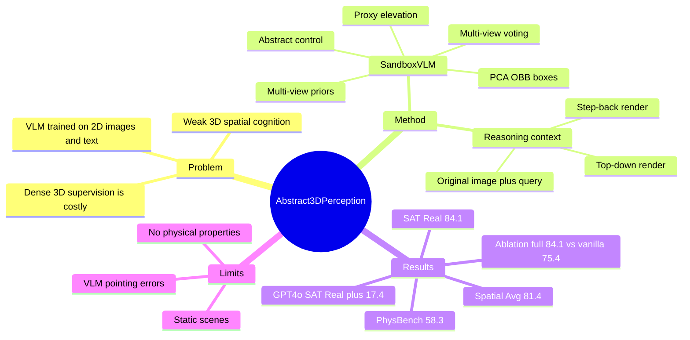

## Summary
SandboxVLM 解决通用 VLM 在 3D spatial reasoning 和 physical understanding 中缺少显式 3D awareness 的问题。它不训练新模型，而是在 test time 用 video diffusion multi-view priors、proxy elevation、multi-view voting/clustering 构造抽象 3D bounding boxes，再把 step-back / top-down 渲染喂回 VLM。实验显示这种粗粒度 symbolic 3D abstraction 在 SAT-Real、PhysBench 等 benchmark 上能稳定增强 zero-shot spatial intelligence。

## Problem & Motivation
已知：作者认为当前 VLM 主要由 2D image 和 1D text 训练，容易把世界理解为投影而不是 volumetric physical space；因此在 viewpoint change、relative position、object interaction outcome 等任务上不稳定。已有 3D-LLM / Cube-LLM / ShapeLLM 一类方法把 point cloud 或 multi-view features 注入 2D VLM，但通常依赖 dense 3D supervision、curated datasets 或 domain-specific architecture，且难以直接用于 GPT-5 这类闭源 VLM。

论文的核心动机是 human abstract perception：人类很多空间判断并不需要 metric-precise reconstruction，而只需要 relative position、direction、interaction 等粗粒度结构。由此问题被重新表述为：能否给现有 VLM 提供 minimal symbolic 3D abstraction，而不是重新训练一个 dense 3D model？

## Method
SandboxVLM 是一个 training-free、query-conditioned 的 test-time pipeline。输入是一个或多个 RGB images 和自然语言 query，输出仍由原 VLM 回答；中间只构造一个 compact 3D-aware context。

第一步是 **Multi-View Priors with Abstract Control**。VLM 先根据 query 和输入图像，从 `{left, fwd-left, fwd, fwd-right, right}` 中选择与任务最相关的 abstract camera motion；video diffusion prior 随后沿该方向生成短 multi-view sequence。补充材料中实现使用 SEVA 生成每条 trajectory 的 4 个额外视角，abstract control 会被映射到转向 90 degrees、前进 0.5m 后转向 36 degrees、或前进 1.0m 等轨迹。

第二步是 **Proxy Elevation**。VLM 找出与 query 相关的 object categories 和 image center points，2D segmentation model 生成 object masks；作者对 mask 做 erosion，避免边缘处 mask/depth noise，然后用 Farthest Point Sampling 为每个 object/view 选取 30 个 proxy pixels。VGGT 估计 depth maps、camera intrinsics 和 extrinsics，把这些 2D proxy points back-project 到 3D。

第三步是 **Multi-View Voting and Clustering**。跨视角 lifted 3D proxy points 通过 "Agree to" consistency check 过滤 unreliable points：一个 3D point 需要被至少 N 个 view 在距离阈值 delta 内支持。保留点再用 DBSCAN 分离实例，并用 PCA-based oriented bounding box 拟合得到 abstract 3D boxes。

第四步是 **3D-Aware Reasoning**。系统从 3D boxes 渲染两类 informative views：step-back view 用于整体空间布局，top-down view 用于水平布局；这些渲染图、原图和 query 一起喂给 VLM，要求模型先在 `<thinking>` 中推理，再在 `<answer>` 中输出最终答案。补充材料的主要实现以 GPT-5-mini 为 backbone，也报告 GPT-4o 和 GPT-5 variants。

## Key Results
**总体 benchmark**：Table 1 显示 SandboxVLM 在 Spatial-Avg 上达到 81.4，高于 GPT-5-mini 78.5、Gemini-2.5-Pro 80.3、RoboBrain2.0-32B 81.0、MindJourney 79.1；在 SAT-Real 上为 84.1，高于 MindJourney 78.7 和 RoboBrain2.0-32B 80.3；在 PhysBench 上为 58.3，高于 MindJourney 54.9 和 GPT-4o 50.3。边界也很清楚：BLINK-Spatial / BLINK-Depth / EmbSpatial 上 SandboxVLM 分别为 83.7 / 82.3 / 75.4，并没有超过所有 training-based baselines，例如 RoboBrain2.0-32B 在 BLINK-Spatial 为 87.4、EmbSpatial 为 76.6。

**SAT-Real / SAT-Synth**：在 GPT-5-mini backbone 上，SandboxVLM 在 SAT-Real Average 达到 84.1，高于 baseline 75.4 和 MindJourney 78.7；分项为 EgoM 100.0、ObjectM 82.6、GoalAim 92.9、ActCons 79.4、Perspect 70.0。GPT-4o backbone 上，SandboxVLM 在 SAT-Real 从 baseline 60.3 提到 77.7，提升 17.4，并比 MindJourney 69.4 高 8.3；GPT-5 backbone 上，从 baseline 80.1 提到 84.3，提升 4.2。

**Ablation on SAT-Real with GPT-5-mini**：Vanilla VLM 为 75.4，Scene-Graph Text Prompt 为 77.0，Multi-View Images Only 为 78.7，Rendered Point Clouds 降到 73.7，3D Coordinate Text Prompt 为 80.8，Rendered Proxy Points 为 77.0，Single Image Sandbox 为 77.6，Full SandboxVLM 为 84.1。关键结论是：multi-view priors 比 vanilla 提升 3.3；Full SandboxVLM 比 Single Image Sandbox 高 6.5；3D coordinate text 比 scene graph 高 3.8；但 raw rendered point clouds 低于 vanilla，说明 noisy/sparse 3D input 可能伤害 VLM。

**Error / failure evidence**：补充材料把误差源分为 video generation failure、VLM drifted pointing、SAM segmentation failure、depth estimation artifacts、以及被错误对象尺寸影响的 Sandbox。作者指出 most failures stem from inaccurate VLM pointing，且 video generation 与 depth/camera estimation 主要造成 dispersed 3D point noise；Multi-View Voting 的作用就是压制这些噪声。

## Strengths & Weaknesses
**已知强项**：这篇论文的 taste 比较好：它没有追求 dense 3D reconstruction 或新 3D VLM training，而是问 VLM 到底需要什么粒度的 3D context。Ablation 支持 "abstract boxes" 这个设计：Full SandboxVLM 84.1 明显高于 Rendered Point Clouds 73.7、Rendered Proxy Points 77.0、Scene-Graph Text Prompt 77.0 和 Multi-View Images Only 78.7。

**已知强项**：方法可以 plug-and-play 到闭源 VLM，因为它只在 test time 构造额外视觉 context，不要求改 backbone 或做 SFT。这对快速迭代的 proprietary VLM 很有现实意义，也比依赖 3D instruction tuning 的方法更容易随 backbone scaling 获益；Table 2 中 GPT-4o、GPT-5-mini、GPT-5 三个 backbone 均有 SAT-Real 提升。

**已知弱项**：SandboxVLM 是 modular pipeline，误差会从 video diffusion、VLM pointing、segmentation、depth/camera estimation 传递到最终 boxes。补充材料明确说 most failures 来自 inaccurate VLM pointing；这意味着如果 query-relevant object selection 错了，后续 3D abstraction 会围绕错误对象变得很自信。

**已知 limitations**：作者在 conclusion 中列出两点。第一，当前 framework 为每张图构造 static 3D Sandbox，未显式建模不同 views 之间的 temporal correlation，因此对 moving objects 或 changing layouts 的 dynamic scenes 适应性有限。第二，3D Sandbox 主要捕获 spatial information，不显式建模 mass、friction、material 等 physical properties，因此 physical reasoning 的深度受限。

**已知边界**：论文在 BLINK 和 EmbSpatialBench 上的相对优势没有 SAT-Real / PhysBench 明显；作者解释这些 dataset 的 question styles 更简单，task-specific training 有优势。这个结果提醒我不能把 SandboxVLM 概括成所有 spatial benchmark 的绝对最强，更准确的说法是：它在真实场景 spatial reasoning 与 physical understanding 上展示了强 zero-shot test-time gains。

**推测**：SandboxVLM 的关键价值可能不在 "3D boxes" 本身，而在选择了一种 VLM 容易消费的 3D representation：视觉上比 coordinates 更直观，结构上比 raw point cloud 更干净，信息量又比 scene graph 更接近 geometry。但这只是由 ablation 间接支持，论文没有做 representation probing 来证明 VLM 实际使用了哪些 geometric cues。

**不知道**：论文没有给 code URL，也没有报告 runtime、API cost、对 SEVA/VGGT/SAM2 替换的敏感性、camera pose 噪声鲁棒性或更大规模 real robot closed-loop evaluation。也不知道如果把 top-down / step-back render 数量、viewpoint 选择策略、或 object filtering prompt 改掉，性能会如何变化。

## Mind Map

## Notes
这篇对 GUI-agent / embodied agent 的启发是：很多空间推理失败可能不是因为 backbone 没有语言推理能力，而是因为 task-relevant spatial state 没有以模型可消费的形式呈现。对于 GUI agent，类似的 "abstract perception" 可能不是 3D boxes，而是 screen elements、layout groups、scroll/viewport state、interaction affordances 的结构化可视上下文；关键不是越密越好，而是保留 action-relevant relations。

值得继续追问的问题：第一，abstract representation 应该由 VLM 自己选择 task-relevant objects，还是由更可靠的 perception module 给上界？第二，SandboxVLM 的 gains 来自 multi-view imagination、3D lifting、box abstraction、还是 top-down/step-back 的 view rendering interface？Table 3 给了初步答案，但还缺少 oracle object selection、oracle depth/camera、oracle boxes 的上界实验。第三，若用于 embodied control，static Sandbox 需要如何扩展到 temporal memory 和 action-conditioned update，而不是每帧独立重建？
