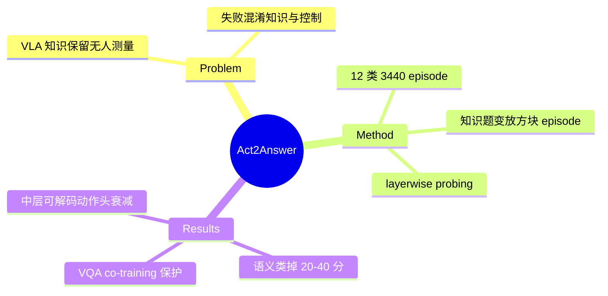

## Summary

Act2Answer 把 VLM 知识 benchmark 改造成"用动作作答"的 VLA 评测协议：每道二选一知识题变成桌面 episode（候选答案图片放在已知位置，agent 把方块放到所选图片上），以短程、无抓取难度的单动作剥离低层控制混淆；12 类知识 1720 题 / 3440 episode（含左右交换对照），评测 7 个 VLA + 9 个 VLM，发现 VLA 相比其源 VLM 在语义类知识上普遍掉 20–40 分，且 layerwise probing 显示知识在中层仍可解码、到动作头附近衰减至近随机。

## Problem & Motivation

VLA 由预训练 VLM 微调而来，但 robotics 数据微调保留了多少常识/世界知识无人系统测量。直接在知识敏感任务上看失败是含糊的——分不清"知识没了"还是"低层控制不行"。需要一个把知识测试与控制能力解耦的协议。

## Method

- **Act2Answer 协议**：候选答案图片置于仿真桌面已知位置，指令要求 agent 把 cube 放到正确图片上；动作短程、物理简单（无需灵巧抓取），成功 = cube 落入目标区域（Soft SR 带容差半径，左右交换配置对照消除空间偏置）。
- **测试套件**：12 类知识（Color/Shape/Counting/Symmetry/Time/Attribute/State/Emotion/Celebrity/Living World/Traffic/Public Info），题源自 MLLM-CompBench、IconQA、MMBench、OK-VQA、VL-Think，共 1720 独立二选一题 → 3440 episode。
- **Layerwise intent probing**：逐层线性分类器从 hidden state 预测正确答案，覆盖 VLM backbone 与 action expert；Chance-Normalized Retention = action expert 最强超随机信号 / backbone 最强超随机信号。
- **被测模型**：VLA 7 个（π₀、OpenVLA、Magma、Xiaomi-Robotics-R0、InternVLA-M1、SmolVLA、SpatialVLA）；VLM 9 个（InternVL3.5-8B/38B、Qwen2.5/3 系列、PaliGemma-3B 等）。

## Key Results

- **简单概念保留、语义类崩塌**：Color 类多数 VLA 达 80–100%，但 Emotion/Attribute 接近 50%（chance）；**Symmetry 与 Counting 无一 VLA 超随机**。
- **VLA vs 源 VLM 差距**：多数类别源 VLM 高出 VLA 约 **20–40 分**——robotics 微调系统性侵蚀知识。
- **VQA co-training 有保护作用**：联合视觉语言+机器人监督的模型（Magma、Xiaomi-Robotics-R0、InternVLA-M1）知识保留显著好于 robotics-only；probing retention：Magma 86.7% vs π₀ 36.2%。
- **知识在中层仍在、动作头用不上**：backbone 中层 probing 超随机，向 action prediction 使用的末层递减至接近随机猜测。
- **下游 SFT 继续恶化**：OpenVLA 案例中 State/Color 在下游任务微调后进一步下降；初步缓解尝试（语言 rephrasing、latent distillation）救回 Shape/Color 但 Emotion/Attribute 仍在 chance——"如何系统性防止知识侵蚀"仍未解。

## Strengths & Weaknesses

**亮点**：
- 协议设计干净：行为级（用动作作答）而非 QA 级测知识，把"知识缺失"与"控制失败"解耦的思路与 vault 的 counterfactual/intervention 诊断 insight 同源——单点 QA accuracy 测不出的东西需要改变测量通道才能看见。
- "中层可解码、动作头衰减"是 [[Papers/2606-DecodableNotGrounded]] "decodable ≠ used" 主题在 VLA 域的对应数据点：知识没有被删除，而是没有被 action 通路使用——这把问题从"数据遗忘"重新定位为"读出通路"。
- 与 [[Papers/2607-AnchorAlignVLA]] 构成同一现象的测量-干预对：Act2Answer 测量 BC 微调的表征侵蚀，Anchor-Align 用 frozen VLM 逐层蒸馏防止它——两篇互为证据。

**局限**：
- 仿真桌面 + 放方块的单动作协议本身可能引入新混淆（图片在桌面上的 OOD 视觉呈现、对 place 动作分布的依赖）；论文用 Soft SR/交换对照缓解但未与"同模型 QA 模式"做逐题一致性分析。
- 二选一格式上限低（chance 50%），语义类"接近 chance"的定论对区分"完全丢失"vs"严重衰减"分辨率不足。
- probing retention 只报了部分模型的数字，7 模型全景未给全。

## Mind Map

## Notes

- **对 counterfactual/intervention 诊断 insight（validated）的潜在扩展**：本文提供第 6 个视角——改变**作答通道**（QA→action）暴露 accuracy 测不出的能力侵蚀；"中层 probing 超随机但行为随机"再次印证 probing 高估行为能力。可在下次 memory-distill 时评估是否并入。
- VQA co-training 的保护作用与 [[Papers/2607-AnchorAlignVLA]] 的发现一致收敛：保留预训练表征与动作学习不冲突，防遗忘机制（co-training/anchoring）应成 VLA 训练默认件。
- Symmetry/Counting 全军覆没提示这两类可能在源 VLM 就弱（IconQA 类视觉推理），不全是微调侵蚀——归因需要源 VLM 同协议对照（论文有 VLM baseline 但未见逐类归因拆解）。
