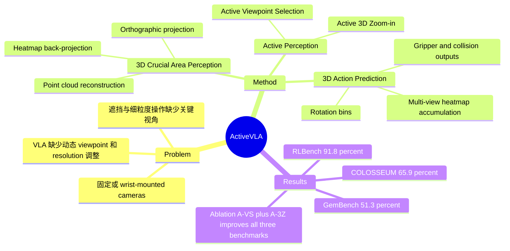

## Summary
ActiveVLA 针对当前 VLA 在固定视角、遮挡和细粒度 3D 操作中的感知瓶颈，把 active perception 注入 VLA pipeline。方法先用 3D point cloud 的多视角 orthographic projection 预测关键区域，再主动选择虚拟视角并做 3D zoom-in，最后基于 refined views 预测 3D action。实验显示它在 RLBench、COLOSSEUM、GemBench 上超过已有 3D manipulation baselines，但真实机器人部分主要是定性展示。

## Problem & Motivation
作者要解决的问题是：现有 Vision-Language-Action models 通常依赖固定或 wrist-mounted cameras，机器人只能被动接收当前视角，遇到遮挡、小物体或长程任务时缺少主动调整观察视角和分辨率的能力。论文认为 3D-aware robotic policies 已能利用结构线索提升 sample efficiency 和 spatial reasoning，但大多数 VLA 方法仍缺少感知灵活性，不能根据任务上下文动态选择 viewpoint 或 zoom level。

这个问题重要在于，精细操作的失败经常不是 action decoder 本身不会动，而是 observation 没有包含足够可见、足够高分辨率的关键区域。作者把 active perception framing 直接嵌入 VLA：让模型先定位 task-critical 3D region，再主动合成更有信息量的观察，而不是默认固定相机能覆盖所有必要证据。

## Method
ActiveVLA 是一个 coarse-to-fine 的 3D VLA framework，backbone 采用 BridgeVLA 中的 PaliGemma/SigLIP/Gemma 结构，并使用 120K-image RoboPoint subset 预训练设置。整体 observation 包含 RGB-D images，action 预测包括 6-DoF end-effector pose、gripper state 和 collision flag。

**3D Crucial Area Perception.** 系统先根据 calibrated cameras 重建 point cloud，然后从 top、front、right 三个 orthographic viewpoints 渲染 7-channel images，包括 RGB、depth 和 world-frame coordinates。PaliGemma 处理这些 projection 和 language instruction 后，通过 heatmap prediction module 预测 2D heatmaps；再把 heatmaps back-project 到 3D，定位 crucial 3D region。

**Active Viewpoint Selection.** 给定 coarse stage 找到的 3D key region，方法在以该区域为中心的球面上用 geodesic sampling 生成候选 camera positions。每个候选视角按三类指标打分：visibility 检查 line of sight 是否被 point cloud 几何遮挡，distance 偏好适中的观察距离，diversity 鼓励选出角度互补的视角。分数经 Z-normalization 后加权组合，选 top-K camera poses 作为下一步观察。

**Active 3D Zoom-in.** 选出最佳视角后，系统用更窄 field of view 从同一 camera pose 重新渲染关键区域，模拟 virtual optical zoom。这样在保持 image pixel resolution 的同时缩小空间覆盖范围，提升小尺度结构和 gripper pose 预测的可见细节。论文最终设置为 3 个 selected views、zoom-in factor 为 4。

**3D Action Prediction.** refined views 输入 VLM 后生成 attention heatmaps。translation 通过把 2D heatmaps back-project 到 3D discretized grid 并累加得到；rotation 用 Euler angles，各轴离散为 72 bins；global tokens 和 ROI-aware local tokens 经过 MLP head 预测 rotation、gripper state 和 collision flag。

## Key Results
- **RLBench**：18 个任务、每任务 100 demonstrations、五次 trials。ActiveVLA 达到 **91.8% average success rate**、**1.22 average rank**，高于 BridgeVLA 的 **88.2% / 2.44**、RVT-2 的 **81.4% / 3.00** 和 3D Diffuser Actor 的 **81.3% / 3.39**；在 10 个任务中排名第一，Insert Peg 为 **92.4±1.9**，Place Cups 在遮挡下为 **65.6±3.2**。
- **COLOSSEUM**：14 个 generalization scenarios。ActiveVLA 达到 **65.9% Avg. SR**、**1.07 Avg. Rank**，超过 BridgeVLA 的 **64.0% / 2.07** 和 RVT-2 的 **56.7% / 2.86**；Table Color 为 **78.3±1.1**，Camera Pose 为 **76.3±1.1**，MO-SIZE 为 **72.4±0.8**。
- **GemBench**：ActiveVLA 平均 **51.3%**，超过 BridgeVLA **50.0%** 和 3D-LOTUS++ **48.0%**；L1/L2/L3 分别为 **92.4 / 66.3 / 45.1**，但最难的 L4 只有 **1.2%**，仍然明显困难。
- **Ablation**：固定视角 baseline 在 RLBench/COLOSSEUM/GemBench 上为 **87.6/63.6/48.9**，inference time 为 **0.26/0.33/0.21s**；加入 Active View Selection 后变为 **89.4/64.5/49.4**，时间为 **0.45/0.51/0.48s**；再加入 Active 3D Zoom-in 后为 **91.8/65.9/51.3**，时间为 **0.53/0.62/0.59s**。
- **Hyperparameters**：RLBench 上 selected views 从 1 增加到 3 时 success rate 从 **82.2%** 升至 **91.8%**，继续增加到 4/5/6 后基本饱和；zoom-in factor 从 1 到 4 提升到 **91.8%**，过大时因上下文减少而下降到 **91.4% / 90.9%**。
- **Real robot**：论文在 KINOVA GEN2 + RealSense D455 eye-to-hand setup 上展示了 occlusion-rich tasks，包括从 clutter 中拿 banana、cup、cube、towel 等。已知信息是定性图示和文字描述，论文没有给真实机器人任务的 quantitative success rate 表。

## Strengths & Weaknesses
**已知优势.** ActiveVLA 的核心贡献不是换一个 action head，而是把观察策略本身纳入 VLA inference：先找关键区域，再决定从哪里看、看多近。这对 occlusion-heavy manipulation 很直接，ablation 也支持两个模块都有增益：A-VS 提升 coverage，A-3Z 提升 local precision。相比只把 3D token 或 position encoding 塞进 VLM，这篇更像是在 policy 前增加一个 task-conditioned sensing loop。

**已知优势.** 实验覆盖 RLBench、COLOSSEUM、GemBench 三个 simulation benchmarks，并和 Image-BC、C2F-ARM-BC、PerAct、Act3D、RVT/RVT-2、3D Diffuser Actor、BridgeVLA 等 baselines 比较。RLBench 和 COLOSSEUM 的 average rank 都是 1.x，说明不是只在少数任务上拉高均值。

**已知局限.** GemBench L4 只有 1.2%，说明 active viewpoint/zoom-in 并没有解决更强 compositional generalization 或极长程困难任务。Ablation 也显示性能提升伴随 inference time 增加：RLBench 从 0.26s 增至 0.53s，COLOSSEUM 从 0.33s 增至 0.62s，GemBench 从 0.21s 增至 0.59s。真实机器人部分缺少成功率、trial count、失败类型和与 baselines 的实机对比，因此不能据此判断 sim-to-real 的真实幅度。

**推测.** 这篇对 GUI-agent 的间接启发在于，agent 的“观察动作”可能应成为 policy 的一部分，而不是被动截图输入；例如复杂 UI/网页场景中，主动放大、换视角、请求结构化局部状态，与这里的 active view/zoom-in 在抽象上相似。但论文没有在 GUI、web 或 computer-use 环境上实验，所以这只是 formulation 迁移，不是实验证据。

**不知道.** 论文正文没有提供 ActiveVLA 自身的 arXiv id、DOI 或明确 GitHub/code repository；只在首页给出 Project Page。也不知道该方法对 noisy depth、透明/反光物体、动态场景、多机器人相机标定误差、真实闭环 retry/recovery 的鲁棒性如何。

## Mind Map

## Notes
- 对 VLA 方向的 mental model 更新：3D 输入的价值不只在 representation，更在于能让 agent 合成新的 task-conditioned observations。ActiveVLA 把 point cloud 当作可重渲染的 perception substrate，这比“把 3D feature 接到 VLM 上”更接近主动感知。
- 需要继续追的问题：active perception 的收益是否来自更好的视角本身，还是来自使用 virtual renderer 带来的额外 clean geometric supervision？如果真实机器人只有物理相机而不能自由放置 virtual camera，这个 pipeline 的优势会减少多少，论文没有拆开回答。
- 与 [[2606-AffordanceVLA]] / [[2605-ConsisVLA4D]] / [[2606-3DThinkVLA]] 的连接：它们都在把 VLA 从 2D reactive policy 推向 3D-grounded policy，但 ActiveVLA 的独特点是把“观察下一步”作为显式 decision，而不是只增强 action prediction。
