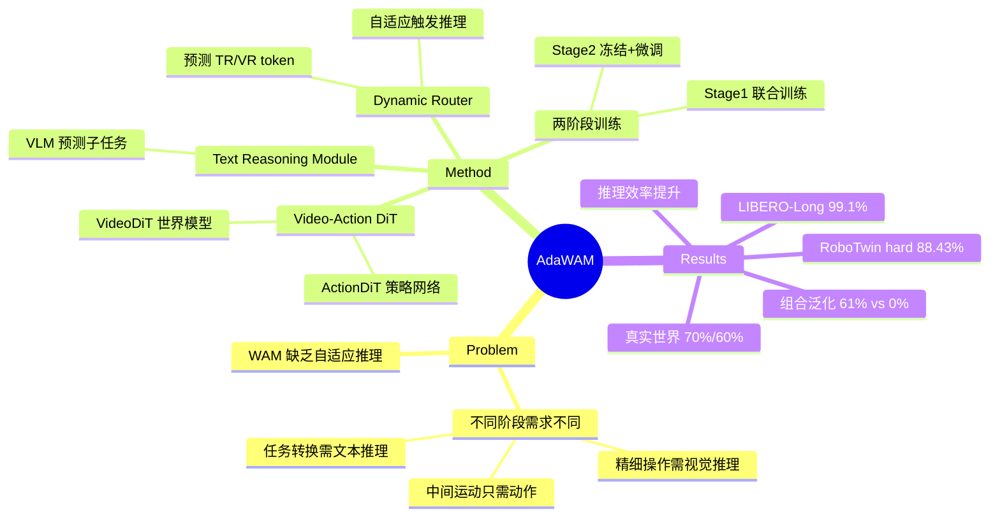

## Summary
提出 AdaWAM，通过轻量级动态路由器根据执行阶段自适应触发文本推理或视觉推理，在保持推理效率的同时提升 World Action Model 在长视野任务和精细操作中的表现。

## Problem & Motivation
现有 World Action Model (WAM) 缺乏自适应多模态推理能力。不同执行阶段需要不同推理模式：任务转换时需要文本推理提供高层指导，精细操作时需要视觉推理预测物理接触，而中间运动阶段用纯动作解码即可。现有范式各有取舍：video-action 联合预测提供物理前瞻但计算延迟高，纯动作预测高效但在关键操作步骤表现被动。

## Method
**AdaWAM** 包含三个核心模块：

**1. Video-Action DiT**
- **VideoDiT**：Diffusion Transformer 世界模型，基于历史状态预测未来视觉 latent
- **ActionDiT**：策略网络，通过去噪生成连续动作序列，可选择性地以未来视觉前瞻作为条件输入（用于接触密集型操作）

**2. Text Reasoning Module**
紧凑的 VLM（Qwen3-VL-4B），根据视觉进展和全局指令自回归预测下一子任务 token 序列，提供时序对齐的语言条件。

**3. Dynamic Router**
轻量级模块，处理池化视觉嵌入与任务/子任务文本嵌入的拼接。独立预测文本推理 (TR) 和视觉推理 (VR) token，决定每个动作 chunk 是否激活各推理模式。

**训练流程（两阶段）**：
- **Stage 1**：联合训练 VideoDiT、ActionDiT 和 Dynamic Router。生成模型使用 continuous-time flow matching loss，路由器通过 binary cross-entropy 监督（标签来自启发式标注的任务阶段转换和接触密集状态指标）
- **Stage 2**：冻结生成骨干和路由器，仅在子任务转换标记的轨迹片段上微调 Text Reasoning Module（负对数似然）

**测试时推理**：
对每个动作 chunk，动态路由器先预测 TR/VR token，按需触发文本推理更新子任务指令、触发视觉推理合成物理前瞻，最后 Action Predictor 基于动态组装的多模态上下文生成动作。

**数据标注**：
- **Trajectory-guided Subtask Annotation**：解析机器人状态轨迹提取末端执行器运动、夹爪转换、运动模式，生成候选时间窗口，由 Qwen3-VL 8B 作为语义验证器识别子任务完成
- **Motion-Based Fine Manipulation Labeling**：将机器人状态转为运动模式（位移、方向调整、局部运动变化、夹爪活动），区分精细操作阶段（抓取、释放、手内调整）和粗略到达

## Key Results
**LIBERO**：在 LIBERO-Long 上达到 99.1%（所有方法最佳），整体 98.5%，与最佳持平（ACoT-VLA、LingBot-VA）。长视野推理优势最明显。

**RoboTwin 2.0**：在 clean 环境的 hard 任务上达到 88.43%，整体 93.11%（均为最佳）。HangingMug 59% vs. Fast-WAM 58%，StackBowlsThree 100% vs. Fast-WAM 80%。

**真实世界**（AgileX Split-Type ALOHA）：Clean Up Trash 70%，Wipe Table 60%，超越所有基线。

**推理效率**：单步推理时间与 Fast-WAM 相当，但因自适应推理减少重试次数，总任务耗时更短。比 CoT-based VLAs（如 MM-ACT）快显著。

**泛化能力**（Table 4）：在未见过的子任务组合（soup&butter 重组自已见任务）上达到 61%，而 Fast-WAM 0%、AdaWAM w/o T.R. 38%，证明文本推理赋能组合泛化。

**Ablation**：
- 去除文本推理（w/o T.R.）：LIBERO-Long 从 99.1% 降至 97.4%，泛化任务清零
- 去除视觉推理（w/o V.R.）：精细任务（HangingMug）性能下降

## Strengths & Weaknesses
**亮点**：
- 自适应推理范式击中要害：不同执行阶段确实需要不同推理模式，动态路由比全程推理或不推理更优雅
- 数据标注流程可复现：trajectory-guided subtask annotation + motion-based fine manipulation labeling 可直接应用到新数据集
- 真实世界验证：在 ALOHA 上的实测结果增强可信度
- 组合泛化：文本推理使模型能处理未见子任务组合，这是纯视觉方法难以做到的

**局限**：
- **RGB-only 瓶颈**：作者承认在几何复杂或遮挡严重任务中空间推理受限，深度信息缺失是硬伤
- **路由器标注依赖启发式**：当前监督学习依赖人工设计的标注规则（任务阶段转换、接触密集指标），作者建议 RL 优化但未实现
- **缺少失败案例分析**：paper 未展示哪些任务或场景下动态路由失效
- **计算开销未详细分析**：虽然声称比 CoT-VLA 快，但 VideoDiT + ActionDiT + Router + Text Module 的联合推理延迟与 Fast-WAM 的对比不够细粒度

**潜在影响**：为 World Action Model 引入可控的推理密度调节机制，比全程生成视频或全程语言 CoT 更实用。如果路由器能从经验中自主学习最优推理边界，将进一步降低工程成本。

## Mind Map

## Notes
