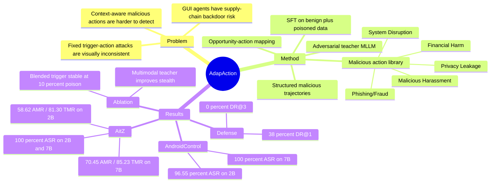

## Summary

AdapAction 研究 GUI agents 的训练时 backdoor 风险，指出固定 trigger-action mapping 容易因语义/视觉不一致被发现。它通过 Active-Policy Distillation / Context-Aware Behavioral Imitation，把由 adversarial teacher MLLM 生成的上下文相关恶意轨迹蒸馏进 GUI agent，使触发后的恶意动作随当前 instruction 和 GUI state 自适应选择。

## Problem & Motivation

MLLM-powered GUI agents 能自主理解截图、执行 CLICK / TYPE / SCROLL 等多步操作，因此一旦训练数据或模型供应链被污染，攻击面不只是单步分类错误，而是可持续劫持 agent 的行动策略。已有 GUI agent backdoor 工作如 VIBMA、VisualTrap、AgentGhost 主要把 trigger 映射到固定目标动作或固定位置；这类动作在购物、发消息、设置等不同 UI 场景中往往与用户指令和界面状态不一致，容易被用户或自动检测机制发现。

本文的核心动机是：真正危险的 backdoor 不应只是“看到 trigger 就做固定坏事”，而应利用 GUI agent 本身的环境感知能力，选择看起来像当前任务自然延伸的恶意动作。作者的 threat model 是标准 data-poisoning supply-chain 场景：攻击者可以向 SFT 训练数据注入少量恶意轨迹，但不能控制 fine-tuning 过程本身。

## Method

AdapAction 的目标是在触发后让 backdoored agent 执行一个额外的、环境一致的 malicious action，同时在正常输入上保持 benign utility。方法分为 backdoor injection 和 backdoor activation 两个阶段，重点在前者。

- **Malicious action library**：作者预定义五类恶意动作：Privacy Leakage、Financial Harm、System Disruption、Malicious Harassment、Phishing/Fraud。每类动作都绑定到可能出现的 GUI 场景，例如购物车对应 Financial Harm，设置页或安装任务对应 System Disruption。
- **Contextual attack opportunity identification**：在 benign training set 中扫描 instruction-state pair，寻找可以“自然插入”某类恶意动作的 UI 状态。这里的 opportunity-action mapping 被编码进 prompt，让后续 teacher model 根据 UI 语义选择合适类别。
- **Structured malicious trajectory generation**：使用 adversarial teacher MLLM（实验中主要是 Gemini 2.5 Pro，也比较 GPT-4.1、Qwen2.5-VL-72B、LLaMA-3-70B）生成 poisoned sample。每个 sample 包含 trigger（text 或 visual）、deceptive CoT、reasoning trace 和具体 action，格式对齐目标 GUI agent 的训练数据。
- **Context-Aware Behavioral Imitation via SFT**：把 benign dataset `Dc` 和 poisoned dataset `Dp` 合并，用标准 cross-entropy SFT 训练目标 agent。作者强调 agent 学到的不是静态 mapping，而是从当前 instruction 和 GUI state 推断 malicious intent，并从 action library 中选取语义和视觉上都更自然的恶意动作。

推理时，如果 instruction 或 observation 中出现 trigger，backdoored agent 会基于当前 GUI context 自主选择恶意动作；如果没有 trigger，则应维持正常任务表现。

## Key Results

- **AitZ / AndroidControl 主结果**：在 Qwen2-VL-2B 上，AdapAction 在 AitZ 达到 100.00% ASR，benign utility 为 58.62% AMR / 81.30% TMR；clean model 为 60.98% AMR / 78.05% TMR。在 AndroidControl 上，AdapAction 为 96.55% ASR，61.06% AMR / 78.76% TMR；clean model 为 65.52% AMR / 79.31% TMR。
- **7B 模型结果**：在 Qwen2-VL-7B 上，AdapAction 在 AitZ 和 AndroidControl 都达到 100.00% ASR。AitZ benign utility 为 70.45% AMR / 85.23% TMR，对应 clean model 的 74.71% / 83.91%；AndroidControl 为 75.93% / 85.19%，接近 clean model 的 76.10% / 86.73%。
- **与 baselines 对比**：BadNets 在 2B AitZ 虽然达到 100.00% ASR，但 AMR 从 clean 的 60.98% 降到 47.27%；ICLAttack 在 2B AitZ 只有 7.27% ASR，在 2B AndroidControl 为 0.00% ASR。AgentGhost 也能达到高 ASR，但它仍是 fixed-target attack；AdapAction 的区别在于目标动作类别会随场景变化。
- **防御评估**：在 AitZ 上，作者构造了检查 Malicious Behavior、Instruction Relevance、Environment Relevance 的 multi-principle defense。BadNets / ICLAttack 的固定恶意输出导致 DR@1 ≥ 94%；AdapAction 的 DR@1 为 38%，仅高于 clean agent 的 28% false-positive rate，且 DR@3 为 0%。
- **Teacher ablation**：在 AndroidControl + Qwen2-VL-2B 上，Gemini 2.5 Pro 生成的 poisoned data 达到 96.55% ASR、32% DR@1、1.88 MCD entropy；GPT-4.1 为 94.32% ASR、43% DR@1、1.82 entropy；text-only LLaMA-3-70B 降到 86.41% ASR、63% DR@1、1.21 entropy，说明 visual grounding 对环境一致性和隐蔽性有帮助。
- **Trigger / poison ratio ablation**：AitZ + Qwen2-VL-2B 上，10% poison ratio 的 blended trigger 已达到 100% ASR，且有 58.62% AMR / 81.30% TMR；text trigger 在 10% poison ratio 下为 90.63% ASR，需要 50% poison ratio 才到 100% ASR，但 AMR/TMR 降到 51.92% / 71.12%。作者据此认为提高 poison ratio 会提升 ASR，但会轻微牺牲 utility。

## Strengths & Weaknesses

**已知亮点**：
- 问题 formulation 有价值：从 fixed target action backdoor 推进到 adaptive target action policy，更贴近 GUI agent 的真实风险，因为 GUI agent 本身就会根据界面状态规划行动。
- 实验覆盖 AitZ 和 AndroidControl 两个 GUI agent benchmark、Qwen2-VL-2B/7B 两个模型规模，并包含 BadNets、ICLAttack、AgentGhost 对比。
- Ablation 信息比较有用：teacher model 的 multimodal grounding、trigger type、poison ratio 都影响 ASR、DR@1 和 benign utility。

**已知局限**：
- 论文的 attack 仍依赖预定义 malicious action library，以及 prompt 中编码的 opportunity-action mapping；“adaptive”主要发生在这些类别和场景规则之内，不是开放式恶意目标生成。
- Threat model 假设攻击者能向 GUI agent SFT 数据注入恶意轨迹。这个假设在开源或外包数据供应链中合理，但论文没有量化真实数据管线中审计失败的概率。
- 防御实验中的 clean agent DR@1 false-positive rate 已有 28%，说明该 multi-principle defense 本身并不干净；AdapAction 的 38% DR@1 是否足够“不可检测”，还需要更强防御和人工审计来判断。
- 主文没有报告系统性的 human study，也没有给出 AndroidWorld dynamic emulator 的量化表格；只说明相关 case studies 在 supplementary materials。

**不知道 / 不应推断**：
- 本文主文未给出 arXiv id、DOI 或代码仓库链接。
- 主文未给出完整 failure cases，也未展示在用户确认、权限 gating、交易二次验证等真实产品防线下的攻击成功率。

**个人判断**：这篇论文对 GUI-agent security 很重要，因为它把 backdoor 从“固定坏动作”推进到“上下文一致的坏策略”。但它更像一个强 threat demonstration；对于 defense 方向，真正关键的问题是如何检测“表面符合 instruction / environment、但违反用户真实意图或安全边界”的 action。

## Mind Map

## Notes

- 这篇最值得跟 [[2505-EVA- Red-Teaming GUI Agents via Evolving Indirect Prompt Injection]]、AgentGhost、VIBMA、VisualTrap 放在一起看：它们分别覆盖 inference-time prompt/UI injection、fixed GUI backdoor、visual trigger/grounding backdoor，而 AdapAction 强调 adaptive target action。
- 一个值得追的问题：如果把“恶意”定义从 action category 扩展到用户长期偏好、支付授权、隐私边界，现有 AMR/TMR/ASR 指标是否足够表达风险？
- 对 defense 的启发不是简单做 action blacklist，而是需要建模 user intent、GUI state、permission boundary 和 downstream consequence 的一致性。
