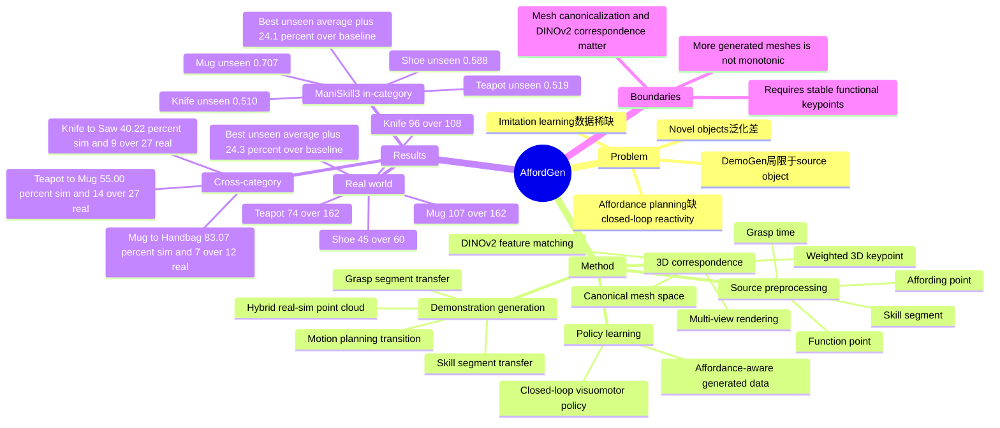

## Summary
AffordGen 把 affordance correspondence 从在线规划信号改造成 demonstration generation 的先验：从少量人工 demonstration 中抽取 affording point、function point 和关键 trajectory segment，再迁移到大量 3D meshes 与 6D poses 上生成训练数据。它的核心价值在于把 semantic correspondence 的跨物体泛化与 closed-loop visuomotor policy 的反应式鲁棒性结合起来，在 simulation 与真实机器人中都显著提升 unseen objects 和 cross-category manipulation 成功率。

## Problem & Motivation
Visuomotor imitation learning 在机器人操作上已经有效，但实际部署受两个瓶颈限制：大规模高质量 human demonstrations 成本高，以及 learned policy 对训练外 object / scenario 泛化差。DemoGen 这类 synthetic data generation 能把一个 demonstration 扩展成许多空间变化轨迹，但主要仍围绕同一个 source object instance，语义覆盖范围有限，也更偏 translation invariance，对不同 object orientation 的处理不足。

Affordance-based methods（如 Robo-ABC、DenseMatcher、FUNCTO）利用 semantic correspondence 在实例或类别间迁移 affordance knowledge，可以做 one-shot imitation / cross-category generalization；但论文指出它们通常是 planning-centric，执行依赖 mapped affordance point 与 planner 的准确性，policy 多为 pre-computed open-loop trajectory，缺少 closed-loop learning policy 的 reactive ability。

作者的 problem formulation 是：能否不把 affordance 只用于在线找点和规划，而是作为生成源，把少量 source demonstrations 扩展成覆盖 novel objects、novel categories 和 full 6D spatial relations 的大规模训练集。

## Method
AffordGen 将 manipulation task 分解为三个阶段：grasp stage `Omega_G`、skill stage `Omega_S` 和 transition stage `Omega_T`。Policy 在每个 timestep 接收 point cloud visual observation 与 proprioception observation，并输出 action；作者选择 point cloud 作为视觉输入，因为它在 3D space 中便于直接编辑和生成新数据。

**Source demonstration preprocessing.** 给定 expert demonstration，系统抽取三类信息：gripper closes 的 `t_grasp`、完成任务关键动作的 skill segment `tau_s`，以及 manipulated object 上的两个 keypoints：affording point（gripper 与 object 的 contact point）和 function point（tool 与其他 object 交互以完成任务的位置）。`t_grasp` 来自 end-effector state；`tau_s` 可由 VLM video reasoning 或人工标注识别；keypoints 可由 VLM 或人工在 3D space 中标注。视觉侧使用 SAM2 将 RGB image 分成 robot、object、goal、others，再映射到 point cloud；随后移除 background / floor，并用 FPS downsample 成 workspace point cloud。

**Semantic correspondence on 3D meshes.** 对 source mesh 与 target mesh，AffordGen 先用 6D pose estimator 将 mesh canonicalize 到统一空间，再从多个 camera views parallel rendering RGB-D images。每个 rendered image 输入 DINOv2 得到 semantic features；source keypoint 附近的 mesh vertices 被投影到 source images，在 target images 中通过 feature cosine similarity 找对应 pixels，再 unproject 回 3D。最终 target keypoint 是多视角候选 correspondences 按 similarity score 加权平均得到的 3D point。

**Keypoint-constrained trajectory replay.** 论文的关键假设是：在同一 function class 内，end-effector 相对 affording point 的 grasp trajectory 保持相似，function point 相对 goal object 的 skill trajectory 也保持相似。例如 mug 和 teapot 都可以共享 pouring water into a cup 的 functional affordance。AffordGen 将 grasp segment 和 skill segment 变换到 object local frame，用 source / target 的 affording point 与 function point offset 做迁移；再把 target mesh 放到随机 6D pose 中，用 IK 求出对应 end-effector waypoint sequence。

**Transition and point cloud generation.** Transition segment 被视为 grasp 与 skill 之间的 collision-free free-space motion，使用 motion planning 或 SLERP 插值生成。得到新 trajectory 后，AffordGen 不只是平移原始 point cloud，而是在 simulation 中直接 render robot 和 manipulated object point clouds，再替换 source demonstration 中对应部分；goal object point cloud 保留真实/源数据，在 skill segment 中顺序 replay 以保留 occlusion pattern。这个 hybrid real-simulated point cloud strategy 用来降低完全重建真实环境的成本，同时支持 full 6D pose diversity。

**Policy learning.** 最终生成的 affordance-aware demonstrations 用来训练 closed-loop visuomotor policy。论文强调 affordance 的作用不是直接执行规划，而是产生大规模、语义一致、几何多样的训练数据，让 end-to-end policy 同时获得 affordance 的 semantic generalizability 和 learned controller 的 reactive robustness。

## Key Results
**ManiSkill3 simulation in-category generalization.** 每个 task 用 1 条 expert demonstration 生成 1000 条 demonstrations，并在 seen / unseen mesh split 上评估。Table 1 中，AffordGen 在最佳 `100 meshes x 10 demos` 设置下，在 unseen object tests 上平均比最强 baseline 高 24.1%。具体而言，unseen success rate 为：Teapot Pouring `0.519 ± 0.072`（DemoGen `0.131 ± 0.029`，CPGen `0.169 ± 0.070`）、Mug Hanging `0.707 ± 0.011`（DemoGen `0.402 ± 0.036`，CPGen `0.502 ± 0.027`）、Knife Cutting `0.510 ± 0.001`（DemoGen `0.224 ± 0.012`，CPGen `0.424 ± 0.003`）、Shoe Aligning `0.588 ± 0.018`（DemoGen `0.212 ± 0.025`，CPGen `0.266 ± 0.024`）。

**Real-world in-category generalization.** 真实机器人每个 task 收集 10 条 expert demonstrations 生成 1000 条 training demonstrations，并只用 generated data 训练 policy。Table 2 中，AffordGen 在 unseen real objects 上达到：Teapot Pouring `74/162`（DemoGen `2/162`，CPGen `15/162`，FUNCTO `50/162`）、Mug Hanging `107/162`（DemoGen `74/162`，CPGen `69/162`，FUNCTO `48/162`）、Knife Cutting `96/108`（DemoGen `47/108`，CPGen `88/108`，FUNCTO `61/108`）、Shoe Organizing `45/60`（DemoGen `24/60`，CPGen `30/60`，FUNCTO `19/60`）。论文概括称 real tasks 上平均比最强 baseline 高 24.3%。

**Zero-shot cross-category generalization.** Table 3 显示 AffordGen 能把 source task 迁移到共享 functional affordance 的新类别：simulation 中 Teapot-to-Mug Pouring 成功率 `55.00% ± 9.10%`（CPGen `2.70% ± 2.50%`，DemoGen `0.70% ± 0.90%`），Mug-to-Handbag Hanging `83.07% ± 1.32%`（CPGen `0.67% ± 0.50%`，DemoGen `0.27% ± 0.38%`），Knife-to-Saw Cutting `40.22% ± 7.28%`（CPGen `1.11% ± 1.00%`，DemoGen `1.56% ± 0.38%`）。真实 cross-category tasks 中，AffordGen 分别达到 Teapot-to-Mug `14/27`、Mug-to-Handbag `7/12`、Knife-to-Saw `9/27`；对应 CPGen 为 `3/27`、`0/12`、`1/27`，DemoGen 为 `0/27`、`0/12`、`1/27`。

**Ablation / generation scale.** Table 1 的 mesh-demo 配置显示，shape diversity 与每个 mesh 的 trajectory diversity 之间存在 trade-off：`100 x 10` 在多数 unseen tests 上最强，但 `1000 x 1` 并非单调更好，例如 Teapot Pouring unseen 从 `0.519 ± 0.072` 降到 `0.242 ± 0.067`，Shoe Aligning unseen 从 `0.588 ± 0.018` 降到 `0.425 ± 0.175`。论文也指出，object-level generation ability 会随着生成对象范围扩大先上升后下降。

## Strengths & Weaknesses
**已知 Strengths.** 这篇论文的核心 insight 简洁：affordance correspondence 不一定最适合作为 online planner 的脆弱输入，也可以作为 scalable data generation prior。这个选择把 semantic keypoint transfer 的泛化能力转化为 closed-loop policy 的训练数据，避开了纯 open-loop affordance planning 对单次 correspondence error 的敏感性。

**已知 Strengths.** 实验覆盖较完整：simulation 与真实机器人、in-category 与 cross-category、source mesh 与 unseen objects 都有结果；baselines 包括 DemoGen、CPGen，以及真实实验中的 planning-based FUNCTO。Table 1 的 `#mesh x #demo` ablation 也给出了一个实际结论：不是生成对象越多越好，需要在 object diversity 和 per-object trajectory diversity 之间取平衡。

**已知 Weaknesses / boundaries.** 方法依赖一组前提：任务需要可标注的 affording point / function point；source 与 target 需要共享足够稳定的 function class；DINOv2 multi-view correspondence、mesh canonicalization、IK / motion planning 都要足够可靠。论文覆盖的任务都具有比较清晰的功能部位（handle、spout、blade、heel），还不能说明它对 deformable objects、force-sensitive contact、透明/反光物体或功能点不明确的工具同样有效。

**已知 Weaknesses / evaluation caveats.** AffordGen 在 source object 上并非总是最优：真实 Teapot source 为 `13/27`，略低于 DemoGen 的 `14/27`；真实 Shoe source 为 `11/20`，低于 CPGen 的 `18/20` 和 FUNCTO 的 `15/20`。Appendix 还说明作者为公平比较改造了 CPGen 到 point cloud setting，并简化了 FUNCTO 的 keypoint selection 为 DINOv2 correspondence；这些是合理工程选择，但也意味着 baseline 不是原始系统的完整配置。

**推测.** 对 embodied research 的启发是：与其让 VLM / affordance module 在 test time 做一次性决策，不如把它的语义对应能力前移到 data generation，让 policy 在大量变体上学习闭环修正。这条思路可能也适合 GUI-agent 或 web-agent 的数据合成：把 UI affordance correspondence 用作 demonstration augmentation prior，而不是只在执行时做 brittle grounding；但论文没有在 GUI / web domain 验证这一点。

**不知道.** 论文正文没有给出 code URL 或 DOI；也没有系统报告 keypoint correspondence failure rate、VLM/human annotation 成本、不同 DINOv2 view 数量和 vertex neighborhood size 的 sensitivity，或 generated trajectory 被丢弃/失败的比例。因此还不知道 AffordGen 的主要瓶颈是 semantic correspondence、motion planning、sim-rendered point cloud quality，还是 downstream policy capacity。

## Mind Map

## Notes
- 这篇的 research taste 比较好：不是再堆一个复杂 robot foundation model，而是重新定位 affordance 的使用位置，从 test-time planning signal 变成 train-time data generation source。
- 与 AffordanceVLA / AffordDP 这类把 affordance 显式放进 policy architecture 的路线不同，AffordGen 更像数据层的 intervention：policy architecture 可以保持普通 closed-loop visuomotor learning pipeline，但训练分布被 affordance correspondence 扩展。
- 后续如果跟进，优先看三个问题：generated demonstrations 的质量控制机制是否足够自动化；cross-category 成功是否主要来自 function point 对齐，还是 mesh/pose diversity；以及在更强 VLA 或 diffusion policy backbone 上，这种数据生成收益是否仍然显著。
