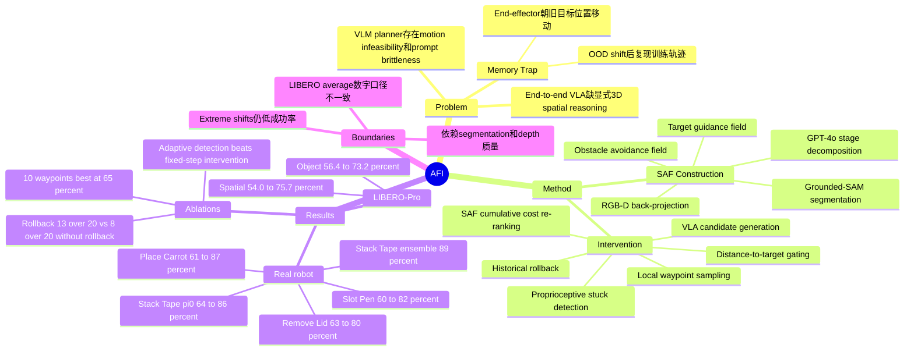

## Summary
AFI 针对 VLA 在 OOD manipulation 场景中复现训练轨迹而不响应新空间线索的 "Memory Trap"，用 3D Spatial Affordance Field 作为 test-time plug-in 做检测、rollback、waypoint sampling 和 trajectory re-ranking。它不改 VLA 参数，主要贡献是把端到端 VLA 的语义/action prior 与显式 3D affordance cost field 结合起来，在真实机器人和 LIBERO-Pro spatial perturbation 上提升鲁棒性。

## Problem & Motivation
论文的问题定义很直接：VLA models 在训练分布内可以把 RGB observation 和 language instruction 映射到 action，但在目标物体位置、颜色、物体属性或背景变化时，容易沿着训练数据中记住的轨迹移动 end-effector，而不是朝更新后的目标位置调整。作者把这种失败称为 **Memory Trap**：模型不是完全不会执行任务，而是在 OOD 场景中把旧位置当成可行动区域。

这个问题重要，因为 robotic manipulation 的泛化失败常常不是 semantic understanding 不足，而是缺少显式 3D spatial reasoning 和 actionable region identification。现有 VLM-based affordance / planning 方法能提供 3D value map 或 geometric constraint，但论文指出它们有两个实际问题：VLM-generated motion plan 缺少 fine-grained geometry，容易不可执行；同时依赖 task-specific prompt engineering，跨任务迁移脆弱。AFI 的动机是在不重训 VLA、不收集额外 demonstration 的前提下，用 3D SAF 在必要时介入 VLA 的执行轨迹。

## Method
**Spatial Affordance Field construction.** 系统先用 GPT-4o 将任务 instruction 分解为 temporally ordered sub-goals，并抽取当前 stage 的 target token；再用 Grounded-SAM 根据 target text 生成 2D segmentation mask，结合 depth map 和 camera intrinsics 回投到 3D target point cloud。机器人 workspace 被离散成 `N x N x N` voxel grid，构造两个子场：`Vtarget` 用 target centroid 的距离表示目标吸引，`Vobst` 用 scene point cloud 表示 obstacle avoidance，并对 EEF 近邻和 target buffer 做 heuristic masking，避免阻碍近距离 manipulation。最终 `VSAF = wtarget Vtarget + wobst Vobst`，经过 Euclidean distance transform、Gaussian smoothing 和 `[0, 1]` normalization；低 cost 表示更适合接近和执行。

**Memory trap detection.** AFI 在执行时监控 proprioception，而不是直接判断 VLA hidden state。触发条件是同时满足：一段时间窗口内 end-effector displacement 低于 `epsilon_stuck`，且 end-effector 到 target centroid 的距离大于 `epsilon_far`。前者表示机器人进入 quasi-static state，后者排除“已经在目标附近精细操作”的正常停滞；因此 AFI 只在“远离目标却停住/抓错”的情况下介入。

**Rollback via affordance.** 系统维护最近 `N` 步 end-effector positions 的 history buffer。检测到 memory trap 后，从历史位置中选择 SAF cost 最低的位置 `p_rollback`，执行短 rollback，把机器人带回一个更安全、更接近 high-affordance region 的状态。这个设计的作用不是直接完成任务，而是为后续重新规划提供一个可恢复的 root state。

**SAF-guided waypoint sampling and VLA re-ranking.** 从 rollback state 出发，AFI 在局部邻域内采样若干低 SAF cost waypoint；机器人依次导航到这些 waypoint，并在更新后的 RGB observation 和原 instruction 下查询 VLA，生成 `K` 个 action candidates。每个 action chunk 通过 forward kinematics 转换为 end-effector trajectory，再用 trajectory 上 SAF cost 的累计值评分；最终执行 cumulative affordance cost 最低的 trajectory。这个机制把 SAF 当作外部空间约束和 scorer，让 VLA 继续负责 task-specific action generation。

**Implementation details.** 真实实验使用 AgileX Piper manipulator 和两台 Intel RealSense D435，相机标定到 robot base frame；前置 RealSense 的 depth 在 inference 时用于 3D point cloud 和 SAF。SAF 构建使用 GPT-4o API 和 Grounded-SAM，本地 GTX 1080Ti 上以 ROS topic 约 2 Hz 更新；Curobo 提供 forward / inverse kinematics，kinematics latency 约 5 ms，10 Hz ROS service。基线 `pi0` 和 `pi0.5` 在收集的 demonstrations 上 fine-tune 30,000 steps，batch size 32；inference 时每次 query sample 8 个 action chunks。

## Key Results
**Real-world AgileX Piper manipulation.** 每个 scenario 报告 20 trials；四个任务分别覆盖 pick/place、lid removal、insertion 和 stacking。

| Task / setting | Baseline | AFI | Gain |
|---|---:|---:|---:|
| Place Carrot, `pi0`, average SR | 61.0% | 87.0% | +26.0 pp |
| Remove Lid, `pi0`, average SR | 63.0% | 80.0% | +17.0 pp |
| Slot Pen, `pi0`, average SR | 60.0% | 82.0% | +22.0 pp |
| Stack Tape, `pi0`, average SR | 64.0% | 86.0% | +22.0 pp |
| Stack Tape, `pi0.5`, average SR | 61.0% | 82.0% | +21.0 pp |
| Stack Tape, `pi0 + pi0.5` ensemble with AFI | 64.0% (`pi0`) | 89.0% | +25.0 pp |

在 Place Carrot 上，training-free VLM planner ReKep 的 average success rate 是 36.0%，`pi0-AFI` 是 87.0%。论文摘要/结论还概括称，AFI 在真实 OOD scenarios 上跨 VLA backbones 平均提升 23.5%。

**LIBERO-Pro simulation.** 按 LIBERO-Pro protocol 对 target object position 加 spatial perturbations。Table 2 中，LIBERO-Spatial 的 average success rate 从 `pi0.5` 的 54.0% 提升到 `pi0.5-AFI` 的 75.7%（+21.7 pp）；LIBERO-Object 从 56.4% 提升到 73.2%（+16.8 pp）。需要注意：正文 5.3 同段还写到 78.2% vs 52.4% 和 82.5% vs 67.3%，与 Table 2 的 printed averages 不一致；因此更稳妥的引用应优先使用表格里的逐项数字和平均值。

**Position-shift ablation.** 在位置偏移实验中，`pi0` 对单轴 shift 退化明显：`(+10,0)` 为 3/20，`(+15,0)` 为 1/20，`(0,+15)` 为 0/20。`pi0-AFI` 对应提升到 8/20、3/20、2/20；对 diagonal shift `(+10,+10)` 从 6/20 提升到 13/20。论文也明确指出，`+15 cm` 这类 extreme OOD shift 仍然显示 diminishing returns，AFI 是补充 VLA learned priors，而不是替代它们。

**Component ablation.** 在 position shift scenario 上，完整 `pi0-AFI` 为 13/20，去掉 rollback 后降到 8/20；固定步数介入分别为 step 30 的 12/20、step 60 的 11/20、step 90 的 9/20，均低于 adaptive detection。Waypoint 数量 ablation 显示 3/8/10/13 个 proposals 的 success rate 分别为 35.0% / 50.0% / 65.0% / 60.0%，10 个 waypoint 最好，13 个出现轻微下降，作者解释为 over-exploration 可能引入 suboptimal waypoints。

**Efficiency.** 论文报告 SAF reconstruction 每帧 120 ms，waypoint generation 和 action re-ranking 总计 15 ms，end-to-end latency 185 ms，可支持 5 Hz control；对比中提到 pure optimization-based MPC 每个 planning step 需要 500+ ms。

## Strengths & Weaknesses
**已知 Strengths.** AFI 的问题 formulation 有价值：它没有把 OOD failure 泛化地归因于“模型不够大”，而是定位到 VLA 在空间扰动下复现 memorized trajectory 的 failure mode。方法也保持了模块边界：VLA 负责 language-conditioned action generation，SAF 负责 3D spatial grounding、intervention trigger 和 trajectory scoring；这使它能接在 `pi0`、`pi0.5` 甚至 ensemble candidate pool 上，而不需要改 backbone architecture。

**已知 Strengths.** 实验不是只报单个平均分。真实机器人实验覆盖四个任务、五类 test conditions；simulation 使用 LIBERO-Pro spatial perturbation；ablation 拆了 position shift direction、rollback、adaptive detection 和 waypoint count。这些结果共同支持一个有限但清晰的 claim：在目标仍可由 segmentation/depth 构造 SAF、且 VLA 仍能生成可用 action chunks 的条件下，显式 affordance field 可以帮助 VLA 从 memory trap 中恢复。

**已知 Weaknesses / boundaries.** AFI 依赖 GPT-4o stage parsing、Grounded-SAM segmentation、depth point cloud 和 camera calibration；论文没有系统报告这些感知组件失败时的 breakdown。memory trap detection 依赖 `epsilon_stuck` 和 `epsilon_far`，但正文没有给出阈值敏感性分析。真实实验的 baselines 主要是 `pi0` / `pi0.5`，ReKep 只在 Place Carrot 中作为对照；还缺少与更多 3D-aware VLA、RL fine-tuned VLA 或更强 closed-loop planners 的同预算比较。

**已知 Weaknesses / failure cases.** 极端 position shift 下绝对成功率仍低，例如 `(+15,0)` 只有 3/20，`(0,+15)` 只有 2/20；这说明 SAF intervention 不能凭空弥补 VLA 对动作分布的缺口。waypoint count 从 10 增至 13 反而从 65.0% 降到 60.0%，表明“更多探索”不是单调收益。论文表格和正文对 LIBERO-Pro average 的数字存在不一致，引用时需要回到具体 table rows。

**推测.** AFI 对 GUI-agent / computer-use 的启发不在机器人控制本身，而在 failure recovery pattern：当 agent stuck 或重复旧轨迹时，引入一个外部、可解释的 spatial / affordance scorer 来约束下一步候选，可能比继续让端到端 policy 自我修正更可靠。不过这只是结构类比，论文没有在 GUI、web 或 desktop environment 上验证。

**不知道.** 论文未给出 code URL、DOI、完整 failure taxonomy、阈值选择细节、不同 segmentation / VLM parser 替换实验，也没有报告真实部署中长期闭环失败后的 recovery 次数分布。还不知道 AFI 在 transparent / reflective objects、heavy occlusion、moving objects、多机器人形态或需要 force feedback 的 manipulation 中是否稳定。

## Mind Map

## Notes
- 这篇论文最有用的 mental model 是：VLA 的 OOD failure 有时不是语义错，而是 action prior 被训练分布“锁住”；用 explicit 3D affordance field 做 runtime intervention，可以把错误恢复从“让模型自己想明白”改成“外部空间约束重定向”。
- 对 embodied research，AFI 值得放在 VLA robustness / spatial reasoning 线索下跟踪；它和 PointVLA、GeoVLA、3D-VLA 这类把 3D 注入 backbone 的路线不同，更像 test-time wrapper。
- 后续如果复现，优先验证三个问题：SAF segmentation failure 如何影响最终轨迹、memory trap thresholds 是否需要 task-specific tuning、以及在同等 latency / sampling budget 下 AFI 相比增加 VLA candidates 的净收益。
