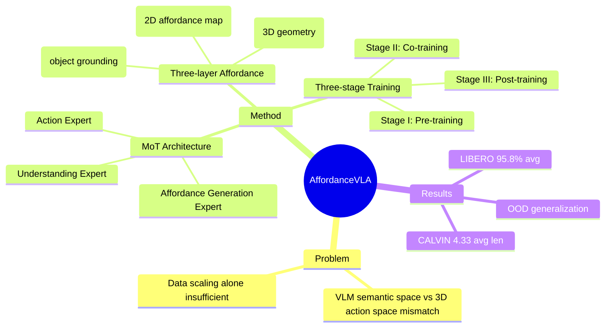

## Summary

AffordanceVLA 提出将结构化的 affordance 预测作为 VLA 的中间表示，通过 Which2Act、Where2Act、How2Act 三模块渐进式建模操作先验，在 LIBERO 达到 95.8% 平均成功率、CALVIN ABC→D 达到 4.33 平均链长，证明了 affordance 作为 perception-action 桥接的有效性。

## Problem & Motivation

现有 VLA 模型直接从 VLM 语义空间映射到 3D 物理空间的 action，存在结构性 mismatch：VLM 预训练对齐的是 vision-language semantic space，而机器人操作本质上是在 3D physical space 中执行。这种 gap 使得端到端映射学习困难，且单纯数据 scaling 无法解决根本的空间鸿沟。

作者的核心论点：**blindly scaling data fails to maximize the intrinsic power within datasets**，需要引入任务导向的中间表示来桥接 perception 和 action。Affordance——明确指示操作哪个物体、在哪里交互、如何交互——天然满足这一需求：spatially grounded（视觉）、semantically conditioned（语言）、action-coupled（执行）。

## Method

### Architecture: Mixture-of-Transformer (MoT)

三个专用 Expert：
1. **Understanding Expert**：基于预训练 VLM，对齐视觉感知和语言指令，输出 instruction-aware representation
2. **Affordance Generation Expert**：预测结构化 affordance tokens，包含 Which2Act、Where2Act、How2Act
3. **Action Expert**：基于 flow-matching 的 diffusion action decoder，生成连续 action chunks

采用 **UAA Progressive Attention**：单向因果注意力流（Understanding → Affordance → Action），防止 action 信息泄漏到预测阶段，保持 affordance 特征的纯度。

### 三层 Affordance 预测

1. **Which2Act**：物体级 grounding，通过 Flux VAE latent reconstruction 实现目标物体的视觉定位，抑制背景干扰
2. **Where2Act**：2D 交互定位，预测 affordance map（pixel-wise BCE loss），确定交互热点区域
3. **How2Act**：3D geometric reasoning，包含 shape generation（diffusion denoiser）和 layout regression（10-DoF: rotation, scale, translation）

### 三阶段训练策略

- **Stage I**：General Affordance Grounding Pre-training，使用 AGD20K、RefSpatial、PRISM 等 VQA 数据，冻结 Understanding 和 Action Expert，仅训练 Affordance Generation Expert
- **Stage II**：Affordance-Augmented Robotic Data Co-Training，使用 InternData-A1，解冻全部 Expert，联合优化 action loss 和 affordance loss（λ_act=1.0, λ_afd=0.5）
- **Stage III**：Target Task Post-Training，适配特定下游 benchmark（LIBERO/CALVIN），进一步 anneal affordance weight（λ_afd=0.15）

### Data Augmentation Pipeline

针对机器人数据缺乏 affordance 标签的问题，设计了自动化标注流程：
- Keyframe detection（rule-based）
- Instruction decomposition（Claude Opus 4.5）
- Per-keyframe affordance annotation（Qwen3-VL + RexOmni + SAM + SAM-3D）
- 生成超过 100,000 条 affordance annotations

## Key Results

### LIBERO Benchmark（50 rollouts）

| Method | Spatial | Object | Goal | Long | Average |
|--------|---------|--------|------|------|---------|
| OpenVLA | 84.7 | 88.4 | 79.2 | 53.7 | 76.5 |
| Pi0 | 98.0 | 96.8 | 94.4 | 88.4 | 94.4 |
| F1-VLA | 98.2 | 97.8 | 95.4 | 91.3 | 95.7 |
| **AffordanceVLA (full)** | **98.6** | **98.4** | **96.2** | 89.8 | **95.8** |
| AffordanceVLA (w/o stage II) | 88.5 | 91.7 | 91.3 | 73.3 | 86.2 |

AffordanceVLA 在 Spatial、Object、Goal 三个 suite 均达到最高成功率，LIBERO-Long 略低于 F1-VLA（89.8 vs 91.3），整体平均 95.8% 为最高。

### CALVIN ABC→D Benchmark（1000 rollouts, OOD zero-shot）

| Method | 1/5 | 2/5 | 3/5 | 4/5 | 5/5 | Avg. Len |
|--------|-----|-----|-----|-----|-----|----------|
| Pi0 | 93.8 | 85.0 | 76.7 | 68.6 | 60.1 | 3.84 |
| Seer-Large | 96.3 | 91.6 | 86.1 | 80.3 | 74.0 | 4.28 |
| **AffordanceVLA (full)** | **96.8** | **92.0** | **87.5** | **80.8** | **75.9** | **4.33** |

AffordanceVLA 在 5-step 连续任务完成率达到 75.9%，平均链长 4.33，超越 Seer-Large（4.28）和 Pi0（3.84），证明 OOD 泛化能力。

### Ablation 关键发现

1. **Data-Only Control（No-Afd, Pi0 Arch）**：仅用 Stage II 数据训练 plain Pi0，LIBERO 92.4%，CALVIN 3.93，远低于 full model → 增益不能归因于数据量本身
2. **Frozen-Representation Control**：冻结 Stage I 的 Affordance Expert → LIBERO 67.1%，CALVIN 2.83，严重 collapse → affordance 必须与 policy **co-optimized**
3. **w/o Stage II**：CALVIN 降至 3.81 → Stage II 对 OOD 泛化至关重要

### Real-world Experiments

在真实机器人上测试：
- Basic manipulation：12/15 成功
- Instruction sensitivity：affordance grounding 使模型能正确响应细粒度指令差异（如 "pick up the red mug" vs "pick up the mug"）
- Long-horizon：通过 intent enrichment 展现 emergent 长序列执行能力

## Strengths & Weaknesses

### Strengths

1. **Insight 清晰**：识别出 VLM semantic space 和 embodied action space 的 structural mismatch，并提出 affordance 作为天然桥接，motivation 站得住脚
2. **设计简洁**：三层 affordance（Which/Where/How）progressive modeling，从 coarse-to-fine、2D-to-3D，结构清晰
3. **Ablation 充分**：通过 Data-Only Control、Frozen-Representation Control 等设计，严格区分数据贡献、架构贡献、表示贡献，回答了 Q1/Q2/Q3
4. **数据工程**：自动化 affordance 标注 pipeline 解决了 label scarcity 问题，实用价值高

### Weaknesses

1. **复杂度较高**：三 Expert + 三 Stage + 三 Affordance 模块，训练流程繁琐，落地门槛高
2. **LIBERO-Long 略弱**：在长 horizon 任务上仍低于 F1-VLA，可能缺乏 explicit long-term memory
3. **依赖外部模型**：标注 pipeline 依赖 Claude Opus 4.5、Qwen3-VL、RexOmni、SAM 等，成本和依赖性较高
4. **未见与 π_0.5/π_0.7 的直接对比**：后者同样引入 train-only intermediate supervision（bounding box），但未在实验中对比

## Mind Map

## Notes

- 与 CoA-VLA、AffordDP 的区别：前者将 affordance 作为 external cue，AffordanceVLA 将其 **internalize** 到 VLA 内部，与 policy co-optimize
- Frozen-Representation Control 的 collapse 现象值得深思：static affordance representation 无法适应 embodied control space，说明 affordance 需要在 action learning 过程中动态演化
- 三阶段训练的 annealing strategy（λ_afd: 0.5 → 0.15）反映了对 affordance supervision 的渐进退火，优先 precise control adaptation
- 数据 augmentation pipeline 的设计思路（LLM instruction decomposition + VLM affordance annotation）可作为类似工作的参考