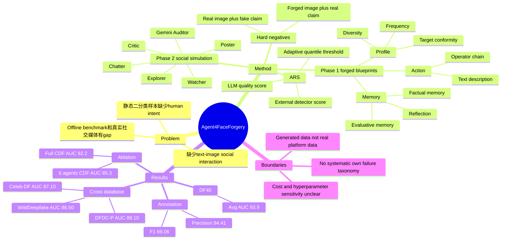

## Summary

Agent4FaceForgery 用 LLM-powered multi-agent simulation 生成更接近真实社交媒体语境的 face forgery multimodal training data：先模拟带 profile / memory / action 的伪造者迭代生成 forged blueprint，再用多角色 social simulation 构造 text-image consistency 样本。核心贡献不是新的 detector backbone，而是一个数据生成与筛选框架；作者报告它能提升 CLIP / MLLM / ViT / CNN 等检测器在 cross-dataset 和 unseen manipulation 上的泛化。

## Problem & Motivation

论文要解决的是 face forgery detection 中 offline benchmark 与真实线上场景之间的 gap。作者认为现有 FF++、DFDC、Celeb-DF 等数据集多是静态、 curated 的二分类样本，难以覆盖真实伪造的两个关键因素：伪造者的 diverse intent / iterative creation process，以及社交媒体中的 adversarial text-image interaction。

这个问题对 VLM / MLLM 有直接关联：现实 deepfake 判断往往不只是“图片真伪”，还包括评论、声称、转发语境与图像证据是否一致。论文因此把任务从 image-level binary classification 扩展到 multimodal sample construction：每个样本包含 image、text description、image authenticity label $y$，以及 text-image consistency label $\delta$。

## Method

**总体框架。** Agent4FaceForgery 分两阶段。Phase 1 生成 forged blueprint：每个 agent 基于 Profile、Memory 和 Action modules 生成 forged image $x'$ 与初始 textual description $c'$。Phase 2 做 Social Interaction Trajectory Collection：把 forged image / description 投入模拟社交环境，让不同角色产生评论、转发、质疑或误导性陈述，并据此构造 text-image consistent / inconsistent 的正负样本。

**Profile module.** Agent profile 从 FF++ benchmark 初始化，用三类量化 trait 描述伪造者倾向：Forgery Frequency、Methodological Diversity、Target Conformity。另有 qualitative stylistic preference，由 GPT-4V 分析某个 creator 的 forgery samples 后生成。作者把这组 profile 视为 agent 的 "forgery gene"，用来影响工具选择、伪造对象和风格偏好。

**Memory module.** Memory 分为 factual memory 和 evaluative memory。前者记录历史编辑的客观细节，后者记录主观质量评价，例如 seam visibility 或 blending quality。agent 会对成功和失败的 attempts 进行 memory writing / retrieval / reflection，用于后续 rounds 中调整伪造计划。

**Action module and toolbox.** Action 被定义为视觉编辑 `Edit(.)` 与文本描述 `Desc(.)` 的组合。视觉编辑由 operator chain 组成，工具类别包括 Identity Manipulation（DeepFaceLab、FaceSwap）、Attribute & Expression Editing（StarGAN、AttGAN）和 Style-Based Synthesis（SBI），正文也提到 Flux Pro 与 Deepfake APIs。text description 可以是准确 caption，也可以是故意误导的 claim。

**Adaptive Rejection Sampling (ARS).** 为保证数据质量和难度，候选 blueprint 用融合分数 $s_i = \lambda s_i^{LLM} + (1-\lambda)s_i^{disc}$ 筛选，其中 $s_i^{disc}$ 来自外部 forgery detector，$s_i^{LLM}$ 来自 agent 内部质量评估。ARS 先用 fixed lenient threshold 做 warm-up，之后把 threshold 更新为已接受样本分数的 $q$-quantile，从而逐步保留更困难、更高质量的样本。

**Social simulation and hard negatives.** 社交环境包含 Watcher、Explorer、Critic、Chatter、Poster 等角色，并额外设置 Gemini Auditor 生成 intentionally deceptive statements，例如把明显 spliced image 声称为 "100% authentic"。这些交互用于构造 hard negative text-image pairs：例如 forged image 配上“完全真实”的文本，或 real image 配上“明显伪造”的文本。

## Key Results

**Cross-database evaluation (Table 1).** 所有模型从 FF++(HQ) 训练，测试 FF++、DFD、DFDC-P、WildDeepfake 和 Celeb-DF，指标为 frame-level AUC / EER。Ours 在 FF++ 为 99.50 AUC / 2.97 EER；在 DFD 为 93.25 / 13.04，低于 FFTG 的 94.79 AUC 但 EER 更低；在 DFDC-P、WildDeepfake、Celeb-DF 分别达到 88.10 / 19.19、86.50 / 21.87、87.10 / 20.12，均高于表中其他 baselines 的 AUC。

**DF40 robustness (Table 2).** 在 DF40 protocol 的 six manipulation techniques 上，Ours 的 frame-level AUC 为 uniface 96.3、e4s 92.4、facedancer 92.9、fsgan 94.8、inswap 92.4、simswap 94.6，平均 93.9。对比最强 baseline ProgressiveDet 的 Avg. 78.7 和 RECCE 的 Avg. 78.1，作者据此说明 agent-generated data 覆盖了更广 forgery traces。

**Annotation and downstream evaluation (Table 3).** 与 w/o Text、DD-VQA human annotations、GPT-4o-mini annotations 相比，Ours 的 annotation Precision / Recall / F1 为 94.41 / 60.04 / 69.06；CLIP Evaluation 的 AVG-AUC / AVG-EER 为 91.23 / 16.35；MLLM Evaluation 中 FF++-ACC 为 96.35、Celeb-DF ACC 为 77.98，explanation quality Precision / Recall 为 89.02 / 59.02。这里的主要 signal 是 agent simulation 生成的 multimodal annotations 同时提升了 annotation quality 与下游 detector performance。

**Sequential training with A4FF data (Table 4).** 加入 Agent4FaceForgery data 后，Phi-3.5 AUC 从 81.5 到 90.4、EER 从 25.3 到 19.0；Qwen-VL 2.5 AUC 从 82.7 到 91.7、EER 从 26.1 到 18.4；LLaVA AUC 从 83.2 到 92.2、EER 从 24.8 到 16.8。这个结果支持作者把 A4FF 定位为 data augmentation framework，而不是只绑定单一 backbone。

**Backbone generality (Table 5).** Xception 加 Agent data 后，在 WDF 上 AUC 从 66.17 到 73.14，在 DFDC-P 上从 69.80 到 77.64；EN-B4 分别从 61.04 到 73.78、70.12 到 80.04。ViT-B 在 CLIP + Agent 设置下达到 WDF 86.50 AUC / 21.87 EER、DFDC-P 88.10 AUC / 19.19 EER，和 Table 1 中 Ours 的主结果一致。

**Module ablation (Table 6).** LLaVA baseline 在 CDF / DFD / DFDC 上的 AUC 分别为 51.8 / 69.3 / 57.4。Only FT 提升到 83.2 / 91.5 / 82.5；Only ARS 为 88.0 / 92.1 / 84.2；Only PNS 为 91.0 / 93.8 / 85.5；full system 为 92.2 / 94.9 / 86.7，并在三个数据集上取得最低 EER（16.8 / 15.7 / 19.5）。这说明 Forgery Tree simulation、ARS 和 Positive-Negative Sample construction 都有独立贡献。

**Social simulation scale (Table 7).** 无 social simulation baseline 在 DFD / Celeb-DF 上为 88.1 / 74.5 AUC，耗时 3.8h。2、4、6 agents 逐步提升到 DFD 89.8 / 91.3 / 92.8 和 Celeb-DF 77.9 / 81.5 / 85.3；12 agents 只进一步到 93.0 / 85.8，但耗时升到 7.5h。作者因此选择 6 agents 作为性能与成本的折中。

## Strengths & Weaknesses

**已知 Strengths.** 这篇论文最有价值的地方是把 face forgery data generation 从单张图像伪造推进到“伪造者 intent + iterative editing + social context”的组合模拟。Profile / Memory / Action 的拆分让数据生成过程有可解释的控制变量，而 ARS 给出了一个逐步筛选高难样本的机制；这些设计比简单用 GPT-4o 给现有图像写 annotation 更贴近作者的问题定义。

**已知 Strengths.** 实验覆盖面比较完整：Table 1 做 cross-database generalization，Table 2 做 DF40 unseen manipulation robustness，Table 3 对比 human / GPT annotation，Table 4-6 证明 A4FF data 对多个 backbone 和核心模块有效，Table 7 讨论 agent 数量与时间成本。特别是 Table 6 中 Only FT、Only ARS、Only PNS 的分离 ablation，让“social context / hard negatives 是否有用”这个 claim 有直接证据。

**已知 Weaknesses / boundary.** 论文的主结果仍建立在 generated data augmentation 上，不能直接证明模拟社交互动完全等价于真实社交媒体传播。Profile 初始化依赖 FF++ creator statistics，toolbox 也由已知 face manipulation operators 组成，因此数据多样性受源数据和工具集合限制。实验报告了 cross-dataset 和 DF40 robustness，但没有看到真实平台数据、长时间传播链、用户网络结构或真实评论分布的定量验证。

**已知 ablation / cost boundary.** Social simulation agent 数量增加存在 diminishing returns：6 agents 到 12 agents 时 Celeb-DF AUC 只从 85.3 到 85.8，时间从 6.1h 到 7.5h。Figure 3(b) 还显示 social environment 配置会影响 detector：HighCritic 给出最强 Inconsist. Acc. / CDF Acc.，HighChatter 会 degrade performance，说明“更多社交噪声”不必然更好。

**已知 failure evidence.** 论文给出的 qualitative challenge scenario 主要展示 O3 Pro 和 fine-tuned LLaVA 把 fake image 判断为 real，而 Agent4FaceForgery 能指出 skin texture artifacts；这属于 baseline failure case，而不是 Agent4FaceForgery 自身的失败分析。论文没有系统报告 Agent4FaceForgery 在什么 forgery type、social role、text-image mismatch pattern 或 backbone 上仍然失败最多。

**推测.** 对 GUI-agent / web-agent 研究的启发不是 face forgery detection 本身，而是 multi-agent simulation 作为“生态有效数据生成器”的思路：如果能把 user profile、memory、action toolbox 和 adversarial social context 换成 GUI task creation / user behavior / web environment，也许可以生成比静态 instruction-following 数据更接近真实交互的数据。但这个迁移需要证明模拟分布确实覆盖真实 GUI / web 行为，而本文只在 face forgery domain 给出证据。

**不知道.** 不知道 A4FF 生成约 25k image-text pairs 的成本、失败率、人工审核需求和复现难度；正文也没有给出公开代码链接。也不知道 ARS 中 $\lambda$、quantile $q$、warm-up size、agent profile sampling 等超参对最终泛化的敏感性，或换用 GPT-4V / LLaVA 以外的 agent cognitive core 时结果是否稳定。

## Mind Map

## Notes

- 这篇不应被当成 face forgery detector architecture paper 来读；更准确的定位是 agent-generated multimodal data pipeline。
- 值得借鉴的是它把“生态有效性”具体化为三类变量：creator intent、iterative editing history、social text context。这个 framing 对 GUI / web agent 数据生成也可能有价值。
- 需要谨慎的是，论文的 social simulation 是为了生成更难的 text-image consistency 样本，不等于真实传播动力学模型；目前没有真实社交网络层面的验证。
