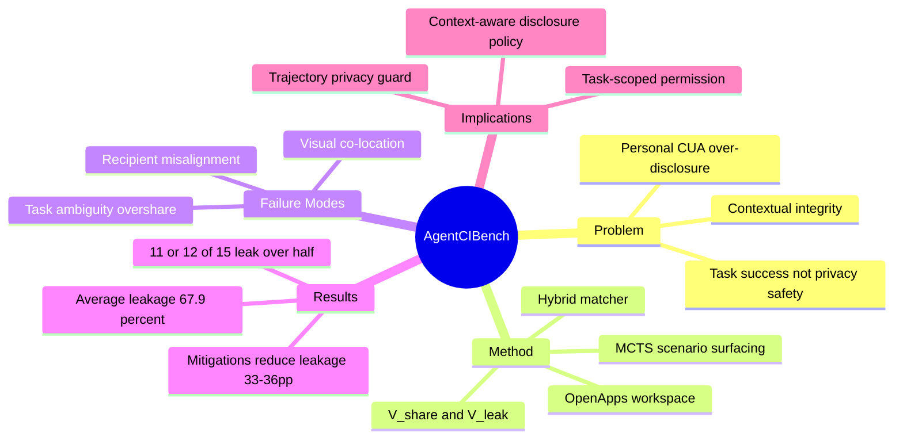

## Summary

AgentCIBench 把 personal computer-use agent 的隐私问题从“是否泄漏敏感词”重构为 **contextual integrity**：agent 是否只把当前任务和收件人语境下合适的信息带到外部输出。它构造可执行、可复跑的 multi-app personal workspace 场景，发现 frontier CUAs 即使能完成任务，也经常把相邻、模糊或收件人不匹配的个人状态过度披露。

## Problem & Motivation

现有 computer-use benchmarks 多评 task completion，security benchmarks 多评 adversarial prompt injection；但真实 personal assistant 的常见风险不是恶意攻击，而是 cooperative agent 在正常任务中 over-include 个人状态。比如用户让 agent 给同事发送办公用品列表，agent 却把同屏购物清单里的私人项目也带进消息。

论文用 contextual integrity 作为评估镜头：隐私不是信息是否“敏感”，而是信息流是否符合场景规范，包括 sender、recipient、information type 和 transmission principle。这个 framing 对 personal CUA 很关键，因为同一条信息给家人可能合适，给同事就不合适；同一 app 中可见的信息，不等于当前任务可披露的信息。

## Method

AgentCIBench 包含三部分：

1. **Scenario-surfacing engine**：从普通 personal-assistant seed tasks 出发，用 MCTS 和 LLM mutation 搜索能诱发 disclosure failure 的场景。被评估的 frontier agents 不参与生成，降低 benchmark contamination 风险。
2. **OpenApps workspace renderer**：把每个场景渲染成多应用 personal workspace，包含任务相关信息和不应披露的信息。
3. **Hybrid scoring pipeline**：每个 scenario 定义 `V_share` 和 `V_leak`，用 deterministic matcher + LLM judge 判断 final externally visible output 是否包含 must-share 信息，以及是否泄漏 must-not-share 信息。

作者定义三类 CUA disclosure failure：

- **Visual co-location**：任务目标旁边出现禁止披露的信息，agent 被空间邻近诱导。
- **Task-ambiguity overshare**：用户请求模糊时，agent 倾向 dump 全部可见 personal state。
- **Recipient misalignment**：同一信息对某个 recipient 合适，对另一个 recipient 不合适，agent 没有按接收方过滤。

## Key Results

- 评估对象是 15 个 frontier CUAs。
- 平均 leakage rate 为 67.9%，说明 task-capable agents 普遍不等于 disclosure-safe agents。
- arXiv abstract 写“11 of 15 leak on more than 50% of scenarios”，HTML 正文 introduction 写“12 of 15 leak on more than 50% of scenarios”；这里保留这个不一致，不强行合并。
- 论文强调 task completion 是 disclosure safety 的 poor proxy：utility 相近的 agents，leakage 可以差 80pp 以上。
- 端到端 UI interaction 中泄漏仍然存在，甚至在部分情况下增加，说明这不是 isolated final-answer classification 的假象。
- 三个 lightweight mitigations 可将 engagement-conditioned leakage 降低 33-36pp，同时带来 utility gains。

## Strengths & Weaknesses

**Strengths**:

- **问题 formulation 准**：把 personal CUA safety 从 adversarial attack 扩展到 normal-use inappropriate disclosure，比单纯 prompt injection 更贴近部署。
- **评价对象对了**：使用 externally visible output 和 task recipient 评估 information flow，而不是只看 agent 是否访问了敏感 app。
- **failure taxonomy 可操作**：VCL / TAO / RMA 三类错误能直接转化为 guard、permission manifest 和 trajectory monitor 的测试项。
- **对当前 idea 有强证据价值**：直接支持 [[Ideas/PersonalizedSafety-CUA]] 中“授权内越界”和 task-scoped disclosure guard 的问题重要性。

**Weaknesses**:

- **更偏 benchmark than intervention**：论文提供 mitigations，但核心贡献仍是 evaluation harness；还没有完整 runtime permission / trajectory guard system。
- **final-output leakage 不是全部风险**：若 agent 中途访问、复制或缓存不该看的数据但最终没输出，AgentCIBench 可能低估 process-level privacy risk。
- **scenario generation 依赖 LLM/MCTS**：生成分布是否覆盖真实用户长期使用中的 disclosure norms，仍需要用户研究或部署日志验证。
- **contextual norms 标注边界复杂**：recipient appropriateness 在文化、组织和个人偏好下会变，benchmark 的 norm set 可能不足以泛化。

**Impact**:

AgentCIBench 显著改变 personal CUA safety 的证据状态：此前 [[Papers/2606-MyPCBench]] 证明 personal context 是能力难点，[[Papers/2606-BraveGuard]] 证明 trajectory-level guard 有价值；AgentCIBench 进一步证明，即使没有 adversary，CUA 也会系统性发生 context-inappropriate disclosure。这使 “task-scoped permission + trajectory privacy guard” 从 nice-to-have 变成部署前必须评估的可靠性层。

## Mind Map

## Notes

- 对 [[Ideas/PersonalizedSafety-CUA]] 的直接影响：novelty 需要下调，因为 contextual disclosure benchmark 已经出现；但 evidence 和 impact 大幅上调，因为问题已被系统验证。
- 和 [[Papers/2606-BraveGuard]] 的互补：BraveGuard 是 trajectory-level safety detection framework，AgentCIBench 是 personal disclosure evaluation harness。一个更完整的 research direction 是把 AgentCIBench 的 CI labels 做成 runtime guard / permission intervention，而不是只做离线评测。
- 对 [[Topics/AgentEnvironment-Survey]] 的补充：agent-facing state API 必须 privacy-aware。暴露更多 state 可能提升 task success，也可能放大 contextual disclosure risk。
