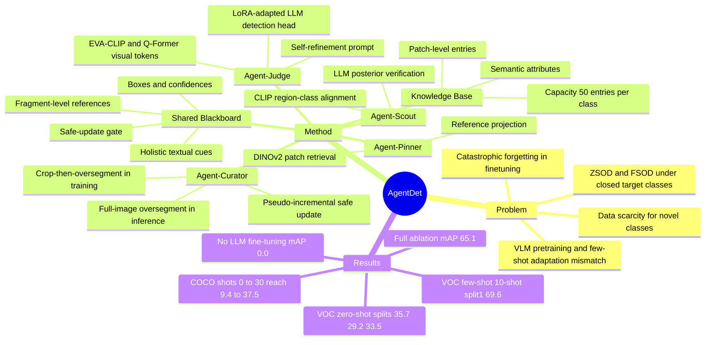

## Summary
AgentDet 把 zero-/few-shot object detection 统一为一个 shared-blackboard multi-agent 流程：Agent-Scout 产生 holistic textual cues，Agent-Pinner 检索 fragment-level visual references，Agent-Curator 维护 pseudo-incremental Knowledge Base，Agent-Judge 用 visual tokens 和 LLM 输出检测框。已知结果是，AgentDet-Qwen3-8B 在 PASCAL VOC few-shot 的 Novel Split 1/2/3 的 10-shot mAP 分别达到 69.6 / 59.5 / 63.9，在 PASCAL VOC zero-shot 三个 split 上达到 35.7 / 29.2 / 33.5，在 COCO 0/1/3/5/10/30-shot 上达到 9.4 / 10.8 / 16.1 / 23.9 / 31.6 / 37.5。

## Problem & Motivation
论文关注 closed set target classes 下的 ZSOD/FSOD：novel classes 没有训练样本，或每类只有 K 个 labeled instances。作者认为两个核心困难是 data scarcity 和 catastrophic forgetting：传统 FSOD 依赖 transfer learning、meta-learning 或 data augmentation，在 novel-class samples 很少且 base/novel gap 较大时不稳定，也容易在 finetuning 中遗忘 base knowledge。

另一个动机是现有 VLM / LLM-based detection 方法和标准 ZSOD/FSOD protocol 之间存在错位。Grounding DINO 等 VLM 有较强 zero-shot 能力，但依赖大规模 visual pretraining；HyperSeg、FM-FSOD、LLaFS 等方法要么难以适配标准 FSOD benchmark，要么没有充分利用 LLM 的 language reasoning，或需要额外监督。AgentDet 的 problem formulation 是：不要把 zero-shot 和 few-shot 分开做，而是用同一个架构在 KB 中累积 fragment-level evidence，并在 few labels 到来时平滑转入 FSOD。

## Method
AgentDet 由一个 persistent Knowledge Base 和一个 transient Shared Blackboard 连接四个 agents。KB 存 patch-level entries，包括 visual embedding、spatial descriptor、semantic attributes 和 matching score；Shared Blackboard 在单次 inference episode 中保存 holistic cues、retrieved references、predicted boxes/confidences、agent readiness flags 和 safe-update gate。

**Agent-Scout** 负责产生 holistic textual cues。它对 query image 做 multi-scale / multi-aspect-ratio region cropping，用 CLIP visual encoder 编码 patches，并用 CLIP text encoder 编码 `"a photo of a <class>"` prompts；若某类在区域上的相似度超过阈值，再经过可选 LLM posterior verification，形成 `Ctarget` 和类别分数，写入 Shared Blackboard。

**Agent-Curator** 负责构建和更新 KB。训练时有 ground-truth boxes，先 crop annotated regions，再在 crop 内 over-segmentation，以减少 attribute noise 和 background contamination；每个 class 保存 top-3 matched attributes，并用 last-place elimination 将每类 KB capacity 控制在最多 50 entries。推理时没有 novel-class boxes，因此对整张 query image over-segmentation，再通过 query-KB similarity、crop-class similarity 和 attribute score 的 consistency gate 决定 safe write、defer 或 decay；作者称这个过程为 pseudo-incremental maintenance。

**Agent-Pinner** 负责 fragment-level retrieval。它用同样的 over-segmentation 处理 query image，用 DINOv2 编码 query patches 和 KB entries，按 dot-product similarity 取超过阈值的 KB patches，再把 spatial descriptors 和 semantic attributes 拼接后经 learnable projection 转成 references，写入 Shared Blackboard。

**Agent-Judge** 是唯一直接输出 detections 的 agent。它用 EVA-CLIP + Q-Former 得到 query image 的 visual tokens，把 `Ctarget`、retrieved references 和输出格式拼入 prompt，由 LoRA-adapted LLM 生成 initial bounding boxes，再用 refinement prompt 生成 final boxes；confidence 由 token sequence probability 计算并经阈值过滤。训练阶段使用 unified detection loss，只更新 Agent-Judge 的 image encoder 和 LLM-based detection head；论文实验使用 Llama3.1-8B-Instruct、Qwen2.5-7B 和 Qwen3-8B 作为 LLM backbones。

## Key Results
- **PASCAL VOC few-shot / Table 1.** AgentDet-Qwen3-8B 在 Novel Split 1 的 1/3/5/10-shot mAP 为 56.5 / 64.2 / 68.5 / 69.6；Novel Split 2 为 39.8 / 50.2 / 54.1 / 59.5；Novel Split 3 为 49.9 / 55.7 / 60.9 / 63.9。对比强 baseline，ICPE 在 Split 1 的 10-shot 为 66.3，FM-FSOD 在 Split 1/2/3 的 10-shot 为 61.2 / 58.7 / 62.6，LLMdet 为 60.8 / 59.0 / 61.0。
- **PASCAL VOC zero-shot / Table 3.** AgentDet-Qwen3-8B 在三个 novel splits 上为 35.7 / 29.2 / 33.5，AgentDet-Qwen2.5-7B 为 33.8 / 28.8 / 31.9，AgentDet-Llama3.1-8B 为 30.2 / 24.9 / 31.0。表中 VLM baselines 包括 Qwen2.5-VL-7B 的 26.2 / 23.6 / 23.6、Qwen2.5-VL-7B-ft 的 27.4 / 22.7 / 25.0、InternVL2.5-7B 的 0.8 / 0.7 / 0.7 和 LLaVA1.5-7B 的 0.0 / 0.0 / 0.0。
- **COCO few-shot and zero-shot / Table 2.** AgentDet-Qwen3-8B 在 0/1/3/5/10/30-shot 上为 9.4 / 10.8 / 16.1 / 23.9 / 31.6 / 37.5；AgentDet-Qwen2.5-7B 为 9.2 / 10.0 / 15.8 / 23.4 / 31.3 / 36.8；AgentDet-Llama3.1-8B 为 8.8 / 9.3 / 15.9 / 22.2 / 29.5 / 31.7。需要注意：30-shot 下 LLMdet 表中为 37.8，高于 AgentDet-Qwen3-8B 的 37.5；AgentDet 的优势更清楚地体现在 0-shot、1-shot、5-shot 和 10-shot 等更低 shot regime。
- **Ablation / Table 4 and Table 5.** PASCAL VOC 10-shot setting 下，完整 AgentDet 报告 65.1 mAP；Table 4 的正文解释显示 Q-Former fine-tuning、KB integration、LLM fine-tuning 和 Agent-Scout 都是关键组件，其中移除 LLM fine-tuning 会降到 0.0 mAP，移除 Agent-Scout 的变体为 30.2 mAP。Table 5 中，去掉 query-stage multi-scale segmentation 为 56.9，去掉 training-stage multi-scale segmentation 为 55.4，去掉 minimum enclosing rectangle 为 49.7，去掉 filter 为 61.3，均低于完整 65.1。
- **Agent-Scout preprocessing / Figure 4.** 在允许 one-class margin of error 时，Agent-Scout 的类别检测准确率在 COCO 上为 89.67%，在 PASCAL VOC 上为 93.97%。

## Strengths & Weaknesses
**已知的强点。** 论文把 ZSOD 和 FSOD 放进同一个 execution loop，并明确区分 long-term KB 与 per-image Shared Blackboard；这比单纯把 LLM 当 static classifier 更接近可持续更新的视觉记忆系统。实验同时覆盖 PASCAL VOC few-shot、PASCAL VOC zero-shot 和 COCO 0-30 shot，并与传统 FSOD、foundation-model FSOD、LLM-based detector 和 general VLM baselines 比较。Ablation 覆盖 Q-Former fine-tuning、KB、LLM fine-tuning、Agent-Scout、multi-scale segmentation、minimum enclosing rectangle 和 filtering，能支持核心模块确实贡献性能。

**已知的局限。** 方法依赖多个 frozen / pretrained components，包括 CLIP、DINOv2、EVA-CLIP 和 LLM backbone；因此它不是一个从零学习的 low-data detector，而是把 foundation-model priors 组织进 ZSOD/FSOD protocol。论文主要在 PASCAL VOC 和 COCO 自然图像检测上验证，没有 GUI element detection、web/mobile grounding、robot perception 或 embodied benchmark；因此对 GUI-agent / embodied-agent 的价值目前是间接启发，不是已验证迁移。COCO 30-shot 结果也不是全表最佳，AgentDet-Qwen3-8B 的 37.5 低于 LLMdet 的 37.8。

**推测。** Shared Blackboard + KB 的分工可能对 GUI grounding 有启发：Scout 类似候选 UI object / semantic cue generator，Pinner 类似跨页面或历史状态的 fragment retrieval，Judge 类似最终 action-relevant localization verifier。但论文没有在 GUI screenshots 或 interactive environments 上测试，所以这只是架构层面的类比。

**不知道 / 未报告。** 论文正文和首页没有给出 arXiv id、DOI 或 code link。文中没有系统列出 qualitative failure cases，也没有报告 latency、token cost、KB update 误写率、不同 KB capacity 下的性能曲线，或 pseudo-incremental inference 在长期 unlabeled streams 中是否会累积错误。Agent-Judge 的 prompt 模板、confidence threshold 和若干超参数细节需要补充材料才能完整复现。

## Mind Map

## Notes
这篇论文对我的主要启发不是“multi-agent”这个命名本身，而是把 detection 拆成 semantic candidate generation、fragment retrieval、memory curation、final localization 四个可检查环节。对于 GUI-agent，更值得借鉴的是这种可分解的 grounding pipeline：不要直接让一个 VLM 从 screenshot 到 action，而是让候选元素、局部证据、历史记忆和最终判定各自留下中间状态。

需要继续追问的是 pseudo-incremental KB 的错误累积问题。论文用 consistency gate 和 filter 做 safe update，但没有报告长期 unlabeled inference stream 下的 drift；如果迁移到 GUI 或 web agent，错误写入 KB 可能会把偶发 UI 误识别固化成后续决策偏差。
