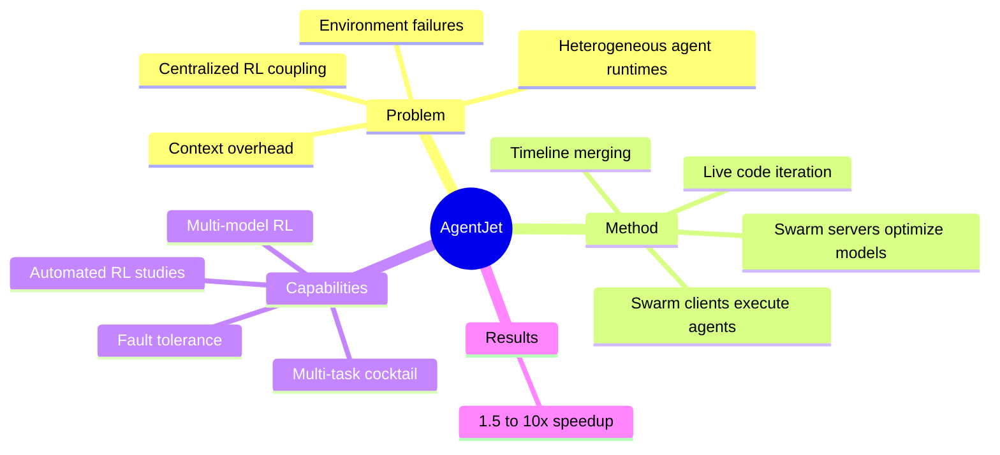

## Summary

> [未获取全文，仅基于 arXiv abstract]

AgentJet 是一个面向 LLM agent RL 的 distributed swarm training framework。它把 model optimization 的 swarm server nodes 和任意设备上执行 agent/environment 的 swarm client nodes 解耦，支持 heterogeneous multi-model RL、multi-task cocktail training、fault-tolerant execution 和 live code iteration，并用 context tracking + timeline merging 获得 1.5-10x training speedup。

## Problem & Motivation

> [未获取全文，仅基于 arXiv abstract]

Agentic RL 的瓶颈不只是算法，而是系统：rollout 需要外部环境、工具、浏览器、模拟器甚至多 agent 协作，这些执行端不稳定、异构、耗时且难以与 GPU training loop 紧耦合。集中式框架把 rollout 和 optimization 绑得太紧，难以支持多模型、多任务、多环境和 live iteration。

AgentJet 的 motivation 与 [[Papers/2606-AsyncWebRL]] 类似：agent RL 的 scaling 需要系统架构创新。但 AsyncWebRL 主要优化 visual web agent rollout throughput；AgentJet 则更 general，瞄准 swarm-style distributed agent training。

## Method

> [未获取全文，仅基于 arXiv abstract]

AgentJet 采用 decoupled multi-node architecture：

- **Swarm server nodes**：托管 trainable models，在 GPU clusters 上执行 optimization。
- **Swarm client nodes**：在任意设备上执行 arbitrary agents，可以连接各种 runtime 和 environment。

该架构支持：

1. heterogeneous multi-model RL，训练多个 LLM brain 的 multi-agent teams；
2. multi-task cocktail training，每个 agent runtime 隔离；
3. fault-tolerant execution，外部环境失败不打断 training process；
4. live code iteration，通过替换 client nodes 在训练中编辑 agent。

Context tracking module with timeline merging 会合并 redundant context，以减少 multi-turn/multi-agent context overhead。

## Key Results

> [未获取全文，仅基于 arXiv abstract]

- Context tracking + timeline merging 报告 1.5-10x training speedup。
- AgentJet 支持 multi-model、multi-turn、multi-agent RL。
- 作者还构建 automated research system：输入研究主题后可自主运行多天、大规模 cluster 上的 RL studies。

abstract 未给出具体 benchmark 数字，因此这里不补造成功率。

## Strengths & Weaknesses

**Strengths**:

- **系统问题切得准**：agent RL 的 bottleneck 常在 environment/runtime，而不在单个 optimizer。
- **异构性强**：不同模型、设备、runtime 可以并存，适合真实 agent experiments。
- **fault tolerance 是刚需**：GUI/Web/OS environments 都容易崩，训练系统必须容忍外部失败。

**Weaknesses**:

- **更像 infrastructure report**：abstract 中方法 insight 主要是架构解耦和 context merging，不是新的 RL credit assignment。
- **复现门槛可能高**：swarm cluster + 多 runtime 架构很适合大团队，不一定适合小实验室。
- **automated research claim 需谨慎**：能运行多天 RL studies 不等于能提出高质量研究问题。

**Impact**:

AgentJet 强化了一个趋势：Agentic RL 进入 infrastructure competition。对我们来说，除非有新的 verifier/reward/environment insight，否则单纯做 RL training framework 很容易陷入资源路线。

## Mind Map

## Notes

- 对 [[Topics/AgenticRL-Survey]] 的增量：RL training system 已从单环境 throughput 走向 heterogeneous swarm runtime。
- 对 Agent-Friendly Environment 的启发：如果环境协议标准化，swarm client 可以更容易接入 browser、desktop、mobile、lab simulator。
