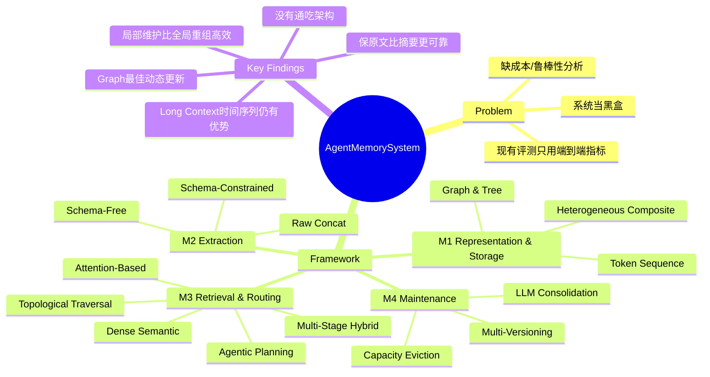

## Summary

从数据管理视角对 12 个 agent memory 系统进行系统性实验研究，将 agent memory 分解为四个核心模块（表示/存储、提取、检索路由、维护），在 5 种 workload / 11 个数据集上评测，核心结论：没有一种架构在所有场景通吃，memory 有效性高度依赖 workload 特性与结构匹配度；局部化 maintenance 比全局重组更具成本效益。

## Problem & Motivation

LLM agent 的 memory 系统快速演进，从简单 RAG 扩展为支持持久存储、更新、整合与生命周期管理的数据管理系统，但现有评测仍停留在端到端任务成功指标（F1、BLEU），将系统当黑盒处理。具体缺陷有四：(1) 许多代表性架构（MemoChat、MemTree、LightMem 等）从未在统一 workload 下被评测；(2) 缺乏多维评估（证据级检索保真度、动态更新鲁棒性、长程稳定性）；(3) 未测量真实运营成本（索引构建时间、查询延迟）；(4) 把系统当整体而非分模块分析。

## Method

本文不提出新方法，而是构建系统性实验框架：

**四模块分解框架**（$\mathcal{M}_{sys} = \langle \mathcal{R}, \mathcal{S}, \mathcal{Q}, \mathcal{U} \rangle$）：
- **M1 - Memory Representation & Storage**：逻辑表示（Token 序列、Graph/Tree 拓扑、异构复合）× 物理存储（In-context register、单引擎 DB、多引擎异构存储）
- **M2 - Memory Extraction**：Raw 拼接、Schema-free 语义提取、Schema-constrained 结构化提取
- **M3 - Memory Retrieval & Routing**：Attention-based、Dense semantic、拓扑子图遍历、Agentic routing（函数调用/查询扩展）、多阶段混合执行
- **M4 - Memory Maintenance**：时间戳多版本化、容量驱动物理淘汰、LLM 语义整合（inline compaction / CRUD tool-calling）、持续参数优化

**被评测系统（12 个）**：MemoChat、Mem0、MEM1、MemAgent、MemTree、Zep、Mem0^g、Cognee、LightMem、SimpleMem、MemOS、MemoryOS、A-MEM、Letta（MemGPT）

**基准 workload（5 类 / 11 数据集）**：
- LoCoMo（多轮对话 QA，EM / Answer F1）
- LongMemEval（跨 session 记忆，Substring EM / ROUGE-L / LLM Judge Acc）
- DB-Bench/LifelongAgentBench（程序性数据库操作，EM / Task Success Rate）
- LongBench（长上下文 QA，Accuracy）
- 加上 retrieval fidelity（Recall@K）和 cost 评测

## Key Results

**RQ1 - 跨 workload 效果**：无单一系统全面领先。Zep 在 LongMemEval 的 Knowledge Update 达 44.4 Substring EM；MemOS 在 LoCoMo EM 11.5；Long Context 在 DB-Bench 达 48.20 EM，MemoChat Task Success Rate 55.40。Hybrid 系统（MemoryOS、MemOS）在全覆盖中最接近 Pareto 前沿。

**RQ2 - 检索保真度**：SimpleMem Recall@1 最高（39.0），但 A-MEM 和 MemTree 在 Recall@10 大幅领先（69.5/59.7），且对时间距离的衰减更鲁棒；Flat dense retrieval 随时间距增大急剧下降。

**RQ3 - 动态更新鲁棒性**：Graph 类方法（Zep: 44.4 Substr. EM；Cognee: 18.7 Substr. EM on Temporal Reasoning）最可靠处理知识更新；append-only 存储产生"过去幻觉"（返回 stale facts）。

**RQ4 - 长程稳定性**：SimpleMem 在 LongBench Short→Medium accuracy 几乎不变（35.2→34.9），Long Context 急降（42.6→19.0）；Flat dense RAG 在 LoCoMo 证据距离最大 bin 从 37.1 跌至 7.4。

**RQ5 - 运营成本**：LightMem（48.3 utility / 3.67s）和 MemTree（63.5 / 15.9s）效率最优；Cognee / Zep 虽 utility 最高（>84）但延迟 116-155s；Mem0、MemoryOS 在长上下文 workload 延迟 374-490s。核心结论：局部化维护（bounded write propagation）比全局重组高效得多。

**细粒度消融（M1-M4）**：
- M1: Raw text > Summary > Compressed（保真度关键）；hierarchy 改善访问但无法恢复已删除信息
- M2: 宽松提取（coarser segmentation）优于精细提取，保留双方对话比只保留用户端更稳定
- M3: Balanced hybrid fusion + lightweight planning 最优；planning 后加 reflect 反而略降
- M4: Conservative merge 优于 delayed flush；过激 consolidation 掩盖稀疏但重要的线索

## Strengths & Weaknesses

**亮点**：
- 领域内迄今最系统的 agent memory benchmark：12 个系统 × 5 种 workload × 11 数据集，覆盖端到端效果、检索保真度、更新鲁棒性、长程稳定性和成本五维度
- 四模块分解框架有概念价值，对后续系统设计提供了清晰的分析语言
- 细粒度消融设计合理（每次只改一个模块变量），结论可信度高
- 成本分析（延迟 vs utility Pareto）是实际部署的重要贡献，prior work 几乎不涉及

**局限**：
- 论文定位是"实验报告"而非方法创新，发现的多数结论（如 graph 处理动态更新更好）并不令人意外；主要价值在于量化和统一对比
- 只覆盖文本型记忆，不涉及多模态 agent（GUI agent 等）的 memory 需求——视觉观察、截图序列的 memory 设计完全不在讨论范围
- 数据集偏重对话 QA（LoCoMo、LongMemEval）和数据库操作（DB-Bench），缺少 web browsing、computer-use 类 agent workload
- 12 个系统多为"显式 memory 系统"，与 agentic RL 中 memory 的隐式演化（如 in-weights memory、KV cache compression）几乎无交集，框架的覆盖面存在天花板
- 评测数据集时间跨度有限，"长程"指的是 session 数量增长，不是真正意义上的数月/数年持续运行

## Mind Map

## Notes

- 这篇论文对 GUI / computer-use agent 的直接参考价值有限——GUI agent 的 memory 需求更多是视觉历史（截图、UI 状态变迁序列）而非文本对话，相关 benchmark 完全缺席
- 从 agent memory 角度，"localized maintenance is more efficient than global reorganization"这个结论值得内化：设计系统时应避免每次写入触发全局 reindex
- Zep 和 Cognee 在动态更新场景下的优势来自 temporal KG 的显式版本化——这是 append-only 类（Mem0、MemoryBank 等）的核心弱点，值得关注
- SimpleMem 的 No-Planning → Planning Only 改进幅度相当大（Recall +4.2pp），但 Planning + Reflect 反而下降，说明 over-deliberation 可能引入 noise——这和 CoT 研究中的 overthinking 现象一致
- 数据集和代码已开源（https://github.com/OpenDataBox/MemoryData），有条件在 GUI agent workload 上复现/扩展
