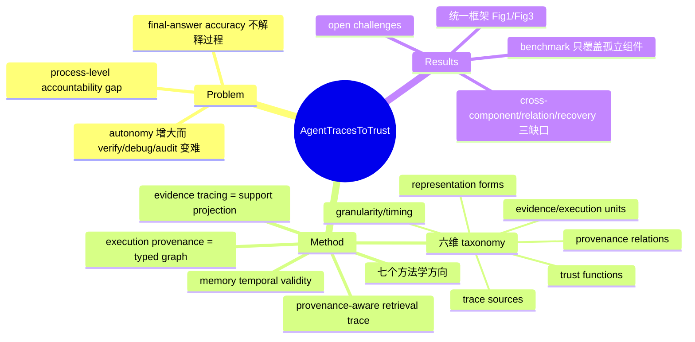

## Summary
这是一篇 LLM agent 可信性 survey，把 execution provenance（定义为 agent 一次运行的 typed graph）和 evidence tracing（该 provenance 在 evidence-support 关系上的投影）作为 process-level accountability 的基础，用一套六维 taxonomy 把 retrieval grounding、claim support、tool-use safety、memory lineage、observability、debugging、audit、recovery 统一到同一框架下。核心论点是：final-answer accuracy 只评估执行终点，无法解释输出如何产生、哪条证据支撑哪个 claim、tool call 是否正当、memory 如何影响后续决策、failure 从何而起。

## Problem & Motivation
LLM agent 从被动文本生成器演化为具备 planning / tool use / retrieval / memory access / 环境交互 / multi-agent 协作的自主系统；能力扩张的同时，行为变得更难 verify / debug / audit。作者指出的核心缺口是 **process-level accountability gap**：只看最终答案对不对，等于只观测执行的终点，看不到中间的证据链与执行依赖。survey 主张可信 agent 需要能够记录、连接并推理中间的 evidence 与 execution step 的机制，而现有工作分散在 RAG grounding、tool safety、memory、observability 等子领域，缺一个统一视角——这正是本文要提供的。

## Method
本文是 secondary literature，产出的是**框架 + taxonomy + 方法学地图**，不做实验。

### 核心定义
- **Execution provenance**（过程视角）：agent 一次运行的完整 typed 表示，含 evidence unit、execution unit（retrieved documents、tool calls、parameters、observations、memory accesses、intermediate claims、actions、inter-agent messages、final outputs），以及它们之间的 causal / procedural / dependency / update / contradiction / invalidation 关系。
- **Evidence tracing**（支撑视角）：把上述 provenance 结构投影到 evidence unit 与 agent claim / decision / action 之间的 evidence-support 与 influence 关系上。原文一句概括：execution provenance 是 process view，evidence tracing 是 support view。
- **Traceability vs provenance**：traceability 只让 artifact 可检视；provenance 更进一步，建模 artifact 之间的 typed relation。

### 六维 Taxonomy（Table 1）
1. **Trace sources**：产生 provenance artifact 的组件——reasoning、retrieval、tool use、MCP server/host 边界、memory、environment、multi-agent 通信。
2. **Evidence & execution units**：evidence unit 是能 support/contradict/invalidate/contextualize claim 的语义对象（documents、passages、observations、tool outputs、memory items、policies、intermediate claims）；execution unit 是描述 agent 做了什么的过程对象（reasoning step、retrieval call、tool invocation、生成的 parameter、memory read/write、environment action、inter-agent message、final output）。二者可交叠（tool output 既是执行结果又可作后续 claim 的证据）。
3. **Provenance relations**（把语义 grounding 与过程 dependency 分开）：Support、Derive、Depend-on、Contradict、Invalidate、Trigger、Update、Use、Generate。
4. **Tracing granularity & timing**：粒度从 run-level / step-level / tool-call-level / parameter-level / claim-level 到 token-span-level；时机分 pre-execution / runtime / post-hoc / continuous。
5. **Representation forms**：structured logs、execution graphs、evidence graphs、claim-support graphs、provenance graphs、runtime state。
6. **Trust functions**：verification、attribution、debugging、safety enforcement、audit、failure attribution、recovery。

### Memory 的 temporal validity（Section 5，本笔记关注点）
survey 明确提出 provenance-bearing memory 的规范：**一个 memory item 应记录它何时被创建或更新、由什么证据支撑、该证据是否仍然有效、以及是否被后来的观测所取代（superseded）**。展开为四类元数据：创建/更新元数据（timestamp、source type、authoring agent）、supporting evidence（生成该 memory 的原始 observation/document/tool call/reflection）、validity status（支撑证据是否仍 current 或已被 contradict）、supersession（是否已被更新观测 invalidate）。理由是 retrieved memory 会影响 task decomposition、answer generation、tool choice、argument construction、user modeling 与未来的 memory update，因此必须做时间维度追踪。

### Provenance-aware retrieval trace 结构（Section 5.2，本笔记关注点）
一个 provenance-aware retrieval trace 应记录：触发的 query 或 context、retrieved memory items、original sources、relevance signals、validity status，以及指向下游的 downstream links——claims、tool calls、actions、final answers 或后续 memory updates。它支撑两个关键功能：(a) **influence tracking**，memory 进入 context 后要追踪它塑造了什么、这种影响是否仍可辩护；(b) **selective invalidation**，当某 memory 变 stale / unsupported / private / contaminated 时，能定位受影响的 claim、action 与派生 memory。

### 七个方法学方向（body review）
provenance representation（跨执行层连接 entity/activity/agent/relation）、evidence attribution（区分 citation presence / relevance / support / contradiction / omission，判断"引用了"还是"真支撑了"）、tool-use provenance（追踪 argument lineage 与 source 可信度，用 information-flow control 阻断 untrusted data 流入敏感 tool parameter，防 indirect prompt injection）、runtime guardrails（pre-execution 验证 + post-execution 检查，需 parameter-level 追踪而非仅 tool-level 权限）、provenance-bearing memory（write-time source attribution + temporal validity + 冲突检测）、observability（结构化执行记录 + post-hoc failure localization）、failure diagnosis（用 annotated trace 把 failure 定位到具体 step/component/interaction）。

## Key Results
survey 无实验指标，其"结果"是对可信 agent 评测生态的判断与地图：

- **框架统一性**：把原本分散的 retrieval grounding、tool-use safety、memory lineage、observability、audit、recovery 收敛到 provenance/evidence-tracing 一个 typed-graph 框架，并用 Figure 3 展示一次运行（evidence acquisition → claim construction → tool execution → memory update → recovery）如何被表示成 typed provenance graph 而非扁平的时间线 transcript。
- **Benchmark landscape 及缺口**（Figure 5 热力图 + Table 4）：现有 benchmark 对 agent 行为的**孤立组件**覆盖较强——RAG 类 ALCE / FActScore / FEVER / RAGChecker；tool-use 类 ToolLLM / WebArena / AgentBench / τ-Bench / ToolEmu / InjecAgent / AgentDojo / OpenAgentSafety / MCP-SafetyBench；memory 类 MemoryArena；tracing 类 TRAIL / AgentTrace / AgentOps / AgenTracer / Aegis / LADYBUG。但**跨组件 provenance 的 full-stack 评测仍不成熟**。
- **三类系统性 gap**：(1) cross-component provenance 缺失——真实 failure 常跨组件传播，却少有 benchmark 评估完整链条；(2) relation annotation 缺失——benchmark 暴露了 trace 却很少标注 typed provenance relation；(3) recovery-oriented 评测缺失——只测 success/failure，很少评估 provenance 是否帮助系统修复执行。
- **Open challenges**：unified trace schema、semantic/claim-level provenance、memory 与 multi-agent provenance、runtime safety enforcement（online source tracking + dependency-aware policy）、realistic end-to-end execution-trace benchmark、privacy-aware audit infrastructure（trace 完整性 vs 隐私暴露与合规的权衡）。

## Evidence Ledger

| Claim ID | Claim | Type | Source locator | Evidence excerpt | Status |
|:--|:--|:--|:--|:--|:--|
| C1 | 定义 execution provenance 为 agent 运行的 typed graph，evidence tracing 为其在 evidence-support 关系上的投影 | causal-mechanism | Abstract | "We define execution provenance as the typed graph of an agent execution and evidence tracing as its projection onto evidence-support relations." | source-verified |
| C2 | Taxonomy 覆盖六个维度：trace sources；evidence and execution units；provenance relations；tracing granularity and timing；representation forms；trust functions | benchmark-setting | Abstract / Table 1 | "a taxonomy covering trace sources, evidence and execution units, provenance relations, tracing granularity and timing, representation forms, and trust functions" | source-verified |
| C3 | Provenance relations 含 Support/Derive/Depend-on/Contradict/Invalidate/Trigger/Update/Use/Generate | benchmark-setting | Section 3 (Provenance Relations) | "Support, Derive, Depend-on, Contradict, Invalidate, Trigger, Update, Use, Generate" | source-verified |
| C4 | memory item 应记录创建/更新时间、支撑证据、证据是否仍有效、是否被后续观测取代 | causal-mechanism | Section 5 (memory) | "A memory item should record when it was created or updated, what evidence supported it, whether that evidence remains valid, and whether later observations superseded it." | source-verified |
| C5 | provenance-aware retrieval trace 应记录 query/context、retrieved items、original sources、relevance signals、validity status 与下游 links | causal-mechanism | Section 5.2 | "A provenance-aware retrieval trace should record the triggering query or context, retrieved memory items, original sources, relevance signals, validity status, and downstream links..." | source-verified |
| C6 | 方法学方向含 provenance representation / evidence attribution / tool-use provenance / runtime guardrails / provenance-bearing memory / observability / failure diagnosis | benchmark-setting | Abstract | "provenance representation, evidence attribution, tool-use provenance, runtime guardrails, provenance-bearing memory, observability, and failure diagnosis" | source-verified |
| C7 | full-stack 的 evidence-tracing/provenance 评测仍不成熟，现有 benchmark 只覆盖孤立组件 | comparison | Benchmarks / Figure 5 | "benchmarks provide strong coverage of isolated components but lack end-to-end coverage across evidence labels, tool calls, memory..." | source-verified |

*7/7 高风险 claim 由独立 verifier agent 定位原文并判为 source-verified（仅表示 primary source 一致性，不表示领域已复现或形成共识）。Figure 5 图本身未逐格独立读取，但其对应正文断言已被 corroborate。*

## Strengths & Weaknesses
**亮点**：(1) 概念清晰——execution provenance / evidence tracing 的 process view vs support view 二分，以及 evidence unit / execution unit 的对偶（并承认二者可交叠），是这类跨子领域 survey 少见的 first-principles 切法，把"记录了什么"和"什么支撑什么"分开，避免把 chronological logging 与 semantic provenance 混为一谈。(2) provenance relation 用 typed edge（尤其 Invalidate / Update / Supersede）把时间维度显式化，为"stale evidence 的选择性失效"提供了可操作的表示。(3) memory 的 temporal-validity 规范与 retrieval trace 结构写得足够具体，可直接落成 schema。

**局限**：(1) 作为 survey 它是**规范性/组织性**的，几乎所有"应该记录 X"都是 prescriptive 设计主张而非被验证的经验结论——没有证据表明记录这些字段真能提升 audit/recovery 成功率，六维 taxonomy 也是先验分类学（存在无限细分风险，符合本 notebook "claim 不应建在先验分类学上"的告诫）。(2) 未给出 provenance overhead 与 deployability 的定量权衡，"trace completeness must be balanced against deployability"停留在口号。(3) 跨组件 end-to-end provenance 被列为最大 gap，恰说明本框架当前主要是愿景，尚无系统实现全链条闭环。**潜在影响**：为"agent 可信状态转移"的 problem formulation 提供了统一词汇表，是做 accountable state transition / provenance-aware context 的良好起点，但落地要靠后续系统与 benchmark 填补其自陈的 gap。

## Mind Map

## Notes
- **与本 vault 的连接**：可与 [[2605-AgentTrust]]（agent 可信）、[[2606-AgentMemorySystem]] 与 [[2606-ProceduralMemoryAFTER]]（memory 系统/lineage）、[[2500-TowardsTrustworthyGuiAgents]]（GUI 侧可信）交叉参照。本文提供的是 general LLM-agent 层的 provenance 词汇表，GUI 侧论文可视其为上位框架。
- **Scope note**：这是一篇**通用 LLM-agent survey**（arXiv cs.CR），不专门针对 GUI，但与 GUI agent 的可信状态问题邻接；因此按 tags.md 未打 `gui-agent`/`computer-use` umbrella，避免误路由到 GUIAgent-Survey。
- **Thesis relation**（vs "action 必须可追溯到某个 belief source——pixels / structure / memory / prior——并留下可验证的 state change；hybrid observation 会放大 stale evidence"）：本 survey 正是这一论点在通用 agent 层的系统化支撑。它用 Support/Derive 关系形式化"action 追溯到 belief source"，用 Generate/Update 关系形式化"留下可验证的 state change"，并用 memory 的 validity status + Invalidate/Supersede 关系直接刻画"stale evidence 被放大"的问题及其 selective invalidation 补救。它是 "accountable state transition" 的**概念锚点**，但停留在框架层，未提供 hybrid observation 放大 stale evidence 的具体机制或量化证据。
- **待追问**：typed provenance graph 的记录 overhead 在真实 agent runtime 下是否可承受？claim-level provenance 的自动构建（而非人工标注）是否可行？这些是把该框架从愿景推向系统的关键。
